# Mote — a native game engine + console OS for the Thumby Color

Mote is a native-C game-development platform for the **Thumby Color** handheld
(RP2350: dual Cortex-M33 @ 280 MHz with FPU, 520 KB SRAM, a 128×128 RGB565 LCD).

The big idea: the **engine lives resident inside the OS**, and your game is a tiny
native module that talks to the engine through a stable jump-table ABI. You
compile optimized native code **on your PC** and deploy it to the device with one
command — no per-game firmware reflash, no interpreter, no waiting.

```
host:   mote new mygame  →  edit src/game.c  →  mote run mygame   (instant SDL emulator)
                                              →  mote push mygame  (USB → device, in seconds)
device: boot → hero-menu launcher → pick a game → the resident engine runs it
```

The repo ships **25 example games** spanning 3D triangle raster, rigid-body
physics, Gaussian splats, voxels, terrain, and 2D sprites — all built on the same
ABI, all under ~300 lines each.

> **New here? Read in this order:** §1 Quick start → §2 Mote Studio (the IDE) →
> §3 Anatomy of a game → §5 The engine API. The rest is reference.

📖 **API / ABI reference:** [austinio7116.github.io/mote](https://austinio7116.github.io/mote/) —
the full engine API, data types, math + SDK helpers, enums, and the ABI version history.

---

## Table of contents

1. [What Mote is — the architecture](#1-what-mote-is)
2. [Quick start — Windows Studio (recommended), or build from source](#2-quick-start)
   - [Option A — Windows + Mote Studio + ThumbyOne (recommended)](#21-option-a--windows--mote-studio--thumbyone-recommended)
   - [Option B — build from source (Linux / WSL): dependencies](#22-option-b--build-from-source-linux--wsl-dependencies)
   - [Build the engine + emulator + Studio (once)](#23-build-the-engine--emulator--studio-once)
   - [Make and run a game (CLI)](#24-make-and-run-a-game-cli)
   - [Game name & author — `MOTE_GAME_META`](#25-game-name--author--mote_game_meta)
   - [Mote Studio — the IDE (recommended workflow)](#26-mote-studio--the-ide-recommended-workflow)
   - [Build games fast: Studio for assets, Claude Code for code](#27-build-games-fast-studio-for-assets-claude-code-for-code)
3. [Anatomy of a game, line by line](#3-anatomy-of-a-game)
4. [The asset pipeline (baking)](#4-the-asset-pipeline)
   - [What bakes, and how you use it](#what-bakes-and-how-you-use-it)
   - [Modelling in the Mesh tab — the built-in model editor](#modelling-in-the-mesh-tab--the-built-in-model-editor)
   - [Texturing a model — UV unwrap and paint](#texturing-a-model--uv-unwrap-and-paint)
   - [Walkthrough — model, texture, and bake into a game](#walkthrough--model-texture-and-bake-into-a-game)
   - [When does baking happen? Do I *have* to bake?](#when-does-baking-happen-do-i-have-to-bake)
   - [Audio: synth notes, streamed SFX recipes, baked samples](#audio-synth-notes-streamed-sfx-recipes-baked-samples)
   - [Fonts: anti-aliased proportional text *(ABI v39)*](#fonts-anti-aliased-proportional-text-abi-v39)
   - [Creating rigs and 3D animations](#creating-rigs-and-3d-animations)
5. [The engine API, fully documented](#5-the-engine-api)
   - [3D scene (the triangle pipeline)](#51--3d-scene-the-triangle-pipeline)
   - [2D scene (sprites + tilemap)](#52--2d-scene-sprites--tilemap)
   - [Physics (rigid bodies)](#53--physics-rigid-bodies)
   - [Gaussian splats](#54--gaussian-splats)
   - [Input](#55--input)
   - [Audio](#56--audio)
   - [Text, telemetry, memory, control](#57--text-telemetry-memory-control)
   - [The helper layer (`mote_build.h`, header-only)](#58--the-helper-layer-mote_buildh-header-only)
6. [Coordinate systems + math types](#6-coordinate-systems--math-types)
7. [Memory model — the arena + MoteConfig](#7-memory-model)
   - [Where the 520 KB goes](#where-the-520-kb-goes)
   - [What real games actually use](#what-real-games-actually-use)
   - [Running hot code from RAM — `.ramtext` (ABI v36)](#running-hot-code-from-ram--ramtext-abi-v36)
8. [Input — buttons, edges, arming](#8-input)
9. [Audio](#9-audio)
10. [Multiplayer — USB, LAN, internet rooms, and how to write a 2P game](#10-multiplayer)
    - [Playing — connecting two players](#playing--connecting-two-players)
    - [Link health — blips don't kill matches](#link-health--blips-dont-kill-matches)
    - [The relay server](#the-relay-server)
    - [For developers — one call, then bytes](#for-developers--one-call-then-bytes)
11. [Device workflow — build, push, flash](#11-device-workflow)
    - [Flashing firmware (only when you change engine/OS C code)](#flashing-firmware-only-when-you-change-engineos-c-code)
12. [Gotchas + rough edges](#12-gotchas--rough-edges)
    - [Real gotchas (things that *will* bite you)](#real-gotchas-things-that-will-bite-you)
    - [Rough edges](#rough-edges)
13. [Project layout + reference](#13-project-layout--reference)
    - [Example games — what each one teaches](#example-games--what-each-one-teaches)
    - [Key reference files to read when in doubt](#key-reference-files-to-read-when-in-doubt)
14. [Changelog](#14-changelog)

---

## 1. What Mote is

*Games built with Mote — voxel survival, 3D snooker, an Elite-style space sim, kart racing, a raycaster FPS, top-down action, 3D Tetris and golf — all native, all running on the one resident engine:*

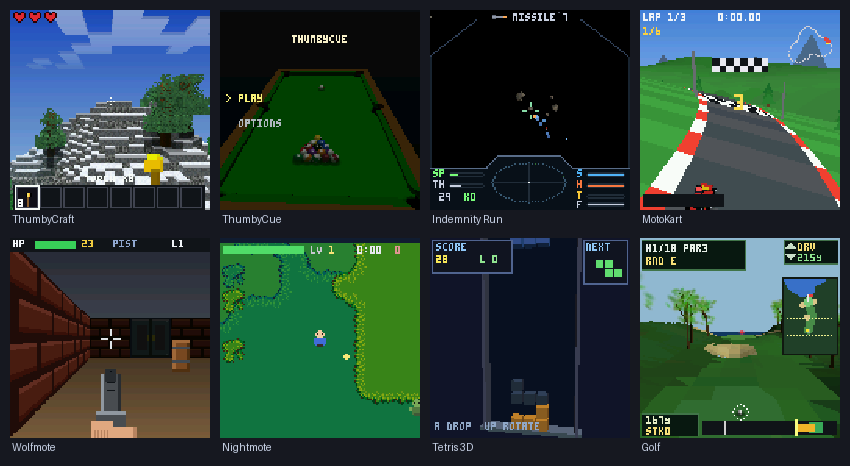

> **Mote ships on real hardware as part of [ThumbyOne](https://github.com/austinio7116/ThumbyOne).** The ThumbyOne multi-boot firmware bundles the Mote engine as a slot, so the `.mote` games you build here run on an actual **Thumby Color** — not just the desktop emulator. Flash ThumbyOne, drop `.mote` files into the device's `/mote/` folder over USB, and they appear in the **MOTE** tile's launcher. (You can develop entirely in the Studio emulator without a device — the firmware is only needed to run on hardware.)

A Mote game is **not** an app that owns `main()` and a loop. It is a *module* —
a small chunk of compiled code (a `.so` on your PC, a `.mote` file on the device)
that the OS loads, hands a table of engine function pointers, and then drives. You
write three or four callbacks; the OS calls them every frame.


Two things make this work:

- **The ABI** (`sdk/mote_api.h`) is a struct of function pointers — `const MoteApi *mote`.
  The game calls `mote->scene_add_object(...)`, `mote->input()`, `mote->audio_note(...)`,
  and never touches engine internals directly. The contract is append-only and
  versioned (`MOTE_ABI_VERSION`), so old games keep running as the engine grows.
- **The same C compiles for PC and device.** The platform layer
  (`engine/core/mote_platform.h`) is the *only* place that differs between the SDL
  emulator and the real hardware. Your game and the engine have zero `#ifdef
  HOST/DEVICE` — what you see in the emulator is what runs on the handheld.

**Mote Studio** is the bespoke IDE (a native C/SDL2 desktop app — no Electron, no
Python) that wraps the whole workflow: a project tree, the *real engine* running
your game inside a photo-accurate Thumby Color shell, an inspector, and docked
tools for pixel art, code editing, meshes, audio, and device control. It is the
recommended way to develop; the `mote` CLI is the same thing without the GUI.

---

## 2. Quick start

Two ways in:

- **Option A — Windows + Mote Studio + ThumbyOne.** Download a self-contained Studio
  bundle, double-click, and you're authoring games in minutes — no compiler setup, no
  build step. Then run them on a real Thumby Color via ThumbyOne. **Start here if you
  just want to make games.**
- **Option B — build from source (Linux / WSL).** Compile the engine, emulator, Studio
  and the `mote` CLI yourself. Best for hacking on the engine itself, CI, or headless use.

### 2.1 Option A — Windows + Mote Studio + ThumbyOne (recommended)

No toolchain to install and nothing to compile first — the Windows bundle ships its
own portable MinGW gcc, `arm-none-eabi-gcc` (device builds) and ffmpeg (the Audio tab),
so Run / Build / Bake / Push all work out of the box.

**1 · Get Studio.** Download the latest self-contained
**`MoteStudio-<ver>-win64.zip`** from the
[Releases page](https://github.com/austinio7116/mote/releases) and unzip it anywhere
on a *local* drive (e.g. `C:\MoteStudio`).

**2 · Run it.** Double-click `mote_studio.exe` from inside that folder (it reads its
bundled `studio/assets`, `examples/`, `engine/`, so run it in place).

**3 · Develop in the emulator — no hardware needed.**

```
 Project ▸ Open ─→ pick a game (Games / Examples)
        │ Studio builds it and runs the REAL engine inside an on-screen,
        │ photo-accurate Thumby Color shell — clickable buttons, zoom, gamepad.
        ▼
 edit src/game.c (Code tab, or "Edit in VS Code") ─→ Save
        │ Studio watches the file and HOT-RELOADS the running game. No restart.
        ▼
 author art/audio/levels in the bottom-dock tools (Pixel Art, Tiles, Mesh, Audio…)
        │ each tool bakes a header your game #includes (§4).
        ▼
 tight loop: play → edit → Save → it reloads.
```

**4 · Run on a real Thumby Color (ThumbyOne).** The device runs Mote via the
[**ThumbyOne**](https://github.com/austinio7116/ThumbyOne) multi-boot firmware, which
bundles the Mote engine as a slot. Flash ThumbyOne once (see that repo), then:

- Connect the board over USB and use Studio's **Device** dock → **Push & Launch**:
  Studio cross-builds the `.mote` module, uploads it over USB-CDC, and runs it. It
  appears under the device's **MOTE** tile launcher.
- Or copy `.mote` files into the device's `/mote/` folder by hand — no firmware reflash
  to add or update a game.

That's the whole workflow: **edit → Save (hot-reload in the emulator) → Push & Launch
(to the device).** The rest of §2 (the [full Studio tour](#26-mote-studio--the-ide-recommended-workflow),
[asset pipeline](#4-the-asset-pipeline) and [engine API](#5-the-engine-api)) applies
identically — Studio is the same program on Windows and Linux.

> Studio's Pixel Art / Mesh / Audio tabs need a C compiler and ffmpeg on `PATH` for
> *Build* and *audio Load*; the self-contained zip bundles all of them. If you instead
> drop the bare `mote_studio.exe` into a source checkout, install MinGW-w64,
> arm-none-eabi-gcc and ffmpeg yourself (see `scripts/WINDOWS-README.txt`).

### 2.2 Option B — build from source (Linux / WSL): dependencies

```bash
# Debian/Ubuntu/WSL:
sudo apt install build-essential cmake libsdl2-dev imagemagick
#   build-essential  — gcc + make (the host compiler for game modules)
#   cmake            — builds the engine, host emulator, and Studio
#   libsdl2-dev      — the emulator window + audio + input
#   imagemagick      — used by `mote bake` to read PNG/BMP for image baking
# Optional, only for device builds / pushes:
sudo apt install gcc-arm-none-eabi   # cross-compiler for the .mote module
pip install pyserial                 # for `mote push` / `mote logs` over USB
```

### 2.3 Build the engine + emulator + Studio (once)

```bash
cmake -B build_host -S . && cmake --build build_host -j8
```

This produces:
- `build_host/mote_host` — the SDL emulator (runs one game `.so`)
- `build_host/mote_studio` — the IDE

### 2.4 Make and run a game (CLI)

`tools/mote` is the command-line driver. Put it on your `PATH` or call
`./tools/mote`.

```bash
mote new mygame                  # scaffold mygame/ — a runnable 3D starter (name in game.c)
mote new mygame -t physics       # or pick a template: 3d (default) · physics · 2d
mote run mygame                  # compile mygame → host .so, launch the emulator
```

`mote new` (and Studio's **New Game** wizard) scaffolds a *runnable* starter for the
template you pick — **3d** (spinning mesh), **physics** (boxes tumbling in a pit), or
**2d** (a top-down sprite) — each with its `.config` arena pools already sized to what
it draws, so a new game starts with sensible claims rather than zero or guesswork.

| Command | What it does |
|---|---|
| `mote new <dir> [-t 3d\|physics\|2d]` | Scaffold a game: a runnable `src/game.c` (with `MOTE_GAME_META` name/author) for the chosen template, `assets/` |
| `mote build <dir>` | Compile → host `.so` in `<dir>/build/`. Add `--device` for the RP2350 `.mote` |
| `mote run <dir>` | Build for host **and** launch the SDL emulator on it |
| `mote bake <dir>` | Convert `assets/*.png`, `*.obj`, `*.stl` → C headers in `src/` (see §4) |
| `mote push <dir>` | Cross-build the `.mote` and upload it over USB (`--launch` runs it now) |
| `mote ping` / `mote list` / `mote logs` / `mote wipe` | Talk to a connected device |
| `mote studio` | Build + open the IDE (see §2.6) |

**Emulator keyboard map:**

| Thumby button | Keys |
|---|---|
| D-pad | Arrow keys **or** W/A/S/D |
| A | `.` or `K` |
| B | `,` or `J` |
| LB | Left Shift |
| RB | Space |
| MENU | Enter |
| (open engine menu) | hold MENU alone 3 s, or set env `MOTE_MENU=1` |
| Quit | Esc / window close |

**Headless (CI / screenshots):**

```bash
# The emulator runs the single .so you pass as argv. MOTE_SHOT dumps frame
# MOTE_SHOT_FRAME (default 20) to a .ppm and exits — handy for CI screenshots.
SDL_VIDEODRIVER=dummy MOTE_SHOT=/tmp/shot.ppm MOTE_SHOT_FRAME=60 \
  ./build_host/mote_host examples/mygame/build/mygame.so
```

### 2.5 Game name & author — `MOTE_GAME_META`

A game's name and author live in `game.c`, right next to the code — the single
source of truth. `mote new` writes it for you:

```c
MOTE_GAME_META("My Game", "me");   // name + author, at file scope
```

The **name** is used for the built `.so`/`.mote` filenames, the device catalog, and
the launcher list. The *engine* config (memory pools) is separate — it's the `.config`
in your vtbl (§7).

> Legacy: older projects carried this in a `game.toml` `[game]` table. That still works
> as a fallback (then the folder name) if `MOTE_GAME_META` is absent, but new projects
> don't create a `game.toml`.

### 2.6 Mote Studio — the IDE (recommended workflow)

```bash
mote studio              # or: ./build_host/mote_studio   (run from the repo root)
```


**The project picker (Project ▸ Open)** lists your library in two sections —
**Games** and **Examples** — each project shown with its icon, triangle/sprite budget,
a live arena-memory meter and its flash size:

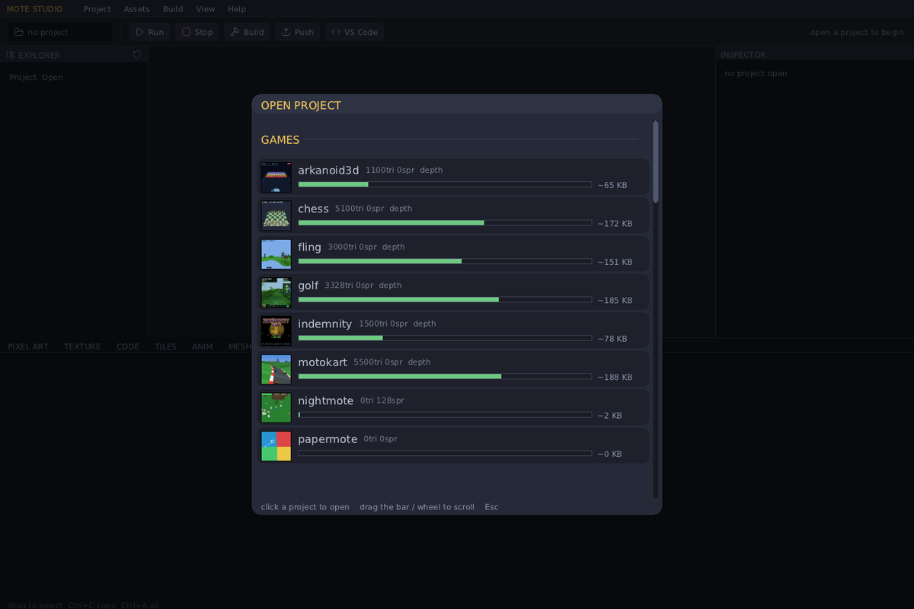

**The development loop — open Studio, pick a game, edit, watch it hot-reload:**

```
 1. Launch Studio.                The project picker lists Games and Examples
                                   (each folder with a game.c that declares a game).
 2. Click a game.                 Studio builds it and runs the REAL engine
                                   inside the on-screen Thumby Color shell.
 3. Play it.                       The shell buttons are clickable; keyboard +
                                   gamepad also work; there's a zoom control.
 4. Edit src/game.c.              Use the built-in Code editor, or click
                                   "Edit in VS Code" to open it in VS Code.
 5. Save.                         Studio watches the source mtime: on change it
                                   rebuilds and HOT-RELOADS the running game —
                                   no restart, no rebuild button needed.
 6. Repeat 3–5.                   Tight inner loop. The Console dock shows the
                                   live build output and any device logs.
```


**The layout — resizable docks with draggable separators:**

- **Menu bar + toolbar** — Project / Assets / Build / Help, plus Run · Stop ·
  Build · Push · "Edit in VS Code".
- **Project tree (left)** — the open game's files with type-coloured icons;
  auto-refreshes on file changes.
- **Emulator (centre)** — the real engine running your game inside a
  photo-accurate, calibrated, crisp integer-scaled Thumby Color shell.
- **Inspector (right)** — properties of the selected file. For `game.toml` it
  parses your `MoteConfig` pools out of the C source and shows a **~272 KB arena
  budget meter** so you can see your memory headroom (§7).
- **Bottom dock — tabbed tools:**

  | Tab | What it does |
  |---|---|
  | **Pixel Art** | HSV+hex colour picker; pencil / **soft brush** (square or round, real soft opacity) / eraser / fill / eyedropper / line / rect; **Ctrl+Z** undo, grid, zoom+pan, transparency, sizes up to **256×256 (non-square)**, PNG/BMP/JPG import. **Save** writes `assets/sprite.png` *and auto-bakes* the `MoteImage` header (§4). |
  | **Texture** | Procedural texture generators (wood / marble / brick / check / cloud / stone / plasma …) with contrast/warp — kept separate from Pixel Art so generating never clobbers hand-drawn art. |
  | **Code** | Built-in C editor with syntax highlighting + inline build errors, or jump to VS Code. |
  | **Tiles** | Rule-tile (autotile) authoring: Blob-47 / edge / Wang templates, per-rule cell editing, weighted variants, rotation/flip, and a **LEVEL** painter (always scaled to fit). **Bake** writes the tileset(s) + a bit-packed `.level.h`. |
  | **Anim** | Sprite-animation editor: clips with per-frame durations, onion-skin, frame events, pivots, and the pixel editor for each frame. **Bake** writes a `MoteAnimClip` set. |
  | **Mesh** | Two modes. **Importer:** live preview of an `.stl`/`.obj` *processed* (decimated + chunked) with parameters — triangle budget, target size, up-axis, recenter, chunk-view colouring, an HSV colour picker — a stats readout, and **Bake** to a `MoteModel` header (§4). **Assign…** picks a PNG to texture the model. **Model editor** (a built-in Blender-style modeller — **Tab** or the **Model editor** button) lets you build/edit low-poly meshes directly: select verts/edges/faces (+ invert / linked / grow / shrink), move / rotate / scale / extrude / inset, make-face / connect / subdivide / bridge / separate, clean topology, mirror, paint per-face colours, and bake. Multiple named models per project; multi-object `.obj` import. See **§4.x Modelling in the Mesh tab**. |
  | **Audio** | Load a WAV/MP3 (→ 22050 Hz mono) or design an SFX with the SFXR synth + presets; see the waveform, crop, play. **Save** writes the `.wav`, the editable `.sfx` recipe, a `MoteSound` header *and* a `MoteSfx` recipe header (play via `audio_play` or `mote_sfx_bake`, §9). |
  | **Device** | Ping / List / Push / Push & Launch / Stream Logs / Wipe over USB. |
  | **Console** | Live build + device output. |

Several of these tabs are shown in context through §4 (asset pipeline) and §5
(the engine API), next to the features they author.

**Native + Python-free.** Studio reimplements the CLI's build/scaffold/bake in C
(`studio/motecore.c`) and talks to the board over USB-CDC directly (`studio/usb.c`;
Linux `termios` / Windows Win32 COM, device found by VID:PID `CAFE:4D01`). It loads
game modules in-process via a cross-platform loader (`dlopen` / `LoadLibrary`) — so
a game is a `.so` on Linux, a `.dll` on Windows. It still shells out to a C
compiler (`gcc`, `arm-none-eabi-gcc`) and, for the Audio tab, `ffmpeg`.

**Windows build:** `scripts/build-windows.sh` cross-compiles with MinGW-w64 into a
single self-contained `dist-windows/mote_studio.exe` (SDL2 + MinGW runtime statically
linked, no DLL dependencies). Drop it in the repo root and run it there.

### 2.7 Build games fast: Studio for assets, Claude Code for code

The quickest way to make a Mote game is to split the work along its natural seam:

- **Mote Studio authors the assets** — paint sprites, generate textures, draw
  rule-tiles and levels, animate, decimate STL models, design SFX — and bakes each to
  a header your game `#include`s. This is the visual, iterative part a person does best.
- **[Claude Code](https://claude.com/claude-code) writes and edits `src/game.c`** — the
  game logic, drawing, and wiring those baked assets. Save in Studio and it hot-reloads.

This repo ships a **Claude Code skill** (`.claude/skills/mote-game-dev/`) so Claude
already knows the engine API, the asset pipeline, the build/push workflow, and the
gotchas the moment you open the project — just clone the repo, run `claude` in it, and
ask it to build or change a game. Author the art in Studio, describe the gameplay to
Claude, and iterate.

---

## 3. Anatomy of a game

A game is one file, `src/game.c`. It links **no engine code** — it is handed the
engine jump table (`mote`) and the OS drives its callbacks. Here is the entire
`mote new` template, every token explained.

```c
#include "mote_api.h"     // the ABI: MoteApi, MoteGameVtbl, MoteConfig, all the
                          // engine types (Vec3, Mesh, MoteInput, MoteBody, …)
#include "mote_build.h"   // header-only convenience: safe mesh primitives, a
                          // camera helper, a tiny immediate-mode UI (§5.8)

MOTE_GAME_MODULE();       // (1) macro — see below

#ifdef MOTE_MODULE_BUILD  // (2) device-only flash header — see below
#include "mote_module.h"
MOTE_MODULE_HEADER();
#endif

static const Mesh *s_cube;   // your game state lives in file-scope statics.
static Mat3 s_m;             // (.data/.bss; on device it's in a fixed RAM region)

static void g_init(void) {                       // (3) called ONCE, after load
    mote->scene_set_background(MOTE_RGB565(10, 12, 26));  // dark-blue clear colour
    mote->scene_set_sun(v3(0.4f, 0.7f, -0.6f));           // directional light dir
    // a unit cube: world-unit HALF-extents (so 1.0 = 2m across) + an RGB565 colour.
    s_cube = mote_mesh_box(mote, 1.0f, 1.0f, 1.0f, MOTE_RGB565(120, 180, 230));
    s_m = m3_identity();                          // its orientation = no rotation
}

static void g_update(float dt) {                 // (4) called EVERY frame
    const MoteInput *in = mote->input();          // current button state (§8)
    // MENU is yours — the engine menu (hold MENU 3s) owns return-to-lobby.

    m3_rotate_local(&s_m, 1, 0.9f * dt);          // spin about the cube's own Y axis
    m3_orthonormalize(&s_m);                      // re-square the basis (drift fix)

    Mat3 cam = mote_camera_look(v3(0,0,0), v3(0,0,1));   // eye at origin, look +Z
    mote->scene_begin(&cam, 60.0f);               // start the draw-list, fov 60°
    MoteObject obj = { .pos = v3(0,0,4.5f),       // 4.5m in front of the camera
                       .basis = s_m, .mesh = s_cube };
    mote->scene_add_object(&obj);                 // queue it; the OS rasters it
}

static const MoteGameVtbl k_vtbl = {              // (5) the contract you hand back
    .init = g_init, .update = g_update,
    .config = { .max_tris = 256, .depth = 1 },    // declare your memory pools (§7)
};
static const MoteGameVtbl *mote_game_vtbl(void) { return &k_vtbl; }
```

**(1) `MOTE_GAME_MODULE()`** expands to three things you'd otherwise hand-write:
the exported `mote_game_abi_version` symbol the loader checks; a file-scope
`static const MoteApi *mote` (the jump-table pointer everything goes through); and
the `mote_game_register(api)` entry function that stashes `mote = api` and returns
your vtable via `mote_game_vtbl()`. So you just define `mote_game_vtbl()` and use
`mote->…`.

**(2) `MOTE_MODULE_HEADER()`** emits the on-flash header the device loader reads
(magic, ABI version, the register entry, and the `.data`/`.bss` copy ranges from
`sdk/game.ld`). It is **device-only** — the host `.so` build omits it, so it's
guarded by `#ifdef MOTE_MODULE_BUILD` (a define the device build sets). On the host
this whole block disappears.

**(3)–(5) The vtable callbacks.** All are optional except you'll want `update`:

| Callback | Signature | When it runs |
|---|---|---|
| `init` | `void init(void)` | Once, after the engine pools are set up. Build meshes, init state. |
| `update` | `void update(float dt)` | Every frame on core0. Read input, advance state, build the draw-list. `dt` = seconds since last frame (clamped ≤ 0.1). Runs **concurrently** with the previous frame's LCD flush. |
| `render_band` | `void render_band(uint16_t *fb, int y0, int y1)` | *Optional.* A custom per-row-band rasteriser, called from **both cores** with disjoint bands `[y0,y1)`. Leave `NULL` to use the built-in scene rasteriser. Use this only for custom raycasters etc. |
| `overlay` | `void overlay(uint16_t *fb)` | *Optional.* 2D HUD drawn on top, on core0, after the 3D/2D passes. `fb` is the 128×128 RGB565 framebuffer. |
| `config` | `MoteConfig` (a struct, not a function) | Read **before** `init()` to size the engine arena. See §7. |

**The frame loop the OS runs for you** (`os/mote_os.c`), per frame:

```
  1. poll buttons → derive edge/held state (MoteInput)
  2. pump audio
  3. if MENU held alone ≥3s → open the engine menu (pause/brightness/volume/exit)
  4. clear the 3D + 2D scene draw-lists
  5. call your update(dt)         ── runs concurrently with last frame's flush ──
  6. wait for last frame's flush to finish
  7. rasterise the scene across BOTH cores (top half / bottom half)
  8. render any registered splats (second banded pass)
  9. call your overlay(fb), then draw the perf graph
 10. kick the async LCD flush (overlaps the next update) → back to 1
```

You never write this loop. You only fill the draw-list in `update()` and (maybe)
draw a HUD in `overlay()`.

**Using the C standard library.** Game code can freely use the standard C library:
string/memory (`memcpy`, `memmove`, `strcmp`, …), math (`sinf`, `sqrtf`, … — `-lm` is
linked), and the `printf` family for *formatting* (e.g. `snprintf(buf, n, "BREAK %d", x)`
into your own buffer, then draw it with `text()`). The device build links a tiny set of
libc syscall stubs (`sdk/mote_syscalls.c`) so stdio's formatting code resolves — a game
performs no real file I/O, so the stubs are never actually called. **Don't use
`malloc`/`free`**: the libc heap isn't wired up. Use `mote->alloc()` for load-time
buffers (§7) and file-scope statics for game state.

---

## 4. The asset pipeline

**The device has no filesystem your game can read from.** A `.mote` is a flat
flash image with code + constants; there's no `fopen("sprite.png")`. So every
asset — images, 3D meshes — is **baked into a C header** of plain constant arrays,
which you `#include` and the compiler embeds straight into your module. The data
ends up in flash (`.rodata`) and you point the engine at it.


Then `#include "logo.h"` in `game.c` and draw it: `mote->blit(fb, &logo_img, x, y)`.

### What bakes, and how you use it

| Source file(s) | Baker | Generated header contains | How you use it in C |
|---|---|---|---|
| `*.png`, `*.bmp` | **img2tex** (needs ImageMagick) | `<name>_px[]` (RGB565), `<name>_img` (a `MoteImage`), `<name>_W` / `<name>_H` | `#include "<name>.h"` then a sprite via `mote->scene2d_add` or an immediate blit via `mote->blit` |
| `*.obj` (one material) | **obj2mesh** | one `<name>_mesh` (a `Mesh`) | small single-colour models that fit ≤255 verts |
| `*.obj` (several materials) | **obj2mesh** | one `<name>` (a `MoteModel`, **one part per material** — colour from each `.mtl` `Kd`) + `<name>_TRIS` | multi-part models (e.g. a chess king = body + cross): draw whole with `mote_model_draw`, or **recolour parts per draw** with `mote_model_draw_palette` (team colours / chess sides) |
| `*.stl` (binary or ASCII) | **stl2mesh** (or the Studio **Mesh** tab) | one `<name>` (a `MoteModel`) + `<name>_TRIS` | big models, auto-decimated + split into ≤255-vert chunks; draw the whole model in one call |
| `*.wav`, `*.mp3` | **wav2snd** (Studio Audio tab / `mote bake`) | `<name>_snd` (a `MoteSound`, kept at native 8/16-bit + source rate) | recorded/sampled audio; play with `audio_play` |
| `*.sfx` (recipe) | Studio **Audio** tab ▸ Save | `<name>_sfx` (a `MoteSfx`) | tiny procedural SFX; synth at load with `mote_sfx_bake` (§9) — ~1000× smaller than the WAV |
| `*.ttf` (+ `.size`) | **ttf2font** (Studio **Font** tab) | `<name>` (a `MoteFont`) | anti-aliased proportional font; draw with `mote->text_font` (§5.7) |
| `<font>_glyphs.png` (+ `.gsheet`) | **glyphs2font** (Studio **Font** tab ▸ Edit glyphs) | `<font>` (a `MoteFont`) | hand-drawn / edited font — one PNG sheet; same `text_font` call |
| `icon.png` / `icon.bmp` (game root) | **icon baker** | a compact paletted blob `mote_game_icon_data[]` in `src/icon.h` | nothing — the build auto-includes it; the OS launcher shows it. The icon travels inside the module, so installing a game over USB is all it takes (no firmware change) |

**Launcher icons (§4.1).** A game's 60×60 icon is baked from `icon.png` to `src/icon.h`
and compiled into the module — the launcher reads it straight from the stored image, so
pushing a game is all it takes for its icon to appear.

- **You don't include it.** `mote_build.h` (which every game includes) auto-pulls
  `src/icon.h` via `__has_include`, and the baked symbol is `weak`, so it travels in the
  module with **no `#include` and no boilerplate** in your game. No `icon.png` → the
  launcher draws a name-coloured tile with the initial.
- **Make it in the IDE.** Draw or import it in the Pixel Art editor — **Assets ▸ Edit
  Icon**, or just save a 60×60 sprite named **`icon`**, or drop an `icon.png` in the game
  root. Save bakes it automatically.
- **Compact in flash.** Since ABI v22 the icon is a **paletted, adaptive-bit-depth blob**
  (`sdk/mote_icon.h`), not a raw 7,200-byte RGB565 array — typically **~1.8–4 KB** (a
  ~2–4× saving), losslessly for ≤256-colour icons. The launcher decodes it inline (no
  RAM scratch) when drawing the selection.

**Image transparency:** any source pixel with alpha < 128 becomes the magenta
colour-key `0xF81F` (`MOTE_KEY_MAGENTA`); the engine's 2D rasteriser and `blit`
skip key-coloured pixels. (A real magenta in your art is nudged one bit off so it
isn't treated as transparent.)

**Sprite sheets are just one image.** A sheet is a single baked `MoteImage`; you
pick a frame with the sprite's source rect `fx,fy,fw,fh`. e.g. a 48×24 PNG holding
two 24×24 frames → frame *i* is `fx = i*24, fy = 0, fw = 24, fh = 24`. See
`examples/imgdemo` (a baked logo + an animated 2-frame sprite).


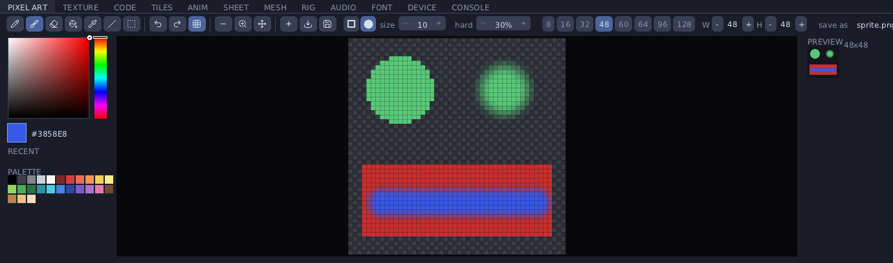

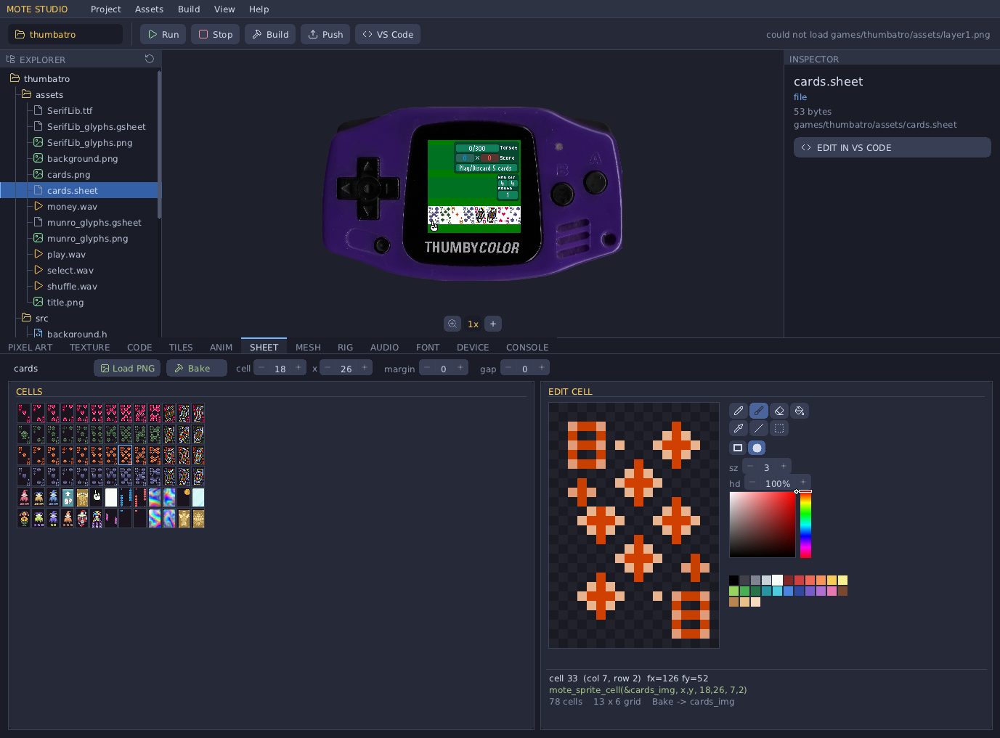

The separate **Texture** tab generates procedural fills (wood, marble, brick, stone,
cloud, plasma …) with contrast/warp — it bakes to a `MoteImage` the same way, and is
kept apart from Pixel Art so generating never overwrites hand-drawn art.


**Big meshes (STL):** `stl2mesh` (and the Studio **Mesh** tab) welds duplicate
vertices, **decimates by vertex clustering** (binary-searched down to a triangle
budget, default ~1500), and **chunks** the result into ≤255-vertex sub-meshes (the
uint8 index cap, §6). You never touch the chunks: the baker bundles them into one
`MoteModel <name>` and a `<name>_TRIS` count, and you draw the whole thing in one
call:

```c
#include "fighter.h"   // baked from assets/fighter.stl: a MoteModel `fighter` + fighter_TRIS

// in your config: size the 3D pool to the model so nothing is clipped
.config = { .max_tris = fighter_TRIS, .depth = 1 },

// in update(): one call draws every chunk — no loop, no chunk array, no count
mote_model_draw_ex(mote, &fighter, world_pos, s_rot, 1.0f);   // or mote_model_draw(mote, &fighter, pos)
```

`mote_model_draw` / `mote_model_draw_ex` (in `mote_build.h`) loop the chunks for you
and pair with `scene_camera()` so positions stay in world space. See
`examples/modelview` (a 6,742-tri fighter → 1,494 tris in 4 chunks, drawn in one line).

**Multi-part models + per-part colour (recolourable).** An `.obj` with several
materials bakes to one `MoteModel` with **a chunk per material** (each part keeps its
`.mtl` `Kd` colour); obj2mesh never recentres, so the parts stay aligned on the OBJ's
shared origin — model a king as one file with `body` + `cross` materials, base at
`y=0`, and it's one clean model in the tree. Draw the baked colours with
`mote_model_draw`, or **recolour the parts at draw time** with `mote_model_draw_palette`
— pass an RGB565 per part (`0` = keep baked). The same model then serves both chess
sides with no extra assets (`games/deepthumb`):
```c
#include "king.h"   // baked from assets/king.obj (body + cross materials): a MoteModel `king`
uint16_t pal[2] = { side_colour(side), accent_colour(side) };   // {body, topper}, swapped per side
mote_model_draw_palette(mote, &king, pos, basis, 1.0f, pal, 2);
```

### Modelling in the Mesh tab — the built-in model editor

The Mesh tab isn't only an importer. Press **Tab** (or the **Model editor**
button) to switch into a **Blender-style low-poly modeller** that builds and edits
real mesh topology — vertices, edges, and faces you can select and operate on — and
bakes the exact result (no decimation) straight to a `MoteModel` header. It's
non-destructive: the importer is untouched, and **Tab** flips back to it.


The **MODEL EDITOR** sidebar has two tabs. **Tools** holds the whole toolset in
**collapsible sections** — **SELECT**, **ADD**, **EDIT**, **FACES**, **TEXTURE**,
**BOOLEAN**, **OBJECT**, **FILE** — click a header to fold a group away (fully folded,
every section fits on screen with no scrolling). True either-or choices (Vert/Edge/Face,
Solid/Wire) are segmented pickers, and every control shows a hover tooltip with its
keyboard shortcut.

**Objects** lists **every part of the model** as a tree — colour swatch, name,
vert/face counts, an `M` badge on mirrored parts. Click a row to make that part the
active object (the tools act on it), click the **eye** to hide a part while you work
on another (hidden parts still bake, save and export), and **double-click to rename**
it — names feed the baked headers and rigs. A multi-material `.obj` (say a chess piece
with `body` + `crown` materials) imports as one object per material, each coloured
from its `.mtl`, so multi-part models arrive ready to rig.

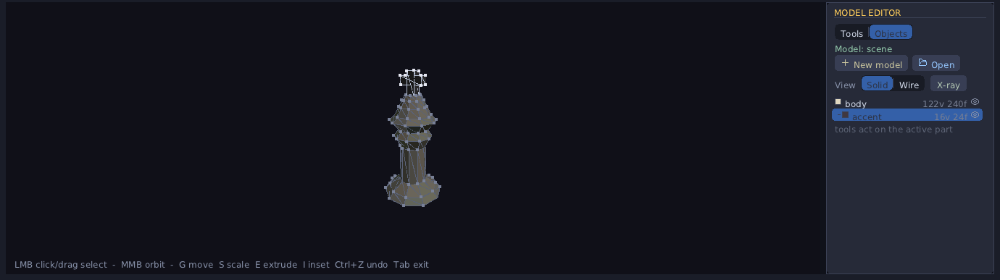

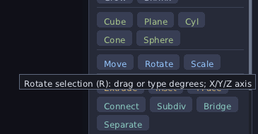

There are three ways to get geometry into the editor:

- **Add a primitive** — Cube, Plane, Cylinder, Cone, or Sphere (`Shift+A` adds a
  cube). Each appears as a new object you can edit.
- **Edit an imported model** — load an `.stl`/`.obj`, set the **tris** budget for the
  topology density you want, then click **Edit this mesh**. The decimated result
  becomes editable verts + faces (e.g. `fighter.stl` at budget 250 → 81 verts / 204
  faces, fully editable). An `.obj` with several `o`/`g` **groups comes in as separate
  objects**, so a multi-part model stays riggable.
- **New / open a project** — **New** (or `Ctrl+N`) starts a fresh **named** model. A
  project can hold several models — each is a `<name>.mmesh`, listed in the file tree,
  and every bake/export follows its name. Switching projects resets *every* tab and
  loads that project's model.

**Select** what you want to work on with the mode buttons or keys **1 / 2 / 3**
(vertex / edge / face). Click an element to select it, **Shift+click** to add, or
**drag a box** over empty space. Then refine with the selection helpers (buttons, or
the keys): **All** (A) / deselect (Alt+A), **Invert** (Ctrl+I), **Linked** — the whole
connected island (L), and **Grow** / **Shrink** (Ctrl + / Ctrl −). Selected elements
highlight orange; hovering previews what you'd pick.

**Transform** the selection with modal operators — exactly like Blender:

| Key | Operator | What it does |
|---|---|---|
| **G** | Grab (move) | Move the selection; the readout shows the distance |
| **R** | Rotate | Rotate about the selection centre — by default around the view axis; type degrees, or **X/Y/Z** for a world axis |
| **S** | Scale | Scale about the selection centroid |
| **E** | Extrude | (Face mode) pull selected faces out — new side walls are bridged in, then it moves along the face normal |
| **I** | Inset | (Face mode) shrink an inner copy of each face inward, with a ring of new faces |

There are buttons for **Move / Rotate / Scale** too if you prefer clicking to keys.

While a modal op is live: press **X / Y / Z** to constrain to an axis, **type a
number** for an exact value, **Enter** or **left-click** to confirm, **Esc** or
**right-click** to cancel. Or skip the keys and **drag the 3-axis gizmo** at the
selection centre. **Ctrl+Z** undoes.

**Build out the mesh** with the edit tools (buttons, or the keys in brackets):
**Duplicate** object (`Shift+D`), **Delete** selection / object (**X**), **Merge**
selected vertices to their centre (**M**), **Flip** normals (`Shift+N`), and
**Paint** (**P**) — assign the picker colour to the selected faces. The colour
picker (HSV square + hue strip + swatch) appears in **Face mode**, right where you
paint; per-face colours bake into a `face_colors[]` array so one model can be
multi-coloured.

**Add and cut geometry** with the EDIT tools: **+Face** (**F**) makes a face from 3–4
selected verts (caps a hole), **Connect** (**J**) splits a face by joining two verts,
**Subdiv** subdivides the selected faces, **Bridge** joins two equal-sided faces with a
band of quads, and **Separate** splits the selected faces off into a **new object** —
exactly what you want before rigging a model into parts.

**Clean up** imported or hand-edited topology: **Recalc outward** flips normals to face
out, and **Clean** (**Ctrl+K**) welds doubled verts, removes non-manifold faces and
reorients in one pass. **Origin ▸ Sel / Centre** moves the object's origin to your
selection or its bounding-box centre *without* moving the geometry — a sane pivot for
the Rig tab.

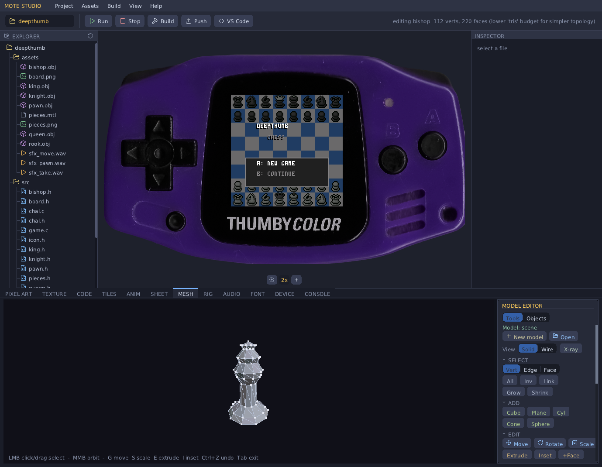

**Mirror** (live): toggle **Mirror X / Y / Z** on an object and you model one half
while the editor shows the whole thing — the reflected half is solid (with a subtle
seam marker), every edit is mirrored instantly, and the bake welds the two halves
into one watertight mesh. Ideal for symmetric assets (ships, characters). **Apply**
(next to the Mirror buttons) bakes the mirrored half into real geometry and turns the
modifier off — use it when you want to edit both halves independently, or before a
boolean.

**Booleans (CSG)** combine whole objects. Once a project has two or more objects a
**Boolean** group appears: pick the second operand with the **Boolean vs obj N**
stepper, then **Union** (merge into one solid), **Subtract** (cut the target out of the
active object, A − B), or **Intersect** (keep only the overlapping volume). The result
replaces the active object, the target is removed, and it's triangulated — re-unwrap if
you want to texture it. Booleans are real BSP CSG, so they work on any closed mesh (all
the primitives qualify).

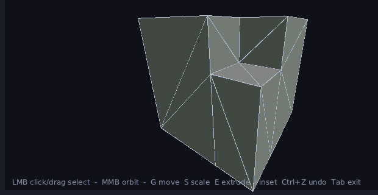

> **Positioning the second object first:** add the primitive, make it the **active**
> object (the *Obj N/N* stepper, or `< >`), then press **A** to select all of *that
> object* and **G** to move it into place. Select All and click-select are scoped to the
> active object, so an overlapping object never steals your selection.

**Camera:** left-drag empty space **or** middle-drag to orbit, wheel to zoom. The
model holds still otherwise (no auto-spin while you work).

**View modes** (the *View* row): **Solid** shades the faces with hidden-line removal
(occluded edges and verts are hidden, for a clean read), **Wire** drops the fill for a
pure wireframe, and **X-ray** makes the faces see-through so you can see — and select —
geometry behind the surface. **Z** toggles X-ray, **Shift+Z** toggles wireframe.

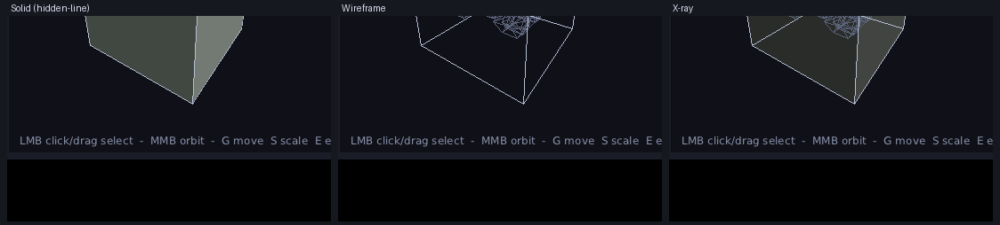

**Save / bake / export:**

- **Save** / **Load** keep an editable `scene.mmesh` in the project (your working
  copy — objects, topology, colours, mirror, origins).
- **Bake .h** writes the exact `MoteModel` header (`src/<object>.h`) — draw it with
  `mote_model_draw` exactly like an STL bake.
- **Bake rig** turns a multi-object scene into a `MoteRig` header (one part per
  object, with parent + pivot) you draw/animate with `mote_anim3d.h` (§4 rigs).
- **Export OBJ** writes `assets/scene.obj` + a `.rig` sidecar so the scene opens in
  the **Rig tab** to set joints and author animation clips.

> **Heads-up:** Bake .h writes `src/<object-name>.h`, so naming an object the same as
> an existing CLI-baked model (e.g. `fighter`) will overwrite that file. Rename the
> object or keep editor bakes to their own names.

**Outside the editor**, the Mesh tab shows the live model with a few preview controls:
**Spin** (auto-rotate on/off), **Texture** (show the painted texture vs flat face
colours), **Reset view**, and a **Bake .h** shortcut so you can re-bake without
re-entering the editor.

### Texturing a model — UV unwrap and paint

A low-poly model can carry a **painted texture** — an RGB565 atlas the device samples
UV-mapped onto the faces (still sun-lit). The whole flow lives in the model editor's
**Texture** group, and you paint with the same tools as the Pixel Art tab.


1. **Unwrap** — select the object and click **Unwrap**. It box-projects the model into
   a paintable atlas saved as `assets/<model>_tex.png` (solid grey to start) and stores
   the UVs on the model. (UVs are normalised, so the *resolution* is independent of the
   unwrap — see below.)
2. **Paint** — click **Paint** to split the viewport: the **live textured model** on the
   left, the **texture atlas** (with the UV layout drawn over it) on the right. You get
   the **full pixel toolset** — pencil, brush (round/square, size, hardness), eraser,
   fill, pick, line, rect, the 25-colour palette and the HSV picker — plus **Undo/Redo**
   (`Ctrl+Z` / `Ctrl+Y`). It edits a **dedicated atlas buffer**, so your sprite documents
   are never touched.
   - **Paint on the atlas, or straight on the 3D model.** When you paint on the model the
     cursor is raycast onto the surface, so the stroke lands exactly where you point — and
     it shows on *both* the model and the atlas at once, with the brush cursor mirrored
     onto the UV map. **LMB** paints; **MMB** or an empty-space drag orbits.
3. **Resolution** — the **64 / 128 / 256** buttons resample the atlas in place. Because
   UVs are normalised this needs **no re-unwrap**; only texel density (and flash cost:
   **8 / 32 / 128 KB**) changes. 128 is the sane default.
4. **Fill from face colours** — if you painted per-face colours in the editor first, this
   seeds the atlas from them (it rasterises each face's UV triangle in its colour, with a
   few pixels of edge bleed so the islands meet cleanly). A fast way to a base coat.
5. **Save** writes the PNG; **Done** leaves paint mode.

**Baking a textured model:** **Bake .h** writes the atlas into the header as a `MoteImage`
plus per-face UVs (the 11-field textured `Mesh`). A textured mesh only draws textured if
the game budgets a textured-triangle pool, so the Studio **auto-adds `.max_tex_tris =
<model>_TRIS` to your `game.c`** on a textured bake (it never overrides a value you set).
Without that pool a textured mesh falls back to a flat shade in the atlas's average
colour — never a black model. See [Textured meshes](#textured-uv-mapped-meshes) for the
runtime side.

### Walkthrough — model, texture, and bake into a game

End to end, here's how a textured 3D prop (say a spaceship) goes from nothing to drawn
in your game. Everything is in the **Mesh** tab; press **Tab** to flip between the
preview and the editor.

1. **Start a model.** Open your project, go to the Mesh tab, click **Edit this mesh**,
   then **+ New model** and name it (e.g. `ship`). Each model is its own `<name>.mmesh`.
2. **Block out the shape.** Add primitives (**Shift+A** cube, or the Cube/Cylinder/Cone/
   Sphere buttons). Position each one: make it the active object (`< >`), **A** to select
   all of it, **G** to move (type a distance or drag the gizmo). Combine them with
   **Booleans** — e.g. *Union* the hull and the wings into one solid, or *Subtract* a
   cockpit cut-out.
3. **Use Mirror for symmetry.** Toggle **Mirror X**, model one wing, and the other appears
   live; click **Apply** to weld it into real geometry when you're happy.
4. **Refine the surface.** In face mode, **Extrude** (E) / **Inset** (I) / **Subdiv** to
   add detail, **Merge** (M) / **Clean** (Ctrl+K) to tidy topology, **Recalc outward** so
   normals face out.
5. **Unwrap and paint.** Select the object, **Unwrap**, then **Paint** — block in colours
   on the model or the atlas, pick a **Resolution**, and **Save**. (Tip: hit **Fill from
   face colours** first for an instant base coat.)
6. **Bake.** Click **Bake .h**. You get `src/ship.h` with `static const MoteModel ship`,
   `ship_TRIS`, the embedded texture, and the per-face UVs — and the Studio adds
   `.max_tex_tris = ship_TRIS` to your `game.c` config.

   

7. **Draw it in your game.** Include the header and draw the whole model (all its chunks)
   with one call:

   ```c
   #include "mote_api.h"
   #include "mote_build.h"
   #include "ship.h"          /* baked: `static const MoteModel ship`; ship_TRIS */

   static Mat3 s_m;

   static void g_init(void) {
       mote->scene_set_background(MOTE_RGB565(10, 12, 26));
       mote->scene_set_sun(v3(0.4f, 0.7f, -0.6f));
       s_m = m3_identity();
   }
   static void g_update(float dt) {
       m3_rotate_local(&s_m, 1, 0.9f * dt); m3_orthonormalize(&s_m);
       Mat3 cam = mote_camera_look(v3(0, 0, 0), v3(0, 0, 1));
       mote->scene_begin(&cam, 60.0f);
       mote_model_draw_ex(mote, &ship, v3(0, 0, 4.5f), s_m, 1.0f);   /* the textured ship */
   }
   static const MoteGameVtbl k_vtbl = {
       .init = g_init, .update = g_update,
       .config = { .max_tex_tris = ship_TRIS, .max_tris = ship_TRIS, .depth = 1 },
   };
   ```

8. **Run it.** `mote build <game> && mote run <game>` (or **Run** in the Studio). Change
   the model later? Re-open it, edit, **Bake .h** again — your `game.c` already points at
   `ship`, so you just rebuild.

### When does baking happen? Do I *have* to bake?

| Where | Action | Bakes? |
|---|---|---|
| **CLI** | `mote bake <dir>` | Yes — scans `assets/`, writes `src/*.h` headers |
| **CLI** | `mote build` / `mote run` | **No** — compiles whatever headers already exist; bake first (or once) |
| **Studio** | Pixel Art ▸ Save | **Auto** — writes `assets/sprite.png` *and* its `MoteImage` header in one click |
| **Studio** | Inspector ▸ Bake → Header | Yes — manual bake of the selected asset |
| **Studio** | Build / Push | **No** — baking is a separate action; build doesn't implicitly re-bake |

So: you **must** have a baked header before your C can use an asset — but in practice
the Studio bakes for you on Pixel-Art Save, and you rarely click Bake by hand.

So: **baking is a one-time-per-asset-change step, not part of every build.** You
re-bake only when the source art/model changes. The generated `.h` is committed
alongside your source (it's just C). You do *not* have to use the bake tools at
all — you can hand-write a `MoteImage`/`Mesh`/`MeshVert[]` literal in code if you
prefer (the `mote new` template's `SHAPE_H` and `tiledemo`'s procedural art do
exactly this). Bake is a convenience for going from real PNG/OBJ/STL files to
embeddable constants.

### Audio: synth notes, streamed SFX recipes, baked samples

- **Synth** — `mote->audio_note(freq, amp)` strikes a one-shot piano-ish note (§9); no
  asset needed. Good for tones, beeps, melodies.
- **Streamed SFX recipes (recommended)** — design an effect with the Studio **Audio tab**'s
  SFXR synth; **Save** writes `src/<name>.sfx.h` (a `static const MoteSfx`, ~88 bytes).
  `mote->audio_play_sfx(&<name>_sfx, gain)` plays it by **generating the sound as it plays** —
  ~88 bytes in flash, almost no RAM, any length, up to **8 at once**. This is the right path
  for a whole game's SFX set: tune the recipe, re-Save, done. (ABI v37.)
- **Baked clips** — **Save** also bakes a PCM clip `src/<name>.h` (`<name>_snd`) via wav2snd;
  `mote->audio_play(&<name>_snd, gain)` plays it from **flash** with **no synthesis cost** at
  play time. Bigger in flash than the recipe, but free of CPU — reach for it only if a game
  fires so many sounds at once that the streamed synth becomes a bottleneck.
- **`mote_sfx_bake`** — synthesises a recipe to a `MoteSound` **in the arena** at load. ⚠️
  costs arena RAM = samples × 2 bytes, per sound (~13 KB for a 0.3 s clip), so it's only for
  the few cases where you need the finished PCM to vary or resample it.

All paths end at the mixer — the streamed recipe voices and one-shot samples mix on top of
the synth notes.

> **Rule of thumb:** play **`&<name>_sfx`** with `audio_play_sfx` (streamed, tiny flash, ~0 RAM)
> for your game's sounds. Use the baked **`&<name>_snd`** only for very heavy simultaneous
> polyphony, and **`mote_sfx_bake`** only when you need to manipulate the rendered PCM.

```c
#include "coin.sfx.h"                  // recipe: static const MoteSfx coin_sfx = {...};
...
mote->audio_play_sfx(&coin_sfx, 1.0f); // fire-and-forget; synthesised on the fly, gain 0..1
mote->audio_note(440.0f, 0.85f);       // or a synth note — they sum
```

### Fonts: anti-aliased proportional text *(ABI v39)*

Beyond the built-in 3×5 `mote->text`, you can draw **designed, anti-aliased, proportional**
fonts at any size with `mote->text_font` (§5.7). The Studio **Font tab** bakes them two ways:

- **Import a `.ttf`** (or pick a bundled starter font), set the pixel size, see a live
  preview, and bake → `src/<name>.font.h` (a `MoteFont`).
- **Edit glyphs** opens an in-place editor — every glyph in a grid (like the tileset
  editor) with a pixel editor beside it; paint each glyph's coverage on a grayscale ramp
  (white = solid, grey = a soft edge), with baseline / pen-origin / advance guides. One PNG
  sheet saves and bakes; hand-drawn fonts keep full parity with TrueType (even cursive
  joins). The built-in 3×5 font is itself editable this way.

Glyph coverage is packed at 1/2/4 bits per pixel (smallest lossless depth auto-picked), so
a font is a few KB. See the `fontdemo` example (a font gallery — A/B to switch).

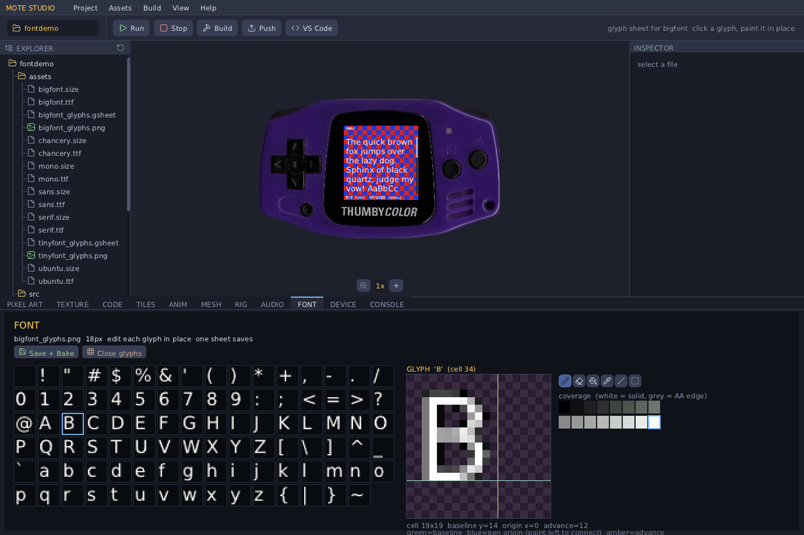

### Creating rigs and 3D animations

Mote does **rigid-part (hierarchical) animation** — a model is split into named parts
that rotate/translate about pivots, and animation **clips** are baked to a header your
game plays. It's all authored in the Studio **Rig tab** (below: the `tanks` example —
the turret/barrel rig, the on-model 3-axis manipulator, and the keyframe timeline):


**1 — Model in parts.** Make a multi-object OBJ, one object per moving part, e.g.:

```
o body      # … verts/faces …
o turret
o barrel
```

Add a `<name>.rig` sidecar next to it giving each part a parent and a pivot (the joint
it rotates about), root first:

```
part body   parent -1     pivot 0 0 0
part turret parent body   pivot 0 0.30 0.02
part barrel parent turret pivot 0 0.30 0.10
```

Drop both in `assets/`. `mote bake` (or Studio's Bake) runs `obj2rig` → `src/<name>.rig.h`
defining a `MoteRig`. (No `.rig`? A plain OBJ bakes to a single static mesh instead.)

**2 — Set pivots + hierarchy (Rig tab).** Click a `.rig`/`.obj` in the tree to open the
Rig tab. Pick a part in the inspector, set its **parent**, and place its **pivot** —
either with the steppers or by dragging the on-model **3-axis manipulator** (red/green/blue
handles). "pivot = centroid" snaps the pivot to the part's centre. **Save .rig + Bake**
writes it back.

**3 — Animate on the timeline.** Toggle the inspector to **edit: pose**. Scrub the
**playhead** along the timeline, pose the selected part — drag the manipulator's
translate **handles** (MOVE) or rotate **rings** (ROTATE), or type values — and press
**+Key** to drop a keyframe at the playhead. Drag key diamonds to retime them; Play/loop
to preview. **Bake anim3d** writes `src/<name>.anim3d.h` — a `const MoteModelClip`
(per-part rotation + translation tracks) that lives in flash.

**4 — Play it, and trigger from game events.** Include the baked header and drive a
player (this is the whole API for the common case):

```c
#include "tank.rig.h"        // MoteRig tank_rig
#include "recoil.anim3d.h"   // MoteModelClip recoil_clip

static MoteModelPlayer barrel;          // one cursor per instance
// on a game event (e.g. the gun fires):
mote_rig_play(&barrel, &recoil_clip);   // MOTE_ANIM_ONCE clip; sets .done when finished
// each frame, after scene_camera():
mote_rig_tick(&barrel, dt);
mote_rig_draw(mote, &tank_rig, &barrel, world_pos);
```

**Mixing baked + procedural** (e.g. a turret you aim by input while a recoil clip plays
on the barrel): evaluate the clip into per-part locals, override the parts you drive from
code, then compose — a clip only "owns" the parts it has tracks for:

```c
MoteRigLocal loc[P_COUNT];
mote_rig_eval(&tank_rig, &barrel, loc);                  // clip -> per-part locals
loc[P_TURRET].rot = mote_quat_axis(v3(0,1,0), aim);      // override turret from input
mote_rig_draw_locals(mote, &tank_rig, loc, pos, body, scale);
```

It's **header-only** (no engine/ABI dependency, no firmware reflash) — clips are const
flash data and the runtime is matrix math over the normal draw path. See
[`docs/animation.md`](docs/animation.md) for the full how-and-why and
[`examples/tanks`](examples/tanks) for a working rig + event-triggered recoil clip.

---

## 5. The engine API

Everything stateful goes through `const MoteApi *mote` (`sdk/mote_api.h`). The
math (`Vec3`/`Mat3`), data formats (`Mesh`, `MoteImage`, `MoteBody`, `MoteSplat`),
and the `mote_build.h` helpers are **header-only** — they compile into your module,
no ABI call. Below, each function is documented with its real signature, every
parameter (units / coordinate space / ranges), the return value, when you'd use
it, and a snippet.

> **Coordinate convention** (full detail in §6): world is right-handed, the camera
> looks down **+Z**, and 3D object positions are **camera-relative** (`world − camera`).
> The 2D scene, `blit`, and `text` use **screen pixels** (0..127, +x right, +y down).

### 5.1 — 3D scene (the triangle pipeline)

The scene is **immediate-mode**: each frame, in `update()`, you start the scene and
then draw everything you want visible — one `mote_draw`/`scene_add_*` call per object.
The draw-list is emptied for you at the start of every frame, so you always describe
the *current* frame from scratch. There are no scene objects to create, keep, or
delete, and no handles to track.

Keep your game state however suits you — a `ball_pos`, a `player_y`, an array of
enemies — and each frame just draw from it:
```c
mote->scene_camera(&cam_basis, cam_pos, 60.0f);    // once per frame
for (int i = 0; i < n_enemies; i++)
    mote_draw(mote, enemy_mesh, enemies[i].pos);    // re-issued every frame
```
To move something, change your own variable; to hide it, don't call `mote_draw` for
it this frame. There's nothing to sync — the next frame's draw calls *are* the scene.

The flow is always: `scene_camera` → add your objects/spheres → done (the OS
rasterises across both cores). It draws thousands of triangles at 60 fps, so
re-submitting your whole scene every frame is exactly what you're meant to do.

#### `void scene_set_background(uint16_t rgb565)`
The clear colour the raster fills behind everything, each frame. Call in `init()`
(or per-frame to change it). `rgb565` is a 16-bit colour — build one with
`MOTE_RGB565(r,g,b)` where r,g,b are 0–255.
```c
mote->scene_set_background(MOTE_RGB565(10, 12, 26));   // dark navy
```

#### `void scene_set_sun(Vec3 dir_toward_light_world)`
Sets the single directional light used to shade all meshes. `dir` is a **world-space
direction pointing toward the light** (it gets normalised internally, but pass a
unit vector for clarity). Surfaces facing the sun are brighter. Call once in `init()`.
```c
mote->scene_set_sun(v3_norm(v3(0.4f, 0.7f, -0.6f)));   // high, slightly behind/right
```

#### `void scene_begin(const Mat3 *cam_basis, float fov_deg)`
Begins this frame's 3D draw-list. `cam_basis` is the camera **orientation** (rows =
right/up/forward; build it with `mote_camera_look`, §5.8). `fov_deg` is the vertical
field of view in degrees (50–70 is typical; smaller = more zoomed/telephoto). The
camera *position* is implicit: it's the origin, and you pass object positions
**relative to it** (§6). Call once per frame before adding objects.
```c
Mat3 cam = mote_camera_look(eye, target);   // eye, target in world space
mote->scene_begin(&cam, 60.0f);
```

#### `void scene_camera(const Mat3 *cam_basis, Vec3 cam_pos, float fov_deg)` — *recommended*
Like `scene_begin`, but you also give the camera **position**, and the engine
subtracts it for you — so you add objects at **world** coordinates instead of doing
`world − cam_pos` by hand everywhere. This is the camera the examples and the
`mote_draw*` helpers use; prefer it. (`scene_begin` is just `scene_camera` with the
camera pinned at the origin.)
```c
Mat3 basis = mote_camera_look(cam_pos, target);
mote->scene_camera(&basis, cam_pos, 60.0f);
mote_draw(mote, mesh, world_pos);            // world coords — no subtraction
```

#### `int scene_add_object(const MoteObject *obj)`
Queues one mesh for rendering. `MoteObject = { Vec3 pos; Mat3 basis; const Mesh *mesh; uint16_t color; }`:
- `pos` — the mesh origin. With `scene_camera` this is a **world** position; with the
  legacy `scene_begin` it's **camera-relative** (`world − cam_pos`).
- `basis` — the object's orientation (rows right/up/forward; `m3_identity()` = unrotated).
- `mesh` — a `const Mesh *` (from a `mote_mesh_*` helper or a baked header).
- `color` — optional RGB565 **tint override**; `0` (default) uses the mesh's own colour(s).

Returns the number of triangles actually emitted (0 if the object was frustum-culled
or the draw-list pool is full). In practice you rarely fill this struct by hand —
`mote_draw(mote, mesh, world_pos)` and friends (§5.8) do it for you:
```c
mote_draw(mote, s_cube, world_pos);                       // identity basis, scale 1
mote_draw_ex(mote, s_cube, world_pos, s_rot, 1.0f);       // + orientation + scale
mote_draw_tint(mote, s_cube, world_pos, s_rot, 1.0f, MOTE_RGB565(255,80,80));  // + tint
```

#### `int scene_add_object_scaled(const MoteObject *obj, float scale)`
Same as `scene_add_object`, but uniformly scales the mesh by `scale` (1.0 =
unchanged, 2.0 = double size) at draw time — handy for reusing one mesh at several
sizes without baking variants.

#### `int scene_add_sphere(Vec3 cam_rel_pos, float radius, uint16_t color)`
Draws a **per-pixel shaded sphere impostor** — a real-looking lit sphere with **no
triangles**. Cheap; depth-tested against meshes. Perfect for balls, particles,
planets, glows, target rings. `cam_rel_pos` is camera-relative (`world − cam`),
`radius` in metres, `color` RGB565. Returns 1 if drawn (0 if culled/full).
```c
mote->scene_add_sphere(v3_sub(ball.pos, cam_pos), 0.12f, MOTE_RGB565(248,248,248));
```

#### `int scene_add_sphere_tex(Vec3 pos, float radius, const Mat3 *orient, const MoteSphereTex *tex)`
A **textured / oriented** sphere impostor. The engine still owns the geometry —
disc raster, per-pixel normal, depth — and rotates the normal into the sphere's
**local** frame by `orient` (rows right/up/forward; `NULL` = identity), so the
surface turns as the object spins. `tex` (a `const MoteSphereTex`) says where the
colour comes from and how it's lit:
- an **equirectangular texture** — raw `texels` (RGB565) *or* `indices` + `palette`
  (compact; planets), or
- a per-pixel **`albedo(Vec3 n_local, void *ud)`** callback (procedural patterns —
  stripes, numbers), and
- a `shade_mode`: `FLAT` / `LIT` / `SMOOTH` / `TOON` / `GLOSS`, or `CUSTOM` with a
  `shade(...)` callback that returns the final colour (e.g. multi-lamp speculars).

Sized by `max_tex_spheres`. Powers ThumbyCue's numbered/striped balls and
Indemnity's lit planets. See `mote_sphere.h`.
```c
static MoteSphereTex ball = { .albedo = ball_pattern, .shade_mode = MOTE_SHADE_SMOOTH };
mote->scene_add_sphere_tex(ball_pos, R, &ball_orient, &ball);
```

#### Particle / beam FX — `scene_add_point` / `scene_add_line` / `scene_add_disc`
Depth-tested 3D primitives for effects (drawn in the scene pass, tested against
meshes but not depth-writing, so they layer like sparks). All take **camera-relative
world** positions (or absolute, with `scene_camera`). Sized by `max_points` /
`max_lines` / `max_discs`.
```c
mote->scene_add_point(p, color, 2);            // a size-px dot (debris, dust, stars)
mote->scene_add_line(a, b, color);             // a 3D segment (lasers, beams) — near-clipped
mote->scene_add_disc(p, radius, color);        // a screen-facing filled disc (fireballs/glows)
```

#### `int scene_add_ring(Vec3 pos, float radius, uint16_t color)`
A **camera-facing circle outline** of world `radius` — depth-tested, always facing
the camera, so it reads as an object's circular silhouette (ghost ball at the
contact point, target reticle, selection ring). Sized by `max_rings`.

#### `int scene_add_billboard(Vec3 pos, const MoteImage *img, int fx, int fy, int fw, int fh, float world_h, uint8_t blend)`
A **camera-facing textured quad** — a "3D sprite" — at a world position. It stays
upright and square to the screen, sized by `world_h` (full height in world units),
so it shrinks with distance and keeps the image's aspect. `fx/fy/fw/fh` pick a
sub-rect for sprite sheets (0 sizes = whole image). Depth-tested: opaque
(`MOTE_BLEND_NONE`) sprites also write depth, blended ones (`MOTE_BLEND_ALPHA`/`_ADD`)
layer on top. Colour-keyed. For trees, pickups, enemies, smoke, muzzle flashes,
explosions. Sized by `max_billboards`.

#### `int scene_add_tri(Vec3 a, Vec3 b, Vec3 c, uint16_t color, uint32_t flags)`
An **immediate-mode world triangle** with a caller-supplied flat colour (the engine
projects, near-clips, depth-tests and fills it but does *not* light it). For dynamic
/ procedural geometry that isn't a baked `Mesh` — generated tables, voxel faces,
debug shapes. **Double-sided** (drawn regardless of winding, unlike
`scene_add_object`). Emits into the `max_tris` pool. `flags` are `MOTE_DRAW_*`.

#### `int scene_add_shadow(Vec3 ground_pos, float radius, float strength)`
A **soft ground-shadow decal** — a darkening ellipse on the ground plane under an
object, foreshortened with the view and faded from the centre out (`strength` 0..1,
0 → default). Depth-tested so raised geometry occludes it; drawn before impostor
balls so an object paints over its own shadow. Sized by `max_shadows`. Used by
ThumbyCue/pool balls, tanks, chess pieces, the golf ball, etc. For non-round
objects use **`scene_add_shadow_ex(ground_pos, semi_a, semi_b, strength)`** — the
footprint is the ellipse spanned by two **world** ground-plane semi-axis vectors,
so it matches the object's shape and heading (a tank passes `right*halfW` and
`forward*halfL` for a long oval along its hull). `scene_add_shadow(radius)` is the
round special case.

#### `int scene_add_object_ex(const MoteObject *obj, uint32_t flags)`
`scene_add_object` with per-object draw flags. `MOTE_DRAW_NO_DEPTH_WRITE` —
depth-test but don't write, for coplanar overlays (e.g. pocket lips, decals) that
later geometry must paint over. `MOTE_DRAW_BLEND(mode)` — draw the whole mesh
**translucent** (`MOTE_BLEND_ALPHA` ~50%, or `MOTE_BLEND_ADD` additive) for water,
glass, force-fields, glows; works on flat-coloured and textured meshes alike.

#### `void set_background_cb(void (*fn)(uint16_t *fb, int y0, int y1))`
Registers a **per-band background pass** run *before* the 3D scene (depth already
cleared), on both cores with disjoint row bands `[y0,y1)` — so you can paint a
gradient / starfield / nebula that the scene then draws over, without owning the
whole frame. `NULL` restores the solid `scene_set_background` colour. Indemnity's sky
is drawn this way.

#### `void scene_set_near(float near_m)`
Moves the near clip plane (metres). The 0.5 m default suits a space sim; small scenes
(a snooker table) need ~0.05 m or close geometry clips. Also rescales the depth
buffer. Set once in `init()`.

#### `int scene_tri_count(void)`
Triangles emitted into the draw-list so far this frame. Use it for HUD/profiling or
to back off detail when you're near the `max_tris` budget.

#### Big STL models — `MoteModel` + one-call draw
A baked STL (§4) is split into ≤255-vertex chunks (the `uint8` face-index cap), but
you never touch the chunks: the baker bundles them into one `MoteModel` and a
`<name>_TRIS` count, and you draw the whole thing in one call. Size the `max_tris`
pool to the model so nothing clips:
```c
#include "fighter.h"                          // a MoteModel `fighter` + fighter_TRIS
.config = { .max_tris = fighter_TRIS, .depth = 1 },
mote_model_draw(mote, &fighter, world_pos);                       // or _ex(pos,basis,scale)
mote_model_draw_tint(mote, &fighter, pos, basis, 1.0f, team_col); // tint every chunk
```
See `examples/modelview` (a 6,742-tri fighter) and `examples/chess` (pieces are STL
models, tinted white/black per side; king & queen are two parts for two colours).

#### Mesh colour
Colour lives on the **mesh**, not on every triangle (a `MeshFace` is 6 bytes —
indices + a quantised normal). A `Mesh` carries one flat `color`, *or* an optional
per-face `face_colors[]` array for multi-coloured models (multi-material OBJ,
height-tinted terrain). A per-draw `MoteObject.color` (via `mote_draw_tint` /
`mote_model_draw_tint`) overrides both — for team colours, damage flashes, selection
highlights. The bakers emit flat or per-face automatically.

#### Textured (UV-mapped) meshes
A `Mesh` with a non-NULL `texture` (a `MoteImage`) and a `face_uvs` array is drawn
**textured** instead of flat-coloured — through the ordinary `scene_add_object` path,
no new call. `face_uvs` is `nfaces*6` bytes: per-corner `u0,v0,u1,v1,u2,v2`, each
`0..255` spanning the texture. The texel is still lit by the sun (sampled colour ×
face shade). Size `max_tex_tris` to the textured faces visible at once — without the
pool a textured mesh falls back to a flat shade in its average colour (never black).
Combine with `MOTE_DRAW_BLEND()` (above) for translucent textured surfaces like water.
The Studio model editor paints and bakes these for you, and adds `.max_tex_tris` to
your config automatically — see [Texturing a model](#texturing-a-model--uv-unwrap-and-paint).

**Indexed (palette) textures *(ABI v41)*.** A `MoteImage` may instead be **4-bit or 8-bit
palette-indexed** (`format` 1/2, with `indices` + `palette`) — a low-colour texture then
costs **1/4** (≤16 colours) or **1/2** (≤256) the flash of RGB565, decoded by a palette
lookup at sample time. Every texture path handles it. You never write it by hand: `mote
bake` and the Studio bake emit indexed **automatically and losslessly** when an image has
≤256 colours (else RGB565); the model-editor texture bake uses a 4bpp palette. Re-bake a
game (`mote bake <dir>`) to shrink its low-colour art.

### 5.2 — 2D scene (sprites + tilemap)

A screen-space 2D layer the OS rasters **after** the 3D scene (both banded across
cores). A game can be pure-2D, pure-3D, or hybrid (3D world + 2D HUD). Build it
each frame: `scene2d_begin` → optional tilemap → add sprites.

#### `void scene2d_begin(int cam_x, int cam_y)`
Starts the 2D scene with a camera offset in **pixels** (`cam_x,cam_y` is the
top-left of the view in world-pixel space; sprites/tiles are drawn at
`world − cam`). For a fixed screen, pass `(0,0)`.

#### `void scene2d_set_tilemap(const MoteTilemap *map, const MoteTileset *tiles)`
Sets a background tile grid drawn under the sprites. `MoteTileset = { const MoteImage
*sheet; uint16_t tile_w, tile_h; }` (an atlas cut into cells, indexed
left-to-right/top-to-bottom). `MoteTilemap = { const uint8_t *cells; uint16_t cols,
rows; }` (cell `[r*cols+c]` is a tile index; `0xFF` = empty).
```c
static MoteImage   atlas   = { atlas_px, 32, 8, MOTE_KEY_MAGENTA }; // 4×(8×8) tiles
static MoteTileset tileset = { &atlas, 8, 8 };
static MoteTilemap tilemap = { map_cells, 24, 18 };
mote->scene2d_set_tilemap(&tilemap, &tileset);
```

#### Rule tiles / autotiling — `scene2d_set_autotile_layers(...)`

A plain tilemap stores the *final* tile index in every cell — you place each edge and
corner by hand. A **rule tile** (autotile) instead stores a *logical* map ("is this cell
terrain?") and lets the engine pick the right edge/corner tile from each cell's neighbours,
every frame, with **no resolved buffer**. Digging a tunnel or growing grass at runtime
re-tiles instantly because the only stored data is the logical map you already keep.


##### The three concepts (and three folders)

![The tilesheet pipeline: a sprite sheet (assets/grass.png, raw tile art that several tilesets may share) becomes a rule tile (tilesets/grass.tileset → src/grass.tiles.h: sheet + tile size + rule type + the 256-entry config→cell LUT + transforms and variant weights = a MoteImage + MoteAutotile, and one rule tile is one level layer) becomes a level (levels/cave.level → src/cave.level.h: one byte per cell where each bit is a layer; const, so flash and 0 SRAM). Layers draw bottom-up, each autotiled against its own bit, so dirt, grass and a path can share a cell](docs/img/tile-pipeline.png)

- **Sprite sheet** (`assets/foo.png`) — just art: a grid of tile images. Edited in the
  pixel tools or imported. *Several rule tiles may slice the same sheet.*
- **Rule tile** (`MoteAutotile`, baked to `src/foo.tiles.h`) — a sheet + tile size + a
  256-entry LUT mapping every neighbour configuration to an atlas cell (+ a per-config
  transform and per-variant weights, below). One rule tile = **one level layer**.
- **Level** (`src/foo.level.h`) — a **bit-packed layer map**: one byte per cell, bit *L*
  set = layer *L* present. Layers are drawn bottom-up and each autotiles against *its own
  bit*, so they overlap (dirt **and** grass **and** a path in one cell). The map is
  `const` → it lives in **flash**, costing **zero SRAM**, and a new level adds only its
  map (~1 byte/cell), never new images.

```c
#include "cave.level.h"
// each frame, after scene2d_begin():
cave_draw(mote);   // = mote->scene2d_set_autotile_layers(cave_map, cave_COLS, cave_ROWS, cave_tiles, n)
```

##### How a tile is chosen (per cell, every frame)


`edge_is_solid` decides whether off-map neighbours count as "same" (seamless map borders)
or "different" (a visible rim around the whole map).

##### The four rule types — and the limits of each

The rule type is the **sheet layout the LUT expects**; pick it per rule tile in the Studio
(the RULES bar). It sets how many tiles you must draw and which neighbours are consulted.

![The four rule types compared. Blob 47 (47 tiles, all 8 neighbours): corner-aware — it notices a single empty diagonal and draws a notched concave corner; best for organic terrain (caves, water, cliffs, grass/sand blobs); limitation: 47 tiles to draw, though transforms cut that. Edge 16 (16 tiles, only N/E/S/W, mask = N|E<<1|S<<2|W<<3): best for blocky/retro platforms, pipes, Mario-style walls; limitation: no corner sense, so concave corners look square. Nine-slice (9 tiles, a 3×3 TL/T/TR/L/C/R/BL/B/BR frame): best for rectangles — UI panels, ledges, building walls; limitation: rectangles only, no islands/bends/diagonals. Wang 16 (16 tiles, keyed on the 4 corners rather than the cells): a complete set covering crisp straight edges, outer + inner corners, isolated tiles and diagonal saddles — general-purpose terrain that handles both blocky regions and smooth blends, and excels layered with transparency; limitation: a 2-state corner scheme, so it can't capture every fine 8-neighbour case Blob 47 can](docs/img/tile-ruletypes.png)

In more detail, with each type's hard limit:

("Edges" = the four side neighbours N/E/S/W; "corners" = the four diagonal ones.)

- **Blob 47** — looks at all 8 neighbours, but a diagonal corner only matters when the
  two side neighbours beside it are both filled, which collapses 256 raw configs to 47
  tiles. *Limit:* you draw 47 tiles (the largest sheet) and must cover both outer **and**
  inner corners, or boundaries look wrong — use **rotation/flip** (below) to draw ~12
  uniques and generate the rest.
- **Edge 16** — looks only at the 4 side neighbours (`mask = N | E<<1 | S<<2 | W<<3`), a
  4×4 sheet. *Limit:* it ignores diagonals, so it can't tell a filled inner corner from a
  flat edge and concave corners come out square. Great for chunky/retro art (blocky
  platforms, pipes, Mario-style walls), wrong for organic terrain.
- **Nine-slice** — a 3×3 frame (corners, edges, centre) keyed by which sides are open.
  *Limit:* it **assumes the region is a rectangle** — an island, a 1-wide line, an L-bend
  or diagonal pick the wrong slice (there's no island/cross/diagonal tile).
- **Wang 16** — a different idea: instead of asking "is each *cell* filled?", each tile is
  keyed on its **four corners** — a corner counts as "inside" when the two side neighbours
  beside it *and* their shared diagonal are all the same terrain (16 combinations). Those
  16 tiles are a **complete** set: full interior, all four **crisp straight edges**, the
  four outer corners, the four inner (concave) corners, an isolated single tile, and the
  two diagonal saddles where terrain pinches corner-to-corner. So it handles straight runs
  *and* curves *and* diagonal blends from one compact 4×4 (or 3×6) sheet — great for both
  blocky regions and organic blends (coastlines, paths, grass-meets-sand). It's especially
  good **layered with transparency**: give each tile a transparent exterior and stack
  several Wang layers, and each shows the one below at its edges (see `examples/tiledemo`).
  *Limit:* it's a 2-state corner scheme (this-terrain vs not), so it can't capture every
  fine 8-neighbour case Blob 47's 47 tiles can — but it's far more capable than Edge 16
  (which has no corner sense at all) for a similar tile count. Its one saddle tile serves
  both diagonals via a per-config flip (`xform`), and the art must be authored as a matched
  corner set.

**Rule of thumb:** maximum organic detail → **Blob 47**; quick blocky/retro walls →
**Edge 16**; rectangles/UI → **Nine-slice**; **general-purpose terrain, layered blends, and
paths → Wang 16** (crisp edges *and* smooth corners, only 16 tiles).

##### Variants + weights (anti-repetition)

Add **variants** (N) to a rule tile: extra art rows beneath row 0. The engine picks a row
per cell from a position hash, so a big grass field doesn't visibly tile. Each variant has
a **weight** (set in the Studio) so picks can be biased — e.g. plain grass `8` : flowered
`1` : cracked `1` makes decorated tiles rare. (Weight 0 is treated as 1.)

##### Rotation / flip transforms (shrink the sheet)

Each LUT entry also carries a **D4 transform** (H-flip, V-flip, 90/180/270° rotation). In
the Studio you can point several rules at **one** source cell with different transforms —
e.g. draw a single outer corner and rotate it for the other three. A Blob-47 set can drop
from 47 hand-drawn tiles to ~12 + transforms, roughly **3× less flash**. (Rotation needs
square tiles; it runs in a separate flash code path so the hot blit stays small.)

##### Memory

Only the **sheet PNGs** take meaningful space, and they are `static const` → flash/XIP,
**0 SRAM**. A 47-tile 16×16 RGB565 sheet is ~24 KB of flash; halve the tile size or use a
simpler rule type (Edge 16 = 16 tiles, Nine-slice = 9) or transforms to cut it. The level
map is ~1 byte/cell of flash. Nothing about a level is generated as an image at runtime —
the renderer samples the sheet live.

##### Studio workflow (Tiles tab)

1. Pick or import a **sheet** (Load PNG), or **Gen** a starter sheet to a file.
2. Choose the **rule type** in the RULES bar; click a rule, then a sheet cell to assign it
   (set rotation/flip and variant weights as needed).
3. Add more **layers** (each its own rule tile), name them, and **paint** the level — layers
   are independent and overlap.
4. **Bake all** → `assets/*.png` + `tilesets/*.tileset` + `levels/*.level` + the
   `src/*.tiles.h` / `src/<level>.level.h` headers. In the game, `#include` the level header
   and call `<level>_draw(mote)`.

#### Sprite animation — `sdk/mote_anim.h`

For animated sprites (a walking character, a spinning coin) Mote has a small **header-only**
animation runtime — no engine ABI, so it works on any firmware and the clip data is `const`
(flash, 0 SRAM). You author clips in **Mote Studio's Anim tab** and bake them; the game keeps
a tiny player per sprite and reads the current frame.

![Sprite animation: a sheet (assets/hero.png) is sliced into cells; clips are ordered frames each with a per-frame duration, a loop mode (once / loop / ping-pong), a pivot/origin and optional per-frame event tags (e.g. frame 5 of an attack fires \"hit\"); at runtime the game calls mote_anim_play then, each frame, mote_anim_tick(dt) and reads mote_anim_fx/fy into a MoteSprite — checking p.event for tagged frames. Authored in the Studio Anim tab with live preview and onion-skin, baked to src/<set>.anim.h. See examples/herodemo](docs/img/sprite-anim.png)


**Data** (all baked `const`): a `MoteAnimSheet` (the atlas + tile size); `MoteAnimClip`
(name, an ordered `MoteAnimFrame[]`, loop mode, pivot); each `MoteAnimFrame` is a cell
index + duration-ms + an optional event string.

**Runtime** (one `MoteAnimPlayer` per sprite):
```c
#include "hero.anim.h"           // hero_sheet + hero_idle / hero_walk / hero_jump / ...
static MoteAnimPlayer p;
mote_anim_play(&p, &hero_walk);  // on state change
// each frame:
mote_anim_tick(&p, dt);          // dt seconds; advances frames, fires events
MoteSprite s = { hero_sheet.image, x - hero_walk.pivot_x, y - hero_walk.pivot_y,
                 mote_anim_fx(&p,&hero_sheet), mote_anim_fy(&p,&hero_sheet),
                 hero_sheet.tile_w, hero_sheet.tile_h, layer, facing<0?MOTE_SPR_HFLIP:0 };
mote->scene2d_add(&s);
if (p.event) { /* "footstep", "hit", … fired this frame */ }
```
- `mote_anim_done(&p)` → a non-looping clip has finished.
- The **pivot** is the clip's origin (e.g. the feet); subtract it from the world position so
  frames of any size line up. **Events** fire once when their frame becomes current.

**Studio workflow (Anim tab):** Load a sprite **PNG** (magenta = transparent) and set the
cell size → click sheet cells to append them to the current clip → set the clip's **loop
mode**, **fps** (or per-frame **ms**), **pivot**, and per-frame **event** strings →
**preview** live with play/pause, speed and **onion-skin** → add more named **clips** →
**Bake** to `src/<set>.anim.h` (+ an editable `anims/<set>.anims`). `examples/herodemo` is a
small platformer that switches idle/walk/jump/fall from its physics state.

#### `int scene2d_add(const MoteSprite *spr)`
Adds one sprite to the 2D scene. `MoteSprite`:
- `const MoteImage *img` — the source image/sheet.
- `int16_t x, y` — world position in pixels (camera-relative applied at raster).
- `uint16_t fx, fy, fw, fh` — source frame rectangle in `img` (for a whole image:
  `fx=fy=0, fw=img->w, fh=img->h`; for a sheet, select the frame cell).
- `uint8_t layer` — draw order (lower drawn first).
- `uint8_t flags` — `MOTE_SPR_HFLIP` (0x01) and/or `MOTE_SPR_VFLIP` (0x02).

Returns 0 if the sprite pool is full. Up to `config.max_sprites` per frame.
```c
MoteSprite s = { &player, (int16_t)px, (int16_t)py,
                 (uint16_t)(frame*8), 0, 8, 8,    // frame cell, 8×8
                 10,                               // layer
                 (facing < 0) ? MOTE_SPR_HFLIP : 0 };
mote->scene2d_add(&s);
```

#### `void blit(uint16_t *fb, const MoteImage *img, int x, int y, int fx, int fy, int fw, int fh, uint8_t flags, int y0, int y1)`
**Immediate-mode** image draw straight into the framebuffer — for HUDs/overlays,
*not* the managed 2D scene. Colour-keyed and band-clipped. `fb` is the framebuffer
(the one passed to `overlay`), `(x,y)` the screen-pixel top-left, `(fx,fy,fw,fh)` the
source rect, `flags` the `MOTE_SPR_*` flips, and `(y0,y1)` the row clip band — pass
`0, 128` from `overlay()` to draw the whole image.
```c
// in overlay(fb): centre a baked logo near the top
mote->blit(fb, &logo_img, (128-logo_W)/2, 2, 0, 0, logo_W, logo_H, 0, 0, 128);
```

#### `void blit_ex(uint16_t *fb, const MoteImage *img, float cx, float cy, int fx, int fy, int fw, int fh, float angle, float scale, uint8_t blend, int yc0, int yc1)`
A **freely rotated and scaled** sprite blit, centred at `(cx,cy)` in framebuffer
pixels — `angle` in radians, `scale` 1.0 = original size. Where `blit` only does
axis-aligned copies (plus 90° steps), this handles any angle/zoom: spinning pickups,
twin-stick sprites, HUD dials, screen-shake. `fw/fh` of 0 mean the whole image.
Colour-keyed, with `blend` = `MOTE_BLEND_*` (`NONE`/`ALPHA`/`ADD`). Immediate-mode —
call from `overlay()` with `0, 128`, or a render/background callback with its band.
```c
// in overlay(fb): a spinning, pulsing additive sparkle at the top-left
mote->blit_ex(fb, &spark_img, 18, 18, 0, 0, 0, 0, t*2.5f, 2.0f, MOTE_BLEND_ADD, 0, 128);
```

### 5.3 — Physics (rigid bodies)

A full-3D impulse rigid-body solver (spheres, OBB boxes, planes, capsules, convex
hulls, static triangle meshes) with gravity, restitution, Coulomb friction,
rotational inertia, a fixed-substep integrator, a grid broad-phase, and sleeping.
**The game owns the body array**; the engine runs the solver on it.

#### `void phys_world_defaults(MoteWorld *w)`
Fills `w` with sensible defaults (earth gravity, a ~unit bounding box, lively
bounce). Call once, then override the fields you care about. `MoteWorld` fields you
typically set: `gravity` (e.g. `v3(0,-9.8f,0)`), `walls` (1 = auto bounding-box
walls, 0 = none), `bmin`/`bmax` (the box, used only if `walls`), `restitution`
(0..1 default bounce), `friction`, `linear_damp`/`angular_damp` (per-second drag),
`substep` (fixed step seconds; raise the *rate* e.g. `1/2000` for fast bodies that
must not tunnel, lower it `1/120` for many slow bodies), `max_substeps` (cap per
frame against the spiral-of-death; high-rate games must raise this).
```c
mote->phys_world_defaults(&world);
world.gravity = v3(0, -9.8f, 0);
world.walls   = 1;
world.bmin = v3(-1.7f, 0.0f, -1.7f);
world.bmax = v3( 1.7f, 6.0f,  1.7f);
world.substep = 1.0f/180.0f; world.max_substeps = 6;
```

#### `uint32_t phys_step(MoteWorld *w, MoteBody *bodies, int n, float dt)`
Advances the simulation by `dt` seconds over your array of `n` bodies. Returns an
event bitmask — currently `MOTE_PHYS_HIT (1<<0)` set when any impact occurred this
step (use it to trigger a sound). Call once per frame, then render the bodies
yourself from their updated `pos`/`orient`.

A `MoteBody` (you fill these): `pos` (centre, world metres), `vel` (m/s), `w`
(angular velocity rad/s, world), `orient` (`Mat3`), `radius` (sphere/capsule radius;
for boxes a bounding radius used in the broad-phase), `inv_mass` (1/kg; **0 =
immovable/static**), `shape` (`MOTE_SHAPE_SPHERE/_BOX/_PLANE/_CAPSULE/_HULL/_MESH`),
`half` (box half-extents; capsule segment half-length in `half.y`), `friction`,
`restitution` (per-body; 0 → use the world default), `shape_data` (hull/mesh
pointer for those shapes). **Do not** touch `_reserved[0..3]` — that's the sleep
state; clear `_reserved[0]=0` to force-wake a body you teleport.
```c
mote->phys_step(&world, body, s_active, dt);
for (int i = 0; i < s_active; i++) {
    MoteObject o = { .pos = v3_sub(body[i].pos, cam), .basis = body[i].orient,
                     .mesh = m_box };
    mote->scene_add_object(&o);
}
```

#### `int phys_raycast(const MoteWorld *w, const MoteBody *bodies, int n, Vec3 origin, Vec3 dir, float max_dist, int skip, MoteRayHit *hit)`
Casts a ray (no simulation) for aiming / ground checks / picking / AI. `origin`
world-space, `dir` a **unit** direction, up to `max_dist` metres. `skip` = a body
index to ignore (e.g. the shooter), or `<0` to test all. Returns 1 and fills `hit`
(`{ int body; float t; Vec3 point, normal; }`) with the **nearest** intersection, or
0 if nothing hit.
```c
MoteRayHit h;
if (mote->phys_raycast(&world, body, n, gun_pos, aim_dir, 50.0f, shooter_idx, &h))
    spawn_impact(h.point, h.normal, h.body);
```

#### `int phys_overlap(const MoteWorld *w, const MoteBody *bodies, int n, Vec3 center, float radius, int *out, int max)`
Sphere-overlap query: fills `out[]` with up to `max` indices of bodies whose shape
overlaps the test sphere `(center, radius)`. Returns the count. Use it for pickups,
triggers, blast radii.
```c
int hits[8];
int k = mote->phys_overlap(&world, body, n, player.pos, 0.6f, hits, 8);
for (int i = 0; i < k; i++) collect_pickup(hits[i]);
```

> See `examples/physics`, `materials`, `hulls`, `dominoes`, `pickups`, `shooter`.

#### 2D rigid bodies — `phys2d_step` *(ABI v42)*

A planar (top-down) sibling of the 3D solver, for driving games, air hockey, top-down
brawlers — anything that lives on a flat plane. Circles and **oriented boxes**, impulse
collisions with restitution + Coulomb friction, and a single rotational DOF, so bodies
pick up **spin from off-centre impacts** (clip a car's rear corner and it spins out).
Sequential-impulse solver, AABB broad phase, sleeping, collision-group masks
(`mask_a & mask_b`, 0 = collide all), and `MOTE_B2D_SENSOR` bodies that detect overlap
without pushing back. The game owns the body array; units are SI-ish on an X/Y plane
(map your world `(x,z)` → body `(x,y)`).

```c
#include "mote_phys2d.h"
static MoteWorld2D w2 = { .iterations = 8 };            /* gx/gy 0 for top-down    */
static MoteBody2D  cars[8];
cars[0] = mote_body2d_box(0, 0, 0.9f, 2.0f, 0, 1200);   /* x,y, half-extents, angle, mass */
cars[0].lat_damp = 40.0f;                               /* tyre grip (see below)   */
mote->phys2d_step(&w2, cars, 8, dt);                    /* engine runs the solver  */
```

`MoteBody2D` knobs: `inv_mass` 0 = immovable (walls/kerbs), `inv_inertia` 0 = rotation
locked (bollards, pedestrians), `restitution`, `friction`, `lin_damp`/`ang_damp`
(exponential damping), and **`lat_damp`** — anisotropic lateral friction in m/s²:
each substep it removes up to `lat_damp*dt` of the velocity component *perpendicular*
to the body's facing. That's tyre grip in one number: low speeds track like rails, a
fast sideways slide isn't fully caught, so the body **drifts**. Leave it 0 for pucks
and curling stones. Header-only constructors `mote_body2d_circle()` /
`mote_body2d_box()` fill sane masses and inertias. Pool sizes come from your
`MoteConfig` (`max_bodies` / `max_contacts`), same as the 3D solver.

### 5.4 — Gaussian splats

A 4th render path: anisotropic 3D Gaussians, depth-sorted and alpha-blended. Each
`MoteSplat = { Vec3 pos; float cov[6]; uint16_t color; float opacity; }`. Build one
from a scale + orientation with the header-only `mote_splat_make(pos, scale, rot,
color, opacity)` (§ `mote_splat.h`).

#### `void scene_set_splats(const MoteSplat *splats, int n, int *order, const Mat3 *cam_basis, Vec3 cam_pos, float fov_deg, const uint16_t *depth)` *(preferred)*
Registers a splat cloud to render **this frame** as a measured, dual-core banded
pass *after* the 3D scene (so it composites with scene depth and its cost shows in
the perf graph). `order` is **your** scratch buffer of `≥ n` ints (the depth-sort
index buffer — lives in *your* RAM, so `mote->alloc` it). `cam_pos` is the world
camera position (yes, the absolute one here). `depth` from `depth_buffer()` (so
terrain occludes splats behind it) or `NULL`. Call from `update()`.
```c
mote->scene_set_splats(s_splat, s_n, s_order, &cam_basis, cam_pos, 60.0f,
                       mote->depth_buffer());
```

#### `int splat_render(uint16_t *fb, const MoteSplat *splats, int n, const Mat3 *cam_basis, Vec3 cam_pos, float fov_deg, int *order, const uint16_t *depth)`
The immediate, single-core form — renders splats into `fb` directly (call from
`overlay()`). Prefer `scene_set_splats` for anything heavy; this is for small/simple
clouds. Returns the number drawn.

#### `const uint16_t *depth_buffer(void)`
Returns the 3D pass's depth buffer (`d = K/z`, **larger = nearer**). Pass it to the
splat calls so opaque geometry occludes splats behind it.

> See `examples/splats`, `cluster`, `zelda`, `golf`, `world`.

### 5.5 — Input

#### `const MoteInput *input(void)`
Returns this frame's derived button state (valid during `update`). Read it through
the header-only helpers — never poke the struct directly:

| Helper | Meaning |
|---|---|
| `bool mote_pressed(in, BTN)` | currently held down |
| `bool mote_just_pressed(in, BTN)` | went down **this frame** (a fresh edge) |
| `bool mote_just_released(in, BTN)` | came up this frame |

Buttons (`MoteBtnId`): `MOTE_BTN_A`, `MOTE_BTN_B`, `MOTE_BTN_UP`, `MOTE_BTN_DOWN`,
`MOTE_BTN_LEFT`, `MOTE_BTN_RIGHT`, `MOTE_BTN_LB`, `MOTE_BTN_RB`, `MOTE_BTN_MENU`.
The `MoteInput` struct also exposes `hold_ms[btn]` (ms held) if you need timing.
```c
const MoteInput *in = mote->input();
if (mote_pressed(in, MOTE_BTN_RIGHT))      px += speed * dt;   // continuous
if (mote_just_pressed(in, MOTE_BTN_A))     fire();             // one-shot
```
**MENU is yours** — see §8 for the only thing the OS reserves (a 3-second solo hold).

### 5.6 — Audio


#### `void audio_note(float freq, float amp)`
Strikes one note on the polyphonic synth: instant attack, piano-ish exponential
decay. `freq` in Hz (e.g. 440 = A4), `amp` 0..1. Fire **one per key/event** (not
per frame — it's a one-shot strike). 8 voices; the oldest is stolen when all are
busy. Master volume follows the engine menu's VOLUME.
```c
mote->audio_note(440.0f, 0.85f);   // a strike
```

#### `void audio_play(const MoteSound *snd, float gain)`
Fires a one-shot **PCM sample**, mixed to 22050 Hz mono. `MoteSound = { const void *pcm;
int count; uint16_t rate; uint8_t bits; ... }` — bake one from a WAV in the Studio Audio tab
(Save) or via `mote bake`. The clip is kept at the WAV's **native quality**: `bits` 8 or 16,
`rate` the source Hz (0 = 22050); the mixer resamples + expands 8-bit on playback, so an
8-bit/11025 clip costs ~1/4 the flash of 16-bit/22050. Up to 8 samples mix at once on top of
the synth notes; the oldest is stolen when full. `gain` 0..1.
```c
#include "hit.h"                    // baked: static const MoteSound hit_snd = { hit_pcm, N, 11025, 8, 0 };
mote->audio_play(&hit_snd, 1.0f);   // legacy { pcm, N } headers read as 16-bit/22050 (unchanged)
```
To shrink a whole game's samples **without editing the WAVs**, force a bake quality:
`MOTE_SFX_RATE=11025 MOTE_SFX_BITS=8 mote bake <game>` (the Studio's baker honours the
same variables) — most retro SFX are indistinguishable at 8-bit/11 kHz and cost ~1/4
the flash.

#### `void audio_play_sfx(const MoteSfx *recipe, float gain)` — stream a recipe *(v37, recommended for SFX)*
Plays an editable **`MoteSfx` recipe** (~88 bytes, authored in the Studio Audio tab, baked
to `<name>.sfx.h`) by **synthesising it on the fly** — no PCM clip, so it costs only the
recipe's ~88 bytes in flash and almost no RAM, for any length. A dedicated pool of up to
**8** recipe voices mixes on top of the notes/samples; the oldest is stolen when full.
This is the right path for a whole game's hand-tuned SFX set — far smaller in flash than
baking each to a clip. `gain` 0..1.
```c
#include "coin.sfx.h"               // recipe: static const MoteSfx coin_sfx = { ... };
mote->audio_play_sfx(&coin_sfx, 1.0f);   // fire-and-forget; generated as it plays
```

#### Tone SFX — `mote_synth.h` (layered synth, the cheapest path)
For a game that plays a **lot** of sounds every frame, the recipe synth above (per-voice
filters / phaser / arp) can cost too much CPU. `sdk/mote_synth.h` is the lightweight
alternative — the approach Indemnity Run uses: a small pool of cheap voices (Square / Saw
/ Sine / Noise, a linear freq sweep, an attack/decay envelope), and a *sound* is a `MoteTone[]`
you **layer** from a few of them. Author it in the Studio's **Audio ▸ Tone** view (live
preview) and it exports the array; costs ~0 flash (just parameters) and ~0 RAM.
```c
#define MOTE_SYNTH_IMPL              // in ONE .c (usually game.c)
#include "mote_synth.h"
#include "laser.tone.h"              // static const MoteTone laser[3] = { ... }; laser_N
// g_init:  if (mote->audio_set_stream) mote->audio_set_stream(mote_synth_render);
// fire it: mote_synth_tone(laser, laser_N);      // or mote_synth_tone_amp(laser, laser_N, vol)
```


#### `MoteSound mote_sfx_bake(mote, const MoteSfx *recipe)` — recipes instead of WAVs
For short procedural SFX you can ship a tiny **`MoteSfx` recipe** (~88 bytes, authored
in the Studio Audio tab and baked to a `<name>.sfx.h`) instead of a WAV. The engine
synthesises it to PCM at load — bake it once in `init()`, then `audio_play` it like
any sample. The recipe is ~1000× smaller in flash than the equivalent PCM, and stays
editable (re-open it in the Studio). Use WAV baking for sampled/recorded audio;
recipes for blips, zaps, pickups.
```c
#include "coin.sfx.h"               // baked: static const MoteSfx coin_sfx = { ... };
static MoteSound coin;
void g_init(void){ coin = mote_sfx_bake(mote, &coin_sfx); }   // synth once, into the arena
... mote->audio_play(&coin, 1.0f);                            // play like any sample
```
`examples/pong3d` uses this for all four of its sounds.

#### `void audio_off(void)`
Silences every voice immediately. The OS already calls this on game exit so notes
don't ring into the launcher.

#### `void audio_set_master(float v)` / `float audio_get_master(void)`
The engine-owned **master volume** (0..1), applied to all audio (synth + samples) in
the mixer. This is the *same* knob the engine menu's VOLUME row drives — so a game's
own volume setting and the system menu stay in sync. Route your in-game volume option
here instead of scaling each sound yourself; persists across the session.
```c
mote->audio_set_master(0.7f);                         // default-ish
int pct = (int)(mote->audio_get_master() * 100.0f);   // for a settings UI
```

> See §9 for synth-vs-sample guidance. Demos: `examples/piano3d` (synth keyboard).

#### `void audio_set_stream(int (*fill)(int16_t *out, int n))`  *(ABI v36)*
Register a **PCM stream source** the mixer pulls each audio block. `fill(out, n)`
writes up to `n` mono 16-bit samples at 22050 Hz and returns the count; the engine
mixes them on top of its synth voices (master-scaled and clamped). Pass `NULL` to
stop. For games that run their **own software synth** (full music + SFX) rather than
the note/sample/sfx API — e.g. the ThumbyCraft port. The callback runs on the audio
path: keep it non-blocking and read-only with respect to heavy game state. The engine
clears the stream automatically when the game exits to the launcher.
```c
static int my_fill(int16_t *out, int n) { return my_synth_render(out, n); }
mote->audio_set_stream(my_fill);   // in init(); NULL to stop
```

### 5.7 — Text, telemetry, memory, control

#### `int text(uint16_t *fb, const char *s, int x, int y, uint16_t color)` / `int text_2x(...)`
Draws an 8×8 bitmap-font string into the framebuffer at screen pixel `(x,y)`
(top-left), in `color`. `text_2x` is double-size. Returns the advanced x (so you can
chain). Call from `overlay()`.
```c
char buf[16]; int q = 0; buf[q++]='H'; buf[q++]='P'; buf[q++]=' ';
q += mote_itoa(hp, buf+q); buf[q]=0;
mote->text(fb, buf, 4, 3, MOTE_RGB565(250,230,90));
```

#### `int text_font(uint16_t *fb, const MoteFont *f, const char *s, int x, int y, uint16_t color)` *(ABI v39)*
Draws an **anti-aliased, proportional** font — each glyph keeps its own width and
bearing, so it reads like real type at any size. `\n` starts a new line; returns the
advanced x. A `MoteFont` comes from the asset pipeline: bake a TrueType `.ttf`, or
hand-draw a glyph sheet in the Studio's **Font tab** — either way you get a
`static const MoteFont <name>` in `src/<name>.font.h`. Coverage is packed at 1/2/4 bits
per pixel (the baker picks the smallest lossless depth), so a font is a few KB.
```c
#include "bigfont.font.h"          // baked from assets/bigfont.ttf (+ a .size sidecar)
...
mote->text_font(fb, &bigfont, "Hello, Mote!", 4, 4, MOTE_RGB565(245,245,255));
```
Use `text()` (the built-in 3×5) for tiny fixed labels; `text_font` for headings, body
text, and anything that should look designed.

#### 2D drawing — `draw_pixel` / `draw_line` / `draw_rect` / `draw_circle`
Immediate-mode 2D framebuffer primitives (screen space, RGB565, no depth) for HUDs,
overlays and custom backgrounds — the companions to `text`/`blit`. From `overlay()`
pass `yc0=0, yc1=128`; from a `set_background_cb` pass the band `[y0,y1)` (they're
row-clipped so both cores can draw concurrently). `draw_rect`/`draw_circle` take a
`fill` flag (non-zero = solid, else outline).
```c
mote->draw_line(fb, x0, y0, x1, y1, color, 0, 128);   // bar, beam, debug line
mote->draw_rect(fb, x, y, w, h, color, 1, 0, 128);     // filled HUD panel
mote->draw_circle(fb, cx, cy, r, color, 0, 0, 128);    // outline (gauge, marker)
```
(In the 3D scene, `scene_add_ring` is the depth-tested camera-facing circle — §5.1.)

#### `uint64_t micros(void)`
Monotonic microsecond clock. Use it for timing, seeding RNGs, etc.
```c
uint32_t rng = (uint32_t)mote->micros() | 1u;   // seed an xorshift
```

#### `void log(const char *s)`
Streams a line to the host (`mote logs` / the Studio Console). On device it goes
over USB-CDC; on host, stdout. Great for live tuning. (Build the string yourself;
`mote_itoa` from `mote_build.h` helps.)

#### `void perf(uint32_t out[6])`
Fills the latest frame's metrics: `[0]=fps, [1]=update_us, [2]=raster_us,
[3]=flush_us, [4]=core0_%, [5]=core1_%`. Use it for an in-game profiler or to log
performance.

#### `void *alloc(uint32_t bytes)` / `uint32_t arena_free(void)`
`alloc` carves a buffer out of the shared load-time arena (8-byte aligned, **zeroed**,
returns `NULL` if the arena is exhausted). Valid from `init()` onward; freed
wholesale on exit (there's no per-allocation free). `arena_free()` reports the bytes
left for the game. Use `alloc` for your big runtime buffers (terrain meshes, splat
clouds, scratch). See §7.
```c
int *order = (int *)mote->alloc(MAX_SPLATS * sizeof(int));   // splat sort scratch
if (!order) { /* shrink your config or your alloc */ }
```

#### `int menu(const char *title, const char *const *items, int n)`
Pops up a **blocking** modal list menu in the system look (gold title, selection
bar), `UP`/`DOWN` to move. Returns the chosen index (A), or -1 (B / quit). Call from
`update()` for pause / game-over / level-select menus — it drives its own
input+present loop and keeps audio pumping while paused.
```c
static const char *const items[] = { "Resume", "Restart", "Quit to lobby" };
int pick = mote->menu("PAUSED", items, 3);
if (pick == 2) mote->exit_to_launcher();
```

#### `void exit_to_launcher(void)`
Ends the game and returns to the hero-menu launcher. (Players also get there via the
engine menu's "Return to lobby" — §8.)

#### `void set_fps_limit(int fps)`  *(ABI v21)*
Cap the frame rate. `0` (the default) runs uncapped — the device free-runs, the host
emulator runs as fast as the machine allows. A positive value paces the main loop to
that many frames per second on **both** the device and the host, so a game can lock
30/60 fps for steady timing. Call it once from `update()` on the first frame (or change
it whenever). The async LCD flush overlaps the wait, so capping costs no extra latency.
```c
static int armed; if (!armed) { armed = 1; mote->set_fps_limit(30); }
```

#### 2-player link — `link_start/stop/status/is_host/send/recv` *(ABI v43)*
A raw byte pipe to a **second unit**. On device the transport is USB: both units run
the same discovery, flipping randomly between USB **device** and USB **host** roles
until one enumerates the other over a single USB-C cable (the proven TinyCircuits
engine_link scheme — no PC in the middle). On the host emulator it's a local socket:
run two instances with the same `MOTE_LINK_SOCK` (default `/tmp/mote_link.sock`) and
they find each other, so 2P games are testable headlessly on one machine.

```c
mote->link_start();                          /* begin discovery (the OS pumps it) */
if (mote->link_status() == MOTE_LINK_CONNECTED) {
    if (mote->link_is_host()) { /* exactly one side: assign white / be the server */ }
    uint8_t msg[5] = { 0xA5, 'M', from, to, promo };
    mote->link_send(msg, 5);                 /* returns bytes queued (0 if full/off) */
    uint8_t buf[32]; int n = mote->link_recv(buf, sizeof buf);   /* non-blocking */
}
mote->link_stop();                           /* also called for you on game exit */
```

- `link_status()` → `MOTE_LINK_OFF` / `MOTE_LINK_SEARCHING` / `MOTE_LINK_CONNECTED`.
  A lost cable drops back to SEARCHING — treat it as a disconnect.
- The pipe is **unframed bytes**: define a tiny message format (magic byte + type) and
  start with a hello exchange, so a PC or stray CDC peer can't be mistaken for the
  other player. The engine buffers ~512 B of RX — poll every frame.
- While the link is started it owns the device's USB controller; the CLI/log channel
  yields and returns when the link stops.
- Reference game: **DeepThumb**'s `2P LINK` mode (`games/deepthumb`) — hello handshake
  with a random-nonce side draw, 5-byte move messages, disconnect + quit handling.
- **Across the LAN (Mote Studio)**: the DEVICE tab's **LAN LINK** row connects two
  Studios (`Host LAN` / `Join LAN`, zero-config discovery; `MOTE_LINK_PEER=<ip>` for a
  fixed address). Games in each Studio's preview link up directly, and **Bridge USB**
  relays a real USB-docked Thumby's link bytes over the pipe — two physical devices
  playing remotely. Tip: don't use `link_is_host()` to assign sides in a game — over
  the bridge both devices are USB device-role, so both read 0. Put a random nonce in
  your hello and break the tie with it (what DeepThumb does).

### 5.8 — The helper layer (`mote_build.h`, header-only)

These have **no ABI cost** (they compile into your module). The mesh builders take
**world-unit dimensions + a colour**, pick the int8 quantisation scale, wind faces
CCW-from-outside, and compute per-face normals — so you sidestep the
quantisation/winding footguns (§6). Meshes are arena-allocated, so call them in
`init()` and keep the returned `const Mesh *`.

| Helper | What it builds |
|---|---|
| `const Mesh *mote_mesh_box(mote, hx,hy,hz, col)` | Axis-aligned box. `hx,hy,hz` = **half**-extents in metres (so a 1×1×1 box is 2 m on each side). `col` RGB565. |
| `const Mesh *mote_mesh_sphere(mote, r, segs, col)` | UV sphere, radius `r` m, `segs` longitudinal segments (more = rounder/costlier). |
| `const Mesh *mote_mesh_cylinder(mote, r, halfh, segs, col)` | Capped cylinder, radius `r`, half-height `halfh` m, `segs` sides. |
| `const Mesh *mote_mesh_revolve(mote, profile, n, segs, col)` | Lathe an `n`-point `{radius,height}` profile (a flat `float[2*n]`) around Y. A radius < 0.03 at an end becomes an apex point; otherwise it's capped flat. Auto-trims segments to fit the 255-vert cap. |
| `int mote_mesh_grid(mote, nx,nz, x0,z0, x1,z1, heightfn, colfn, user, out[], max, &center)` | Sample an `nx×nz` heightfield over `[x0,z0]..[x1,z1]` into one or more arena meshes (auto-chunked under the 255-vert cap). Fills `out[]`, returns the chunk count, writes the grid centre to `*center` (render each chunk at `center − cam`). `heightfn(x,z,user)→y`, `colfn(x,z,ny,user)→rgb565`. |

```c
s_cube   = mote_mesh_box(mote, 0.5f, 1.0f, 0.4f, MOTE_RGB565(120,180,230));
s_ball   = mote_mesh_sphere(mote, 0.4f, 12, MOTE_RGB565(245,110,110));
s_barrel = mote_mesh_cylinder(mote, 0.24f, 0.30f, 12, MOTE_RGB565(96,210,120));
// a chess pawn by revolving a profile:
const float pawn[] = { 0.0f,0.0f,  0.18f,0.05f,  0.10f,0.25f,  0.14f,0.40f,  0.0f,0.55f };
const Mesh *pawnm = mote_mesh_revolve(mote, pawn, 5, 10, MOTE_RGB565(230,230,230));
```

**Drawing, models & SFX:**

| Helper | What it does |
|---|---|
| `mote_draw(mote, mesh, pos)` | Draw a mesh at a **world** position (pair with `scene_camera`). Identity orientation, scale 1. |
| `mote_draw_ex(mote, mesh, pos, basis, scale)` | …plus orientation + uniform scale. |
| `mote_draw_tint(mote, mesh, pos, basis, scale, col)` | …plus a colour override (team colours, damage flashes, selection). |
| `mote_model_draw(mote, &model, pos)` · `_ex` · `_tint` | Draw a whole baked **`MoteModel`** (all its STL chunks) in one call; `_tint` recolours every chunk. |
| `MoteSound mote_sfx_bake(mote, &recipe)` | Synthesise a `MoteSfx` recipe to a playable `MoteSound` at load (§9). |

**Camera:**
#### `Mat3 mote_camera_look(Vec3 eye, Vec3 target)`
Builds the view basis (rows right/up/forward) looking from `eye` toward `target`
(world space, up = +Y). Pass it to **`scene_camera`** (with the camera position) and
then add objects in world coordinates — `mote_draw` does the rest:
```c
Mat3 cam = mote_camera_look(cam_pos, v3(0,0,0));
mote->scene_camera(&cam, cam_pos, 60.0f);
mote_draw_ex(mote, m, world_pos, s_rot, 1.0f);   // world coords, no subtraction
```

**Tiny immediate-mode UI** (pure framebuffer ops; pair with `mote->text`):

| Helper | Draws |
|---|---|
| `mote_ui_rect(fb, x,y,w,h, col)` | a filled rectangle |
| `mote_ui_panel(fb, x,y,w,h, bg, border)` | a filled panel with a 1px border (HUD boxes) |
| `mote_ui_bar(fb, x,y,w,h, frac, fg, bg)` | a progress/health bar, `frac` 0..1 |
| `int mote_itoa(int n, char *out)` | int → string, returns the length (saves re-rolling itoa) |

```c
mote_ui_panel(fb, 1, 1, 80, 20, MOTE_RGB565(14,18,28), MOTE_RGB565(70,90,130));
mote_ui_bar(fb, 4, 24, 60, 4, hp/100.0f, MOTE_RGB565(80,220,120), MOTE_RGB565(40,40,40));
```

---

## 6. Coordinate systems + math types


- **Camera-relative 3D world.** The camera is the origin of the rendered scene; you
  pass object positions as `world − cam_pos`. The camera's *orientation* comes from
  `cam_basis` (Mat3, rows right/up/forward); its *position* is baked into the
  positions you subtract. (`scene_set_splats` is the one call that also wants the
  absolute `cam_pos` — read its signature.)
- **+Z is forward** in view space; **screen x → right, y → down**.
- **Depth** is `uint16`, **larger = nearer** (`d = K/z`, 65535 at the near plane 0.5 m).
- **Winding:** meshes are CCW-from-outside; the projection flips them to screen-CW
  front faces. The `mote_mesh_*` helpers and the bakers handle this — only hand-rolled
  `MeshFace` literals need to get it right.

**Math types** (`engine/math/mote_vec.h`, header-only, all float — the RP2350 FPU
makes float as fast as fixed-point and far less error-prone):

```c
typedef struct { float x, y, z; } Vec3;
typedef struct { Vec3 r[3]; } Mat3;   // r[0]=right, r[1]=up, r[2]=forward
```

| Function | What it does |
|---|---|
| `v3(x,y,z)` | construct a Vec3 |
| `v3_add/sub(a,b)`, `v3_scale(a,s)` | vector arithmetic |
| `v3_dot(a,b)`, `v3_cross(a,b)` | dot / cross product |
| `v3_len(a)`, `v3_len2(a)`, `v3_norm(a)` | length / squared length / normalise |
| `v3_lerp(a,b,t)` | linear interpolate |
| `m3_identity()` | the unrotated basis |
| `m3_mul_v3(&m, v)` / `m3_mul_v3_t(&m, v)` | transform a vector by the basis / its transpose (world↔view) |
| `m3_rotate_local(&m, axis, a)` | rotate the basis about its own axis (0=x,1=y,2=z) by `a` radians |
| `m3_rotate_world(&m, k, a)` | rotate about an arbitrary **world** unit axis `k` (Rodrigues) |
| `m3_orthonormalize(&m)` | re-square the basis after many incremental rotations (drift control) |

The `Mesh` format (`engine/assets/mote_mesh.h`): `int8` vertices `× (scale/127)`
(so `scale` is the model half-extent in metres), `uint8` face indices (the **255-vert
cap**), and an RGB565 albedo + quantised normal per face.

---

## 7. Memory model

A game gets **two RAM budgets**, and it helps to keep them straight:

1. **Static module RAM — 134 KB.** Your module's own globals: every `static`/global
   array and variable, fixed at link time. This is the `GAME_RAM` region the loader
   reserves for the running game (`.data` + `.bss`, plus `.ramtext` — see below).
2. **The arena — 272 KB.** A shared pool the OS hands out at load. The engine sizes
   its pools (3D draw-list, depth buffer, physics, …) from *your* `MoteConfig`, and
   whatever's left your game claims at runtime with `mote->alloc()`. Reset per game.

Code, textures, sounds and other `const` data don't count against either — they
execute/read straight from flash (XIP), costing **zero SRAM**.

### Where the 520 KB goes

The RP2350's 520 KB SRAM is **one 512 KB contiguous bank + two 4 KB scratch banks**.
The resident OS+engine never unloads, so it has to coexist with your game in that
512 KB bank. Measured against the real device firmware (`arm-none-eabi-size`):

| Region | Size | Notes |
|--------|------|-------|
| **OS region** | **378 KB** | the firmware + everything below ↓ |
| ├ **Game arena** | **272 KB** | `MOTE_ARENA_SIZE` — your `MoteConfig` pools + `alloc()`s. **The 3D draw-list (≈36 B/tri) and the 32 KB depth buffer live *in here*** (sized per game), which is why they show in the arena meter. |
| ├ Framebuffer | 32 KB | 128×128 RGB565, shared with the launcher (one buffer; the game reuses the idle launcher frame). |
| ├ OS `.data` + other `.bss` | ~57 KB | launcher, menu, font, USB-CDC, the audio ring, perf overlay, pipeline vertex scratch, splat scratch, C runtime. |
| └ Heap | ~1.5 KB | effectively unused — the firmware has no `malloc` callers. |
| **GAME_RAM (your module)** | **134 KB** | the loaded module's `.data` + `.ramtext` + `.bss`. |
| SCRATCH_X / SCRATCH_Y | 8 KB | core-0 / core-1 stacks (both cores rasterise), 4 KB each. |

So the arena isn't "whatever's left" — it's a deliberate, round budget set *below* the
true ceiling. If your `MoteConfig` + `alloc()`s fit in 272 KB **and** your statics fit
134 KB, the game is *certain* to load and run alongside the framebuffer, both stacks,
USB and audio — with no per-game tuning of the system.


Declare your pools in the vtable `config`:

```c
.config = {
    .max_tris      = 2000,  // 3D triangle draw-list capacity (0 = no 3D raster)
    .max_spheres   = 64,    // sphere impostors per frame
    .max_splats    = 0,     // Gaussian splats
    .max_sprites   = 0,     // 2D sprites (0 = no 2D scene)
    .max_bodies    = 32,    // physics bodies (0 = no physics engine)
    .max_contacts  = 200,   // physics contact manifolds
    .max_mesh_tris = 0,     // largest mesh-collider triangle count
    .depth         = 1,     // 1 = allocate the 32 KB depth buffer (3D / splats)
}
```

- **Declare only what you use.** A field left 0 opts that subsystem out entirely and
  costs nothing. `max_tris` and `depth` are the big spenders.
- **If it doesn't fit, the loader refuses to launch** and shows an **OUT OF MEMORY**
  screen telling you to shrink a pool — instead of a NULL-deref crash on device.
- **Watch your headroom live:** the engine menu's perf overlay (LB+RB cycles it, or
  hold MENU 3 s → the menu) shows **ARENA used/total**, and Studio's Inspector shows
  the budget meter for `game.toml`.
- **Sizing tip:** roughly `max_tris × 36 B + (depth ? 32 KB : 0) + physics pools +
  your alloc()s` must fit 272 KB.

> A game with **no** `config` at all falls back to a generous static worst-case so
> legacy games still run — but always declare your pools so you get the slack.

### What real games actually use

Static RAM is measured from each device `.elf`; arena is estimated from the
config (depth buffer 32 KB when `depth=1`, draw-list ≈ 36 B/tri) plus the game's
`alloc()`s. The spread shows how much headroom most games have — and how far
ThumbyCraft pushes the platform.

| Game | Render path | Static RAM | Arena (≈) | Notes |
|------|-------------|-----------:|----------:|-------|
| tetris3d | 3D scene | 1.3 KB | ~64 KB | depth + 900 tris |
| pong3d | 3D scene | 3.0 KB | ~49 KB | depth + 400 tris + spheres |
| papermote | `render_band` | 8.7 KB | ~78 KB | no engine pools; five 100×100 grids via `alloc` |
| thumbycue | `render_band` + 3D | 35.5 KB | ~126 KB | depth + 2600 tris (3D snooker / pool) |
| fling | 3D + physics | 43.9 KB | ~160 KB | depth + 3000 tris + bodies/contacts/mesh |
| indemnity | `render_band` + 3D | 75.4 KB | ~86 KB | depth + 1500 tris (space sim) |
| **thumbycraft** | `render_band` (SRAM raycaster) | **130.3 KB** | **272 KB (full)** | 256 KB voxel world + 16 KB z-buffer in the arena; 9 KB `.ramtext`; fills both budgets |

Most games sit at a few KB of static RAM and 50–160 KB of arena — i.e. tens of KB of
slack on both budgets. ThumbyCraft is the outlier that fills the arena exactly (world
+ z-buffer) and nearly fills static RAM; it's why the static budget grew to 134 KB and
the `.ramtext` mechanism exists.

### Running hot code from RAM — `.ramtext` (ABI v36)

By default a module's code executes in place from flash (XIP) through a small CPU
cache. That's fine until a tight inner loop and a large `const` data set (e.g. a
texture atlas) compete for that cache: the data reads keep evicting the code, and the
loop stalls re-fetching itself from flash every iteration. ThumbyCraft's voxel
raycaster hit exactly this — its per-pixel loop and its 157 KB texture atlas thrashed
the cache, holding the frame to 8–12 fps.

`.ramtext` fixes it by running the hot code from **SRAM** instead of flash, so it never
competes with data for the cache:

1. **Mark the function.** Put it in a `.ramtext.*` section (e.g. via an attribute
   macro). The linker places it at a `GAME_RAM` address but keeps its bytes in the
   flash image (load address in flash, run address in RAM — the classic "ramfunc"
   pattern). Calls from RAM code to functions still in flash get automatic linker
   **veneers** (long-branch trampolines), so cross-region calls just work.
2. **The loader copies it.** At launch, right after copying `.data` and zeroing
   `.bss`, the loader memcpy's the `.ramtext` image from flash to its RAM address
   (three header fields — `ramtext_load/start/end` — describe the range). From then on
   the function executes from SRAM.
3. **Backward compatible.** The loader only does this for modules built at ABI ≥ 36;
   older modules (and any module that ships no `.ramtext`) are untouched.

The cost is SRAM: the copied code lives in your 134 KB static budget (ThumbyCraft's
raycaster is ~9 KB). Use it **only** for genuinely hot, cache-contended loops —
per-pixel raster/raycast inner loops are the canonical case. For ThumbyCraft it took
the framerate from 8–12 fps to 12–20 fps (matching the native, non-Mote build).

---

## 8. Input

The platform fills 9 raw booleans each frame; the engine derives edge/held state
into `MoteInput` (so `is_pressed` / `just_pressed` / `just_released` behave the same
on PC and device). Read it via the helpers in §5.5.

**Edges vs held:** use `mote_pressed` for continuous actions (move while held) and
`mote_just_pressed` for one-shots (fire once per tap). `mote_just_released` for
release events.

**MENU is yours.** The OS reserves exactly one gesture: a **3-second SOLO hold of
MENU** (no other button down) opens the engine menu (perf overlay / brightness /
volume / "Return to lobby"). Short MENU taps, sub-3 s holds, and **any MENU chord**
all stay free for your game. There is no "tap MENU to exit" — exiting is the engine
menu's job (or your own `mote->exit_to_launcher()`).

**The launcher-A arming gotcha.** The A press that launched your game from the
menu is *still physically down* on your first frame. The OS arms a
**suppress-until-released** mask so that A doesn't register as a fresh
`just_pressed` on frame 1 — but the button still *reads as held* until released. If
you key a one-shot off `mote_pressed(A)` (rather than `just_pressed`), gate it
behind your own "armed once A is released" flag:

```c
static int s_armed;
// in update():
if (!mote_pressed(in, MOTE_BTN_A)) s_armed = 1;            // A has been released
if (s_armed && mote_just_pressed(in, MOTE_BTN_A)) fire();  // safe one-shot
```

(See the `s_armed` pattern in `imgdemo`, `fling`, `pong3d`, `arkanoid3d`.)

---

## 9. Audio

The engine audio is a small **polyphonic software synth**, mixed mono at 22050 Hz —
SDL on the host, 12-bit PWM on GP23 on the device. The entire game-facing API is:

```c
mote->audio_note(freq, amp);   // strike one note: freq Hz, amp 0..1, piano decay
mote->audio_off();             // silence all voices
```

Notes are **one-shot**: instant attack, exponential decay, 8 voices (oldest stolen
when busy). Fire one per event — a coin pickup, a key press, a hit — *not* every
frame. Build melodies/SFX by striking a sequence of notes over time. Master volume
follows the engine menu's VOLUME slider. See `examples/piano3d` (a playable 3D
keyboard).

**Samples play too** (ABI v12). `audio_play(const MoteSound *snd, float gain)` fires a
one-shot 22050 Hz mono PCM sample; up to 8 mix at once on top of the synth (oldest stolen).
Bake one in the Studio **Audio tab** — load/crop a WAV/MP3 or generate an SFX, then **Save**
writes `assets/<name>.wav` *and* `src/<name>.h` (a `MoteSound`); `#include` it and call
`mote->audio_play(&<name>_snd, 1.0f)`. (`mote bake` also bakes any `.wav` in `assets/`.)

**Recipes, not WAVs, for procedural SFX** (ABI v19). The Audio-tab Save *also* writes
`src/<name>.sfx.h` — a `static const MoteSfx` recipe (~88 bytes). `mote_sfx_bake(mote,
&<name>_sfx)` has the engine synthesise it to a `MoteSound` at load, so the game ships
the recipe instead of bulky PCM (~1000× smaller in flash) and the sound stays editable.
Best for blips/zaps/pickups; keep WAV baking for sampled or recorded audio. Choose
per sound — both paths end at `audio_play`. `examples/pong3d` uses recipes for all four
of its sounds.

**Which to use:** synth `audio_note` for tones/melodies; **`MoteSfx` recipes** for short
procedural effects (tiny, editable); **WAV → `MoteSound`** for recorded/sampled audio.

---

## 10. Multiplayer

Mote multiplayer is **engine-owned end to end**: a game asks the engine for an
opponent with one call, and the engine handles everything a player sees —
transport choice, rooms, pairing, the handshake, and link health. Seven games
ship with 2-player modes: **DeepThumb** (chess), **Wolfmote** (deathmatch with
loot drops), **Grand Thumb Auto** (open-city deathmatch, shared traffic),
**MotoKart** (racing with the full item game), **ThumbyCue** (pool & snooker),
**PaperMote** (territory duel) and **Indemnity Run** (1v1 arena with your saved
ship + loadout).

<p align="center">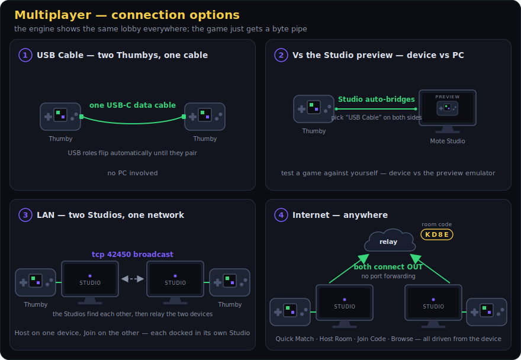</p>

### Playing — connecting two players

Pick the multiplayer option in any 2-player game and the engine shows the same
lobby everywhere. What you can select depends on where the device is:

**USB Cable — two Thumbys, one cable.** Connect the two devices with a USB-C
**data** cable, pick *USB Cable* on both, and they pair in a few seconds (the
units flip USB roles automatically until they find each other). No PC involved.

**Vs the Studio preview — device against your PC.** Dock the Thumby in Mote
Studio, run the same game in the Studio preview, and enter multiplayer → *USB
Cable* on **both** (the preview's lobby and the device's). The Studio notices
the docked device is looking for a direct opponent and links the two
automatically — great for testing a game against yourself.

**LAN — two Studios on the same network.** Each player docks their Thumby in a
Mote Studio; pick *LAN* → Host on one device, *LAN* → Join on the other. The
Studios find each other by broadcast (tcp 42450) and relay the two devices.

**Internet — anywhere.** Dock the Thumby in Mote Studio (the Studio must show
**Device: ON** in the DEVICE tab's MULTIPLAYER row — it does by default), then
drive everything from the device:

- **Quick Match** — one tap: joins any open public room for this game, or
  opens one and waits.
- **Host Room** — opens a room and shows a **4-letter code**; tell your friend.
- **Join Code** — enter their code with the d-pad.
- **Browse Rooms** — list the open public rooms for this game and pick one.

No port-forwarding, no firewall prompts: both Studios connect **out** to a
small relay server, which splices the two byte streams. Rooms are **per-game**
(a WolfMote room never pairs with a MotoKart player) and per-protocol-version,
so mismatched games can't meet. While a session is live the Studio shows
**Device: RELAYING** and logs heartbeats (`relaying ok … max gap …`) in the
Console; everything manual (LAN peering, USB bridging, rooms by hand) still
exists under **Advanced** in the DEVICE tab.

### Link health — blips don't kill matches

The engine keepalives every session itself (tiny frames the games never see)
and measures true transport silence. A short internet hiccup shows a
**LINK STALLED** banner over the game and the match carries on when packets
resume; only a real outage (>20 s) ends it. This works for turn-based games
too — chess says nothing between moves, and the engine's keepalives are what
prove the peer is still there.

### The relay server

The default relay is a tiny Python byte-splicer (`relay/mote_relay.py`) — no
game logic, no accounts, just rooms and pipes. The Studio ships pointing at a
default relay; change it in DEVICE → Advanced → the `relay` field (host or
host:port, Enter to apply — persisted to `mote_relay.txt` next to the exe), or
set `MOTE_RELAY=host[:port]` in the environment.

Self-hosting is one file on any always-on box (a free-tier cloud VM works):

```bash
# on the server
python3 mote_relay.py --port 443            # 443 = firewall-friendly everywhere
# systemd unit + full deploy guide: relay/README.md
```

Rooms idle out after 15 minutes of true silence; TCP keepalives reap dead
peers in about a minute; an event-loop watchdog and per-room gap logs make
"the internet hiccuped" visible in `journalctl` instead of a mystery.

### For developers — one call, then bytes

```c
int host = 0;
MoteNetCfg cfg = { "MyGame", 1, MOTE_NET_ALL };   /* name, protocol version, transports */
if (mote->net_lobby(&cfg, &host) == MOTE_NET_CONNECTED) {
    /* paired: host is 1 on exactly one side — use it for authority/colour/spawn */
}
```

`net_lobby()` blocks while the engine drives the whole lobby UI, and returns
with a **clean connected pipe** — no handshake bytes in the stream. From there
it's plain `mote->link_send(buf, n)` / `mote->link_recv(buf, max)`: a raw
byte pipe, identical across USB / LAN / Internet, so a game written against it
gets every transport for free.

<p align="center">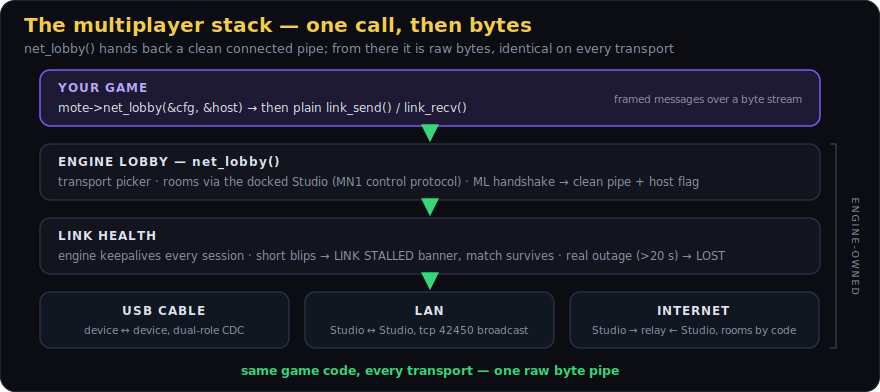</p>

Conventions the shipped games use (worth copying):

- **Frame your messages** — magic byte + type + fixed payload, resync on the
  magic (`0xA5 't' …` in the shipped games). The pipe is a stream, not packets.
- **`host` decides asymmetric things once** — who's white, who rolls the map
  seed, who simulates traffic. Never regenerate shared content from maths on
  both sides (x86 Studio previews and the ARM device disagree on `sinf` at the
  last bit); the authority generates, the other receives.
- **Victims decide their own damage** — each unit simulates its own player and
  applies hits reported against it, so neither side's lag punches through.
- **End the match on `mote->net_health() == MOTE_NET_LOST`**, not your own
  silence timer — the engine's keepalives mean short gaps recover on their own
  (it shows the stall banner for you). `MOTE_NET_STALLED` is informational.
- **Test with two emulators**: run two instances sharing a socket —
  `MOTE_LINK_SOCK=/tmp/lk.sock ./build_host/mote_host mygame.so` twice — and
  drive them with `MOTE_KEYS`. `examples/linkdemo` is the minimal reference
  (lobby → HOST/GUEST → exchange bytes, ~60 lines).

## 11. Device workflow

Games deploy with **`mote push`** — no firmware reflash. The flow:

```
   mote push mygame --launch
        │
        │ 1. cross-compile mygame → mygame.mote   (arm-none-eabi-gcc + sdk/game.ld)
        │ 2. open USB-CDC (VID:PID CAFE:4D01), send "PUT mygame <size>"
        │ 3. stream the .mote bytes; device stores it in flash
        │ 4. (--launch) send "LAUNCH mygame"
        ▼
   device: the resident engine maps the module's flash window via an ATRANS slot,
           runs its mini-crt (copy .data, zero .bss), calls mote_game_register,
           and drives your vtable — the same engine you saw in the emulator.
```

| Command | Action |
|---|---|
| `mote ping` | Handshake — confirm a Mote device is connected |
| `mote list` | List installed games (the device catalog) |
| `mote push <dir> [--launch]` | Cross-build + upload, optionally launch immediately |
| `mote logs [--seconds N]` | Stream the device's `mote->log` output + telemetry |
| `mote wipe` | Erase all games from the device store |

In **Studio**, the **Device** dock does all of this with buttons (Ping / List /
Push / Push & Launch / Stream Logs / Wipe), and the **Console** dock streams the live
build + device output:


**How a `.mote` runs in place (no copy, no relocation):** the module is linked
against a fixed *virtual* flash window (`MOTE_MODULE_VADDR = 0x10800000`, ATRANS
slot 2) and a fixed RAM region (`MOTE_MODULE_RAM = 0x2005E800`, the top 134 KB). The
loader points the ATRANS window at wherever the image physically sits in flash, so
code/rodata execute via XIP. Only `.data`/`.bss` (and `.ramtext`, ABI v36) are copied/zeroed into the reserved
RAM. This is what `MOTE_MODULE_HEADER()` + `sdk/game.ld` set up.

### Flashing firmware (only when you change engine/OS C code)

You only reflash to change the *engine itself* (a new ABI function, the launcher, a
driver) — never for a game.

```bash
cmake -B build_os -S os/device      # configure (needs the Pico SDK)
cmake --build build_os -j8          # → build_os/mote_os.uf2
```

Enter BOOTSEL (power off → hold a button → power on), then copy the `.uf2` to the
RP2350 mass-storage drive.

---

## 12. Gotchas + rough edges

### Real gotchas (things that *will* bite you)

- **255-vertex cap per mesh** (uint8 face indices). Anything bigger must be chunked —
  the STL baker and `mote_mesh_grid` do it automatically; hand-built meshes must
  split themselves.
- **int8 vertices.** Use the `mote_mesh_*` helpers — they pick the quantisation
  scale. Raw `*127` quantisation overflows *silently* if a coordinate exceeds the
  mesh's `scale`.
- **A is held on entry.** The launcher's A press carries into your first frame
  (§8) — gate one-shot fire actions behind an "armed once A released" flag.
- **`update()` overlaps the previous frame's flush.** Your `update` must only touch
  game state + the draw-list, **never the framebuffer**. The framebuffer is only
  yours in `overlay()` / `render_band()`.
- **Don't toggle shared render globals mid-frame.** Both cores raster concurrently;
  a global flipped during the raster is a data race (flicker on device). Keep
  per-call state in the call, not in a global.
- **Return to lobby is the engine menu (or `exit_to_launcher`), not a MENU tap.**
- **Audio notes are one-shot.** Calling `audio_note` every frame retriggers the
  attack and sounds like a buzz — fire it once per event.
- **Arena allocations never individually free.** `mote->alloc` is bump-allocated and
  freed wholesale on exit. Allocate your buffers once in `init()`.

### Rough edges

#### Fixed — new header-only helpers in `mote_build.h` (no ABI change)

| Was painful | Now |
|---|---|
| Open-coding HUD strings with `buf[q++]=…` + `mote_itoa` | `mote_textf(mote, fb, x, y, col, "FPS %d  %.2f", n, x)` — `%d %i %u %x %c %s %f %%` |
| `MoteSprite` 9-field positional struct, easy to mis-order | `mote_sprite(img, x, y)` / `mote_sprite_cell(img, x, y, cw, ch, col, row)` / `mote_sprite_add(mote, img, x, y)` |
| Box bodies silently never collide if you forget the bounding `radius` | `mote_body_box(pos, half, mass)` / `mote_body_sphere(pos, r, mass)` — auto-computes `radius`, sets `orient`, wakes the body; `mass<=0` = static |
| Gameplay logic gets raw, frame-rate-dependent `dt` | `MoteFixed t; mote_fixed_feed(&t, dt); while (mote_fixed_step(&t, 1.0f/60)) update(1.0f/60);` |
| Studio SFX couldn't play on-device (`audio_note` only) | **ABI v12** `audio_play(snd, gain)` + a `.wav`→`MoteSound` baker; SFX-editor Save bakes a playable header |
| Camera-relative positions + `scene_set_splats` inconsistency | **ABI v13** `scene_camera(basis, cam_pos, fov)` — add objects with ABSOLUTE world positions; pass the same `cam_pos` to splats (legacy `scene_begin` still works) |
| `game.toml`'s `abi` field was inert | removed from the scaffold; the real check is the C `MOTE_ABI_VERSION` symbol |
| `MoteImage` "no transparency" was an implicit unlikely-key convention | explicit `opaque` flag (appended to `MoteImage`; old `{px,w,h,key}` headers default to keyed); both bakers set it, the blit skips the key compare when opaque |
| Studio budget meter parsed `MoteConfig` out of source text (broke on unusual formatting) | reads the **exact** `config` from the running module's vtable; falls back to source-parse only when no game is loaded |

#### Fixed — Studio authoring (no engine/ABI change)

| Was painful | Now |
|---|---|
| Pixel-art Save wrote nothing useful with no project open, and always overwrote `sprite.png` | Save requires an open project + a **save-as name field** → `assets/<name>.png` (then auto-bakes) |
| Procedural textures didn't tessellate, or only at certain scales | seamless **tileable** generators (periodic noise + integer-frequency patterns) + a **3×3 tiled preview**; a **Tile ON/off** toggle restores free continuous-scale mode |
| The SFX waveform was a fixed full-width block | **Audacity-style** waveform: wheel-zoom, drag-pan scrollbar, Fit, time ruler, amplitude grid, per-sample at high zoom, live cursor time |

#### Open — still design decisions (not clean fixes)

- **`render_band` reentrancy isn't enforced by the type/signature.** Both cores call it;
  the signature gives no hint you must be reentrant. A fix means changing the vtable
  signature (a core id? a `const` scene handle?) — an ABI change touching every game.
- **Sleeping bodies hang in mid-air** if their support vanishes with no net motion — a
  physics-solver behaviour (needs support-tracking), not a helper.

---

## 13. Project layout + reference

```
engine/     the engine — math/ render/ physics/ audio/ input/ assets/ core/
              render/  : mote_scene3d (raster), mote_pipe, mote_2d, mote_splat, mote_font
              physics/ : mote_phys (rigid bodies + queries)
              core/    : mote_config (FB constants, MOTE_RGB565), mote_platform (the boundary)
platform/   host/ (SDL2 emulator)   device/ (RP2350: LCD, buttons, audio, USB)
os/         mote_os.c (frame loop + ABI assembly), mote_launcher, mote_menu, mote_ui
sdk/        mote_api.h (THE ABI) · mote_build.h (helpers) · mote_module.h + game.ld (device)
studio/     Mote Studio IDE — main.c (UI), motecore.c (native build/bake), usb.c (device link)
tools/      mote (CLI) · obj2mesh.c · stl2mesh.c · ply2splat.py
scripts/    build-windows.sh + mingw-toolchain.cmake (Windows cross-build)
examples/   sample games (see below)
docs/img/   studio-*.png (IDE + per-panel screenshots), architecture/arena/pipeline diagrams
```

### Example games — what each one teaches

### The games — the shipped library

Every game in `games/` (all in the release bundle — drop the `.mote` files into
`/mote/` on a ThumbyOne device):

<table>
<tr>
<td align="center"><a href="games/arkanoid3d">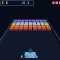</a><br><sub><a href="games/arkanoid3d">arkanoid3d</a></sub></td>
<td align="center"><a href="games/chess">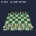</a><br><sub><a href="games/chess">chess</a></sub></td>
<td align="center"><a href="games/deepthumb">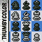</a><br><sub><a href="games/deepthumb">deepthumb</a></sub></td>
<td align="center"><a href="games/fling">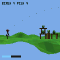</a><br><sub><a href="games/fling">fling</a></sub></td>
<td align="center"><a href="games/golf">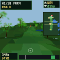</a><br><sub><a href="games/golf">golf</a></sub></td>
<td align="center"><a href="https://github.com/austinio7116/ThumbyOne/releases/latest">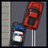</a><br><sub><a href="https://github.com/austinio7116/ThumbyOne/releases/latest">grandthumbauto</a></sub></td>
<td align="center"><a href="games/indemnity"></a><br><sub><a href="games/indemnity">indemnity</a></sub></td>
<td align="center"><a href="games/motokart"></a><br><sub><a href="games/motokart">motokart</a></sub></td>
<td align="center"><a href="games/nightmote">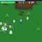</a><br><sub><a href="games/nightmote">nightmote</a></sub></td>
<td align="center"><a href="games/papermote"></a><br><sub><a href="games/papermote">papermote</a></sub></td>
</tr>
<tr>
<td align="center"><a href="games/pong3d">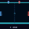</a><br><sub><a href="games/pong3d">pong3d</a></sub></td>
<td align="center"><a href="games/tanks">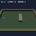</a><br><sub><a href="games/tanks">tanks</a></sub></td>
<td align="center"><a href="games/tetris3d">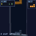</a><br><sub><a href="games/tetris3d">tetris3d</a></sub></td>
<td align="center"><a href="games/thumbalaga"></a><br><sub><a href="games/thumbalaga">thumbalaga</a></sub></td>
<td align="center"><a href="games/thumbatro">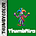</a><br><sub><a href="games/thumbatro">thumbatro</a></sub></td>
<td align="center"><a href="games/thumbycraft">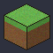</a><br><sub><a href="games/thumbycraft">thumbycraft</a></sub></td>
<td align="center"><a href="games/thumbycue">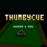</a><br><sub><a href="games/thumbycue">thumbycue</a></sub></td>
<td align="center"><a href="games/thumbyrogue">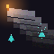</a><br><sub><a href="games/thumbyrogue">thumbyrogue</a></sub></td>
<td align="center"><a href="games/wolfmote"></a><br><sub><a href="games/wolfmote">wolfmote</a></sub></td>
</tr>
</table>

The newest: **Grand Thumb Auto** — a top-down open-city driving game built on the v42
2D rigid-body solver (cars with tyre grip and spin-outs, on-foot sections, a wanted
level). Its `.mote` ships in the games bundle attached to the
[latest ThumbyOne release](https://github.com/austinio7116/ThumbyOne/releases/latest).

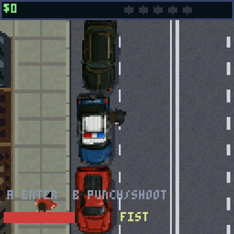

### What each example teaches

| Game | Shows |
|---|---|
| `hello-mesh`, `tumbler` | minimal mesh + camera (**start here**) |
| `tetris3d` | grid logic + engine-rendered cubes (~190 lines) |
| `pong3d`, `arkanoid3d` | polished arcade: trails, particles, power-ups, levels, `menu` for game-over |
| `nightmote` | **2D horde survivor** — the 2D sprite scene drawing a culled swarm, a WANG16 autotiled procedural ground (grass + alt-grass + mud), baked SFX recipes, XP/level-up build, overlay HUD |
| `thumbycue` | **full game port** — 3D snooker & pool rendered through the **built-in engine**: `scene_add_tri` table, `scene_add_sphere_tex` numbered/striped balls, soft ball shadows, ghost-ball `scene_add_ring`, physics/rules/AI, sampled SFX |
| `indemnity` | **full game port** (~20k lines) — Elite-style space sim (flight/combat/trade/galaxy) on the **built-in engine**: `scene_add_object` ships/stations, textured-impostor planets, point/line/disc FX, `set_background_cb` starfield; baked per-weapon SFX; **save + rumble** APIs |
| `tanks` | **3D rigid-part animation** (the showcase) — a rigged tank (body/tracks/turret/barrel), a baked recoil clip triggered on fire, procedural turret aim mixed with the clip, per-part team tinting |
| `physics`, `materials`, `playground`, `dominoes`, `hulls` | the rigid-body solver (boxes/spheres/hulls/materials/stacking) |
| `pickups`, `shooter` | `phys_overlap` / `phys_raycast` as game mechanics |
| `golf`, `pool`, `fling`, `world` | full games (terrain, AI, splats, mesh colliders) |
| `chess` | full game + STL piece models tinted per side (king/queen are two parts for two colours) |
| `terrain` | `mote_mesh_grid` auto-chunked heightfield |
| `cluster`, `zelda`, `splats` | Gaussian-splat scenes |
| `modelview` | a full-detail baked STL `MoteModel` (5,759 tris / 19 chunks) drawn in one call — a heavy 3D stress test |
| `piano3d` | the audio synth — a playable 3D keyboard |
| `tiledemo` | the 2D scene + autotiled file tilesets (dirt/grass/water layers) |
| `tiles` | the render-time autotiler — a procedural Blob-47 cave you can dig live |
| `herodemo` | the sprite-animation runtime — a platformer with idle/walk/jump/fall clips |
| `imgdemo` | baked PNG/BMP images (sprite sheet + overlay blit) |
| `fxdemo` | the FX toolkit — depth-tested points/lines/discs/ring, textured + procedural sphere impostors, soft shadow, `set_background_cb` gradient, a 3D-sprite billboard, a textured mesh, and an additive `blit_ex` HUD sparkle |
| `wolfmote` | **Wolfenstein-3D-style FPS** — textured wall/door cube meshes, billboard enemies (guard + brute, aim/fire/hit/dead) + scenery, a `blit_ex` gun with additive muzzle flash, two weapons, doors (B), hand-authored text-map levels, and `MoteSfx` sound |
| `grandthumbauto` | **top-down open-city driving** — the `phys2d_step` 2D rigid-body solver as a game: cars with `lat_damp` tyre grip, on-foot + vehicle play, city streets, a wanted level *(binary in the games bundle; source lands with a future release)* |

### Key reference files to read when in doubt

- **[austinio7116.github.io/mote](https://austinio7116.github.io/mote/)** — the rendered HTML API/ABI reference (source: [`docs/index.html`](docs/index.html)).
- **`sdk/mote_api.h`** — the canonical ABI (every `mote->` call, with comments).
- **`sdk/mote_build.h`** — every helper, fully inline (read the source, it's short).
- **`engine/*/mote_*.h`** — the real type definitions (`MoteBody`, `MoteSprite`,
  `MoteSplat`, `Mesh`, `Vec3`/`Mat3`).
- **`os/mote_os.c`** — the exact frame loop and how the ABI table is assembled.
- **`examples/hello-mesh/src/game.c`** — the smallest complete game.

## 14. Changelog

See [`CHANGELOG.md`](CHANGELOG.md) for the full history.

### 0.15-alpha

**Multiplayer.** Engine ABI v42 → v45 — reflash the device and rebuild games.

- **`net_lobby()` (v44):** games get an opponent with one call; the engine draws the standard lobby — **USB Cable / LAN / Internet**, host/join/browse rooms with 4-letter codes, d-pad code entry — and returns a clean connected `link_send/recv` pipe with the authority decided (`out_is_host`). Rooms are gated per game + protocol version.
- **Device-driven online:** dock a Thumby in the Studio and the whole internet match is set up from the device — the Studio auto-relays (Device: ON/RELAYING in the DEVICE tab), speaks a tiny control protocol with the device, performs the room action on the relay, and splices the pipes. Manual LAN/USB-bridge/room controls moved under **Advanced**.
- **Link health (v45):** the engine keepalives every session and strips them on receipt, so silence always means a real stall — `net_health()` returns OK / STALLED (>2.5 s, engine draws a LINK STALLED banner over any game) / LOST (>20 s). Blips recover instead of killing matches; turn-based games stop looking dead between moves.
- **2P USB link (v43):** dual-role USB on device (role-flip discovery), local socket pairs on the host emulator (`MOTE_LINK_SOCK`), `examples/linkdemo` is the minimal reference.
- **Seven games with multiplayer modes:** DeepThumb, Wolfmote (+ loot drops on death), Grand Thumb Auto (+ shared traffic), MotoKart (+ the full item game in 2P), ThumbyCue, PaperMote, Indemnity Run (saved ship + loadout).
- **Relay server** (`relay/mote_relay.py` + deploy guide): dumb byte-splicer with public/private rooms, quick match, per-game gating, aggressive TCP keepalives, an event-loop watchdog and per-room gap logging.

### 0.14-alpha

**The model editor grows up.** Multi-part models are first-class; engine ABI unchanged (v42) — reflash only to pick up the physics fix on device.

- **Objects tab (Mesh tab):** the MODEL EDITOR card gains **Tools | Objects** tabs — every part of the model listed as a tree (colour swatch, name, vert/face counts). Click to make a part active, click the **eye** to hide it while you edit another (still bakes/saves), **double-click to rename**.
- **Multi-material OBJs import as separate parts** (one object per `usemtl`, coloured from the `.mtl`) — matching how the baker chunks them. **"Edit this mesh" imports the file you're previewing**; **Re-import parts** refreshes a scene from its own file; clicking a file in the Explorer reliably shows *that* file.
- **A calmer sidebar:** collapsible sections, segmented Vert/Edge/Face + Solid/Wire pickers, Lucide icons on the busiest buttons — and **hover tooltips on every tool in the whole Studio**.
- **Engine:** phys2d positional correction applied once per contact (was once per iteration) — fast, deep collisions no longer "teleport" bodies apart.

### 0.13-alpha

**Smaller games, richer physics.** Engine ABI **v39 → v42** — ships in ThumbyOne firmware 1.30+.

- **Indexed (palette) textures** *(v41)*: ≤256-colour art at 1/4–1/2 the flash on every texture path; bakers apply it automatically and losslessly.
- **Native-quality sounds** *(v40)*: clips keep their real rate/bit-depth (8-bit/11 kHz ≈ 1/4 flash); `MOTE_SFX_RATE`/`MOTE_SFX_BITS` shrink a whole game without touching the WAVs.
- **2D rigid-body physics** *(v42)*: `phys2d_step` — circles + oriented boxes, spin from off-centre hits, masks, sensors, tyre-grip lateral friction.
- **Tone SFX**: the Audio tab's **Full / Tone** toggle + header-only `mote_synth.h` — layered synth sounds authored live, ~0 flash/RAM.
- **Multi-part OBJ models** with per-part colour + `mote_model_draw_palette()` draw-time recolouring.

### 0.12-alpha

**Texture-paint your models, plus booleans and view modes.** A Studio-only update — no firmware reflash; the engine and ABI (v39) are unchanged.

- **UV texture paint (Mesh tab):** **Unwrap** a model into a paintable atlas, then **Paint** it in a split view — the live textured model beside the atlas — with the **full pixel toolset** (brush / fill / line / rect / pick, palette, HSV) and **Undo/Redo**. Paint on the atlas **or directly on the 3D model** (strokes land on both at once, cursor mirrored). Pick the atlas **resolution** (64 / 128 / 256, no re-unwrap), or **Fill from face colours** for an instant base coat. A textured **Bake .h** embeds the atlas + per-face UVs and **auto-adds `.max_tex_tris`** to your `game.c` so it renders (never a black model).
- **Booleans (CSG):** **Union / Subtract / Intersect** two objects — real BSP CSG, works on any closed mesh. **Apply Mirror** bakes the mirrored half into real geometry.
- **View modes:** **Solid** (with hidden-line removal) / **Wireframe** / **X-ray** (`Z` / `Shift+Z`).
- **Quality of life:** Select-All and click-select are scoped to the **active object** so overlapping parts don't fight for the click; a discoverable **New model / switch** header; and **Spin / Texture / Reset view / Bake .h** controls on the model preview card.

### 0.11-alpha

**A full 3D model editor, and a much better Pixel Art tab.** A Studio-only release — no firmware reflash; the engine and ABI (v39) are unchanged.

- **Model editor (Mesh tab):** select verts/edges/faces (+ invert / linked / grow / shrink); move / rotate / scale / extrude / inset; make-face / connect / subdivide / bridge / separate; recalc + clean topology; set-origin; per-face paint; live mirror. Multiple **named models per project**, **multi-object `.obj` import**, and a grouped, **scrollable sidebar with hover tooltips**.
- **Pixel Art:** non-square canvases up to **256×256**, a **real soft-opacity brush** with a square/round shape toggle, and **Ctrl-Z** undo.

### 0.10-alpha

**Proper fonts.** Crisp, anti-aliased, **proportional** text at any size (`text_font`, ABI v39) — bake a TrueType or hand-draw glyphs in the Studio's Font tab. *(Reflash to use new text in device games.)*

### 0.9-alpha

**Smoother sound, and texture a 3D model in the Studio.** Assign a PNG to a mesh and the Studio fills the UVs for you; plus lower-latency, glitch-free audio.

### 0.8-alpha

**Smaller sound effects, and the Mote library as one lobby tile.** Stream `MoteSfx` recipes synthesised on the fly (tiny flash, ~0 RAM), and run the whole Mote game library from a single tile.

### 0.7-alpha

**ThumbyCraft — a full Minecraft-style voxel sandbox — now runs on Mote**, and getting it
there pushed the engine in reusable ways. It's a demanding game (256 KB voxel world, its own
raycaster, eight-biome procedural worlds, mobs, redstone, day/night, crafting, its own music),
so it became the stress test for how far a Mote game can go (engine interface version
35 → **36**; reflash `firmware_mote_os.uf2`).

- **New games:** **ThumbyCraft** (the voxel sandbox above — fills both memory budgets, runs
  at its native framerate; see §7 for the memory story) and **papermote** (a paper.io-style
  territory game with ten creature sprites, AI rivals, three modes, and a procedural music bed).
- **A game can feed its own audio stream** — `audio_set_stream` (ABI v36) registers a callback
  the engine mixes on top of its synth voices, for games with their own software synth (music +
  effects) instead of the note/sample API.
- **Run hot code from RAM** — `.ramtext` (ABI v36) lets a game mark its hottest loop (e.g. a
  raycaster) to execute from SRAM instead of flash, so it doesn't lose the cache to texture
  reads; the loader copies it in at launch. Took ThumbyCraft's raycaster from 8–12 → 12–20 fps.
- **More room + steadier audio:** a game's static RAM grew 128 → 134 KB (from unused OS heap),
  and the engine now keeps the sound buffer topped up *during* the frame's render, so audio
  stays glitch-free even on heavy frames.
- **Tooling:** `mote bake` now bakes every asset type the Studio does (images, `.sfx`, `.wav`,
  tilesets, levels, animations); a per-game `cflags` file adds build-time defines; Studio gained
  selectable console text, `.sfx` loading into the Audio panel, and a complete arena meter.

### 0.6-alpha

**The big games now draw through the built-in engine.** ThumbyCue and Indemnity Run
used to carry their own custom rendering code; now they draw the same way any small game
does — by calling the engine. To make that work, the engine gained the drawing features
they needed (textured/numbered balls, lit planets, shadows, particle/beam effects,
circles, sky backgrounds), plus 3D sprite billboards, textured meshes, rotated/scaled 2D
sprites and alpha/additive blending — usable by every game (engine interface version
23 → **35**; reflash `firmware_mote_os.uf2`).

- **Indemnity Run** and **ThumbyCue** rewritten to render *through the engine* directly
  (shared `mote_vec.h`/`mote_mesh.h`, `scene_add_*`); their `r3d_*` renderers are gone.
- **New 3D scene primitives**: `scene_add_point` / `scene_add_line` / `scene_add_disc`
  (depth-tested FX), `scene_add_tri` (double-sided immediate-mode world triangle),
  `scene_add_sphere_tex` (textured *or* callback-shaded oriented sphere impostor —
  numbered balls, lit planets), `scene_add_shadow` / `scene_add_shadow_ex` (soft round
  or oriented-oval ground shadows), `scene_add_ring` (camera-facing circle outline),
  plus `MOTE_DRAW_NO_DEPTH_WRITE` and `scene_add_object_ex`.
- **Background + camera**: `set_background_cb` (per-band sky pass), `scene_set_near`.
- **3D sprites + texturing + blend**: `scene_add_billboard` (camera-facing textured
  quads — trees/pickups/enemies/smoke), textured meshes (`Mesh.texture` + per-corner
  `face_uvs`, drawn through `scene_add_object`), `blit_ex` (rotate/scale any 2D sprite),
  and `MOTE_BLEND_ALPHA` / `_ADD` on billboards, `blit_ex` and whole meshes
  (`MOTE_DRAW_BLEND`) — glows, lasers, water, glass.
- **2D framebuffer drawing** for HUDs: `draw_pixel` / `draw_line` / `draw_rect` /
  `draw_circle` (companions to `text`/`blit`).
- **Engine master volume**: `audio_set_master` / `audio_get_master` — one knob shared by
  every game and the engine menu (games route their volume option here).
- **pool** upgraded: textured/numbered balls + soft shadows, and a fixed table (real
  cushions + no z-fight flicker). **Soft shadows** added to `tanks`, `chess`, `dominoes`,
  `golf`. New **`fxdemo`** (FX/impostor/shadow/ring/billboard/blend showcase) and
  **`wolfmote`** (a full Wolfenstein-3D-style FPS — textured walls/doors, billboard
  enemies + scenery, two weapons, sound, hand-authored levels). Both ship icons.
- Fixes: in-game volume and the engine menu now share one master and re-arm audio on
  close (no more dead sound after the menu); textured triangles are now
  perspective-correct (no skew up close); a game declaring only the newer pools is no
  longer misread as legacy (it was overflowing the arena); the load arena is **272 KB**.

### 0.5-alpha

Saves, rumble, and a third big game port. Reflash `firmware_mote_os.uf2` (ABI → 23).

- **Indemnity Run** — full Elite-style space sim port (~20k lines) on `render_band`.
- **Persistent save** (`save`/`load`/`save_slots` — fixed numbered slots, files on device's
  save folder / host) and **rumble** (`rumble(intensity, ms)`) added to the ABI (v23).
- **Named-blob storage** (`kv_save`/`kv_load`/`kv_list` — ABI v38): arbitrary keyed blobs of
  any size, file-backed, for games that persist *many* pieces — e.g. ThumbyCraft saves each
  edited voxel chunk under its own key. The fixed `save` slots are for a game's single
  record; `kv_*` is for open-ended collections.
- **Audio**: play baked `<name>_snd` clips (flash, 0 RAM) for a game's sounds; the docs,
  the Studio save hint, and the OOM screen now steer you off the RAM-hungry
  `mote_sfx_bake`-everything path. Audio-tab seed/Randomize no longer renames your sound.
- Load arena trimmed 280 → 276 KB to fit the new OS state; cleaner build consoles.

### 0.4-alpha

Two new example games and Studio/tooling polish. Updates the device firmware (reflash
`firmware_mote_os.uf2`); ABI unchanged (22), so existing games keep running.

- **ThumbyCue** — full 3D snooker & pool port on the dual-core `render_band` hook.
- **Nightmote** — a 2D horde survivor (sprite swarm, WANG16 procedural ground, baked
  SFX, level-up build) — all native Mote.
- **C standard library in games** — `snprintf` / `printf`-family link on device now (the
  build supplies libc syscall stubs); use `mote->alloc`, not `malloc`.
- Studio: **Toggle Chassis** (solid/clear shell), **Assets ▸ Import** (copy a file into
  `assets/`), and a panel-separator hover highlight.
- Fixes: pong paddle flash (no more sphere), piano front-of-key glow, device `snprintf`
  links in both build paths, `mote bake` skips tileset sheet PNGs.

### 0.3-alpha

Updates the device firmware — reflash `firmware_mote_os.uf2` and rebuild your games for
the smaller launcher icons.

- **3D model animation** — rig models into moving parts, animate on a keyframe timeline,
  bake clips, and trigger them from game events. Authored in the Studio Rig tab (3-axis
  manipulator + timeline); see [Creating rigs and 3D animations](#creating-rigs-and-3d-animations) and [`docs/animation.md`](docs/animation.md).
- **Tanks example** rebuilt with detailed rigged 3D tanks and a baked recoil clip on fire.
- **Smaller launcher icons** ([§4.1](#4-the-asset-pipeline)) — a compact paletted blob in flash (~2–4× smaller), now handled by the build (games don't `#include` anything).
- **Open Project** screen shows each game's icon, a memory-usage bar, and a scrollbar.
- **Edit the launcher icon** in the Pixel Art editor; more canvas sizes (incl. 60) + a −/+ for any size.
- **File manager in the tree** — right-click New File/Folder, Rename, Delete; double-click a folder to collapse; `.sfx`→Audio, `.rig`→Rig; mousewheel-zoom the 3D previews.
- **Optional frame-rate cap** ([§5.7](#57--text-telemetry-memory-control)) games can set, honoured by device + emulator.
- Fixed: sharp + un-squashed Mesh/Rig preview, non-inverted orbit drag, rig editable on load, Windows "VS Code" + "Reveal in Files", asset subfolders now build.

### 0.2-alpha

This release updates the device firmware — reflash `firmware_mote_os.uf2`, and
rebuild your games so they pick up the new per-game icons.

**New and improved**

- Each game now carries its own launcher icon, so adding a game no longer means updating the firmware.
- The device holds and shows many more games — up to 56, was 24.
- Creating a game gives you a wizard: pick a starter template (3D, physics, or 2D) with sensible memory settings already filled in.
- The **fling** example is now a full game — procedurally generated levels, large rolling terrain, and taller, more varied forts.
- Animation files are much smaller: only the frames a clip actually uses are saved.
- More games have proper icons, taken from a screenshot of the game.
- Mote Studio shows its version under Help ▸ About.

**Fixed**

- Switching between projects now refreshes the Tiles, Anim, and Mesh tabs.
- Listing games on the device no longer cuts off when you have a lot of them.
- **fling** forts no longer fall over before you take a shot, and the aim dots are now easy to see against the sky.

### 0.1-alpha

First public alpha: the native C engine, console OS, and Studio IDE for the Thumby Color.
