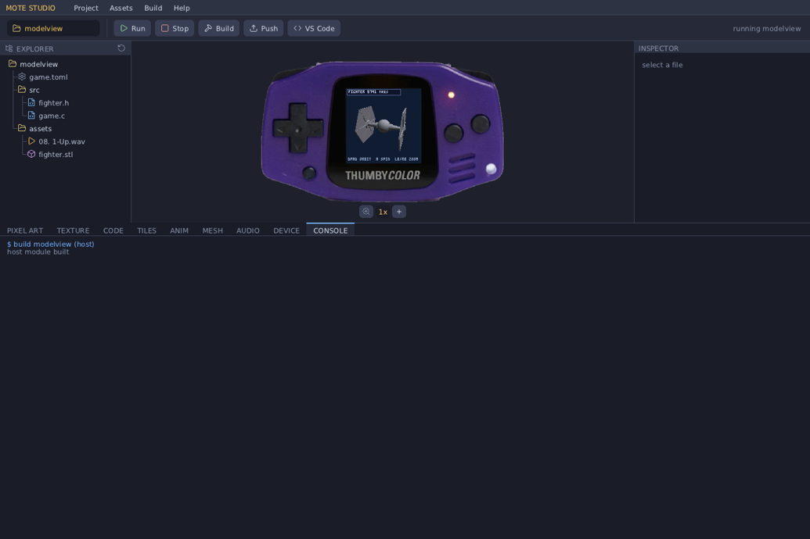

# Mote — a native game engine + console OS for the Thumby Color

Mote is a native-C game-development platform for the **Thumby Color** handheld
(RP2350: dual Cortex-M33 @ 280 MHz with FPU, 520 KB SRAM, a 128×128 RGB565 LCD).

The big idea: the **engine lives resident inside the OS**, and your game is a tiny
native module that talks to the engine through a stable jump-table ABI. You
compile optimized native code **on your PC** and deploy it to the device with one
command — no per-game firmware reflash, no interpreter, no waiting.

```
host:   mote new mygame  →  edit src/game.c  →  mote run mygame   (instant SDL emulator)
                                              →  mote push mygame  (USB → device, in seconds)
device: boot → hero-menu launcher → pick a game → the resident engine runs it
```

The repo ships **25 example games** spanning 3D triangle raster, rigid-body
physics, Gaussian splats, voxels, terrain, and 2D sprites — all built on the same
ABI, all under ~300 lines each.

> **New here? Read in this order:** §1 Quick start → §2 Mote Studio (the IDE) →
> §3 Anatomy of a game → §5 The engine API. The rest is reference.

---

## Table of contents

1. [What Mote is — the architecture](#1-what-mote-is)
2. [Quick start (CLI) + Mote Studio (the IDE)](#2-quick-start)
3. [Anatomy of a game, line by line](#3-anatomy-of-a-game)
4. [The asset pipeline (baking)](#4-the-asset-pipeline)
5. [The engine API, fully documented](#5-the-engine-api)
6. [Coordinate systems + math types](#6-coordinate-systems--math-types)
7. [Memory model — the arena + MoteConfig](#7-memory-model)
8. [Input — buttons, edges, arming](#8-input)
9. [Audio](#9-audio)
10. [Device workflow — build, push, flash](#10-device-workflow)
11. [Gotchas + rough edges](#11-gotchas--rough-edges)
12. [Project layout + reference](#12-project-layout--reference)

---

## 1. What Mote is

A Mote game is **not** an app that owns `main()` and a loop. It is a *module* —
a small chunk of compiled code (a `.so` on your PC, a `.mote` file on the device)
that the OS loads, hands a table of engine function pointers, and then drives. You
write three or four callbacks; the OS calls them every frame.

```
        YOUR GAME MODULE                    THE RESIDENT ENGINE + OS
   ┌──────────────────────────┐        ┌──────────────────────────────────────┐
   │  src/game.c               │        │  os/mote_os.c   — the frame loop      │
   │   • g_init()              │  ABI   │  engine/render  — triangle raster,    │
   │   • g_update(dt) ─────────┼───────►│                   2D sprites, splats  │
   │   • g_overlay(fb)         │ (mote->)│  engine/physics — rigid bodies        │
   │   • config { pools }      │◄───────┤  engine/audio   — synth               │
   │                           │ vtable  │  engine/input   — edge/held state     │
   │  links NO engine code     │        │  os/mote_launcher — the game picker    │
   └──────────────────────────┘        └───────────────┬──────────────────────┘
              ▲                                          │
              │ #include <mote_api.h>                    │  platform abstraction
              │          <mote_build.h>  (header-only)   ▼  (one boundary, two impls)
              │                              ┌───────────────────────────────────┐
              │                              │ platform/host  — SDL2 (your PC)     │
              └── compiled by `mote` / Studio│ platform/device— RP2350 (LCD/USB…) │
                                             └───────────────────────────────────┘
```

Two things make this work:

- **The ABI** (`sdk/mote_api.h`) is a struct of function pointers — `const MoteApi *mote`.
  The game calls `mote->scene_add_object(...)`, `mote->input()`, `mote->audio_note(...)`,
  and never touches engine internals directly. The contract is append-only and
  versioned (`MOTE_ABI_VERSION`), so old games keep running as the engine grows.
- **The same C compiles for PC and device.** The platform layer
  (`engine/core/mote_platform.h`) is the *only* place that differs between the SDL
  emulator and the real hardware. Your game and the engine have zero `#ifdef
  HOST/DEVICE` — what you see in the emulator is what runs on the handheld.

**Mote Studio** is the bespoke IDE (a native C/SDL2 desktop app — no Electron, no
Python) that wraps the whole workflow: a project tree, the *real engine* running
your game inside a photo-accurate Thumby Color shell, an inspector, and docked
tools for pixel art, code editing, meshes, audio, and device control. It is the
recommended way to develop; the `mote` CLI is the same thing without the GUI.

---

## 2. Quick start

### 2.1 Install dependencies (host)

```bash
# Debian/Ubuntu/WSL:
sudo apt install build-essential cmake libsdl2-dev imagemagick
#   build-essential  — gcc + make (the host compiler for game modules)
#   cmake            — builds the engine, host emulator, and Studio
#   libsdl2-dev      — the emulator window + audio + input
#   imagemagick      — used by `mote bake` to read PNG/BMP for image baking
# Optional, only for device builds / pushes:
sudo apt install gcc-arm-none-eabi   # cross-compiler for the .mote module
pip install pyserial                 # for `mote push` / `mote logs` over USB
```

### 2.2 Build the engine + emulator + Studio (once)

```bash
cmake -B build_host -S . && cmake --build build_host -j8
```

This produces:
- `build_host/mote_host` — the SDL emulator (runs one game `.so`)
- `build_host/mote_studio` — the IDE

### 2.3 Make and run a game (CLI)

`tools/mote` is the command-line driver. Put it on your `PATH` or call
`./tools/mote`.

```bash
mote new mygame      # scaffold mygame/ with a spinning-cube src/game.c + game.toml
mote run mygame      # compile mygame → host .so, launch the emulator
```

| Command | What it does |
|---|---|
| `mote new <dir>` | Scaffold a game: `game.toml`, `src/game.c` (a spinning cube), `assets/` |
| `mote build <dir>` | Compile → host `.so` in `<dir>/build/`. Add `--device` for the RP2350 `.mote` |
| `mote run <dir>` | Build for host **and** launch the SDL emulator on it |
| `mote bake <dir>` | Convert `assets/*.png`, `*.obj`, `*.stl` → C headers in `src/` (see §4) |
| `mote push <dir>` | Cross-build the `.mote` and upload it over USB (`--launch` runs it now) |
| `mote ping` / `mote list` / `mote logs` / `mote wipe` | Talk to a connected device |
| `mote studio` | Build + open the IDE (see §2.5) |

**Emulator keyboard map:**

| Thumby button | Keys |
|---|---|
| D-pad | Arrow keys **or** W/A/S/D |
| A | `.` or `K` |
| B | `,` or `J` |
| LB | Left Shift |
| RB | Space |
| MENU | Enter |
| (open engine menu) | hold MENU alone 3 s, or set env `MOTE_MENU=1` |
| Quit | Esc / window close |

**Headless (CI / screenshots):**

```bash
# The emulator runs the single .so you pass as argv. MOTE_SHOT dumps frame
# MOTE_SHOT_FRAME (default 20) to a .ppm and exits — handy for CI screenshots.
SDL_VIDEODRIVER=dummy MOTE_SHOT=/tmp/shot.ppm MOTE_SHOT_FRAME=60 \
  ./build_host/mote_host examples/mygame/build/mygame.so
```

### 2.4 The `game.toml` manifest

`mote new` writes a tiny manifest. It only carries metadata; the *engine* config
(memory pools) lives in your C code (§7), not here.

```toml
[game]
name = "mygame"      # the module's name (used for the built .so/.mote filenames,
                     # the device catalog, and the launcher list). Defaults to the
                     # folder name if omitted.
author = "you"
abi = 1
```

### 2.5 Mote Studio — the IDE (recommended workflow)

```bash
mote studio              # or: ./build_host/mote_studio   (run from the repo root)
mote studio calibrate    # one-off: align the emulator screen to the device photo
```



**The foolproof loop — open Studio, pick a game, edit, watch it hot-reload:**

```
 1. Launch Studio.                A project picker (Project ▸ Open) lists
                                   examples/ and any folder with a game.toml.
 2. Click a game.                 Studio builds it and runs the REAL engine
                                   inside the on-screen Thumby Color shell.
 3. Play it.                       The shell buttons are clickable; keyboard +
                                   gamepad also work; there's a zoom control.
 4. Edit src/game.c.              Use the built-in Code editor, or click
                                   "Edit in VS Code" to open it in VS Code.
 5. Save.                         Studio watches the source mtime: on change it
                                   rebuilds and HOT-RELOADS the running game —
                                   no restart, no rebuild button needed.
 6. Repeat 3–5.                   Tight inner loop. The Console dock shows the
                                   live build output and any device logs.
```

**The layout — Unity/Godot-style docks, resizable with draggable separators:**

- **Menu bar + toolbar** — Project / Assets / Build / Help, plus Run · Stop ·
  Build · Push · "Edit in VS Code".
- **Project tree (left)** — the open game's files with type-coloured icons;
  auto-refreshes on file changes.
- **Emulator (centre)** — the real engine running your game inside a
  photo-accurate, calibrated, crisp integer-scaled Thumby Color shell.
- **Inspector (right)** — properties of the selected file. For `game.toml` it
  parses your `MoteConfig` pools out of the C source and shows a **~280 KB arena
  budget meter** so you can see your memory headroom (§7).
- **Bottom dock — tabbed tools:**

  | Tab | What it does |
  |---|---|
  | **Pixel Art** | HSV+hex colour picker, pencil/eraser/fill/eyedropper/line/rect, undo, grid, sizes 8–128, zoom+pan, PNG/BMP/JPG import. **Save** writes `assets/sprite.png` *and auto-bakes* the `MoteImage` header (§4). |
  | **Assets** | Browse the project's baked assets. |
  | **Mesh** | Software-rendered 3D preview of `.stl`/`.obj` (drag to rotate). |
  | **Audio** | Load a WAV/MP3 (→ 22050 Hz mono), see the waveform, drag-crop, play, "Save Crop" into `assets/`; plus an **SFX generator** (Random / presets). See §9 — note these are `.wav` *files*, not the runtime synth. |
  | **Device** | Ping / List / Push / Push & Launch / Stream Logs / Wipe over USB. |
  | **Console** | Live build + device output. |

**Native + Python-free.** Studio reimplements the CLI's build/scaffold/bake in C
(`studio/motecore.c`) and talks to the board over USB-CDC directly (`studio/usb.c`;
Linux `termios` / Windows Win32 COM, device found by VID:PID `CAFE:4D01`). It loads
game modules in-process via a cross-platform loader (`dlopen` / `LoadLibrary`) — so
a game is a `.so` on Linux, a `.dll` on Windows. It still shells out to a C
compiler (`gcc`, `arm-none-eabi-gcc`) and, for the Audio tab, `ffmpeg`.

**Windows build:** `scripts/build-windows.sh` cross-compiles with MinGW-w64 into a
single self-contained `dist-windows/mote_studio.exe` (SDL2 + MinGW runtime statically
linked, no DLL dependencies). Drop it in the repo root and run it there.

---

## 3. Anatomy of a game

A game is one file, `src/game.c`. It links **no engine code** — it is handed the
engine jump table (`mote`) and the OS drives its callbacks. Here is the entire
`mote new` template, every token explained.

```c
#include "mote_api.h"     // the ABI: MoteApi, MoteGameVtbl, MoteConfig, all the
                          // engine types (Vec3, Mesh, MoteInput, MoteBody, …)
#include "mote_build.h"   // header-only convenience: safe mesh primitives, a
                          // camera helper, a tiny immediate-mode UI (§5.8)

MOTE_GAME_MODULE();       // (1) macro — see below

#ifdef MOTE_MODULE_BUILD  // (2) device-only flash header — see below
#include "mote_module.h"
MOTE_MODULE_HEADER();
#endif

static const Mesh *s_cube;   // your game state lives in file-scope statics.
static Mat3 s_m;             // (.data/.bss; on device it's in a fixed RAM region)

static void g_init(void) {                       // (3) called ONCE, after load
    mote->scene_set_background(MOTE_RGB565(10, 12, 26));  // dark-blue clear colour
    mote->scene_set_sun(v3(0.4f, 0.7f, -0.6f));           // directional light dir
    // a unit cube: world-unit HALF-extents (so 1.0 = 2m across) + an RGB565 colour.
    s_cube = mote_mesh_box(mote, 1.0f, 1.0f, 1.0f, MOTE_RGB565(120, 180, 230));
    s_m = m3_identity();                          // its orientation = no rotation
}

static void g_update(float dt) {                 // (4) called EVERY frame
    const MoteInput *in = mote->input();          // current button state (§8)
    // MENU is yours — the engine menu (hold MENU 3s) owns return-to-lobby.

    m3_rotate_local(&s_m, 1, 0.9f * dt);          // spin about the cube's own Y axis
    m3_orthonormalize(&s_m);                      // re-square the basis (drift fix)

    Mat3 cam = mote_camera_look(v3(0,0,0), v3(0,0,1));   // eye at origin, look +Z
    mote->scene_begin(&cam, 60.0f);               // start the draw-list, fov 60°
    MoteObject obj = { .pos = v3(0,0,4.5f),       // 4.5m in front of the camera
                       .basis = s_m, .mesh = s_cube };
    mote->scene_add_object(&obj);                 // queue it; the OS rasters it
}

static const MoteGameVtbl k_vtbl = {              // (5) the contract you hand back
    .init = g_init, .update = g_update,
    .config = { .max_tris = 256, .depth = 1 },    // declare your memory pools (§7)
};
static const MoteGameVtbl *mote_game_vtbl(void) { return &k_vtbl; }
```

**(1) `MOTE_GAME_MODULE()`** expands to three things you'd otherwise hand-write:
the exported `mote_game_abi_version` symbol the loader checks; a file-scope
`static const MoteApi *mote` (the jump-table pointer everything goes through); and
the `mote_game_register(api)` entry function that stashes `mote = api` and returns
your vtable via `mote_game_vtbl()`. So you just define `mote_game_vtbl()` and use
`mote->…`.

**(2) `MOTE_MODULE_HEADER()`** emits the on-flash header the device loader reads
(magic, ABI version, the register entry, and the `.data`/`.bss` copy ranges from
`sdk/game.ld`). It is **device-only** — the host `.so` build omits it, so it's
guarded by `#ifdef MOTE_MODULE_BUILD` (a define the device build sets). On the host
this whole block disappears.

**(3)–(5) The vtable callbacks.** All are optional except you'll want `update`:

| Callback | Signature | When it runs |
|---|---|---|
| `init` | `void init(void)` | Once, after the engine pools are set up. Build meshes, init state. |
| `update` | `void update(float dt)` | Every frame on core0. Read input, advance state, build the draw-list. `dt` = seconds since last frame (clamped ≤ 0.1). Runs **concurrently** with the previous frame's LCD flush. |
| `render_band` | `void render_band(uint16_t *fb, int y0, int y1)` | *Optional.* A custom per-row-band rasteriser, called from **both cores** with disjoint bands `[y0,y1)`. Leave `NULL` to use the built-in scene rasteriser. Use this only for custom raycasters etc. |
| `overlay` | `void overlay(uint16_t *fb)` | *Optional.* 2D HUD drawn on top, on core0, after the 3D/2D passes. `fb` is the 128×128 RGB565 framebuffer. |
| `config` | `MoteConfig` (a struct, not a function) | Read **before** `init()` to size the engine arena. See §7. |

**The frame loop the OS runs for you** (`os/mote_os.c`), per frame:

```
  1. poll buttons → derive edge/held state (MoteInput)
  2. pump audio
  3. if MENU held alone ≥3s → open the engine menu (pause/brightness/volume/exit)
  4. clear the 3D + 2D scene draw-lists
  5. call your update(dt)         ── runs concurrently with last frame's flush ──
  6. wait for last frame's flush to finish
  7. rasterise the scene across BOTH cores (top half / bottom half)
  8. render any registered splats (second banded pass)
  9. call your overlay(fb), then draw the perf graph
 10. kick the async LCD flush (overlaps the next update) → back to 1
```

You never write this loop. You only fill the draw-list in `update()` and (maybe)
draw a HUD in `overlay()`.

---

## 4. The asset pipeline

**The device has no filesystem your game can read from.** A `.mote` is a flat
flash image with code + constants; there's no `fopen("sprite.png")`. So every
asset — images, 3D meshes — is **baked into a C header** of plain constant arrays,
which you `#include` and the compiler embeds straight into your module. The data
ends up in flash (`.rodata`) and you point the engine at it.

```
   assets/logo.png  ──(img2tex, uses ImageMagick)──►  src/logo.h
                                                       ┌──────────────────────────┐
                                                       │ static const uint16_t    │
                                                       │   logo_px[3120] = {...};  │  ← RGB565 pixels
                                                       │ static const MoteImage    │
                                                       │   logo_img = {logo_px,    │  ← the struct you use
                                                       │     104, 30, 0xF81F};     │
                                                       │ #define logo_W 104        │
                                                       │ #define logo_H 30         │
                                                       └──────────────────────────┘
   #include "logo.h"  in game.c  →  mote->blit(fb, &logo_img, ...)
```

### What bakes, and how you use it

| Source file(s) | Baker | Generated header contains | How you use it in C |
|---|---|---|---|
| `*.png`, `*.bmp` | **img2tex** (needs ImageMagick) | `<name>_px[]` (RGB565), `<name>_img` (a `MoteImage`), `<name>_W` / `<name>_H` | `#include "<name>.h"` then a sprite via `mote->scene2d_add` or an immediate blit via `mote->blit` |
| `*.obj` | **obj2mesh** | one `<name>_mesh` (a `Mesh`) | small models that fit ≤255 verts |
| `*.stl` (binary or ASCII) | **stl2mesh** | `<name>_chunks[]` (array of `Mesh`) + `<name>_NCHUNKS` | big models, auto-decimated + split into ≤255-vert chunks; draw every chunk at one transform |

**Image transparency:** any source pixel with alpha < 128 becomes the magenta
colour-key `0xF81F` (`MOTE_KEY_MAGENTA`); the engine's 2D rasteriser and `blit`
skip key-coloured pixels. (A real magenta in your art is nudged one bit off so it
isn't treated as transparent.)

**Sprite sheets are just one image.** A sheet is a single baked `MoteImage`; you
pick a frame with the sprite's source rect `fx,fy,fw,fh`. e.g. a 48×24 PNG holding
two 24×24 frames → frame *i* is `fx = i*24, fy = 0, fw = 24, fh = 24`. See
`examples/imgdemo` (a baked logo + an animated 2-frame sprite).

**Big meshes (STL):** `stl2mesh` welds duplicate vertices, **decimates by vertex
clustering** (binary-searched down to a triangle budget, default ~1500), and
**chunks** the result into ≤255-vertex sub-meshes (the uint8 index cap, §6). Render
it by drawing every chunk at the same transform:

```c
#include "fighter.h"   // baked from assets/fighter.stl: fighter_chunks[], fighter_NCHUNKS
for (int i = 0; i < fighter_NCHUNKS; i++) {
    MoteObject o = { .pos = v3_sub(world_pos, cam_pos),
                     .basis = s_rot, .mesh = &fighter_chunks[i] };
    mote->scene_add_object(&o);
}
```

See `examples/modelview` (a 6,742-tri fighter → 1,494 tris in 4 chunks).

### When does baking happen? Do I *have* to bake?

```
  ┌─ CLI ─────────────────────────────────────────────────────────────────┐
  │  mote bake <dir>     manual: scans assets/, writes src/*.h headers.     │
  │  mote build / run    does NOT auto-bake. It compiles whatever headers   │
  │                      already exist in src/. Bake first (or once).       │
  └────────────────────────────────────────────────────────────────────────┘
  ┌─ Studio ──────────────────────────────────────────────────────────────┐
  │  Pixel Art ▸ Save    AUTO-bakes: writes assets/sprite.png AND the       │
  │                      matching MoteImage header in one click.            │
  │  Inspector ▸ Bake    manual "Bake → Header" button on an asset.         │
  │  Build / Push (k=1)  cross-build for device; bake is a SEPARATE action  │
  │                      (k=2) — Studio does not implicitly re-bake on build │
  │                      either.                                            │
  └────────────────────────────────────────────────────────────────────────┘
```

So: **baking is a one-time-per-asset-change step, not part of every build.** You
re-bake only when the source art/model changes. The generated `.h` is committed
alongside your source (it's just C). You do *not* have to use the bake tools at
all — you can hand-write a `MoteImage`/`Mesh`/`MeshVert[]` literal in code if you
prefer (the `mote new` template's `SHAPE_H` and `tiledemo`'s procedural art do
exactly this). Bake is a convenience for going from real PNG/OBJ/STL files to
embeddable constants.

### Audio is **not** baked — read this carefully

There is **no `.wav` → header baker** and the runtime has **no WAV/sample
playback**. The engine's audio API is a small **procedural synth**: you call
`mote->audio_note(freq, amp)` to strike a one-shot piano-ish note (§9). The Studio
Audio tab's WAV/MP3 loading, cropping, and SFX generator save `.wav` *files* into
`assets/` for your own reference/preview — they are **not** loaded by a game at
runtime. If you want sound in a game today, you synthesise it with `audio_note`.
(This is a known rough edge — see §11.)

---

## 5. The engine API

Everything stateful goes through `const MoteApi *mote` (`sdk/mote_api.h`). The
math (`Vec3`/`Mat3`), data formats (`Mesh`, `MoteImage`, `MoteBody`, `MoteSplat`),
and the `mote_build.h` helpers are **header-only** — they compile into your module,
no ABI call. Below, each function is documented with its real signature, every
parameter (units / coordinate space / ranges), the return value, when you'd use
it, and a snippet.

> **Coordinate convention** (full detail in §6): world is right-handed, the camera
> looks down **+Z**, and 3D object positions are **camera-relative** (`world − camera`).
> The 2D scene, `blit`, and `text` use **screen pixels** (0..127, +x right, +y down).

### 5.1 — 3D scene (the triangle pipeline)

You build a draw-list each frame in `update()`; the OS rasterises it across both
cores. The flow is always: `scene_begin` → add objects/spheres → (done; OS rasters).

#### `void scene_set_background(uint16_t rgb565)`
The clear colour the raster fills behind everything, each frame. Call in `init()`
(or per-frame to change it). `rgb565` is a 16-bit colour — build one with
`MOTE_RGB565(r,g,b)` where r,g,b are 0–255.
```c
mote->scene_set_background(MOTE_RGB565(10, 12, 26));   // dark navy
```

#### `void scene_set_sun(Vec3 dir_toward_light_world)`
Sets the single directional light used to shade all meshes. `dir` is a **world-space
direction pointing toward the light** (it gets normalised internally, but pass a
unit vector for clarity). Surfaces facing the sun are brighter. Call once in `init()`.
```c
mote->scene_set_sun(v3_norm(v3(0.4f, 0.7f, -0.6f)));   // high, slightly behind/right
```

#### `void scene_begin(const Mat3 *cam_basis, float fov_deg)`
Begins this frame's 3D draw-list. `cam_basis` is the camera **orientation** (rows =
right/up/forward; build it with `mote_camera_look`, §5.8). `fov_deg` is the vertical
field of view in degrees (50–70 is typical; smaller = more zoomed/telephoto). The
camera *position* is implicit: it's the origin, and you pass object positions
**relative to it** (§6). Call once per frame before adding objects.
```c
Mat3 cam = mote_camera_look(eye, target);   // eye, target in world space
mote->scene_begin(&cam, 60.0f);
```

#### `int scene_add_object(const MoteObject *obj)`
Queues one mesh for rendering. `MoteObject = { Vec3 pos; Mat3 basis; const Mesh *mesh; }`:
- `pos` — **camera-relative** world position of the mesh's origin (`world − cam_pos`).
- `basis` — the object's orientation (rows right/up/forward; `m3_identity()` = unrotated).
- `mesh` — a `const Mesh *` (from a `mote_mesh_*` helper or a baked header).

Returns the number of triangles actually emitted (0 if the object was frustum-culled
or the draw-list pool is full). Call as many times as you have objects.
```c
MoteObject o = { .pos = v3_sub(world_pos, cam_pos),
                 .basis = s_rot, .mesh = s_cube };
mote->scene_add_object(&o);
```

#### `int scene_add_object_scaled(const MoteObject *obj, float scale)`
Same as `scene_add_object`, but uniformly scales the mesh by `scale` (1.0 =
unchanged, 2.0 = double size) at draw time — handy for reusing one mesh at several
sizes without baking variants.

#### `int scene_add_sphere(Vec3 cam_rel_pos, float radius, uint16_t color)`
Draws a **per-pixel shaded sphere impostor** — a real-looking lit sphere with **no
triangles**. Cheap; depth-tested against meshes. Perfect for balls, particles,
planets, glows, target rings. `cam_rel_pos` is camera-relative (`world − cam`),
`radius` in metres, `color` RGB565. Returns 1 if drawn (0 if culled/full).
```c
mote->scene_add_sphere(v3_sub(ball.pos, cam_pos), 0.12f, MOTE_RGB565(248,248,248));
```

#### `int scene_tri_count(void)`
Triangles emitted into the draw-list so far this frame. Use it for HUD/profiling or
to back off detail when you're near the `max_tris` budget.

### 5.2 — 2D scene (sprites + tilemap)

A screen-space 2D layer the OS rasters **after** the 3D scene (both banded across
cores). A game can be pure-2D, pure-3D, or hybrid (3D world + 2D HUD). Build it
each frame: `scene2d_begin` → optional tilemap → add sprites.

#### `void scene2d_begin(int cam_x, int cam_y)`
Starts the 2D scene with a camera offset in **pixels** (`cam_x,cam_y` is the
top-left of the view in world-pixel space; sprites/tiles are drawn at
`world − cam`). For a fixed screen, pass `(0,0)`.

#### `void scene2d_set_tilemap(const MoteTilemap *map, const MoteTileset *tiles)`
Sets a background tile grid drawn under the sprites. `MoteTileset = { const MoteImage
*sheet; uint16_t tile_w, tile_h; }` (an atlas cut into cells, indexed
left-to-right/top-to-bottom). `MoteTilemap = { const uint8_t *cells; uint16_t cols,
rows; }` (cell `[r*cols+c]` is a tile index; `0xFF` = empty).
```c
static MoteImage   atlas   = { atlas_px, 32, 8, MOTE_KEY_MAGENTA }; // 4×(8×8) tiles
static MoteTileset tileset = { &atlas, 8, 8 };
static MoteTilemap tilemap = { map_cells, 24, 18 };
mote->scene2d_set_tilemap(&tilemap, &tileset);
```

#### `int scene2d_add(const MoteSprite *spr)`
Adds one sprite to the 2D scene. `MoteSprite`:
- `const MoteImage *img` — the source image/sheet.
- `int16_t x, y` — world position in pixels (camera-relative applied at raster).
- `uint16_t fx, fy, fw, fh` — source frame rectangle in `img` (for a whole image:
  `fx=fy=0, fw=img->w, fh=img->h`; for a sheet, select the frame cell).
- `uint8_t layer` — draw order (lower drawn first).
- `uint8_t flags` — `MOTE_SPR_HFLIP` (0x01) and/or `MOTE_SPR_VFLIP` (0x02).

Returns 0 if the sprite pool is full. Up to `config.max_sprites` per frame.
```c
MoteSprite s = { &player, (int16_t)px, (int16_t)py,
                 (uint16_t)(frame*8), 0, 8, 8,    // frame cell, 8×8
                 10,                               // layer
                 (facing < 0) ? MOTE_SPR_HFLIP : 0 };
mote->scene2d_add(&s);
```

#### `void blit(uint16_t *fb, const MoteImage *img, int x, int y, int fx, int fy, int fw, int fh, uint8_t flags, int y0, int y1)`
**Immediate-mode** image draw straight into the framebuffer — for HUDs/overlays,
*not* the managed 2D scene. Colour-keyed and band-clipped. `fb` is the framebuffer
(the one passed to `overlay`), `(x,y)` the screen-pixel top-left, `(fx,fy,fw,fh)` the
source rect, `flags` the `MOTE_SPR_*` flips, and `(y0,y1)` the row clip band — pass
`0, 128` from `overlay()` to draw the whole image.
```c
// in overlay(fb): centre a baked logo near the top
mote->blit(fb, &logo_img, (128-logo_W)/2, 2, 0, 0, logo_W, logo_H, 0, 0, 128);
```

### 5.3 — Physics (rigid bodies)

A full-3D impulse rigid-body solver (spheres, OBB boxes, planes, capsules, convex
hulls, static triangle meshes) with gravity, restitution, Coulomb friction,
rotational inertia, a fixed-substep integrator, a grid broad-phase, and sleeping.
**The game owns the body array**; the engine runs the solver on it.

#### `void phys_world_defaults(MoteWorld *w)`
Fills `w` with sensible defaults (earth gravity, a ~unit bounding box, lively
bounce). Call once, then override the fields you care about. `MoteWorld` fields you
typically set: `gravity` (e.g. `v3(0,-9.8f,0)`), `walls` (1 = auto bounding-box
walls, 0 = none), `bmin`/`bmax` (the box, used only if `walls`), `restitution`
(0..1 default bounce), `friction`, `linear_damp`/`angular_damp` (per-second drag),
`substep` (fixed step seconds; raise the *rate* e.g. `1/2000` for fast bodies that
must not tunnel, lower it `1/120` for many slow bodies), `max_substeps` (cap per
frame against the spiral-of-death; high-rate games must raise this).
```c
mote->phys_world_defaults(&world);
world.gravity = v3(0, -9.8f, 0);
world.walls   = 1;
world.bmin = v3(-1.7f, 0.0f, -1.7f);
world.bmax = v3( 1.7f, 6.0f,  1.7f);
world.substep = 1.0f/180.0f; world.max_substeps = 6;
```

#### `uint32_t phys_step(MoteWorld *w, MoteBody *bodies, int n, float dt)`
Advances the simulation by `dt` seconds over your array of `n` bodies. Returns an
event bitmask — currently `MOTE_PHYS_HIT (1<<0)` set when any impact occurred this
step (use it to trigger a sound). Call once per frame, then render the bodies
yourself from their updated `pos`/`orient`.

A `MoteBody` (you fill these): `pos` (centre, world metres), `vel` (m/s), `w`
(angular velocity rad/s, world), `orient` (`Mat3`), `radius` (sphere/capsule radius;
for boxes a bounding radius used in the broad-phase), `inv_mass` (1/kg; **0 =
immovable/static**), `shape` (`MOTE_SHAPE_SPHERE/_BOX/_PLANE/_CAPSULE/_HULL/_MESH`),
`half` (box half-extents; capsule segment half-length in `half.y`), `friction`,
`restitution` (per-body; 0 → use the world default), `shape_data` (hull/mesh
pointer for those shapes). **Do not** touch `_reserved[0..3]` — that's the sleep
state; clear `_reserved[0]=0` to force-wake a body you teleport.
```c
mote->phys_step(&world, body, s_active, dt);
for (int i = 0; i < s_active; i++) {
    MoteObject o = { .pos = v3_sub(body[i].pos, cam), .basis = body[i].orient,
                     .mesh = m_box };
    mote->scene_add_object(&o);
}
```

#### `int phys_raycast(const MoteWorld *w, const MoteBody *bodies, int n, Vec3 origin, Vec3 dir, float max_dist, int skip, MoteRayHit *hit)`
Casts a ray (no simulation) for aiming / ground checks / picking / AI. `origin`
world-space, `dir` a **unit** direction, up to `max_dist` metres. `skip` = a body
index to ignore (e.g. the shooter), or `<0` to test all. Returns 1 and fills `hit`
(`{ int body; float t; Vec3 point, normal; }`) with the **nearest** intersection, or
0 if nothing hit.
```c
MoteRayHit h;
if (mote->phys_raycast(&world, body, n, gun_pos, aim_dir, 50.0f, shooter_idx, &h))
    spawn_impact(h.point, h.normal, h.body);
```

#### `int phys_overlap(const MoteWorld *w, const MoteBody *bodies, int n, Vec3 center, float radius, int *out, int max)`
Sphere-overlap query: fills `out[]` with up to `max` indices of bodies whose shape
overlaps the test sphere `(center, radius)`. Returns the count. Use it for pickups,
triggers, blast radii.
```c
int hits[8];
int k = mote->phys_overlap(&world, body, n, player.pos, 0.6f, hits, 8);
for (int i = 0; i < k; i++) collect_pickup(hits[i]);
```

> See `examples/physics`, `materials`, `hulls`, `dominoes`, `pickups`, `shooter`.

### 5.4 — Gaussian splats

A 4th render path: anisotropic 3D Gaussians, depth-sorted and alpha-blended. Each
`MoteSplat = { Vec3 pos; float cov[6]; uint16_t color; float opacity; }`. Build one
from a scale + orientation with the header-only `mote_splat_make(pos, scale, rot,
color, opacity)` (§ `mote_splat.h`).

#### `void scene_set_splats(const MoteSplat *splats, int n, int *order, const Mat3 *cam_basis, Vec3 cam_pos, float fov_deg, const uint16_t *depth)` *(preferred)*
Registers a splat cloud to render **this frame** as a measured, dual-core banded
pass *after* the 3D scene (so it composites with scene depth and its cost shows in
the perf graph). `order` is **your** scratch buffer of `≥ n` ints (the depth-sort
index buffer — lives in *your* RAM, so `mote->alloc` it). `cam_pos` is the world
camera position (yes, the absolute one here). `depth` from `depth_buffer()` (so
terrain occludes splats behind it) or `NULL`. Call from `update()`.
```c
mote->scene_set_splats(s_splat, s_n, s_order, &cam_basis, cam_pos, 60.0f,
                       mote->depth_buffer());
```

#### `int splat_render(uint16_t *fb, const MoteSplat *splats, int n, const Mat3 *cam_basis, Vec3 cam_pos, float fov_deg, int *order, const uint16_t *depth)`
The immediate, single-core form — renders splats into `fb` directly (call from
`overlay()`). Prefer `scene_set_splats` for anything heavy; this is for small/simple
clouds. Returns the number drawn.

#### `const uint16_t *depth_buffer(void)`
Returns the 3D pass's depth buffer (`d = K/z`, **larger = nearer**). Pass it to the
splat calls so opaque geometry occludes splats behind it.

> See `examples/splats`, `cluster`, `zelda`, `golf`, `world`.

### 5.5 — Input

#### `const MoteInput *input(void)`
Returns this frame's derived button state (valid during `update`). Read it through
the header-only helpers — never poke the struct directly:

| Helper | Meaning |
|---|---|
| `bool mote_pressed(in, BTN)` | currently held down |
| `bool mote_just_pressed(in, BTN)` | went down **this frame** (a fresh edge) |
| `bool mote_just_released(in, BTN)` | came up this frame |

Buttons (`MoteBtnId`): `MOTE_BTN_A`, `MOTE_BTN_B`, `MOTE_BTN_UP`, `MOTE_BTN_DOWN`,
`MOTE_BTN_LEFT`, `MOTE_BTN_RIGHT`, `MOTE_BTN_LB`, `MOTE_BTN_RB`, `MOTE_BTN_MENU`.
The `MoteInput` struct also exposes `hold_ms[btn]` (ms held) if you need timing.
```c
const MoteInput *in = mote->input();
if (mote_pressed(in, MOTE_BTN_RIGHT))      px += speed * dt;   // continuous
if (mote_just_pressed(in, MOTE_BTN_A))     fire();             // one-shot
```
**MENU is yours** — see §8 for the only thing the OS reserves (a 3-second solo hold).

### 5.6 — Audio

#### `void audio_note(float freq, float amp)`
Strikes one note on the polyphonic synth: instant attack, piano-ish exponential
decay. `freq` in Hz (e.g. 440 = A4), `amp` 0..1. Fire **one per key/event** (not
per frame — it's a one-shot strike). 8 voices; the oldest is stolen when all are
busy. Master volume follows the engine menu's VOLUME.
```c
mote->audio_note(440.0f, 0.85f);   // a strike
```

#### `void audio_off(void)`
Silences every voice immediately. The OS already calls this on game exit so notes
don't ring into the launcher.

> See §9 for the full audio story (and why there's no sample playback). Demo: `examples/piano3d`.

### 5.7 — Text, telemetry, memory, control

#### `int text(uint16_t *fb, const char *s, int x, int y, uint16_t color)` / `int text_2x(...)`
Draws an 8×8 bitmap-font string into the framebuffer at screen pixel `(x,y)`
(top-left), in `color`. `text_2x` is double-size. Returns the advanced x (so you can
chain). Call from `overlay()`.
```c
char buf[16]; int q = 0; buf[q++]='H'; buf[q++]='P'; buf[q++]=' ';
q += mote_itoa(hp, buf+q); buf[q]=0;
mote->text(fb, buf, 4, 3, MOTE_RGB565(250,230,90));
```

#### `uint64_t micros(void)`
Monotonic microsecond clock. Use it for timing, seeding RNGs, etc.
```c
uint32_t rng = (uint32_t)mote->micros() | 1u;   // seed an xorshift
```

#### `void log(const char *s)`
Streams a line to the host (`mote logs` / the Studio Console). On device it goes
over USB-CDC; on host, stdout. Great for live tuning. (Build the string yourself;
`mote_itoa` from `mote_build.h` helps.)

#### `void perf(uint32_t out[6])`
Fills the latest frame's metrics: `[0]=fps, [1]=update_us, [2]=raster_us,
[3]=flush_us, [4]=core0_%, [5]=core1_%`. Use it for an in-game profiler or to log
performance.

#### `void *alloc(uint32_t bytes)` / `uint32_t arena_free(void)`
`alloc` carves a buffer out of the shared load-time arena (8-byte aligned, **zeroed**,
returns `NULL` if the arena is exhausted). Valid from `init()` onward; freed
wholesale on exit (there's no per-allocation free). `arena_free()` reports the bytes
left for the game. Use `alloc` for your big runtime buffers (terrain meshes, splat
clouds, scratch). See §7.
```c
int *order = (int *)mote->alloc(MAX_SPLATS * sizeof(int));   // splat sort scratch
if (!order) { /* shrink your config or your alloc */ }
```

#### `int menu(const char *title, const char *const *items, int n)`
Pops up a **blocking** modal list menu in the system look (gold title, selection
bar), `UP`/`DOWN` to move. Returns the chosen index (A), or -1 (B / quit). Call from
`update()` for pause / game-over / level-select menus — it drives its own
input+present loop and keeps audio pumping while paused.
```c
static const char *const items[] = { "Resume", "Restart", "Quit to lobby" };
int pick = mote->menu("PAUSED", items, 3);
if (pick == 2) mote->exit_to_launcher();
```

#### `void exit_to_launcher(void)`
Ends the game and returns to the hero-menu launcher. (Players also get there via the
engine menu's "Return to lobby" — §8.)

### 5.8 — The helper layer (`mote_build.h`, header-only)

These have **no ABI cost** (they compile into your module). The mesh builders take
**world-unit dimensions + a colour**, pick the int8 quantisation scale, wind faces
CCW-from-outside, and compute per-face normals — so you sidestep the
quantisation/winding footguns (§6). Meshes are arena-allocated, so call them in
`init()` and keep the returned `const Mesh *`.

| Helper | What it builds |
|---|---|
| `const Mesh *mote_mesh_box(mote, hx,hy,hz, col)` | Axis-aligned box. `hx,hy,hz` = **half**-extents in metres (so a 1×1×1 box is 2 m on each side). `col` RGB565. |
| `const Mesh *mote_mesh_sphere(mote, r, segs, col)` | UV sphere, radius `r` m, `segs` longitudinal segments (more = rounder/costlier). |
| `const Mesh *mote_mesh_cylinder(mote, r, halfh, segs, col)` | Capped cylinder, radius `r`, half-height `halfh` m, `segs` sides. |
| `const Mesh *mote_mesh_revolve(mote, profile, n, segs, col)` | Lathe an `n`-point `{radius,height}` profile (a flat `float[2*n]`) around Y. A radius < 0.03 at an end becomes an apex point; otherwise it's capped flat. Auto-trims segments to fit the 255-vert cap. |
| `int mote_mesh_grid(mote, nx,nz, x0,z0, x1,z1, heightfn, colfn, user, out[], max, &center)` | Sample an `nx×nz` heightfield over `[x0,z0]..[x1,z1]` into one or more arena meshes (auto-chunked under the 255-vert cap). Fills `out[]`, returns the chunk count, writes the grid centre to `*center` (render each chunk at `center − cam`). `heightfn(x,z,user)→y`, `colfn(x,z,ny,user)→rgb565`. |

```c
s_cube   = mote_mesh_box(mote, 0.5f, 1.0f, 0.4f, MOTE_RGB565(120,180,230));
s_ball   = mote_mesh_sphere(mote, 0.4f, 12, MOTE_RGB565(245,110,110));
s_barrel = mote_mesh_cylinder(mote, 0.24f, 0.30f, 12, MOTE_RGB565(96,210,120));
// a chess pawn by revolving a profile:
const float pawn[] = { 0.0f,0.0f,  0.18f,0.05f,  0.10f,0.25f,  0.14f,0.40f,  0.0f,0.55f };
const Mesh *pawnm = mote_mesh_revolve(mote, pawn, 5, 10, MOTE_RGB565(230,230,230));
```

**Camera:**
#### `Mat3 mote_camera_look(Vec3 eye, Vec3 target)`
Builds the view basis (rows right/up/forward) looking from `eye` toward `target`
(world space, up = +Y). Pass the result to `scene_begin`. Remember the camera
*position* is implicit, so object positions are `world − eye` (§6).
```c
Mat3 cam = mote_camera_look(cam_pos, v3(0,0,0));
mote->scene_begin(&cam, 60.0f);
MoteObject o = { .pos = v3_sub(world_pos, cam_pos), .basis = s_rot, .mesh = m };
```

**Tiny immediate-mode UI** (pure framebuffer ops; pair with `mote->text`):

| Helper | Draws |
|---|---|
| `mote_ui_rect(fb, x,y,w,h, col)` | a filled rectangle |
| `mote_ui_panel(fb, x,y,w,h, bg, border)` | a filled panel with a 1px border (HUD boxes) |
| `mote_ui_bar(fb, x,y,w,h, frac, fg, bg)` | a progress/health bar, `frac` 0..1 |
| `int mote_itoa(int n, char *out)` | int → string, returns the length (saves re-rolling itoa) |

```c
mote_ui_panel(fb, 1, 1, 80, 20, MOTE_RGB565(14,18,28), MOTE_RGB565(70,90,130));
mote_ui_bar(fb, 4, 24, 60, 4, hp/100.0f, MOTE_RGB565(80,220,120), MOTE_RGB565(40,40,40));
```

---

## 6. Coordinate systems + math types

```
   3D WORLD (right-handed)              SCREEN / 2D (pixels)
        +Y up                            (0,0) ───────► +x  (127,0)
         │     +Z forward                  │
         │    ╱   (camera looks            │
         │   ╱     down +Z)                ▼ +y
         │  ╱                            (0,127)        (127,127)
         └──────► +X right               128 × 128 RGB565
```

- **Camera-relative 3D world.** The camera is the origin of the rendered scene; you
  pass object positions as `world − cam_pos`. The camera's *orientation* comes from
  `cam_basis` (Mat3, rows right/up/forward); its *position* is baked into the
  positions you subtract. (`scene_set_splats` is the one call that also wants the
  absolute `cam_pos` — read its signature.)
- **+Z is forward** in view space; **screen x → right, y → down**.
- **Depth** is `uint16`, **larger = nearer** (`d = K/z`, 65535 at the near plane 0.5 m).
- **Winding:** meshes are CCW-from-outside; the projection flips them to screen-CW
  front faces. The `mote_mesh_*` helpers and the bakers handle this — only hand-rolled
  `MeshFace` literals need to get it right.

**Math types** (`engine/math/mote_vec.h`, header-only, all float — the RP2350 FPU
makes float as fast as fixed-point and far less error-prone):

```c
typedef struct { float x, y, z; } Vec3;
typedef struct { Vec3 r[3]; } Mat3;   // r[0]=right, r[1]=up, r[2]=forward
```

| Function | What it does |
|---|---|
| `v3(x,y,z)` | construct a Vec3 |
| `v3_add/sub(a,b)`, `v3_scale(a,s)` | vector arithmetic |
| `v3_dot(a,b)`, `v3_cross(a,b)` | dot / cross product |
| `v3_len(a)`, `v3_len2(a)`, `v3_norm(a)` | length / squared length / normalise |
| `v3_lerp(a,b,t)` | linear interpolate |
| `m3_identity()` | the unrotated basis |
| `m3_mul_v3(&m, v)` / `m3_mul_v3_t(&m, v)` | transform a vector by the basis / its transpose (world↔view) |
| `m3_rotate_local(&m, axis, a)` | rotate the basis about its own axis (0=x,1=y,2=z) by `a` radians |
| `m3_rotate_world(&m, k, a)` | rotate about an arbitrary **world** unit axis `k` (Rodrigues) |
| `m3_orthonormalize(&m)` | re-square the basis after many incremental rotations (drift control) |

The `Mesh` format (`engine/assets/mote_mesh.h`): `int8` vertices `× (scale/127)`
(so `scale` is the model half-extent in metres), `uint8` face indices (the **255-vert
cap**), and an RGB565 albedo + quantised normal per face.

---

## 7. Memory model

There is **one shared 280 KB SRAM arena** per game. At load, the OS sizes the
engine's pools to *your* declared `MoteConfig`; whatever's left, your game claims
via `mote->alloc()`. A lean game keeps the slack.

```
   ┌──────────────────────── 280 KB arena ─────────────────────────┐
   │ engine pools (sized to YOUR MoteConfig) │ your mote->alloc()s  │ slack │
   │  • 3D draw-list (max_tris × ~36 B)       │  • terrain meshes    │       │
   │  • sphere impostors (max_spheres)        │  • splat clouds      │       │
   │  • depth buffer (32 KB, if depth=1)      │  • scratch buffers   │       │
   │  • physics bodies/contacts               │                      │       │
   │  • 2D sprite pool (max_sprites)          │                      │       │
   └──────────────────────────────────────────────────────────────────────────┘
```

Declare your pools in the vtable `config`:

```c
.config = {
    .max_tris      = 2000,  // 3D triangle draw-list capacity (0 = no 3D raster)
    .max_spheres   = 64,    // sphere impostors per frame
    .max_splats    = 0,     // Gaussian splats
    .max_sprites   = 0,     // 2D sprites (0 = no 2D scene)
    .max_bodies    = 32,    // physics bodies (0 = no physics engine)
    .max_contacts  = 200,   // physics contact manifolds
    .max_mesh_tris = 0,     // largest mesh-collider triangle count
    .depth         = 1,     // 1 = allocate the 32 KB depth buffer (3D / splats)
}
```

- **Declare only what you use.** A field left 0 opts that subsystem out entirely and
  costs nothing. `max_tris` and `depth` are the big spenders.
- **If it doesn't fit, the loader refuses to launch** and shows an **OUT OF MEMORY**
  screen telling you to shrink a pool — instead of a NULL-deref crash on device.
- **Watch your headroom live:** the engine menu's perf overlay (LB+RB cycles it, or
  hold MENU 3 s → the menu) shows **ARENA used/total**, and Studio's Inspector shows
  the budget meter for `game.toml`.
- **Sizing tip:** roughly `max_tris × 36 B + (depth ? 32 KB : 0) + physics pools +
  your alloc()s` must fit 280 KB.

> A game with **no** `config` at all falls back to a generous static worst-case so
> legacy games still run — but always declare your pools so you get the slack.

---

## 8. Input

The platform fills 9 raw booleans each frame; the engine derives edge/held state
into `MoteInput` (so `is_pressed` / `just_pressed` / `just_released` behave the same
on PC and device). Read it via the helpers in §5.5.

**Edges vs held:** use `mote_pressed` for continuous actions (move while held) and
`mote_just_pressed` for one-shots (fire once per tap). `mote_just_released` for
release events.

**MENU is yours.** The OS reserves exactly one gesture: a **3-second SOLO hold of
MENU** (no other button down) opens the engine menu (perf overlay / brightness /
volume / "Return to lobby"). Short MENU taps, sub-3 s holds, and **any MENU chord**
all stay free for your game. There is no "tap MENU to exit" — exiting is the engine
menu's job (or your own `mote->exit_to_launcher()`).

**The launcher-A arming gotcha.** The A press that launched your game from the
menu is *still physically down* on your first frame. The OS arms a
**suppress-until-released** mask so that A doesn't register as a fresh
`just_pressed` on frame 1 — but the button still *reads as held* until released. If
you key a one-shot off `mote_pressed(A)` (rather than `just_pressed`), gate it
behind your own "armed once A is released" flag:

```c
static int s_armed;
// in update():
if (!mote_pressed(in, MOTE_BTN_A)) s_armed = 1;            // A has been released
if (s_armed && mote_just_pressed(in, MOTE_BTN_A)) fire();  // safe one-shot
```

(See the `s_armed` pattern in `imgdemo`, `fling`, `pong3d`, `arkanoid3d`.)

---

## 9. Audio

The engine audio is a small **polyphonic software synth**, mixed mono at 22050 Hz —
SDL on the host, 12-bit PWM on GP23 on the device. The entire game-facing API is:

```c
mote->audio_note(freq, amp);   // strike one note: freq Hz, amp 0..1, piano decay
mote->audio_off();             // silence all voices
```

Notes are **one-shot**: instant attack, exponential decay, 8 voices (oldest stolen
when busy). Fire one per event — a coin pickup, a key press, a hit — *not* every
frame. Build melodies/SFX by striking a sequence of notes over time. Master volume
follows the engine menu's VOLUME slider. See `examples/piano3d` (a playable 3D
keyboard).

**There is no sample/WAV playback at runtime, and no WAV-to-header baker.** The
Studio **Audio tab** (load WAV/MP3, crop, the SFX generator, "Save Crop") produces
`.wav` *files* in your `assets/` for preview/reference only — a game cannot load
them. To put sound in a game today, synthesise it with `audio_note`. (Tracked as a
rough edge — §11.)

---

## 10. Device workflow

Games deploy with **`mote push`** — no firmware reflash. The flow:

```
   mote push mygame --launch
        │
        │ 1. cross-compile mygame → mygame.mote   (arm-none-eabi-gcc + sdk/game.ld)
        │ 2. open USB-CDC (VID:PID CAFE:4D01), send "PUT mygame <size>"
        │ 3. stream the .mote bytes; device stores it in flash
        │ 4. (--launch) send "LAUNCH mygame"
        ▼
   device: the resident engine maps the module's flash window via an ATRANS slot,
           runs its mini-crt (copy .data, zero .bss), calls mote_game_register,
           and drives your vtable — the same engine you saw in the emulator.
```

| Command | Action |
|---|---|
| `mote ping` | Handshake — confirm a Mote device is connected |
| `mote list` | List installed games (the device catalog) |
| `mote push <dir> [--launch]` | Cross-build + upload, optionally launch immediately |
| `mote logs [--seconds N]` | Stream the device's `mote->log` output + telemetry |
| `mote wipe` | Erase all games from the device store |

In **Studio**, the **Device** dock does all of this with buttons (Ping / List /
Push / Push & Launch / Stream Logs / Wipe).

**How a `.mote` runs in place (no copy, no relocation):** the module is linked
against a fixed *virtual* flash window (`MOTE_MODULE_VADDR = 0x10800000`, ATRANS
slot 2) and a fixed RAM region (`MOTE_MODULE_RAM = 0x20060000`, the top 128 KB). The
loader points the ATRANS window at wherever the image physically sits in flash, so
code/rodata execute via XIP. Only `.data`/`.bss` are copied/zeroed into the reserved
RAM. This is what `MOTE_MODULE_HEADER()` + `sdk/game.ld` set up.

### Flashing firmware (only when you change engine/OS C code)

You only reflash to change the *engine itself* (a new ABI function, the launcher, a
driver) — never for a game.

```bash
cmake -B build_os -S os/device      # configure (needs the Pico SDK)
cmake --build build_os -j8          # → build_os/mote_os.uf2
```

Enter BOOTSEL (power off → hold a button → power on), then copy the `.uf2` to the
RP2350 mass-storage drive.

---

## 11. Gotchas + rough edges

### Real gotchas (things that *will* bite you)

- **255-vertex cap per mesh** (uint8 face indices). Anything bigger must be chunked —
  the STL baker and `mote_mesh_grid` do it automatically; hand-built meshes must
  split themselves.
- **int8 vertices.** Use the `mote_mesh_*` helpers — they pick the quantisation
  scale. Raw `*127` quantisation overflows *silently* if a coordinate exceeds the
  mesh's `scale`.
- **A is held on entry.** The launcher's A press carries into your first frame
  (§8) — gate one-shot fire actions behind an "armed once A released" flag.
- **`update()` overlaps the previous frame's flush.** Your `update` must only touch
  game state + the draw-list, **never the framebuffer**. The framebuffer is only
  yours in `overlay()` / `render_band()`.
- **Don't toggle shared render globals mid-frame.** Both cores raster concurrently;
  a global flipped during the raster is a data race (flicker on device). Keep
  per-call state in the call, not in a global.
- **Return to lobby is the engine menu (or `exit_to_launcher`), not a MENU tap.**
- **Audio notes are one-shot.** Calling `audio_note` every frame retriggers the
  attack and sounds like a buzz — fire it once per event.
- **Arena allocations never individually free.** `mote->alloc` is bump-allocated and
  freed wholesale on exit. Allocate your buffers once in `init()`.

### Rough edges (honest, fixable API friction — feeds the next improvement pass)

- **Manual sprite/HUD string building is painful.** There's no `printf`-style text
  helper; every game open-codes `buf[q++]='F'; buf[q++]='P'; …` plus `mote_itoa`. A
  `mote->textf(fb, x, y, col, "FPS %d", n)` (or even a `mote_strcat`/`mote_fmt`
  helper in `mote_build.h`) would delete a lot of boilerplate in every example.
- **`MoteSprite` is an unlabelled positional struct.** `{ &player, px, py, frame*8,
  0, 8, 8, 10, flags }` — nine fields, easy to mis-order (the `fx,fy,fw,fh` block in
  particular). Designated initialisers help but most examples don't use them. Worth a
  `mote_sprite(img, x, y, frame_index)` convenience for the common single-row-sheet case.
- **Camera-relative positions are a constant `v3_sub(world, cam)` footgun.** Almost
  every `scene_add_object` call wraps its position in `v3_sub(..., cam_pos)`; forget
  it once and the object jumps. And `scene_set_splats` inconsistently wants the
  *absolute* `cam_pos` while objects want the *relative* one — surprising. Consider
  an API that takes a camera (basis + pos) once and absolute world positions thereafter.
- **`render_band` is called from two cores but the docs/types don't enforce it.**
  It's easy to write a `render_band` that mutates shared state and only discover the
  race on device. The signature gives no hint which core you're on or that you must
  be reentrant.
- **Physics body setup is verbose and error-prone.** You must set `shape`, `half`,
  `radius` (a *bounding* radius for boxes, separate from `half`!), `inv_mass`,
  `restitution`, `friction`, *and* remember to clear `_reserved[0]` to wake a
  teleported body — with no constructor and no validation. A `mote_body_box(half,
  mass)` / `mote_body_sphere(r, mass)` factory in `mote_build.h` would prevent a
  whole class of bugs (e.g. a box with `radius` left 0 silently never collides in the
  broad-phase).
- **Sleeping bodies hang in mid-air if their support vanishes** with no net motion
  (documented in `mote_phys.h`, but a real surprise: delete the floor and the stack
  freezes). The advice ("nudge `pos.y -= 0.05f`") is a workaround, not a fix.
- **The audio/Studio mismatch is the sharpest edge for newcomers.** The Studio Audio
  tab strongly implies you can author and play WAV SFX, but the runtime has only
  `audio_note`. Either the synth should gain a sampler + a `.wav`→header baker, or the
  Audio tab should clearly say "preview only / synth presets".
- **`game.toml`'s `abi` field is inert.** The actual ABI check is the C symbol
  `MOTE_ABI_VERSION`; `abi = 1` in the toml does nothing. Confusing to have two
  "abi" notions.
- **`config` lives in C, but Studio parses it out of source text** to show the
  budget meter — so an unusual formatting of the struct can defeat the meter. A
  declarative pool count (or a tiny ABI query) would be more robust.
- **No `dt`-independent fixed timestep for game logic.** Physics has a substep
  accumulator, but gameplay code gets raw `dt` (clamped to 0.1). Fast/slow frames can
  change feel; a helper or guidance for fixed-step game logic would help.
- **`MoteImage.key` semantics are subtle.** "No transparency" is expressed as a key
  that won't occur, and the baker nudges real magenta off the key — workable, but
  there's no explicit "opaque image" flag, so it's easy to be confused about whether
  a given image is keyed.

---

## 12. Project layout + reference

```
engine/     the engine — math/ render/ physics/ audio/ input/ assets/ core/
              render/  : mote_scene3d (raster), mote_pipe, mote_2d, mote_splat, mote_font
              physics/ : mote_phys (rigid bodies + queries)
              core/    : mote_config (FB constants, MOTE_RGB565), mote_platform (the boundary)
platform/   host/ (SDL2 emulator)   device/ (RP2350: LCD, buttons, audio, USB)
os/         mote_os.c (frame loop + ABI assembly), mote_launcher, mote_menu, mote_ui
sdk/        mote_api.h (THE ABI) · mote_build.h (helpers) · mote_module.h + game.ld (device)
studio/     Mote Studio IDE — main.c (UI), motecore.c (native build/bake), usb.c (device link)
tools/      mote (CLI) · obj2mesh.c · stl2mesh.c · ply2splat.py
scripts/    build-windows.sh + mingw-toolchain.cmake (Windows cross-build)
examples/   25 sample games (see below)
docs/img/   studio-ide.png
```

### Example games — what each one teaches

| Game | Shows |
|---|---|
| `hello-mesh`, `tumbler` | minimal mesh + camera (**start here**) |
| `tetris3d` | grid logic + engine-rendered cubes (~190 lines) |
| `pong3d`, `arkanoid3d` | polished arcade: trails, particles, power-ups, levels, `menu` for game-over |
| `physics`, `materials`, `playground`, `dominoes`, `hulls` | the rigid-body solver (boxes/spheres/hulls/materials/stacking) |
| `pickups`, `shooter` | `phys_overlap` / `phys_raycast` as game mechanics |
| `golf`, `chess`, `pool`, `fling`, `world` | full games (terrain, AI, splats, mesh colliders) |
| `terrain` | `mote_mesh_grid` auto-chunked heightfield |
| `cluster`, `zelda`, `splats` | Gaussian-splat scenes |
| `modelview` | loading a real baked STL model in chunks |
| `piano3d` | the audio synth — a playable 3D keyboard |
| `tiledemo` | the 2D scene + tilemap + animated sprite |
| `imgdemo` | baked PNG/BMP images (sprite sheet + overlay blit) |

### Key reference files to read when in doubt

- **`sdk/mote_api.h`** — the canonical ABI (every `mote->` call, with comments).
- **`sdk/mote_build.h`** — every helper, fully inline (read the source, it's short).
- **`engine/*/mote_*.h`** — the real type definitions (`MoteBody`, `MoteSprite`,
  `MoteSplat`, `Mesh`, `Vec3`/`Mat3`).
- **`os/mote_os.c`** — the exact frame loop and how the ABI table is assembled.
- **`examples/hello-mesh/src/game.c`** — the smallest complete game.
