# Mote — a native game engine + console OS for the Thumby Color

Mote is a native-C game-development platform for the **Thumby Color** handheld
(RP2350: dual Cortex-M33 @ 280 MHz with FPU, 520 KB SRAM, a 128×128 RGB565 LCD).

The big idea: the **engine lives resident inside the OS**, and your game is a tiny
native module that talks to the engine through a stable jump-table ABI. You
compile optimized native code **on your PC** and deploy it to the device with one
command — no per-game firmware reflash, no interpreter, no waiting.

```
host:   mote new mygame  →  edit src/game.c  →  mote run mygame   (instant SDL emulator)
                                              →  mote push mygame  (USB → device, in seconds)
device: boot → hero-menu launcher → pick a game → the resident engine runs it
```

The repo ships **25 example games** spanning 3D triangle raster, rigid-body
physics, Gaussian splats, voxels, terrain, and 2D sprites — all built on the same
ABI, all under ~300 lines each.

> **New here? Read in this order:** §1 Quick start → §2 Mote Studio (the IDE) →
> §3 Anatomy of a game → §5 The engine API. The rest is reference.

📖 **API / ABI reference:** [austinio7116.github.io/mote](https://austinio7116.github.io/mote/) —
the full engine API, data types, math + SDK helpers, enums, and the ABI version history.

---

## Table of contents

1. [What Mote is — the architecture](#1-what-mote-is)
2. [Quick start (CLI) + Mote Studio (the IDE)](#2-quick-start)
3. [Anatomy of a game, line by line](#3-anatomy-of-a-game)
4. [The asset pipeline (baking)](#4-the-asset-pipeline)
   - [Creating rigs and 3D animations](#creating-rigs-and-3d-animations)
5. [The engine API, fully documented](#5-the-engine-api)
6. [Coordinate systems + math types](#6-coordinate-systems--math-types)
7. [Memory model — the arena + MoteConfig](#7-memory-model)
8. [Input — buttons, edges, arming](#8-input)
9. [Audio](#9-audio)
10. [Device workflow — build, push, flash](#10-device-workflow)
11. [Gotchas + rough edges](#11-gotchas--rough-edges)
12. [Project layout + reference](#12-project-layout--reference)

---

## 1. What Mote is

A Mote game is **not** an app that owns `main()` and a loop. It is a *module* —
a small chunk of compiled code (a `.so` on your PC, a `.mote` file on the device)
that the OS loads, hands a table of engine function pointers, and then drives. You
write three or four callbacks; the OS calls them every frame.

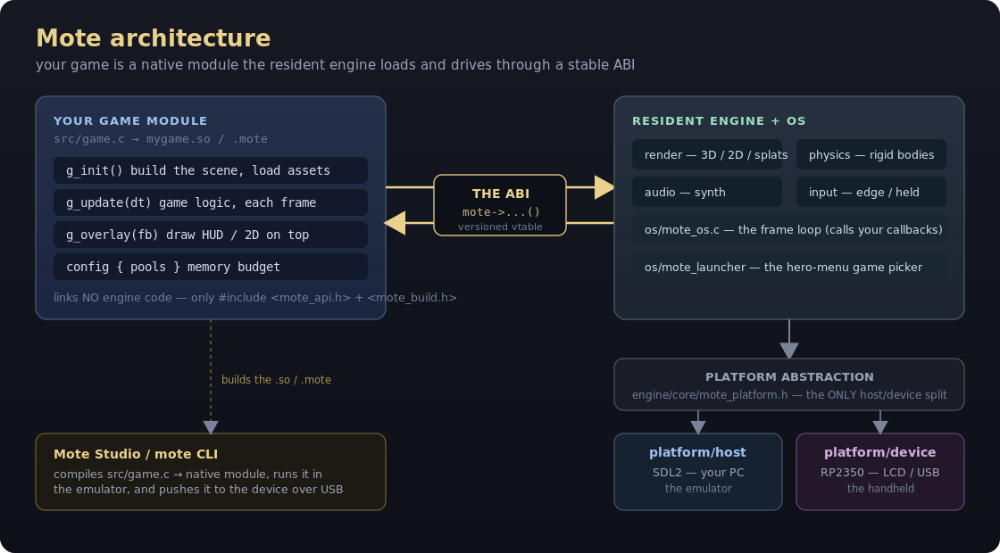

Two things make this work:

- **The ABI** (`sdk/mote_api.h`) is a struct of function pointers — `const MoteApi *mote`.
  The game calls `mote->scene_add_object(...)`, `mote->input()`, `mote->audio_note(...)`,
  and never touches engine internals directly. The contract is append-only and
  versioned (`MOTE_ABI_VERSION`), so old games keep running as the engine grows.
- **The same C compiles for PC and device.** The platform layer
  (`engine/core/mote_platform.h`) is the *only* place that differs between the SDL
  emulator and the real hardware. Your game and the engine have zero `#ifdef
  HOST/DEVICE` — what you see in the emulator is what runs on the handheld.

**Mote Studio** is the bespoke IDE (a native C/SDL2 desktop app — no Electron, no
Python) that wraps the whole workflow: a project tree, the *real engine* running
your game inside a photo-accurate Thumby Color shell, an inspector, and docked
tools for pixel art, code editing, meshes, audio, and device control. It is the
recommended way to develop; the `mote` CLI is the same thing without the GUI.

---

## 2. Quick start

### 2.1 Install dependencies (host)

```bash
# Debian/Ubuntu/WSL:
sudo apt install build-essential cmake libsdl2-dev imagemagick
#   build-essential  — gcc + make (the host compiler for game modules)
#   cmake            — builds the engine, host emulator, and Studio
#   libsdl2-dev      — the emulator window + audio + input
#   imagemagick      — used by `mote bake` to read PNG/BMP for image baking
# Optional, only for device builds / pushes:
sudo apt install gcc-arm-none-eabi   # cross-compiler for the .mote module
pip install pyserial                 # for `mote push` / `mote logs` over USB
```

### 2.2 Build the engine + emulator + Studio (once)

```bash
cmake -B build_host -S . && cmake --build build_host -j8
```

This produces:
- `build_host/mote_host` — the SDL emulator (runs one game `.so`)
- `build_host/mote_studio` — the IDE

### 2.3 Make and run a game (CLI)

`tools/mote` is the command-line driver. Put it on your `PATH` or call
`./tools/mote`.

```bash
mote new mygame                  # scaffold mygame/ — a runnable 3D starter + game.toml
mote new mygame -t physics       # or pick a template: 3d (default) · physics · 2d
mote run mygame                  # compile mygame → host .so, launch the emulator
```

`mote new` (and Studio's **New Game** wizard) scaffolds a *runnable* starter for the
template you pick — **3d** (spinning mesh), **physics** (boxes tumbling in a pit), or
**2d** (a top-down sprite) — each with its `.config` arena pools already sized to what
it draws, so a new game starts with sensible claims rather than zero or guesswork.

| Command | What it does |
|---|---|
| `mote new <dir> [-t 3d\|physics\|2d]` | Scaffold a game: `game.toml`, a runnable `src/game.c` for the chosen template, `assets/` |
| `mote build <dir>` | Compile → host `.so` in `<dir>/build/`. Add `--device` for the RP2350 `.mote` |
| `mote run <dir>` | Build for host **and** launch the SDL emulator on it |
| `mote bake <dir>` | Convert `assets/*.png`, `*.obj`, `*.stl` → C headers in `src/` (see §4) |
| `mote push <dir>` | Cross-build the `.mote` and upload it over USB (`--launch` runs it now) |
| `mote ping` / `mote list` / `mote logs` / `mote wipe` | Talk to a connected device |
| `mote studio` | Build + open the IDE (see §2.5) |

**Emulator keyboard map:**

| Thumby button | Keys |
|---|---|
| D-pad | Arrow keys **or** W/A/S/D |
| A | `.` or `K` |
| B | `,` or `J` |
| LB | Left Shift |
| RB | Space |
| MENU | Enter |
| (open engine menu) | hold MENU alone 3 s, or set env `MOTE_MENU=1` |
| Quit | Esc / window close |

**Headless (CI / screenshots):**

```bash
# The emulator runs the single .so you pass as argv. MOTE_SHOT dumps frame
# MOTE_SHOT_FRAME (default 20) to a .ppm and exits — handy for CI screenshots.
SDL_VIDEODRIVER=dummy MOTE_SHOT=/tmp/shot.ppm MOTE_SHOT_FRAME=60 \
  ./build_host/mote_host examples/mygame/build/mygame.so
```

### 2.4 The `game.toml` manifest

`mote new` writes a tiny manifest. It only carries metadata; the *engine* config
(memory pools) lives in your C code (§7), not here.

```toml
[game]
name = "mygame"      # the module's name (used for the built .so/.mote filenames,
                     # the device catalog, and the launcher list). Defaults to the
                     # folder name if omitted.
author = "you"
abi = 1
```

### 2.5 Mote Studio — the IDE (recommended workflow)

```bash
mote studio              # or: ./build_host/mote_studio   (run from the repo root)
```

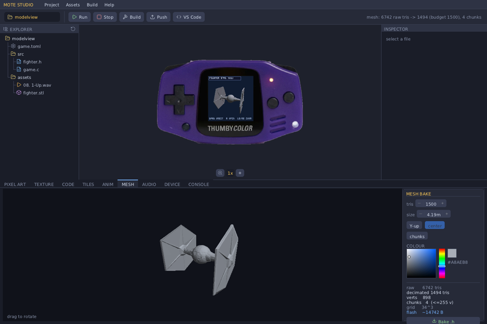

**The development loop — open Studio, pick a game, edit, watch it hot-reload:**

```
 1. Launch Studio.                A project picker (Project ▸ Open) lists
                                   examples/ and any folder with a game.toml.
 2. Click a game.                 Studio builds it and runs the REAL engine
                                   inside the on-screen Thumby Color shell.
 3. Play it.                       The shell buttons are clickable; keyboard +
                                   gamepad also work; there's a zoom control.
 4. Edit src/game.c.              Use the built-in Code editor, or click
                                   "Edit in VS Code" to open it in VS Code.
 5. Save.                         Studio watches the source mtime: on change it
                                   rebuilds and HOT-RELOADS the running game —
                                   no restart, no rebuild button needed.
 6. Repeat 3–5.                   Tight inner loop. The Console dock shows the
                                   live build output and any device logs.
```

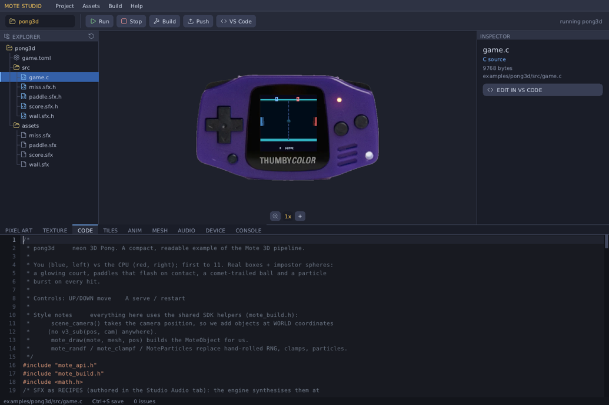

**The layout — resizable docks with draggable separators:**

- **Menu bar + toolbar** — Project / Assets / Build / Help, plus Run · Stop ·
  Build · Push · "Edit in VS Code".
- **Project tree (left)** — the open game's files with type-coloured icons;
  auto-refreshes on file changes.
- **Emulator (centre)** — the real engine running your game inside a
  photo-accurate, calibrated, crisp integer-scaled Thumby Color shell.
- **Inspector (right)** — properties of the selected file. For `game.toml` it
  parses your `MoteConfig` pools out of the C source and shows a **~276 KB arena
  budget meter** so you can see your memory headroom (§7).
- **Bottom dock — tabbed tools:**

  | Tab | What it does |
  |---|---|
  | **Pixel Art** | HSV+hex colour picker, pencil/eraser/fill/eyedropper/line/rect, undo, grid, sizes 8–128, zoom+pan, transparency, PNG/BMP/JPG import. **Save** writes `assets/sprite.png` *and auto-bakes* the `MoteImage` header (§4). |
  | **Texture** | Procedural texture generators (wood / marble / brick / check / cloud / stone / plasma …) with contrast/warp — kept separate from Pixel Art so generating never clobbers hand-drawn art. |
  | **Code** | Built-in C editor with syntax highlighting + inline build errors, or jump to VS Code. |
  | **Tiles** | Rule-tile (autotile) authoring: Blob-47 / edge / Wang templates, per-rule cell editing, weighted variants, rotation/flip, and a **LEVEL** painter (always scaled to fit). **Bake** writes the tileset(s) + a bit-packed `.level.h`. |
  | **Anim** | Sprite-animation editor: clips with per-frame durations, onion-skin, frame events, pivots, and the pixel editor for each frame. **Bake** writes a `MoteAnimClip` set. |
  | **Mesh** | Live preview of an `.stl`/`.obj` *processed* (decimated + chunked) with parameters — triangle budget, target size, up-axis, recenter, chunk-view colouring, an HSV colour picker — a stats readout, and **Bake** to a `MoteModel` header (§4). |
  | **Audio** | Load a WAV/MP3 (→ 22050 Hz mono) or design an SFX with the SFXR synth + presets; see the waveform, crop, play. **Save** writes the `.wav`, the editable `.sfx` recipe, a `MoteSound` header *and* a `MoteSfx` recipe header (play via `audio_play` or `mote_sfx_bake`, §9). |
  | **Device** | Ping / List / Push / Push & Launch / Stream Logs / Wipe over USB. |
  | **Console** | Live build + device output. |

Several of these tabs are shown in context through §4 (asset pipeline) and §5
(the engine API), next to the features they author.

**Native + Python-free.** Studio reimplements the CLI's build/scaffold/bake in C
(`studio/motecore.c`) and talks to the board over USB-CDC directly (`studio/usb.c`;
Linux `termios` / Windows Win32 COM, device found by VID:PID `CAFE:4D01`). It loads
game modules in-process via a cross-platform loader (`dlopen` / `LoadLibrary`) — so
a game is a `.so` on Linux, a `.dll` on Windows. It still shells out to a C
compiler (`gcc`, `arm-none-eabi-gcc`) and, for the Audio tab, `ffmpeg`.

**Windows build:** `scripts/build-windows.sh` cross-compiles with MinGW-w64 into a
single self-contained `dist-windows/mote_studio.exe` (SDL2 + MinGW runtime statically
linked, no DLL dependencies). Drop it in the repo root and run it there.

### 2.6 Build games fast: Studio for assets, Claude Code for code

The quickest way to make a Mote game is to split the work along its natural seam:

- **Mote Studio authors the assets** — paint sprites, generate textures, draw
  rule-tiles and levels, animate, decimate STL models, design SFX — and bakes each to
  a header your game `#include`s. This is the visual, iterative part a person does best.
- **[Claude Code](https://claude.com/claude-code) writes and edits `src/game.c`** — the
  game logic, drawing, and wiring those baked assets. Save in Studio and it hot-reloads.

This repo ships a **Claude Code skill** (`.claude/skills/mote-game-dev/`) so Claude
already knows the engine API, the asset pipeline, the build/push workflow, and the
gotchas the moment you open the project — just clone the repo, run `claude` in it, and
ask it to build or change a game. Author the art in Studio, describe the gameplay to
Claude, and iterate.

---

## 3. Anatomy of a game

A game is one file, `src/game.c`. It links **no engine code** — it is handed the
engine jump table (`mote`) and the OS drives its callbacks. Here is the entire
`mote new` template, every token explained.

```c
#include "mote_api.h"     // the ABI: MoteApi, MoteGameVtbl, MoteConfig, all the
                          // engine types (Vec3, Mesh, MoteInput, MoteBody, …)
#include "mote_build.h"   // header-only convenience: safe mesh primitives, a
                          // camera helper, a tiny immediate-mode UI (§5.8)

MOTE_GAME_MODULE();       // (1) macro — see below

#ifdef MOTE_MODULE_BUILD  // (2) device-only flash header — see below
#include "mote_module.h"
MOTE_MODULE_HEADER();
#endif

static const Mesh *s_cube;   // your game state lives in file-scope statics.
static Mat3 s_m;             // (.data/.bss; on device it's in a fixed RAM region)

static void g_init(void) {                       // (3) called ONCE, after load
    mote->scene_set_background(MOTE_RGB565(10, 12, 26));  // dark-blue clear colour
    mote->scene_set_sun(v3(0.4f, 0.7f, -0.6f));           // directional light dir
    // a unit cube: world-unit HALF-extents (so 1.0 = 2m across) + an RGB565 colour.
    s_cube = mote_mesh_box(mote, 1.0f, 1.0f, 1.0f, MOTE_RGB565(120, 180, 230));
    s_m = m3_identity();                          // its orientation = no rotation
}

static void g_update(float dt) {                 // (4) called EVERY frame
    const MoteInput *in = mote->input();          // current button state (§8)
    // MENU is yours — the engine menu (hold MENU 3s) owns return-to-lobby.

    m3_rotate_local(&s_m, 1, 0.9f * dt);          // spin about the cube's own Y axis
    m3_orthonormalize(&s_m);                      // re-square the basis (drift fix)

    Mat3 cam = mote_camera_look(v3(0,0,0), v3(0,0,1));   // eye at origin, look +Z
    mote->scene_begin(&cam, 60.0f);               // start the draw-list, fov 60°
    MoteObject obj = { .pos = v3(0,0,4.5f),       // 4.5m in front of the camera
                       .basis = s_m, .mesh = s_cube };
    mote->scene_add_object(&obj);                 // queue it; the OS rasters it
}

static const MoteGameVtbl k_vtbl = {              // (5) the contract you hand back
    .init = g_init, .update = g_update,
    .config = { .max_tris = 256, .depth = 1 },    // declare your memory pools (§7)
};
static const MoteGameVtbl *mote_game_vtbl(void) { return &k_vtbl; }
```

**(1) `MOTE_GAME_MODULE()`** expands to three things you'd otherwise hand-write:
the exported `mote_game_abi_version` symbol the loader checks; a file-scope
`static const MoteApi *mote` (the jump-table pointer everything goes through); and
the `mote_game_register(api)` entry function that stashes `mote = api` and returns
your vtable via `mote_game_vtbl()`. So you just define `mote_game_vtbl()` and use
`mote->…`.

**(2) `MOTE_MODULE_HEADER()`** emits the on-flash header the device loader reads
(magic, ABI version, the register entry, and the `.data`/`.bss` copy ranges from
`sdk/game.ld`). It is **device-only** — the host `.so` build omits it, so it's
guarded by `#ifdef MOTE_MODULE_BUILD` (a define the device build sets). On the host
this whole block disappears.

**(3)–(5) The vtable callbacks.** All are optional except you'll want `update`:

| Callback | Signature | When it runs |
|---|---|---|
| `init` | `void init(void)` | Once, after the engine pools are set up. Build meshes, init state. |
| `update` | `void update(float dt)` | Every frame on core0. Read input, advance state, build the draw-list. `dt` = seconds since last frame (clamped ≤ 0.1). Runs **concurrently** with the previous frame's LCD flush. |
| `render_band` | `void render_band(uint16_t *fb, int y0, int y1)` | *Optional.* A custom per-row-band rasteriser, called from **both cores** with disjoint bands `[y0,y1)`. Leave `NULL` to use the built-in scene rasteriser. Use this only for custom raycasters etc. |
| `overlay` | `void overlay(uint16_t *fb)` | *Optional.* 2D HUD drawn on top, on core0, after the 3D/2D passes. `fb` is the 128×128 RGB565 framebuffer. |
| `config` | `MoteConfig` (a struct, not a function) | Read **before** `init()` to size the engine arena. See §7. |

**The frame loop the OS runs for you** (`os/mote_os.c`), per frame:

```
  1. poll buttons → derive edge/held state (MoteInput)
  2. pump audio
  3. if MENU held alone ≥3s → open the engine menu (pause/brightness/volume/exit)
  4. clear the 3D + 2D scene draw-lists
  5. call your update(dt)         ── runs concurrently with last frame's flush ──
  6. wait for last frame's flush to finish
  7. rasterise the scene across BOTH cores (top half / bottom half)
  8. render any registered splats (second banded pass)
  9. call your overlay(fb), then draw the perf graph
 10. kick the async LCD flush (overlaps the next update) → back to 1
```

You never write this loop. You only fill the draw-list in `update()` and (maybe)
draw a HUD in `overlay()`.

**Using the C standard library.** Game code can freely use the standard C library:
string/memory (`memcpy`, `memmove`, `strcmp`, …), math (`sinf`, `sqrtf`, … — `-lm` is
linked), and the `printf` family for *formatting* (e.g. `snprintf(buf, n, "BREAK %d", x)`
into your own buffer, then draw it with `text()`). The device build links a tiny set of
libc syscall stubs (`sdk/mote_syscalls.c`) so stdio's formatting code resolves — a game
performs no real file I/O, so the stubs are never actually called. **Don't use
`malloc`/`free`**: the libc heap isn't wired up. Use `mote->alloc()` for load-time
buffers (§7) and file-scope statics for game state.

---

## 4. The asset pipeline

**The device has no filesystem your game can read from.** A `.mote` is a flat
flash image with code + constants; there's no `fopen("sprite.png")`. So every
asset — images, 3D meshes — is **baked into a C header** of plain constant arrays,
which you `#include` and the compiler embeds straight into your module. The data
ends up in flash (`.rodata`) and you point the engine at it.

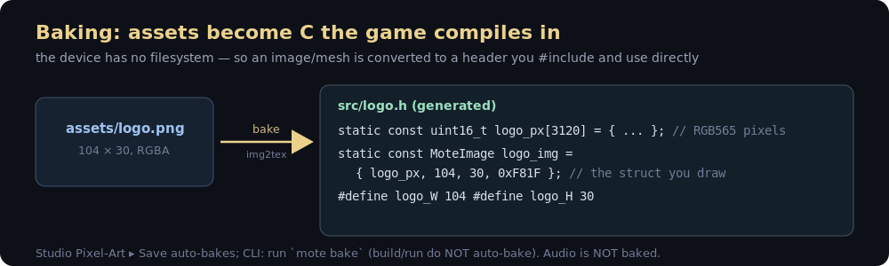

Then `#include "logo.h"` in `game.c` and draw it: `mote->blit(fb, &logo_img, x, y)`.

### What bakes, and how you use it

| Source file(s) | Baker | Generated header contains | How you use it in C |
|---|---|---|---|
| `*.png`, `*.bmp` | **img2tex** (needs ImageMagick) | `<name>_px[]` (RGB565), `<name>_img` (a `MoteImage`), `<name>_W` / `<name>_H` | `#include "<name>.h"` then a sprite via `mote->scene2d_add` or an immediate blit via `mote->blit` |
| `*.obj` | **obj2mesh** | one `<name>_mesh` (a `Mesh`) | small models that fit ≤255 verts |
| `*.stl` (binary or ASCII) | **stl2mesh** (or the Studio **Mesh** tab) | one `<name>` (a `MoteModel`) + `<name>_TRIS` | big models, auto-decimated + split into ≤255-vert chunks; draw the whole model in one call |
| `*.wav`, `*.mp3` | **wav2snd** (Studio Audio tab / `mote bake`) | `<name>_snd` (a `MoteSound`) | recorded/sampled audio; play with `audio_play` |
| `*.sfx` (recipe) | Studio **Audio** tab ▸ Save | `<name>_sfx` (a `MoteSfx`) | tiny procedural SFX; synth at load with `mote_sfx_bake` (§9) — ~1000× smaller than the WAV |
| `icon.png` / `icon.bmp` (game root) | **icon baker** | a compact paletted blob `mote_game_icon_data[]` in `src/icon.h` | nothing — the build auto-includes it; the OS launcher shows it. The icon travels inside the module, so installing a game over USB is all it takes (no firmware change) |

**Launcher icons (§4.1).** A game's 60×60 icon is baked from `icon.png` to `src/icon.h`
and compiled into the module — the launcher reads it straight from the stored image, so
pushing a game is all it takes for its icon to appear.

- **You don't include it.** `mote_build.h` (which every game includes) auto-pulls
  `src/icon.h` via `__has_include`, and the baked symbol is `weak`, so it travels in the
  module with **no `#include` and no boilerplate** in your game. No `icon.png` → the
  launcher draws a name-coloured tile with the initial.
- **Make it in the IDE.** Draw or import it in the Pixel Art editor — **Assets ▸ Edit
  Icon**, or just save a 60×60 sprite named **`icon`**, or drop an `icon.png` in the game
  root. Save bakes it automatically.
- **Compact in flash.** Since ABI v22 the icon is a **paletted, adaptive-bit-depth blob**
  (`sdk/mote_icon.h`), not a raw 7,200-byte RGB565 array — typically **~1.8–4 KB** (a
  ~2–4× saving), losslessly for ≤256-colour icons. The launcher decodes it inline (no
  RAM scratch) when drawing the selection.

**Image transparency:** any source pixel with alpha < 128 becomes the magenta
colour-key `0xF81F` (`MOTE_KEY_MAGENTA`); the engine's 2D rasteriser and `blit`
skip key-coloured pixels. (A real magenta in your art is nudged one bit off so it
isn't treated as transparent.)

**Sprite sheets are just one image.** A sheet is a single baked `MoteImage`; you
pick a frame with the sprite's source rect `fx,fy,fw,fh`. e.g. a 48×24 PNG holding
two 24×24 frames → frame *i* is `fx = i*24, fy = 0, fw = 24, fh = 24`. See
`examples/imgdemo` (a baked logo + an animated 2-frame sprite).

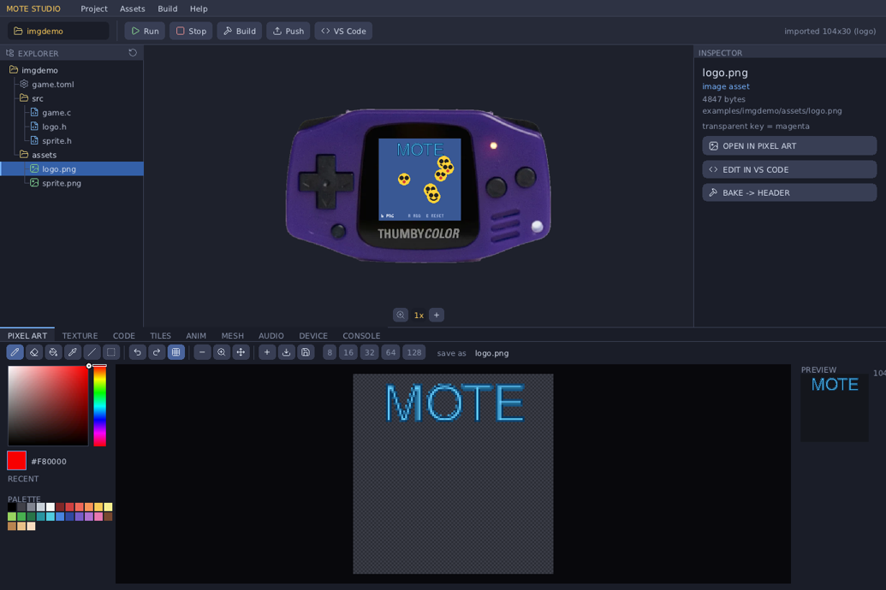

The separate **Texture** tab generates procedural fills (wood, marble, brick, stone,
cloud, plasma …) with contrast/warp — it bakes to a `MoteImage` the same way, and is
kept apart from Pixel Art so generating never overwrites hand-drawn art.

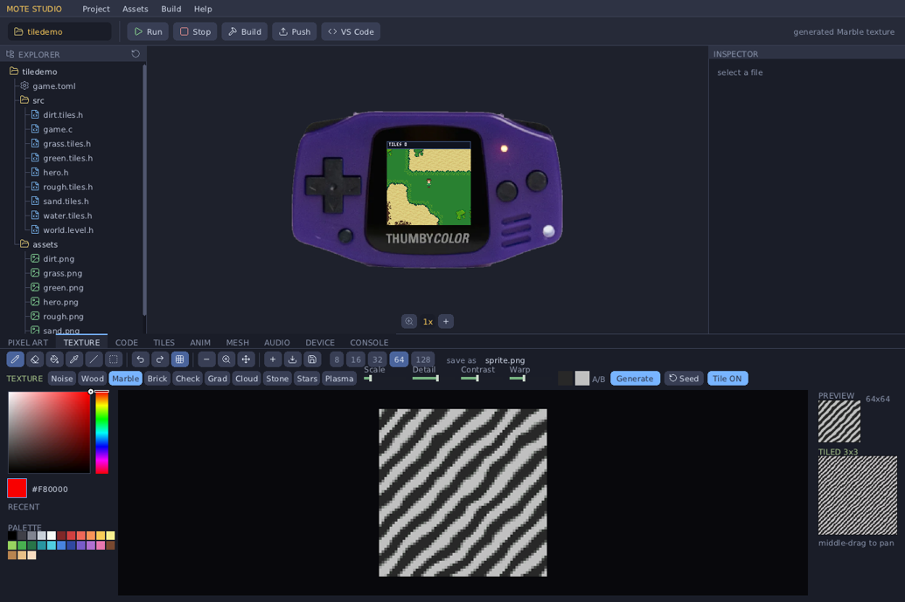

**Big meshes (STL):** `stl2mesh` (and the Studio **Mesh** tab) welds duplicate
vertices, **decimates by vertex clustering** (binary-searched down to a triangle
budget, default ~1500), and **chunks** the result into ≤255-vertex sub-meshes (the
uint8 index cap, §6). You never touch the chunks: the baker bundles them into one
`MoteModel <name>` and a `<name>_TRIS` count, and you draw the whole thing in one
call:

```c
#include "fighter.h"   // baked from assets/fighter.stl: a MoteModel `fighter` + fighter_TRIS

// in your config: size the 3D pool to the model so nothing is clipped
.config = { .max_tris = fighter_TRIS, .depth = 1 },

// in update(): one call draws every chunk — no loop, no chunk array, no count
mote_model_draw_ex(mote, &fighter, world_pos, s_rot, 1.0f);   // or mote_model_draw(mote, &fighter, pos)
```

`mote_model_draw` / `mote_model_draw_ex` (in `mote_build.h`) loop the chunks for you
and pair with `scene_camera()` so positions stay in world space. See
`examples/modelview` (a 6,742-tri fighter → 1,494 tris in 4 chunks, drawn in one line).

### When does baking happen? Do I *have* to bake?

| Where | Action | Bakes? |
|---|---|---|
| **CLI** | `mote bake <dir>` | Yes — scans `assets/`, writes `src/*.h` headers |
| **CLI** | `mote build` / `mote run` | **No** — compiles whatever headers already exist; bake first (or once) |
| **Studio** | Pixel Art ▸ Save | **Auto** — writes `assets/sprite.png` *and* its `MoteImage` header in one click |
| **Studio** | Inspector ▸ Bake → Header | Yes — manual bake of the selected asset |
| **Studio** | Build / Push | **No** — baking is a separate action; build doesn't implicitly re-bake |

So: you **must** have a baked header before your C can use an asset — but in practice
the Studio bakes for you on Pixel-Art Save, and you rarely click Bake by hand.

So: **baking is a one-time-per-asset-change step, not part of every build.** You
re-bake only when the source art/model changes. The generated `.h` is committed
alongside your source (it's just C). You do *not* have to use the bake tools at
all — you can hand-write a `MoteImage`/`Mesh`/`MeshVert[]` literal in code if you
prefer (the `mote new` template's `SHAPE_H` and `tiledemo`'s procedural art do
exactly this). Bake is a convenience for going from real PNG/OBJ/STL files to
embeddable constants.

### Audio: three paths — synth notes, SFX recipes, baked samples

- **Synth** — `mote->audio_note(freq, amp)` strikes a one-shot piano-ish note (§9); no
  asset needed. Good for tones, beeps, melodies.
- **SFX recipes** — design an effect with the Studio **Audio tab**'s SFXR synth; **Save**
  writes `src/<name>.sfx.h` (a `static const MoteSfx`, ~88 bytes) **and** bakes a PCM clip
  `src/<name>.h` (`<name>_snd`). `mote_sfx_bake(mote, &<name>_sfx)` synthesises the recipe
  to a `MoteSound` at load — but ⚠️ **that costs arena RAM = samples × 2 bytes, per sound**
  (~13 KB for a 0.3 s clip). Fine for a few; for many sounds, play the **baked clip**
  instead (next bullet) — it's free.
- **Samples / baked clips** — `<name>_snd` is a `const MoteSound` baked into **flash** by
  wav2snd (Studio **Save**, or `mote bake` on any `assets/*.wav`). `mote->audio_play(&<name>_snd, gain)`
  plays it at **zero arena cost**. This is the right path for a whole game's SFX set —
  tune the recipe in the Audio tab, re-Save to re-bake `<name>_snd`.

All paths end at the mixer — up to 8 one-shot samples mix on top of the synth notes.

> **Rule of thumb:** play **`&<name>_snd`** (baked, flash, 0 RAM) for your game's sounds.
> Reserve **`mote_sfx_bake`** for a handful of sounds, or ones you synthesise/vary at
> runtime — every bake eats arena RAM, and 30+ of them will overflow it.

```c
#include "coin.sfx.h"                  // recipe: static const MoteSfx coin_sfx = {...};
static MoteSound coin;
void g_init(void){ coin = mote_sfx_bake(mote, &coin_sfx); }   // synth once at load
...
mote->audio_play(&coin, 1.0f);         // fire-and-forget; gain 0..1
mote->audio_note(440.0f, 0.85f);       // or a synth note — they sum
```

### Creating rigs and 3D animations

Mote does **rigid-part (hierarchical) animation** — a model is split into named parts
that rotate/translate about pivots, and animation **clips** are baked to a header your
game plays. It's all authored in the Studio **Rig tab** (below: the `tanks` example —
the turret/barrel rig, the on-model 3-axis manipulator, and the keyframe timeline):

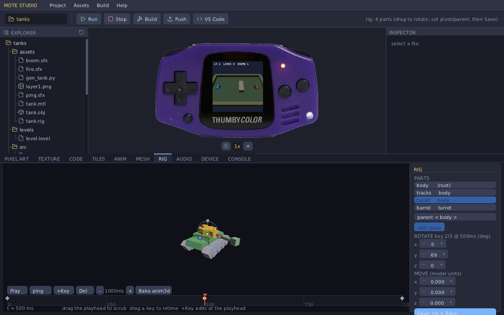

**1 — Model in parts.** Make a multi-object OBJ, one object per moving part, e.g.:

```
o body      # … verts/faces …
o turret
o barrel
```

Add a `<name>.rig` sidecar next to it giving each part a parent and a pivot (the joint
it rotates about), root first:

```
part body   parent -1     pivot 0 0 0
part turret parent body   pivot 0 0.30 0.02
part barrel parent turret pivot 0 0.30 0.10
```

Drop both in `assets/`. `mote bake` (or Studio's Bake) runs `obj2rig` → `src/<name>.rig.h`
defining a `MoteRig`. (No `.rig`? A plain OBJ bakes to a single static mesh instead.)

**2 — Set pivots + hierarchy (Rig tab).** Click a `.rig`/`.obj` in the tree to open the
Rig tab. Pick a part in the inspector, set its **parent**, and place its **pivot** —
either with the steppers or by dragging the on-model **3-axis manipulator** (red/green/blue
handles). "pivot = centroid" snaps the pivot to the part's centre. **Save .rig + Bake**
writes it back.

**3 — Animate on the timeline.** Toggle the inspector to **edit: pose**. Scrub the
**playhead** along the timeline, pose the selected part — drag the manipulator's
translate **handles** (MOVE) or rotate **rings** (ROTATE), or type values — and press
**+Key** to drop a keyframe at the playhead. Drag key diamonds to retime them; Play/loop
to preview. **Bake anim3d** writes `src/<name>.anim3d.h` — a `const MoteModelClip`
(per-part rotation + translation tracks) that lives in flash.

**4 — Play it, and trigger from game events.** Include the baked header and drive a
player (this is the whole API for the common case):

```c
#include "tank.rig.h"        // MoteRig tank_rig
#include "recoil.anim3d.h"   // MoteModelClip recoil_clip

static MoteModelPlayer barrel;          // one cursor per instance
// on a game event (e.g. the gun fires):
mote_rig_play(&barrel, &recoil_clip);   // MOTE_ANIM_ONCE clip; sets .done when finished
// each frame, after scene_camera():
mote_rig_tick(&barrel, dt);
mote_rig_draw(mote, &tank_rig, &barrel, world_pos);
```

**Mixing baked + procedural** (e.g. a turret you aim by input while a recoil clip plays
on the barrel): evaluate the clip into per-part locals, override the parts you drive from
code, then compose — a clip only "owns" the parts it has tracks for:

```c
MoteRigLocal loc[P_COUNT];
mote_rig_eval(&tank_rig, &barrel, loc);                  // clip -> per-part locals
loc[P_TURRET].rot = mote_quat_axis(v3(0,1,0), aim);      // override turret from input
mote_rig_draw_locals(mote, &tank_rig, loc, pos, body, scale);
```

It's **header-only** (no engine/ABI dependency, no firmware reflash) — clips are const
flash data and the runtime is matrix math over the normal draw path. See
[`docs/animation.md`](docs/animation.md) for the full how-and-why and
[`examples/tanks`](examples/tanks) for a working rig + event-triggered recoil clip.

---

## 5. The engine API

Everything stateful goes through `const MoteApi *mote` (`sdk/mote_api.h`). The
math (`Vec3`/`Mat3`), data formats (`Mesh`, `MoteImage`, `MoteBody`, `MoteSplat`),
and the `mote_build.h` helpers are **header-only** — they compile into your module,
no ABI call. Below, each function is documented with its real signature, every
parameter (units / coordinate space / ranges), the return value, when you'd use
it, and a snippet.

> **Coordinate convention** (full detail in §6): world is right-handed, the camera
> looks down **+Z**, and 3D object positions are **camera-relative** (`world − camera`).
> The 2D scene, `blit`, and `text` use **screen pixels** (0..127, +x right, +y down).

### 5.1 — 3D scene (the triangle pipeline)

The scene is **immediate-mode**: each frame, in `update()`, you start the scene and
then draw everything you want visible — one `mote_draw`/`scene_add_*` call per object.
The draw-list is emptied for you at the start of every frame, so you always describe
the *current* frame from scratch. There are no scene objects to create, keep, or
delete, and no handles to track.

Keep your game state however suits you — a `ball_pos`, a `player_y`, an array of
enemies — and each frame just draw from it:
```c
mote->scene_camera(&cam_basis, cam_pos, 60.0f);    // once per frame
for (int i = 0; i < n_enemies; i++)
    mote_draw(mote, enemy_mesh, enemies[i].pos);    // re-issued every frame
```
To move something, change your own variable; to hide it, don't call `mote_draw` for
it this frame. There's nothing to sync — the next frame's draw calls *are* the scene.

The flow is always: `scene_camera` → add your objects/spheres → done (the OS
rasterises across both cores). It draws thousands of triangles at 60 fps, so
re-submitting your whole scene every frame is exactly what you're meant to do.

#### `void scene_set_background(uint16_t rgb565)`
The clear colour the raster fills behind everything, each frame. Call in `init()`
(or per-frame to change it). `rgb565` is a 16-bit colour — build one with
`MOTE_RGB565(r,g,b)` where r,g,b are 0–255.
```c
mote->scene_set_background(MOTE_RGB565(10, 12, 26));   // dark navy
```

#### `void scene_set_sun(Vec3 dir_toward_light_world)`
Sets the single directional light used to shade all meshes. `dir` is a **world-space
direction pointing toward the light** (it gets normalised internally, but pass a
unit vector for clarity). Surfaces facing the sun are brighter. Call once in `init()`.
```c
mote->scene_set_sun(v3_norm(v3(0.4f, 0.7f, -0.6f)));   // high, slightly behind/right
```

#### `void scene_begin(const Mat3 *cam_basis, float fov_deg)`
Begins this frame's 3D draw-list. `cam_basis` is the camera **orientation** (rows =
right/up/forward; build it with `mote_camera_look`, §5.8). `fov_deg` is the vertical
field of view in degrees (50–70 is typical; smaller = more zoomed/telephoto). The
camera *position* is implicit: it's the origin, and you pass object positions
**relative to it** (§6). Call once per frame before adding objects.
```c
Mat3 cam = mote_camera_look(eye, target);   // eye, target in world space
mote->scene_begin(&cam, 60.0f);
```

#### `void scene_camera(const Mat3 *cam_basis, Vec3 cam_pos, float fov_deg)` — *recommended*
Like `scene_begin`, but you also give the camera **position**, and the engine
subtracts it for you — so you add objects at **world** coordinates instead of doing
`world − cam_pos` by hand everywhere. This is the camera the examples and the
`mote_draw*` helpers use; prefer it. (`scene_begin` is just `scene_camera` with the
camera pinned at the origin.)
```c
Mat3 basis = mote_camera_look(cam_pos, target);
mote->scene_camera(&basis, cam_pos, 60.0f);
mote_draw(mote, mesh, world_pos);            // world coords — no subtraction
```

#### `int scene_add_object(const MoteObject *obj)`
Queues one mesh for rendering. `MoteObject = { Vec3 pos; Mat3 basis; const Mesh *mesh; uint16_t color; }`:
- `pos` — the mesh origin. With `scene_camera` this is a **world** position; with the
  legacy `scene_begin` it's **camera-relative** (`world − cam_pos`).
- `basis` — the object's orientation (rows right/up/forward; `m3_identity()` = unrotated).
- `mesh` — a `const Mesh *` (from a `mote_mesh_*` helper or a baked header).
- `color` — optional RGB565 **tint override**; `0` (default) uses the mesh's own colour(s).

Returns the number of triangles actually emitted (0 if the object was frustum-culled
or the draw-list pool is full). In practice you rarely fill this struct by hand —
`mote_draw(mote, mesh, world_pos)` and friends (§5.8) do it for you:
```c
mote_draw(mote, s_cube, world_pos);                       // identity basis, scale 1
mote_draw_ex(mote, s_cube, world_pos, s_rot, 1.0f);       // + orientation + scale
mote_draw_tint(mote, s_cube, world_pos, s_rot, 1.0f, MOTE_RGB565(255,80,80));  // + tint
```

#### `int scene_add_object_scaled(const MoteObject *obj, float scale)`
Same as `scene_add_object`, but uniformly scales the mesh by `scale` (1.0 =
unchanged, 2.0 = double size) at draw time — handy for reusing one mesh at several
sizes without baking variants.

#### `int scene_add_sphere(Vec3 cam_rel_pos, float radius, uint16_t color)`
Draws a **per-pixel shaded sphere impostor** — a real-looking lit sphere with **no
triangles**. Cheap; depth-tested against meshes. Perfect for balls, particles,
planets, glows, target rings. `cam_rel_pos` is camera-relative (`world − cam`),
`radius` in metres, `color` RGB565. Returns 1 if drawn (0 if culled/full).
```c
mote->scene_add_sphere(v3_sub(ball.pos, cam_pos), 0.12f, MOTE_RGB565(248,248,248));
```

#### `int scene_tri_count(void)`
Triangles emitted into the draw-list so far this frame. Use it for HUD/profiling or
to back off detail when you're near the `max_tris` budget.

#### Big STL models — `MoteModel` + one-call draw
A baked STL (§4) is split into ≤255-vertex chunks (the `uint8` face-index cap), but
you never touch the chunks: the baker bundles them into one `MoteModel` and a
`<name>_TRIS` count, and you draw the whole thing in one call. Size the `max_tris`
pool to the model so nothing clips:
```c
#include "fighter.h"                          // a MoteModel `fighter` + fighter_TRIS
.config = { .max_tris = fighter_TRIS, .depth = 1 },
mote_model_draw(mote, &fighter, world_pos);                       // or _ex(pos,basis,scale)
mote_model_draw_tint(mote, &fighter, pos, basis, 1.0f, team_col); // tint every chunk
```
See `examples/modelview` (a 6,742-tri fighter) and `examples/chess` (pieces are STL
models, tinted white/black per side; king & queen are two parts for two colours).

#### Mesh colour
Colour lives on the **mesh**, not on every triangle (a `MeshFace` is 6 bytes —
indices + a quantised normal). A `Mesh` carries one flat `color`, *or* an optional
per-face `face_colors[]` array for multi-coloured models (multi-material OBJ,
height-tinted terrain). A per-draw `MoteObject.color` (via `mote_draw_tint` /
`mote_model_draw_tint`) overrides both — for team colours, damage flashes, selection
highlights. The bakers emit flat or per-face automatically.

### 5.2 — 2D scene (sprites + tilemap)

A screen-space 2D layer the OS rasters **after** the 3D scene (both banded across
cores). A game can be pure-2D, pure-3D, or hybrid (3D world + 2D HUD). Build it
each frame: `scene2d_begin` → optional tilemap → add sprites.

#### `void scene2d_begin(int cam_x, int cam_y)`
Starts the 2D scene with a camera offset in **pixels** (`cam_x,cam_y` is the
top-left of the view in world-pixel space; sprites/tiles are drawn at
`world − cam`). For a fixed screen, pass `(0,0)`.

#### `void scene2d_set_tilemap(const MoteTilemap *map, const MoteTileset *tiles)`
Sets a background tile grid drawn under the sprites. `MoteTileset = { const MoteImage
*sheet; uint16_t tile_w, tile_h; }` (an atlas cut into cells, indexed
left-to-right/top-to-bottom). `MoteTilemap = { const uint8_t *cells; uint16_t cols,
rows; }` (cell `[r*cols+c]` is a tile index; `0xFF` = empty).
```c
static MoteImage   atlas   = { atlas_px, 32, 8, MOTE_KEY_MAGENTA }; // 4×(8×8) tiles
static MoteTileset tileset = { &atlas, 8, 8 };
static MoteTilemap tilemap = { map_cells, 24, 18 };
mote->scene2d_set_tilemap(&tilemap, &tileset);
```

#### Rule tiles / autotiling — `scene2d_set_autotile_layers(...)`

A plain tilemap stores the *final* tile index in every cell — you place each edge and
corner by hand. A **rule tile** (autotile) instead stores a *logical* map ("is this cell
terrain?") and lets the engine pick the right edge/corner tile from each cell's neighbours,
every frame, with **no resolved buffer**. Digging a tunnel or growing grass at runtime
re-tiles instantly because the only stored data is the logical map you already keep.


##### The three concepts (and three folders)

![The tilesheet pipeline: a sprite sheet (assets/grass.png, raw tile art that several tilesets may share) becomes a rule tile (tilesets/grass.tileset → src/grass.tiles.h: sheet + tile size + rule type + the 256-entry config→cell LUT + transforms and variant weights = a MoteImage + MoteAutotile, and one rule tile is one level layer) becomes a level (levels/cave.level → src/cave.level.h: one byte per cell where each bit is a layer; const, so flash and 0 SRAM). Layers draw bottom-up, each autotiled against its own bit, so dirt, grass and a path can share a cell](docs/img/tile-pipeline.png)

- **Sprite sheet** (`assets/foo.png`) — just art: a grid of tile images. Edited in the
  pixel tools or imported. *Several rule tiles may slice the same sheet.*
- **Rule tile** (`MoteAutotile`, baked to `src/foo.tiles.h`) — a sheet + tile size + a
  256-entry LUT mapping every neighbour configuration to an atlas cell (+ a per-config
  transform and per-variant weights, below). One rule tile = **one level layer**.
- **Level** (`src/foo.level.h`) — a **bit-packed layer map**: one byte per cell, bit *L*
  set = layer *L* present. Layers are drawn bottom-up and each autotiles against *its own
  bit*, so they overlap (dirt **and** grass **and** a path in one cell). The map is
  `const` → it lives in **flash**, costing **zero SRAM**, and a new level adds only its
  map (~1 byte/cell), never new images.

```c
#include "cave.level.h"
// each frame, after scene2d_begin():
cave_draw(mote);   // = mote->scene2d_set_autotile_layers(cave_map, cave_COLS, cave_ROWS, cave_tiles, n)
```

##### How a tile is chosen (per cell, every frame)


`edge_is_solid` decides whether off-map neighbours count as "same" (seamless map borders)
or "different" (a visible rim around the whole map).

##### The four rule types — and the limits of each

The rule type is the **sheet layout the LUT expects**; pick it per rule tile in the Studio
(the RULES bar). It sets how many tiles you must draw and which neighbours are consulted.

![The four rule types compared. Blob 47 (47 tiles, all 8 neighbours): corner-aware — it notices a single empty diagonal and draws a notched concave corner; best for organic terrain (caves, water, cliffs, grass/sand blobs); limitation: 47 tiles to draw, though transforms cut that. Edge 16 (16 tiles, only N/E/S/W, mask = N|E<<1|S<<2|W<<3): best for blocky/retro platforms, pipes, Mario-style walls; limitation: no corner sense, so concave corners look square. Nine-slice (9 tiles, a 3×3 TL/T/TR/L/C/R/BL/B/BR frame): best for rectangles — UI panels, ledges, building walls; limitation: rectangles only, no islands/bends/diagonals. Wang 16 (16 tiles, keyed on the 4 corners rather than the cells): a complete set covering crisp straight edges, outer + inner corners, isolated tiles and diagonal saddles — general-purpose terrain that handles both blocky regions and smooth blends, and excels layered with transparency; limitation: a 2-state corner scheme, so it can't capture every fine 8-neighbour case Blob 47 can](docs/img/tile-ruletypes.png)

In more detail, with each type's hard limit:

("Edges" = the four side neighbours N/E/S/W; "corners" = the four diagonal ones.)

- **Blob 47** — looks at all 8 neighbours, but a diagonal corner only matters when the
  two side neighbours beside it are both filled, which collapses 256 raw configs to 47
  tiles. *Limit:* you draw 47 tiles (the largest sheet) and must cover both outer **and**
  inner corners, or boundaries look wrong — use **rotation/flip** (below) to draw ~12
  uniques and generate the rest.
- **Edge 16** — looks only at the 4 side neighbours (`mask = N | E<<1 | S<<2 | W<<3`), a
  4×4 sheet. *Limit:* it ignores diagonals, so it can't tell a filled inner corner from a
  flat edge and concave corners come out square. Great for chunky/retro art (blocky
  platforms, pipes, Mario-style walls), wrong for organic terrain.
- **Nine-slice** — a 3×3 frame (corners, edges, centre) keyed by which sides are open.
  *Limit:* it **assumes the region is a rectangle** — an island, a 1-wide line, an L-bend
  or diagonal pick the wrong slice (there's no island/cross/diagonal tile).
- **Wang 16** — a different idea: instead of asking "is each *cell* filled?", each tile is
  keyed on its **four corners** — a corner counts as "inside" when the two side neighbours
  beside it *and* their shared diagonal are all the same terrain (16 combinations). Those
  16 tiles are a **complete** set: full interior, all four **crisp straight edges**, the
  four outer corners, the four inner (concave) corners, an isolated single tile, and the
  two diagonal saddles where terrain pinches corner-to-corner. So it handles straight runs
  *and* curves *and* diagonal blends from one compact 4×4 (or 3×6) sheet — great for both
  blocky regions and organic blends (coastlines, paths, grass-meets-sand). It's especially
  good **layered with transparency**: give each tile a transparent exterior and stack
  several Wang layers, and each shows the one below at its edges (see `examples/tiledemo`).
  *Limit:* it's a 2-state corner scheme (this-terrain vs not), so it can't capture every
  fine 8-neighbour case Blob 47's 47 tiles can — but it's far more capable than Edge 16
  (which has no corner sense at all) for a similar tile count. Its one saddle tile serves
  both diagonals via a per-config flip (`xform`), and the art must be authored as a matched
  corner set.

**Rule of thumb:** maximum organic detail → **Blob 47**; quick blocky/retro walls →
**Edge 16**; rectangles/UI → **Nine-slice**; **general-purpose terrain, layered blends, and
paths → Wang 16** (crisp edges *and* smooth corners, only 16 tiles).

##### Variants + weights (anti-repetition)

Add **variants** (N) to a rule tile: extra art rows beneath row 0. The engine picks a row
per cell from a position hash, so a big grass field doesn't visibly tile. Each variant has
a **weight** (set in the Studio) so picks can be biased — e.g. plain grass `8` : flowered
`1` : cracked `1` makes decorated tiles rare. (Weight 0 is treated as 1.)

##### Rotation / flip transforms (shrink the sheet)

Each LUT entry also carries a **D4 transform** (H-flip, V-flip, 90/180/270° rotation). In
the Studio you can point several rules at **one** source cell with different transforms —
e.g. draw a single outer corner and rotate it for the other three. A Blob-47 set can drop
from 47 hand-drawn tiles to ~12 + transforms, roughly **3× less flash**. (Rotation needs
square tiles; it runs in a separate flash code path so the hot blit stays small.)

##### Memory

Only the **sheet PNGs** take meaningful space, and they are `static const` → flash/XIP,
**0 SRAM**. A 47-tile 16×16 RGB565 sheet is ~24 KB of flash; halve the tile size or use a
simpler rule type (Edge 16 = 16 tiles, Nine-slice = 9) or transforms to cut it. The level
map is ~1 byte/cell of flash. Nothing about a level is generated as an image at runtime —
the renderer samples the sheet live.

##### Studio workflow (Tiles tab)

1. Pick or import a **sheet** (Load PNG), or **Gen** a starter sheet to a file.
2. Choose the **rule type** in the RULES bar; click a rule, then a sheet cell to assign it
   (set rotation/flip and variant weights as needed).
3. Add more **layers** (each its own rule tile), name them, and **paint** the level — layers
   are independent and overlap.
4. **Bake all** → `assets/*.png` + `tilesets/*.tileset` + `levels/*.level` + the
   `src/*.tiles.h` / `src/<level>.level.h` headers. In the game, `#include` the level header
   and call `<level>_draw(mote)`.

#### Sprite animation — `sdk/mote_anim.h`

For animated sprites (a walking character, a spinning coin) Mote has a small **header-only**
animation runtime — no engine ABI, so it works on any firmware and the clip data is `const`
(flash, 0 SRAM). You author clips in **Mote Studio's Anim tab** and bake them; the game keeps
a tiny player per sprite and reads the current frame.

![Sprite animation: a sheet (assets/hero.png) is sliced into cells; clips are ordered frames each with a per-frame duration, a loop mode (once / loop / ping-pong), a pivot/origin and optional per-frame event tags (e.g. frame 5 of an attack fires \"hit\"); at runtime the game calls mote_anim_play then, each frame, mote_anim_tick(dt) and reads mote_anim_fx/fy into a MoteSprite — checking p.event for tagged frames. Authored in the Studio Anim tab with live preview and onion-skin, baked to src/<set>.anim.h. See examples/herodemo](docs/img/sprite-anim.png)

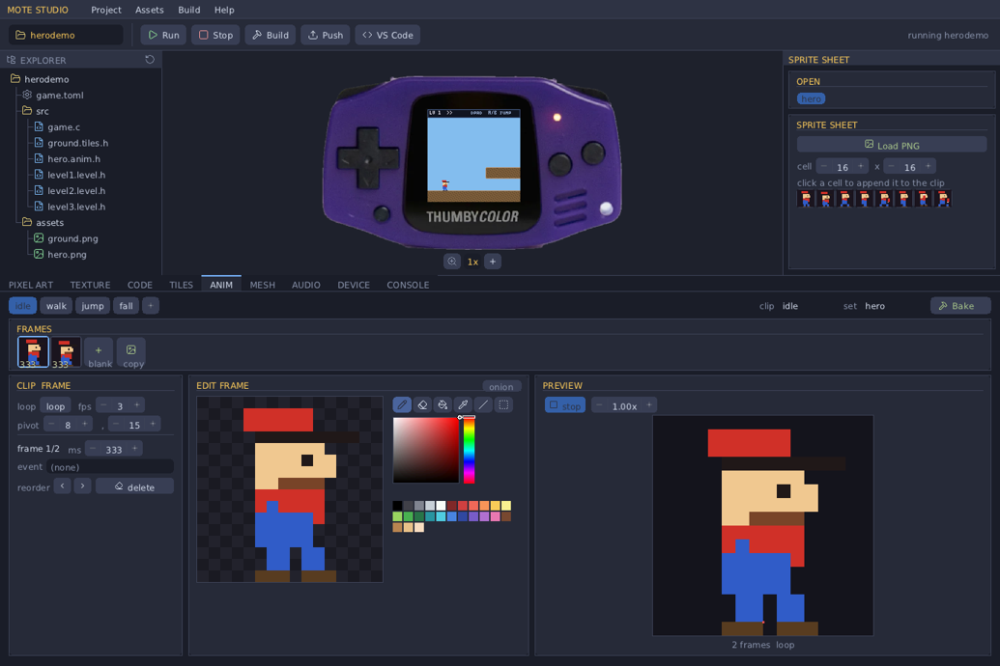

**Data** (all baked `const`): a `MoteAnimSheet` (the atlas + tile size); `MoteAnimClip`
(name, an ordered `MoteAnimFrame[]`, loop mode, pivot); each `MoteAnimFrame` is a cell
index + duration-ms + an optional event string.

**Runtime** (one `MoteAnimPlayer` per sprite):
```c
#include "hero.anim.h"           // hero_sheet + hero_idle / hero_walk / hero_jump / ...
static MoteAnimPlayer p;
mote_anim_play(&p, &hero_walk);  // on state change
// each frame:
mote_anim_tick(&p, dt);          // dt seconds; advances frames, fires events
MoteSprite s = { hero_sheet.image, x - hero_walk.pivot_x, y - hero_walk.pivot_y,
                 mote_anim_fx(&p,&hero_sheet), mote_anim_fy(&p,&hero_sheet),
                 hero_sheet.tile_w, hero_sheet.tile_h, layer, facing<0?MOTE_SPR_HFLIP:0 };
mote->scene2d_add(&s);
if (p.event) { /* "footstep", "hit", … fired this frame */ }
```
- `mote_anim_done(&p)` → a non-looping clip has finished.
- The **pivot** is the clip's origin (e.g. the feet); subtract it from the world position so
  frames of any size line up. **Events** fire once when their frame becomes current.

**Studio workflow (Anim tab):** Load a sprite **PNG** (magenta = transparent) and set the
cell size → click sheet cells to append them to the current clip → set the clip's **loop
mode**, **fps** (or per-frame **ms**), **pivot**, and per-frame **event** strings →
**preview** live with play/pause, speed and **onion-skin** → add more named **clips** →
**Bake** to `src/<set>.anim.h` (+ an editable `anims/<set>.anims`). `examples/herodemo` is a
small platformer that switches idle/walk/jump/fall from its physics state.

#### `int scene2d_add(const MoteSprite *spr)`
Adds one sprite to the 2D scene. `MoteSprite`:
- `const MoteImage *img` — the source image/sheet.
- `int16_t x, y` — world position in pixels (camera-relative applied at raster).
- `uint16_t fx, fy, fw, fh` — source frame rectangle in `img` (for a whole image:
  `fx=fy=0, fw=img->w, fh=img->h`; for a sheet, select the frame cell).
- `uint8_t layer` — draw order (lower drawn first).
- `uint8_t flags` — `MOTE_SPR_HFLIP` (0x01) and/or `MOTE_SPR_VFLIP` (0x02).

Returns 0 if the sprite pool is full. Up to `config.max_sprites` per frame.
```c
MoteSprite s = { &player, (int16_t)px, (int16_t)py,
                 (uint16_t)(frame*8), 0, 8, 8,    // frame cell, 8×8
                 10,                               // layer
                 (facing < 0) ? MOTE_SPR_HFLIP : 0 };
mote->scene2d_add(&s);
```

#### `void blit(uint16_t *fb, const MoteImage *img, int x, int y, int fx, int fy, int fw, int fh, uint8_t flags, int y0, int y1)`
**Immediate-mode** image draw straight into the framebuffer — for HUDs/overlays,
*not* the managed 2D scene. Colour-keyed and band-clipped. `fb` is the framebuffer
(the one passed to `overlay`), `(x,y)` the screen-pixel top-left, `(fx,fy,fw,fh)` the
source rect, `flags` the `MOTE_SPR_*` flips, and `(y0,y1)` the row clip band — pass
`0, 128` from `overlay()` to draw the whole image.
```c
// in overlay(fb): centre a baked logo near the top
mote->blit(fb, &logo_img, (128-logo_W)/2, 2, 0, 0, logo_W, logo_H, 0, 0, 128);
```

### 5.3 — Physics (rigid bodies)

A full-3D impulse rigid-body solver (spheres, OBB boxes, planes, capsules, convex
hulls, static triangle meshes) with gravity, restitution, Coulomb friction,
rotational inertia, a fixed-substep integrator, a grid broad-phase, and sleeping.
**The game owns the body array**; the engine runs the solver on it.

#### `void phys_world_defaults(MoteWorld *w)`
Fills `w` with sensible defaults (earth gravity, a ~unit bounding box, lively
bounce). Call once, then override the fields you care about. `MoteWorld` fields you
typically set: `gravity` (e.g. `v3(0,-9.8f,0)`), `walls` (1 = auto bounding-box
walls, 0 = none), `bmin`/`bmax` (the box, used only if `walls`), `restitution`
(0..1 default bounce), `friction`, `linear_damp`/`angular_damp` (per-second drag),
`substep` (fixed step seconds; raise the *rate* e.g. `1/2000` for fast bodies that
must not tunnel, lower it `1/120` for many slow bodies), `max_substeps` (cap per
frame against the spiral-of-death; high-rate games must raise this).
```c
mote->phys_world_defaults(&world);
world.gravity = v3(0, -9.8f, 0);
world.walls   = 1;
world.bmin = v3(-1.7f, 0.0f, -1.7f);
world.bmax = v3( 1.7f, 6.0f,  1.7f);
world.substep = 1.0f/180.0f; world.max_substeps = 6;
```

#### `uint32_t phys_step(MoteWorld *w, MoteBody *bodies, int n, float dt)`
Advances the simulation by `dt` seconds over your array of `n` bodies. Returns an
event bitmask — currently `MOTE_PHYS_HIT (1<<0)` set when any impact occurred this
step (use it to trigger a sound). Call once per frame, then render the bodies
yourself from their updated `pos`/`orient`.

A `MoteBody` (you fill these): `pos` (centre, world metres), `vel` (m/s), `w`
(angular velocity rad/s, world), `orient` (`Mat3`), `radius` (sphere/capsule radius;
for boxes a bounding radius used in the broad-phase), `inv_mass` (1/kg; **0 =
immovable/static**), `shape` (`MOTE_SHAPE_SPHERE/_BOX/_PLANE/_CAPSULE/_HULL/_MESH`),
`half` (box half-extents; capsule segment half-length in `half.y`), `friction`,
`restitution` (per-body; 0 → use the world default), `shape_data` (hull/mesh
pointer for those shapes). **Do not** touch `_reserved[0..3]` — that's the sleep
state; clear `_reserved[0]=0` to force-wake a body you teleport.
```c
mote->phys_step(&world, body, s_active, dt);
for (int i = 0; i < s_active; i++) {
    MoteObject o = { .pos = v3_sub(body[i].pos, cam), .basis = body[i].orient,
                     .mesh = m_box };
    mote->scene_add_object(&o);
}
```

#### `int phys_raycast(const MoteWorld *w, const MoteBody *bodies, int n, Vec3 origin, Vec3 dir, float max_dist, int skip, MoteRayHit *hit)`
Casts a ray (no simulation) for aiming / ground checks / picking / AI. `origin`
world-space, `dir` a **unit** direction, up to `max_dist` metres. `skip` = a body
index to ignore (e.g. the shooter), or `<0` to test all. Returns 1 and fills `hit`
(`{ int body; float t; Vec3 point, normal; }`) with the **nearest** intersection, or
0 if nothing hit.
```c
MoteRayHit h;
if (mote->phys_raycast(&world, body, n, gun_pos, aim_dir, 50.0f, shooter_idx, &h))
    spawn_impact(h.point, h.normal, h.body);
```

#### `int phys_overlap(const MoteWorld *w, const MoteBody *bodies, int n, Vec3 center, float radius, int *out, int max)`
Sphere-overlap query: fills `out[]` with up to `max` indices of bodies whose shape
overlaps the test sphere `(center, radius)`. Returns the count. Use it for pickups,
triggers, blast radii.
```c
int hits[8];
int k = mote->phys_overlap(&world, body, n, player.pos, 0.6f, hits, 8);
for (int i = 0; i < k; i++) collect_pickup(hits[i]);
```

> See `examples/physics`, `materials`, `hulls`, `dominoes`, `pickups`, `shooter`.

### 5.4 — Gaussian splats

A 4th render path: anisotropic 3D Gaussians, depth-sorted and alpha-blended. Each
`MoteSplat = { Vec3 pos; float cov[6]; uint16_t color; float opacity; }`. Build one
from a scale + orientation with the header-only `mote_splat_make(pos, scale, rot,
color, opacity)` (§ `mote_splat.h`).

#### `void scene_set_splats(const MoteSplat *splats, int n, int *order, const Mat3 *cam_basis, Vec3 cam_pos, float fov_deg, const uint16_t *depth)` *(preferred)*
Registers a splat cloud to render **this frame** as a measured, dual-core banded
pass *after* the 3D scene (so it composites with scene depth and its cost shows in
the perf graph). `order` is **your** scratch buffer of `≥ n` ints (the depth-sort
index buffer — lives in *your* RAM, so `mote->alloc` it). `cam_pos` is the world
camera position (yes, the absolute one here). `depth` from `depth_buffer()` (so
terrain occludes splats behind it) or `NULL`. Call from `update()`.
```c
mote->scene_set_splats(s_splat, s_n, s_order, &cam_basis, cam_pos, 60.0f,
                       mote->depth_buffer());
```

#### `int splat_render(uint16_t *fb, const MoteSplat *splats, int n, const Mat3 *cam_basis, Vec3 cam_pos, float fov_deg, int *order, const uint16_t *depth)`
The immediate, single-core form — renders splats into `fb` directly (call from
`overlay()`). Prefer `scene_set_splats` for anything heavy; this is for small/simple
clouds. Returns the number drawn.

#### `const uint16_t *depth_buffer(void)`
Returns the 3D pass's depth buffer (`d = K/z`, **larger = nearer**). Pass it to the
splat calls so opaque geometry occludes splats behind it.

> See `examples/splats`, `cluster`, `zelda`, `golf`, `world`.

### 5.5 — Input

#### `const MoteInput *input(void)`
Returns this frame's derived button state (valid during `update`). Read it through
the header-only helpers — never poke the struct directly:

| Helper | Meaning |
|---|---|
| `bool mote_pressed(in, BTN)` | currently held down |
| `bool mote_just_pressed(in, BTN)` | went down **this frame** (a fresh edge) |
| `bool mote_just_released(in, BTN)` | came up this frame |

Buttons (`MoteBtnId`): `MOTE_BTN_A`, `MOTE_BTN_B`, `MOTE_BTN_UP`, `MOTE_BTN_DOWN`,
`MOTE_BTN_LEFT`, `MOTE_BTN_RIGHT`, `MOTE_BTN_LB`, `MOTE_BTN_RB`, `MOTE_BTN_MENU`.
The `MoteInput` struct also exposes `hold_ms[btn]` (ms held) if you need timing.
```c
const MoteInput *in = mote->input();
if (mote_pressed(in, MOTE_BTN_RIGHT))      px += speed * dt;   // continuous
if (mote_just_pressed(in, MOTE_BTN_A))     fire();             // one-shot
```
**MENU is yours** — see §8 for the only thing the OS reserves (a 3-second solo hold).

### 5.6 — Audio

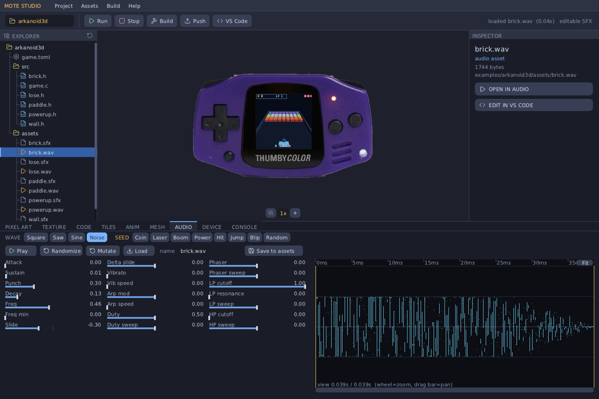

#### `void audio_note(float freq, float amp)`
Strikes one note on the polyphonic synth: instant attack, piano-ish exponential
decay. `freq` in Hz (e.g. 440 = A4), `amp` 0..1. Fire **one per key/event** (not
per frame — it's a one-shot strike). 8 voices; the oldest is stolen when all are
busy. Master volume follows the engine menu's VOLUME.
```c
mote->audio_note(440.0f, 0.85f);   // a strike
```

#### `void audio_play(const MoteSound *snd, float gain)`
Fires a one-shot **PCM sample** (22050 Hz mono int16). `MoteSound = { const int16_t *pcm;
int count; }` — bake one from a WAV in the Studio Audio tab (Save) or via `mote bake`. Up to
8 samples mix at once on top of the synth notes; the oldest is stolen when full. `gain` 0..1.
```c
#include "hit.h"                    // baked: static const MoteSound hit_snd = { hit_pcm, N };
mote->audio_play(&hit_snd, 1.0f);
```

#### `MoteSound mote_sfx_bake(mote, const MoteSfx *recipe)` — recipes instead of WAVs
For short procedural SFX you can ship a tiny **`MoteSfx` recipe** (~88 bytes, authored
in the Studio Audio tab and baked to a `<name>.sfx.h`) instead of a WAV. The engine
synthesises it to PCM at load — bake it once in `init()`, then `audio_play` it like
any sample. The recipe is ~1000× smaller in flash than the equivalent PCM, and stays
editable (re-open it in the Studio). Use WAV baking for sampled/recorded audio;
recipes for blips, zaps, pickups.
```c
#include "coin.sfx.h"               // baked: static const MoteSfx coin_sfx = { ... };
static MoteSound coin;
void g_init(void){ coin = mote_sfx_bake(mote, &coin_sfx); }   // synth once, into the arena
... mote->audio_play(&coin, 1.0f);                            // play like any sample
```
`examples/pong3d` uses this for all four of its sounds.

#### `void audio_off(void)`
Silences every voice immediately. The OS already calls this on game exit so notes
don't ring into the launcher.

> See §9 for synth-vs-sample guidance. Demos: `examples/piano3d` (synth keyboard).

### 5.7 — Text, telemetry, memory, control

#### `int text(uint16_t *fb, const char *s, int x, int y, uint16_t color)` / `int text_2x(...)`
Draws an 8×8 bitmap-font string into the framebuffer at screen pixel `(x,y)`
(top-left), in `color`. `text_2x` is double-size. Returns the advanced x (so you can
chain). Call from `overlay()`.
```c
char buf[16]; int q = 0; buf[q++]='H'; buf[q++]='P'; buf[q++]=' ';
q += mote_itoa(hp, buf+q); buf[q]=0;
mote->text(fb, buf, 4, 3, MOTE_RGB565(250,230,90));
```

#### `uint64_t micros(void)`
Monotonic microsecond clock. Use it for timing, seeding RNGs, etc.
```c
uint32_t rng = (uint32_t)mote->micros() | 1u;   // seed an xorshift
```

#### `void log(const char *s)`
Streams a line to the host (`mote logs` / the Studio Console). On device it goes
over USB-CDC; on host, stdout. Great for live tuning. (Build the string yourself;
`mote_itoa` from `mote_build.h` helps.)

#### `void perf(uint32_t out[6])`
Fills the latest frame's metrics: `[0]=fps, [1]=update_us, [2]=raster_us,
[3]=flush_us, [4]=core0_%, [5]=core1_%`. Use it for an in-game profiler or to log
performance.

#### `void *alloc(uint32_t bytes)` / `uint32_t arena_free(void)`
`alloc` carves a buffer out of the shared load-time arena (8-byte aligned, **zeroed**,
returns `NULL` if the arena is exhausted). Valid from `init()` onward; freed
wholesale on exit (there's no per-allocation free). `arena_free()` reports the bytes
left for the game. Use `alloc` for your big runtime buffers (terrain meshes, splat
clouds, scratch). See §7.
```c
int *order = (int *)mote->alloc(MAX_SPLATS * sizeof(int));   // splat sort scratch
if (!order) { /* shrink your config or your alloc */ }
```

#### `int menu(const char *title, const char *const *items, int n)`
Pops up a **blocking** modal list menu in the system look (gold title, selection
bar), `UP`/`DOWN` to move. Returns the chosen index (A), or -1 (B / quit). Call from
`update()` for pause / game-over / level-select menus — it drives its own
input+present loop and keeps audio pumping while paused.
```c
static const char *const items[] = { "Resume", "Restart", "Quit to lobby" };
int pick = mote->menu("PAUSED", items, 3);
if (pick == 2) mote->exit_to_launcher();
```

#### `void exit_to_launcher(void)`
Ends the game and returns to the hero-menu launcher. (Players also get there via the
engine menu's "Return to lobby" — §8.)

#### `void set_fps_limit(int fps)`  *(ABI v21)*
Cap the frame rate. `0` (the default) runs uncapped — the device free-runs, the host
emulator runs as fast as the machine allows. A positive value paces the main loop to
that many frames per second on **both** the device and the host, so a game can lock
30/60 fps for steady timing. Call it once from `update()` on the first frame (or change
it whenever). The async LCD flush overlaps the wait, so capping costs no extra latency.
```c
static int armed; if (!armed) { armed = 1; mote->set_fps_limit(30); }
```

### 5.8 — The helper layer (`mote_build.h`, header-only)

These have **no ABI cost** (they compile into your module). The mesh builders take
**world-unit dimensions + a colour**, pick the int8 quantisation scale, wind faces
CCW-from-outside, and compute per-face normals — so you sidestep the
quantisation/winding footguns (§6). Meshes are arena-allocated, so call them in
`init()` and keep the returned `const Mesh *`.

| Helper | What it builds |
|---|---|
| `const Mesh *mote_mesh_box(mote, hx,hy,hz, col)` | Axis-aligned box. `hx,hy,hz` = **half**-extents in metres (so a 1×1×1 box is 2 m on each side). `col` RGB565. |
| `const Mesh *mote_mesh_sphere(mote, r, segs, col)` | UV sphere, radius `r` m, `segs` longitudinal segments (more = rounder/costlier). |
| `const Mesh *mote_mesh_cylinder(mote, r, halfh, segs, col)` | Capped cylinder, radius `r`, half-height `halfh` m, `segs` sides. |
| `const Mesh *mote_mesh_revolve(mote, profile, n, segs, col)` | Lathe an `n`-point `{radius,height}` profile (a flat `float[2*n]`) around Y. A radius < 0.03 at an end becomes an apex point; otherwise it's capped flat. Auto-trims segments to fit the 255-vert cap. |
| `int mote_mesh_grid(mote, nx,nz, x0,z0, x1,z1, heightfn, colfn, user, out[], max, &center)` | Sample an `nx×nz` heightfield over `[x0,z0]..[x1,z1]` into one or more arena meshes (auto-chunked under the 255-vert cap). Fills `out[]`, returns the chunk count, writes the grid centre to `*center` (render each chunk at `center − cam`). `heightfn(x,z,user)→y`, `colfn(x,z,ny,user)→rgb565`. |

```c
s_cube   = mote_mesh_box(mote, 0.5f, 1.0f, 0.4f, MOTE_RGB565(120,180,230));
s_ball   = mote_mesh_sphere(mote, 0.4f, 12, MOTE_RGB565(245,110,110));
s_barrel = mote_mesh_cylinder(mote, 0.24f, 0.30f, 12, MOTE_RGB565(96,210,120));
// a chess pawn by revolving a profile:
const float pawn[] = { 0.0f,0.0f,  0.18f,0.05f,  0.10f,0.25f,  0.14f,0.40f,  0.0f,0.55f };
const Mesh *pawnm = mote_mesh_revolve(mote, pawn, 5, 10, MOTE_RGB565(230,230,230));
```

**Drawing, models & SFX:**

| Helper | What it does |
|---|---|
| `mote_draw(mote, mesh, pos)` | Draw a mesh at a **world** position (pair with `scene_camera`). Identity orientation, scale 1. |
| `mote_draw_ex(mote, mesh, pos, basis, scale)` | …plus orientation + uniform scale. |
| `mote_draw_tint(mote, mesh, pos, basis, scale, col)` | …plus a colour override (team colours, damage flashes, selection). |
| `mote_model_draw(mote, &model, pos)` · `_ex` · `_tint` | Draw a whole baked **`MoteModel`** (all its STL chunks) in one call; `_tint` recolours every chunk. |
| `MoteSound mote_sfx_bake(mote, &recipe)` | Synthesise a `MoteSfx` recipe to a playable `MoteSound` at load (§9). |

**Camera:**
#### `Mat3 mote_camera_look(Vec3 eye, Vec3 target)`
Builds the view basis (rows right/up/forward) looking from `eye` toward `target`
(world space, up = +Y). Pass it to **`scene_camera`** (with the camera position) and
then add objects in world coordinates — `mote_draw` does the rest:
```c
Mat3 cam = mote_camera_look(cam_pos, v3(0,0,0));
mote->scene_camera(&cam, cam_pos, 60.0f);
mote_draw_ex(mote, m, world_pos, s_rot, 1.0f);   // world coords, no subtraction
```

**Tiny immediate-mode UI** (pure framebuffer ops; pair with `mote->text`):

| Helper | Draws |
|---|---|
| `mote_ui_rect(fb, x,y,w,h, col)` | a filled rectangle |
| `mote_ui_panel(fb, x,y,w,h, bg, border)` | a filled panel with a 1px border (HUD boxes) |
| `mote_ui_bar(fb, x,y,w,h, frac, fg, bg)` | a progress/health bar, `frac` 0..1 |
| `int mote_itoa(int n, char *out)` | int → string, returns the length (saves re-rolling itoa) |

```c
mote_ui_panel(fb, 1, 1, 80, 20, MOTE_RGB565(14,18,28), MOTE_RGB565(70,90,130));
mote_ui_bar(fb, 4, 24, 60, 4, hp/100.0f, MOTE_RGB565(80,220,120), MOTE_RGB565(40,40,40));
```

---

## 6. Coordinate systems + math types

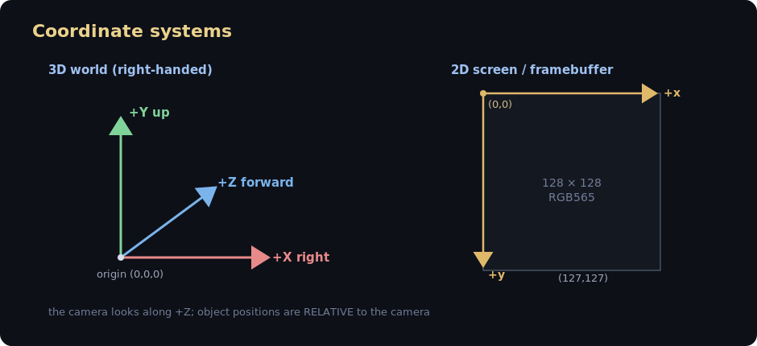

- **Camera-relative 3D world.** The camera is the origin of the rendered scene; you
  pass object positions as `world − cam_pos`. The camera's *orientation* comes from
  `cam_basis` (Mat3, rows right/up/forward); its *position* is baked into the
  positions you subtract. (`scene_set_splats` is the one call that also wants the
  absolute `cam_pos` — read its signature.)
- **+Z is forward** in view space; **screen x → right, y → down**.
- **Depth** is `uint16`, **larger = nearer** (`d = K/z`, 65535 at the near plane 0.5 m).
- **Winding:** meshes are CCW-from-outside; the projection flips them to screen-CW
  front faces. The `mote_mesh_*` helpers and the bakers handle this — only hand-rolled
  `MeshFace` literals need to get it right.

**Math types** (`engine/math/mote_vec.h`, header-only, all float — the RP2350 FPU
makes float as fast as fixed-point and far less error-prone):

```c
typedef struct { float x, y, z; } Vec3;
typedef struct { Vec3 r[3]; } Mat3;   // r[0]=right, r[1]=up, r[2]=forward
```

| Function | What it does |
|---|---|
| `v3(x,y,z)` | construct a Vec3 |
| `v3_add/sub(a,b)`, `v3_scale(a,s)` | vector arithmetic |
| `v3_dot(a,b)`, `v3_cross(a,b)` | dot / cross product |
| `v3_len(a)`, `v3_len2(a)`, `v3_norm(a)` | length / squared length / normalise |
| `v3_lerp(a,b,t)` | linear interpolate |
| `m3_identity()` | the unrotated basis |
| `m3_mul_v3(&m, v)` / `m3_mul_v3_t(&m, v)` | transform a vector by the basis / its transpose (world↔view) |
| `m3_rotate_local(&m, axis, a)` | rotate the basis about its own axis (0=x,1=y,2=z) by `a` radians |
| `m3_rotate_world(&m, k, a)` | rotate about an arbitrary **world** unit axis `k` (Rodrigues) |
| `m3_orthonormalize(&m)` | re-square the basis after many incremental rotations (drift control) |

The `Mesh` format (`engine/assets/mote_mesh.h`): `int8` vertices `× (scale/127)`
(so `scale` is the model half-extent in metres), `uint8` face indices (the **255-vert
cap**), and an RGB565 albedo + quantised normal per face.

---

## 7. Memory model

There is **one shared 276 KB SRAM arena** per game. At load, the OS sizes the
engine's pools to *your* declared `MoteConfig`; whatever's left, your game claims
via `mote->alloc()`. A lean game keeps the slack.

### Why 276 KB and not the chip's full 520 KB?

The RP2350's 520 KB SRAM is **one 512 KB contiguous bank + two 4 KB scratch banks**
(measured from the firmware's linker map: `RAM 0x20000000 len 0x80000`, plus
`SCRATCH_X`/`SCRATCH_Y` 4 KB each). The arena and the resident OS+engine share that
512 KB bank — the engine never unloads, so it has to coexist with your game.

Measured against the real RP2350 firmware (`arm-none-eabi-size` on the device build),
the budget breaks down like this:

| Region | Size | Notes |
|--------|------|-------|
| **Game arena** | **276 KB** | `MOTE_ARENA_SIZE` — your `MoteConfig` pools + `alloc()`s. **The 3D draw-list (~18 KB) and the 32 KB depth buffer live *in here*** (sized per game), which is why they show in the arena meter. |
| Framebuffer | 32 KB | 128×128 RGB565. A second 32 KB buffer is used when the async-overlap present is on (render frame N+1 while N streams to the LCD over SPI DMA). |
| Pipeline vertex scratch | ~7 KB | `s_view`/`s_sx`/`s_sy`/`s_sd`/`s_front` (320-vertex working set). |
| Core0 + Core1 stacks | 8 KB | both cores rasterise; `PICO_STACK_SIZE` + `PICO_CORE1_STACK_SIZE`, 4 KB each. |
| SDK malloc heap | 16 KB | `PICO_HEAP_SIZE` (engine/SDK use, separate from the game arena). |
| Vector table + SDK/libc/clocks BSS + code statics | ~9 KB | `ram_vector_table`, audio mixer, USB-CDC, launcher/menu, C runtime. |

That's **276 KB arena + ~70–100 KB resident ≈ 350–380 KB of the 512 KB bank → ~130 KB
of headroom.** So 276 KB isn't "whatever's left" — it's a deliberate, round budget set
*below* the true ceiling. That margin is the guarantee: if your `MoteConfig` + `alloc()`s
fit in 276 KB, the game is *certain* to load and run alongside the framebuffers, both
stacks, the SDK heap, USB and audio — with no per-game tuning of the system.

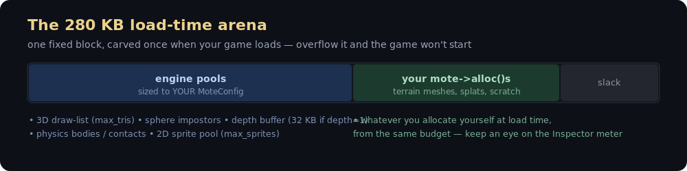

Declare your pools in the vtable `config`:

```c
.config = {
    .max_tris      = 2000,  // 3D triangle draw-list capacity (0 = no 3D raster)
    .max_spheres   = 64,    // sphere impostors per frame
    .max_splats    = 0,     // Gaussian splats
    .max_sprites   = 0,     // 2D sprites (0 = no 2D scene)
    .max_bodies    = 32,    // physics bodies (0 = no physics engine)
    .max_contacts  = 200,   // physics contact manifolds
    .max_mesh_tris = 0,     // largest mesh-collider triangle count
    .depth         = 1,     // 1 = allocate the 32 KB depth buffer (3D / splats)
}
```

- **Declare only what you use.** A field left 0 opts that subsystem out entirely and
  costs nothing. `max_tris` and `depth` are the big spenders.
- **If it doesn't fit, the loader refuses to launch** and shows an **OUT OF MEMORY**
  screen telling you to shrink a pool — instead of a NULL-deref crash on device.
- **Watch your headroom live:** the engine menu's perf overlay (LB+RB cycles it, or
  hold MENU 3 s → the menu) shows **ARENA used/total**, and Studio's Inspector shows
  the budget meter for `game.toml`.
- **Sizing tip:** roughly `max_tris × 36 B + (depth ? 32 KB : 0) + physics pools +
  your alloc()s` must fit 276 KB.

> A game with **no** `config` at all falls back to a generous static worst-case so
> legacy games still run — but always declare your pools so you get the slack.

---

## 8. Input

The platform fills 9 raw booleans each frame; the engine derives edge/held state
into `MoteInput` (so `is_pressed` / `just_pressed` / `just_released` behave the same
on PC and device). Read it via the helpers in §5.5.

**Edges vs held:** use `mote_pressed` for continuous actions (move while held) and
`mote_just_pressed` for one-shots (fire once per tap). `mote_just_released` for
release events.

**MENU is yours.** The OS reserves exactly one gesture: a **3-second SOLO hold of
MENU** (no other button down) opens the engine menu (perf overlay / brightness /
volume / "Return to lobby"). Short MENU taps, sub-3 s holds, and **any MENU chord**
all stay free for your game. There is no "tap MENU to exit" — exiting is the engine
menu's job (or your own `mote->exit_to_launcher()`).

**The launcher-A arming gotcha.** The A press that launched your game from the
menu is *still physically down* on your first frame. The OS arms a
**suppress-until-released** mask so that A doesn't register as a fresh
`just_pressed` on frame 1 — but the button still *reads as held* until released. If
you key a one-shot off `mote_pressed(A)` (rather than `just_pressed`), gate it
behind your own "armed once A is released" flag:

```c
static int s_armed;
// in update():
if (!mote_pressed(in, MOTE_BTN_A)) s_armed = 1;            // A has been released
if (s_armed && mote_just_pressed(in, MOTE_BTN_A)) fire();  // safe one-shot
```

(See the `s_armed` pattern in `imgdemo`, `fling`, `pong3d`, `arkanoid3d`.)

---

## 9. Audio

The engine audio is a small **polyphonic software synth**, mixed mono at 22050 Hz —
SDL on the host, 12-bit PWM on GP23 on the device. The entire game-facing API is:

```c
mote->audio_note(freq, amp);   // strike one note: freq Hz, amp 0..1, piano decay
mote->audio_off();             // silence all voices
```

Notes are **one-shot**: instant attack, exponential decay, 8 voices (oldest stolen
when busy). Fire one per event — a coin pickup, a key press, a hit — *not* every
frame. Build melodies/SFX by striking a sequence of notes over time. Master volume
follows the engine menu's VOLUME slider. See `examples/piano3d` (a playable 3D
keyboard).

**Samples play too** (ABI v12). `audio_play(const MoteSound *snd, float gain)` fires a
one-shot 22050 Hz mono PCM sample; up to 8 mix at once on top of the synth (oldest stolen).
Bake one in the Studio **Audio tab** — load/crop a WAV/MP3 or generate an SFX, then **Save**
writes `assets/<name>.wav` *and* `src/<name>.h` (a `MoteSound`); `#include` it and call
`mote->audio_play(&<name>_snd, 1.0f)`. (`mote bake` also bakes any `.wav` in `assets/`.)

**Recipes, not WAVs, for procedural SFX** (ABI v19). The Audio-tab Save *also* writes
`src/<name>.sfx.h` — a `static const MoteSfx` recipe (~88 bytes). `mote_sfx_bake(mote,
&<name>_sfx)` has the engine synthesise it to a `MoteSound` at load, so the game ships
the recipe instead of bulky PCM (~1000× smaller in flash) and the sound stays editable.
Best for blips/zaps/pickups; keep WAV baking for sampled or recorded audio. Choose
per sound — both paths end at `audio_play`. `examples/pong3d` uses recipes for all four
of its sounds.

**Which to use:** synth `audio_note` for tones/melodies; **`MoteSfx` recipes** for short
procedural effects (tiny, editable); **WAV → `MoteSound`** for recorded/sampled audio.

---

## 10. Device workflow

Games deploy with **`mote push`** — no firmware reflash. The flow:

```
   mote push mygame --launch
        │
        │ 1. cross-compile mygame → mygame.mote   (arm-none-eabi-gcc + sdk/game.ld)
        │ 2. open USB-CDC (VID:PID CAFE:4D01), send "PUT mygame <size>"
        │ 3. stream the .mote bytes; device stores it in flash
        │ 4. (--launch) send "LAUNCH mygame"
        ▼
   device: the resident engine maps the module's flash window via an ATRANS slot,
           runs its mini-crt (copy .data, zero .bss), calls mote_game_register,
           and drives your vtable — the same engine you saw in the emulator.
```

| Command | Action |
|---|---|
| `mote ping` | Handshake — confirm a Mote device is connected |
| `mote list` | List installed games (the device catalog) |
| `mote push <dir> [--launch]` | Cross-build + upload, optionally launch immediately |
| `mote logs [--seconds N]` | Stream the device's `mote->log` output + telemetry |
| `mote wipe` | Erase all games from the device store |

In **Studio**, the **Device** dock does all of this with buttons (Ping / List /
Push / Push & Launch / Stream Logs / Wipe), and the **Console** dock streams the live
build + device output:

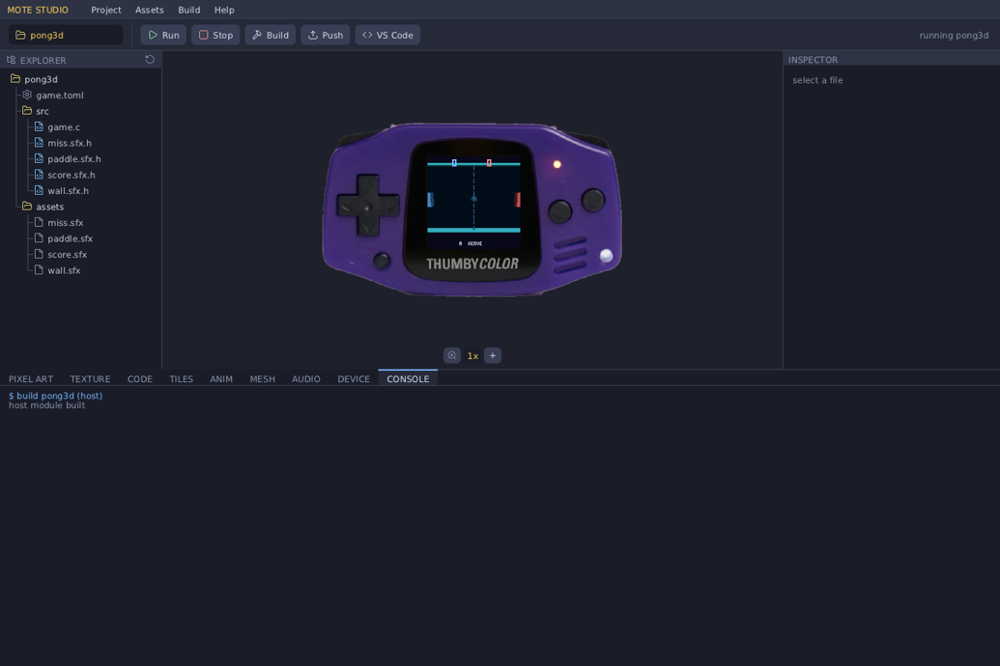

**How a `.mote` runs in place (no copy, no relocation):** the module is linked
against a fixed *virtual* flash window (`MOTE_MODULE_VADDR = 0x10800000`, ATRANS
slot 2) and a fixed RAM region (`MOTE_MODULE_RAM = 0x20060000`, the top 128 KB). The
loader points the ATRANS window at wherever the image physically sits in flash, so
code/rodata execute via XIP. Only `.data`/`.bss` are copied/zeroed into the reserved
RAM. This is what `MOTE_MODULE_HEADER()` + `sdk/game.ld` set up.

### Flashing firmware (only when you change engine/OS C code)

You only reflash to change the *engine itself* (a new ABI function, the launcher, a
driver) — never for a game.

```bash
cmake -B build_os -S os/device      # configure (needs the Pico SDK)
cmake --build build_os -j8          # → build_os/mote_os.uf2
```

Enter BOOTSEL (power off → hold a button → power on), then copy the `.uf2` to the
RP2350 mass-storage drive.

---

## 11. Gotchas + rough edges

### Real gotchas (things that *will* bite you)

- **255-vertex cap per mesh** (uint8 face indices). Anything bigger must be chunked —
  the STL baker and `mote_mesh_grid` do it automatically; hand-built meshes must
  split themselves.
- **int8 vertices.** Use the `mote_mesh_*` helpers — they pick the quantisation
  scale. Raw `*127` quantisation overflows *silently* if a coordinate exceeds the
  mesh's `scale`.
- **A is held on entry.** The launcher's A press carries into your first frame
  (§8) — gate one-shot fire actions behind an "armed once A released" flag.
- **`update()` overlaps the previous frame's flush.** Your `update` must only touch
  game state + the draw-list, **never the framebuffer**. The framebuffer is only
  yours in `overlay()` / `render_band()`.
- **Don't toggle shared render globals mid-frame.** Both cores raster concurrently;
  a global flipped during the raster is a data race (flicker on device). Keep
  per-call state in the call, not in a global.
- **Return to lobby is the engine menu (or `exit_to_launcher`), not a MENU tap.**
- **Audio notes are one-shot.** Calling `audio_note` every frame retriggers the
  attack and sounds like a buzz — fire it once per event.
- **Arena allocations never individually free.** `mote->alloc` is bump-allocated and
  freed wholesale on exit. Allocate your buffers once in `init()`.

### Rough edges

#### Fixed — new header-only helpers in `mote_build.h` (no ABI change)

| Was painful | Now |
|---|---|
| Open-coding HUD strings with `buf[q++]=…` + `mote_itoa` | `mote_textf(mote, fb, x, y, col, "FPS %d  %.2f", n, x)` — `%d %i %u %x %c %s %f %%` |
| `MoteSprite` 9-field positional struct, easy to mis-order | `mote_sprite(img, x, y)` / `mote_sprite_cell(img, x, y, cw, ch, col, row)` / `mote_sprite_add(mote, img, x, y)` |
| Box bodies silently never collide if you forget the bounding `radius` | `mote_body_box(pos, half, mass)` / `mote_body_sphere(pos, r, mass)` — auto-computes `radius`, sets `orient`, wakes the body; `mass<=0` = static |
| Gameplay logic gets raw, frame-rate-dependent `dt` | `MoteFixed t; mote_fixed_feed(&t, dt); while (mote_fixed_step(&t, 1.0f/60)) update(1.0f/60);` |
| Studio SFX couldn't play on-device (`audio_note` only) | **ABI v12** `audio_play(snd, gain)` + a `.wav`→`MoteSound` baker; SFX-editor Save bakes a playable header |
| Camera-relative positions + `scene_set_splats` inconsistency | **ABI v13** `scene_camera(basis, cam_pos, fov)` — add objects with ABSOLUTE world positions; pass the same `cam_pos` to splats (legacy `scene_begin` still works) |
| `game.toml`'s `abi` field was inert | removed from the scaffold; the real check is the C `MOTE_ABI_VERSION` symbol |
| `MoteImage` "no transparency" was an implicit unlikely-key convention | explicit `opaque` flag (appended to `MoteImage`; old `{px,w,h,key}` headers default to keyed); both bakers set it, the blit skips the key compare when opaque |
| Studio budget meter parsed `MoteConfig` out of source text (broke on unusual formatting) | reads the **exact** `config` from the running module's vtable; falls back to source-parse only when no game is loaded |

#### Fixed — Studio authoring (no engine/ABI change)

| Was painful | Now |
|---|---|
| Pixel-art Save wrote nothing useful with no project open, and always overwrote `sprite.png` | Save requires an open project + a **save-as name field** → `assets/<name>.png` (then auto-bakes) |
| Procedural textures didn't tessellate, or only at certain scales | seamless **tileable** generators (periodic noise + integer-frequency patterns) + a **3×3 tiled preview**; a **Tile ON/off** toggle restores free continuous-scale mode |
| The SFX waveform was a fixed full-width block | **Audacity-style** waveform: wheel-zoom, drag-pan scrollbar, Fit, time ruler, amplitude grid, per-sample at high zoom, live cursor time |

#### Open — still design decisions (not clean fixes)

- **`render_band` reentrancy isn't enforced by the type/signature.** Both cores call it;
  the signature gives no hint you must be reentrant. A fix means changing the vtable
  signature (a core id? a `const` scene handle?) — an ABI change touching every game.
- **Sleeping bodies hang in mid-air** if their support vanishes with no net motion — a
  physics-solver behaviour (needs support-tracking), not a helper.

---

## 12. Project layout + reference

```
engine/     the engine — math/ render/ physics/ audio/ input/ assets/ core/
              render/  : mote_scene3d (raster), mote_pipe, mote_2d, mote_splat, mote_font
              physics/ : mote_phys (rigid bodies + queries)
              core/    : mote_config (FB constants, MOTE_RGB565), mote_platform (the boundary)
platform/   host/ (SDL2 emulator)   device/ (RP2350: LCD, buttons, audio, USB)
os/         mote_os.c (frame loop + ABI assembly), mote_launcher, mote_menu, mote_ui
sdk/        mote_api.h (THE ABI) · mote_build.h (helpers) · mote_module.h + game.ld (device)
studio/     Mote Studio IDE — main.c (UI), motecore.c (native build/bake), usb.c (device link)
tools/      mote (CLI) · obj2mesh.c · stl2mesh.c · ply2splat.py
scripts/    build-windows.sh + mingw-toolchain.cmake (Windows cross-build)
examples/   sample games (see below)
docs/img/   studio-*.png (IDE + per-panel screenshots), architecture/arena/pipeline diagrams
```

### Example games — what each one teaches

| Game | Shows |
|---|---|
| `hello-mesh`, `tumbler` | minimal mesh + camera (**start here**) |
| `tetris3d` | grid logic + engine-rendered cubes (~190 lines) |
| `pong3d`, `arkanoid3d` | polished arcade: trails, particles, power-ups, levels, `menu` for game-over |
| `nightmote` | **2D horde survivor** — the 2D sprite scene drawing a culled swarm, a WANG16 autotiled procedural ground (grass + alt-grass + mud), baked SFX recipes, XP/level-up build, overlay HUD |
| `thumbycue` | **full game port** — 3D snooker & pool on the dual-core full-screen `render_band` hook (custom rasteriser, textured ball impostors, physics/rules/AI, sampled SFX) |
| `indemnity` | **full game port** (~20k lines) — Elite-style space sim (flight/combat/trade/galaxy) on `render_band`; arena-resident render buffers, baked per-weapon SFX, uses the **save + rumble** APIs |
| `tanks` | **3D rigid-part animation** (the showcase) — a rigged tank (body/tracks/turret/barrel), a baked recoil clip triggered on fire, procedural turret aim mixed with the clip, per-part team tinting |
| `physics`, `materials`, `playground`, `dominoes`, `hulls` | the rigid-body solver (boxes/spheres/hulls/materials/stacking) |
| `pickups`, `shooter` | `phys_overlap` / `phys_raycast` as game mechanics |
| `golf`, `pool`, `fling`, `world` | full games (terrain, AI, splats, mesh colliders) |
| `chess` | full game + STL piece models tinted per side (king/queen are two parts for two colours) |
| `terrain` | `mote_mesh_grid` auto-chunked heightfield |
| `cluster`, `zelda`, `splats` | Gaussian-splat scenes |
| `modelview` | a full-detail baked STL `MoteModel` (5,759 tris / 19 chunks) drawn in one call — a heavy 3D stress test |
| `piano3d` | the audio synth — a playable 3D keyboard |
| `tiledemo` | the 2D scene + autotiled file tilesets (dirt/grass/water layers) |
| `tiles` | the render-time autotiler — a procedural Blob-47 cave you can dig live |
| `herodemo` | the sprite-animation runtime — a platformer with idle/walk/jump/fall clips |
| `imgdemo` | baked PNG/BMP images (sprite sheet + overlay blit) |

### Key reference files to read when in doubt

- **[austinio7116.github.io/mote](https://austinio7116.github.io/mote/)** — the rendered HTML API/ABI reference (source: [`docs/index.html`](docs/index.html)).
- **`sdk/mote_api.h`** — the canonical ABI (every `mote->` call, with comments).
- **`sdk/mote_build.h`** — every helper, fully inline (read the source, it's short).
- **`engine/*/mote_*.h`** — the real type definitions (`MoteBody`, `MoteSprite`,
  `MoteSplat`, `Mesh`, `Vec3`/`Mat3`).
- **`os/mote_os.c`** — the exact frame loop and how the ABI table is assembled.
- **`examples/hello-mesh/src/game.c`** — the smallest complete game.

## 13. Changelog

See [`CHANGELOG.md`](CHANGELOG.md) for the full history.

### 0.5-alpha

Saves, rumble, and a third big game port. Reflash `firmware_mote_os.uf2` (ABI → 23).

- **Indemnity Run** — full Elite-style space sim port (~20k lines) on `render_band`.
- **Persistent save** (`save`/`load`/`save_slots` — flash slots on device, files on host)
  and **rumble** (`rumble(intensity, ms)`) added to the ABI (v23).
- **Audio**: play baked `<name>_snd` clips (flash, 0 RAM) for a game's sounds; the docs,
  the Studio save hint, and the OOM screen now steer you off the RAM-hungry
  `mote_sfx_bake`-everything path. Audio-tab seed/Randomize no longer renames your sound.
- Load arena trimmed 280 → 276 KB to fit the new OS state; cleaner build consoles.

### 0.4-alpha

Two new example games and Studio/tooling polish. Updates the device firmware (reflash
`firmware_mote_os.uf2`); ABI unchanged (22), so existing games keep running.

- **ThumbyCue** — full 3D snooker & pool port on the dual-core `render_band` hook.
- **Nightmote** — a 2D horde survivor (sprite swarm, WANG16 procedural ground, baked
  SFX, level-up build) — all native Mote.
- **C standard library in games** — `snprintf` / `printf`-family link on device now (the
  build supplies libc syscall stubs); use `mote->alloc`, not `malloc`.
- Studio: **Toggle Chassis** (solid/clear shell), **Assets ▸ Import** (copy a file into
  `assets/`), and a panel-separator hover highlight.
- Fixes: pong paddle flash (no more sphere), piano front-of-key glow, device `snprintf`
  links in both build paths, `mote bake` skips tileset sheet PNGs.

### 0.3-alpha

Updates the device firmware — reflash `firmware_mote_os.uf2` and rebuild your games for
the smaller launcher icons.

- **3D model animation** — rig models into moving parts, animate on a keyframe timeline,
  bake clips, and trigger them from game events. Authored in the Studio Rig tab (3-axis
  manipulator + timeline); see [Creating rigs and 3D animations](#creating-rigs-and-3d-animations) and [`docs/animation.md`](docs/animation.md).
- **Tanks example** rebuilt with detailed rigged 3D tanks and a baked recoil clip on fire.
- **Smaller launcher icons** ([§4.1](#4-the-asset-pipeline)) — a compact paletted blob in flash (~2–4× smaller), now handled by the build (games don't `#include` anything).
- **Open Project** screen shows each game's icon, a memory-usage bar, and a scrollbar.
- **Edit the launcher icon** in the Pixel Art editor; more canvas sizes (incl. 60) + a −/+ for any size.
- **File manager in the tree** — right-click New File/Folder, Rename, Delete; double-click a folder to collapse; `.sfx`→Audio, `.rig`→Rig; mousewheel-zoom the 3D previews.
- **Optional frame-rate cap** ([§5.7](#57--text-telemetry-memory-control)) games can set, honoured by device + emulator.
- Fixed: sharp + un-squashed Mesh/Rig preview, non-inverted orbit drag, rig editable on load, Windows "VS Code" + "Reveal in Files", asset subfolders now build.

### 0.2-alpha

This release updates the device firmware — reflash `firmware_mote_os.uf2`, and
rebuild your games so they pick up the new per-game icons.

**New and improved**

- Each game now carries its own launcher icon, so adding a game no longer means updating the firmware.
- The device holds and shows many more games — up to 56, was 24.
- Creating a game gives you a wizard: pick a starter template (3D, physics, or 2D) with sensible memory settings already filled in.
- The **fling** example is now a full game — procedurally generated levels, large rolling terrain, and taller, more varied forts.
- Animation files are much smaller: only the frames a clip actually uses are saved.
- More games have proper icons, taken from a screenshot of the game.
- Mote Studio shows its version under Help ▸ About.

**Fixed**

- Switching between projects now refreshes the Tiles, Anim, and Mesh tabs.
- Listing games on the device no longer cuts off when you have a lot of them.
- **fling** forts no longer fall over before you take a shot, and the aim dots are now easy to see against the sky.

### 0.1-alpha

First public alpha: the native C engine, console OS, and Studio IDE for the Thumby Color.
