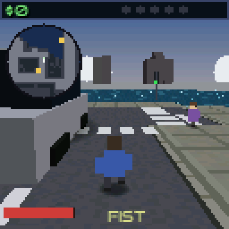
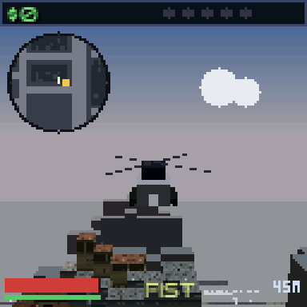
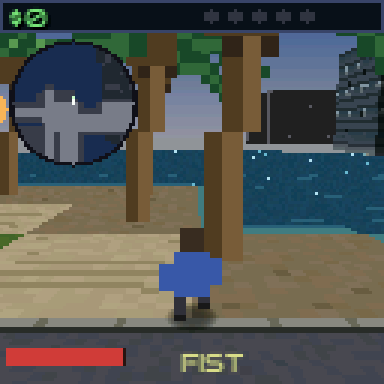

# Grand Thumb Auto III

**Version 1.0.2.** A third-person open-city crime sandbox for the Thumby Color,
built on the Mote engine. The third-person fork of `grandthumbauto`: the camera sits behind the
player rather than overhead, so the city is drawn as 3D massing instead of a
top-down map.



## Play

```bash
./tools/mote run games/grandthumbauto3            # SDL emulator
./tools/mote push games/grandthumbauto3 --launch  # USB -> device
```

**Controls** (as the in-game CONTROLS page lists them, under SETTINGS):

| Action | Button |
|---|---|
| **On foot** | |
| Move / turn | `DPAD` |
| Run (hold) | `A` |
| Attack | `B` |
| Enter car / switch weapon | `RB` |
| Look back | `LB` |
| **In the helicopter** | |
| Pitch / yaw | `DPAD` |
| Climb | `A` |
| Descend | `B` |
| Get out (landed, and not on a roof) | `RB` |
| **In the boat** | |
| Steer | `DPAD` |
| Ahead | `A` |
| Astern | `B` |
| Get out (alongside only) | `RB` |
| **In a car** | |
| Steer | `DPAD` |
| Gas | `A` |
| Brake / reverse | `B` |
| Fire | `LB` |
| Get out | `RB` |
| **Anywhere** | |
| Map / settings | `MENU` |
| **Title screen** | |
| Pick an option / take it | `UP`,`DOWN` / `A` |
| Settings: pick a row / change its value | `UP`,`DOWN` / `LEFT`,`RIGHT` |

`B` is the brake first and reverse second: held from speed it only ever brakes,
and it drops into reverse on its own once the car has actually come to rest, no
release needed. Held **while steering** it is a handbrake — the pedal keeps
under half its stopping power and lateral grip falls, so the tail steps out and
you can slide a corner. Keep the throttle on through it and the car gathers
itself up again when you let go of `B`.

## Features

- **Procedural city** — a 254x256 tile map generated at boot: road grid, avenues, pavements, parks, rivers, lakes, bridges and a plaza, different every seed.
- **Third-person chase camera** — smoothed yaw, wall collision, no flip when reversing, and an orbit for the title and death screens.
- **On-foot play** — walk, sprint on A with stamina, punch, eight weapons plus fists, and LB to look behind you.
- **Vehicle play** — RB to get in or out, A for the throttle, B to brake and drop into reverse once stopped, LB to fire from the car. The bottom-right corner names what you are driving over the speed readout — the handling class, so a cab says TAXI and a cruiser says POLICE — and the helicopter shows altitude in place of speed.
- **Handbrake drifts** — braking while steering cuts lateral grip instead of stopping you, so you can slide a corner and pick the car back up on the exit. The rear tyres smoke while they are actually scrubbing, one puff per wheel.
- **54 vehicles on 16 silhouettes** — sedan, compact, coupe, sports, racer, long-hood, wagon, van, truck, pickup, jeep, classic sports, plus a bus, a tank, a boat and a helicopter that are vehicle types rather than handling classes. No silhouette carries more than 17% of the 54 types. Each is a tinted mesh with a cabin, a wheel line and an oriented ground shadow; taxis are yellow with a roof sign.
- **Car damage** — vehicles take damage, catch fire and wreck, ejecting the driver; a damage bar sits under the health bar while you drive.
- **Armour** — found in the weapon caches. It soaks damage before health does and never regenerates, so it is a consumable advantage rather than a second health bar. A blue strip appears over the health bar only while you are wearing some.
- **Traffic AI** — cars hold a right-hand lane with pure-pursuit steering, change lanes, take turns, yield at junctions, queue behind each other and wait at red lights.
- **Traffic lights** — one signal head per intersection on a kerbside post, red/amber/green off a single global clock with no per-junction state.
- **Pedestrians** — 34 live peds who walk the pavements, flee a fight, and occasionally fight back.
- **The city keeps hours** — traffic and pedestrian counts follow the clock, with bumps at the morning and evening rush. Measured at one seed: 4 cars and 6 people walking at 1 a.m., 10 and 20 at 8 a.m. Costs nothing — it scales targets the streamer already had — and the thinner night traffic also lowers the triangle peak.
- **Street crews** — one city in three has a knot of four matching pedestrians who come for you on sight rather than when provoked. Put all four down and the last one drops the crew's takings.
- **Police and a wanted level** — up to six stars. Ambient patrols are the witnesses: a crime nobody sees costs you nothing, and gunfire and explosions are heard through walls where a theft has to be watched. Ramming a squad car is an automatic star; stealing one is two on the spot. **Stay in sight of the police and the level climbs on its own** — every twelve seconds of unbroken pursuit adds a star, up to four, so a chase you cannot shake gets worse rather than stalling. Escaping means both 30 m of separation and no line of sight, held for long enough; ducking behind one building only slows the count down. Squad cars chase by descending a routed distance field over the street grid rather than steering at you in a straight line, so they corner instead of grinding along the wall between you. At three stars they arrive in pairs, at four they throw roadblocks across the road ahead, and at five the army sends a tank.
- **14 mission types** — courier, rampage, getaway, hit, deliver, pickup, repo, escort, smuggle, demolition, vigilante, wanted-survival, circuit time-trial and a rubber-band rival race.
- **Day/night cycle** — a gradient sky on a full clock, a sun and moon on their own arc, stars that fade up through dusk, and a daylight cloud deck. After dark the city lights up: building facades swap to a night palette that drops the walls and lights a scattered share of the windows, costing no RAM and no extra triangles because the atlases are palette-indexed and the night image reuses the same pixels. The clouds sit at one altitude the way real cumulus do, all their flat bottoms on a single plane, so the only thing that varies is how far away a cloud is — perspective then makes the distant ones smaller and lower in the sky at the same time, and hazier, without any of it being faked per cloud.
- **Weather** — rain and thunderstorms that come and go, with wet road tinting.
- **Rotating minimap** — a live radar under the title bar, hideable from the settings page. It turns with your heading, so it matches what is out of the windscreen rather than the map page; an N tick travels round the rim to say which way north is, because heading south the dial is the map turned 180 and on a grid city that reads as a mirror.
- **Save and load** — three save slots on the settings tab of the pause screen, picked with LEFT/RIGHT and marked when occupied, plus a persisted best-cash record and a persisted sound on/off setting. A save records the **city seed**, so loading rebuilds the map you saved in rather than dropping you at those coordinates in an unrelated one. The title screen's menu offers `CONTINUE <slot>` when the selected slot holds a game, so you need not start a new city just to reach the menu. Dynamic state — traffic, pedestrians, uncollected caches, a mission in progress — is not saved and repopulates.
- **A flyable helicopter** — parked on an open pad somewhere in the city, with a 45 m ceiling, flight over water and buildings, an altitude readout in place of the speedo, and police who can only shoot at you below 18 m. It hovers rather than ditches over water, because there is only one of them. **You can set it down on any roof**, and the skids settle on the building properly — but you cannot step out up there, because nothing on foot in this game has a height. Rooftop caches are meant to be taken from the cockpit anyway: they have a 4 m collection radius against 1.5 m on the ground, so hovering level with the roof picks them up.
- **A boat** — moored at a shoreline in one city in two, rarer than the helicopter. It runs on water and nowhere else: drive it aground and the engine gives you nothing, but astern still works at reduced power to back you off the beach. RB will not put you out into open water. Low grip, so a hull carries its momentum through a turn, with a wake that widens with speed.
- **Hidden content** — a treasure island in the bottom-left water reached by a footbridge, weapon and cash caches in the forests, five more on the roofs of tall buildings that only the helicopter can reach, a rare one-shot rocket launcher, and a drivable tank with finite shells.
- **Shop signs after dark** — the gun shop, spray garage, phone boxes and dock light up at night, each in the colour the map page uses for it, so what you saw on the map is what is lit in front of you. Glow discs, no RAM; the budget has room precisely at night because the clouds stop drawing.
- **Street detail** — street lamps along the kerbs whose heads light up at dusk, bus stops with a sign facing the road, park benches on plazas and pavements, shrubs in the parks, railings on the long bridges, palm trees on the waterline, puddles on the road while it rains, zebra crossings and phone boxes.
- **Parking lots** — open pavement pockets away from the kerb are surfaced as asphalt with painted bays, about fifty-five to a city and averaging ten bays each. They cost nothing to draw: the ground pass emits the same triangles either way, just with a different cell of a sheet it has already bound.
- **City ambience** — a siren somewhere else in the city every twenty seconds or so, quiet enough to read as distance, and only when nothing is chasing you.
- **Birds** — flocks circle over the parks and the water by day and vanish when you get close, which reads as taking flight. Stateless: the flock comes from the tile hash and the circling from the clock, drawn as scene points (two pixels, depth-tested) with twelve of the 56-point pool reserved for them.
- **Beaches** — a quarter of the waterfront is sand two tiles deep, wet on the waterline and dry behind it, with the seawall dropped where it meets the water.
- **Draw budget** — cone culling, a banded draw distance with a haze band and ground skirt, and every pool (triangles, billboards, discs, shadows) sized from a measured host profile. That profile never covered combat, and a three-star pursuit now fills the triangle list — see [`KNOWN_ISSUES.md`](KNOWN_ISSUES.md).





## Temporary debug affordances

**BRING** — a hidden row on the SETTINGS page. Open the menu, `RB` to the
settings tab, then **tap `B` nine times**: a BRING row appears at the bottom.
`LEFT`/`RIGHT` picks HELI, TANK or BOAT and `A` delivers it. Nine more taps
puts the row away again.

The helicopter and the tank arrive 9 m in front of you. The boat has to arrive
on water, so it goes to the nearest mooring instead and the message says so.

`B` is the button because the settings tab is the one screen where it does
nothing — `UP`/`DOWN` pick a row, `LEFT`/`RIGHT` set its value, `A` activates
it, `LB`/`RB` flip tabs, `MENU` closes — so the code cannot disturb anything on
its way in.

This replaced an in-play code (four `LB`s then a direction, entered on foot).
That one passed its scripted capture but was no good in the hand: it wanted
four taps inside a 1.5 s window while `LB` was also swinging the look-back
camera, and nothing on screen told you whether a tap had registered. Here the
row either appears or it does not.

This is meant to come out. To remove it, delete `bring_vehicle`, the
`BRING_HELI`/`BRING_TANK`/`BRING_BOAT`/`BRING_N` enum, `g_bring`, `g_cheats`,
`set_rows()` and its two call sites, the `SET_BRING` row in the settings enum,
the B-tap block in the settings handler, its `LEFT`/`RIGHT` and `A` arms, its
`NAME[]` entry and the `BN[]` value arm in `draw_settings`.

The host-only equivalents are environment variables, which are no use with the
handheld in your hands: `MOTE_GTA_TP_HELI=1` stands beside the aircraft, `2`
puts you in it already airborne, `3` also parks it over the nearest tall roof,
`4` over the nearest water, and `5` over the nearest rooftop cache. `MOTE_GTA_TP_TANK=1` stands beside the tank.
`MOTE_GTA_BOAT=1` forces the boat to exist (one city in two), `MOTE_GTA_TP_BOAT=1`
stands you beside it and `=2` puts you aboard. `MOTE_GTA_CARTYPE=<n>` forces the
type of the first eight traffic cars so a given silhouette can be got on camera.
`MOTE_GTA_NOWIN=1` holds the day building palettes after dark, so the lit windows
can be A/B'd within one scene. `MOTE_GTA_ARMOUR=1` starts play in a full vest and
`=10` in ten points of one, since the caches that carry armour are scattered over
the whole map and reaching one in a scripted capture is not practical.

## Build and test

```bash
./tools/mote build games/grandthumbauto3            # host .so
./tools/mote build games/grandthumbauto3 --device   # .mote for the device
cmake --build build_host --target gta3_test_veh gta3_test_view gta3_test_camera
```

`gta3_shots.sh` lives in this folder and takes headless gameplay captures to
`games/grandthumbauto3/gta3_shots/` (git-ignored). Run it from anywhere; it
finds the repo root from its own location.

Three host test binaries cover the parts that are testable without a frame:
`gta3_test_veh` (vehicle mesh construction, silhouettes, lamp styles),
`gta3_test_view` (the world-space visibility cone) and `gta3_test_camera`
(chase-camera framing, angle wrapping, wall collision).

The game is close to two budget ceilings, and both are checked on every change:

- **`GAME_RAM`** — 134 KB at `0x2005E800`, with **968 bytes free**. Check with
  `arm-none-eabi-nm` on the `.elf`: `__mote_bss_end` against the top of the region.
- **Triangles** — `max_tris` is 850, and a three-star pursuit now **reaches it**.
  (The game runs on a Thumby Color; what is unmeasured is the engine arena's
  spare capacity, which the device build cannot report — see KNOWN_ISSUES.)
  `MOTE_GTA_DEBUG=1` prints `[TRI] peak=` to stderr and shows `t<n>` in the HUD;
  seed 7 at `MOTE_GTA_HEAT=3` peaks at exactly 850, which means the list filled
  and further triangles were dropped. See [`KNOWN_ISSUES.md`](KNOWN_ISSUES.md).
  See [`PROFILING.md`](PROFILING.md) for the measured scenes behind every pool size —
  note that combat was never among them.

  Open defects, with reproductions and what has already been ruled out, are in
  [`KNOWN_ISSUES.md`](KNOWN_ISSUES.md).

After any device build, disassemble `mote_game_register` and confirm the literal
it returns is the address of `k_vtbl`. A NULL there is the "map failed" bug —
see [`docs/DEVICE_DEBUGGING.md`](../../docs/DEVICE_DEBUGGING.md).

## Assets

`assets/*.png` are the editable sources; `tools/mote bake` turns them into the
`src/*.h` headers the game includes. The `make_*.py` scripts author them.

`make_citytiles.py` has an absolute `ROOT` pointing at another machine and at
`games/grandthumbauto`, not this game — running it here overwrites the wrong
game's committed art. `make_beach.py` derives its `ROOT` from its own location.
`mote bake` also rewrites *every* header in `src/`, so bake a staging directory
holding only the files you changed and copy the results across.
