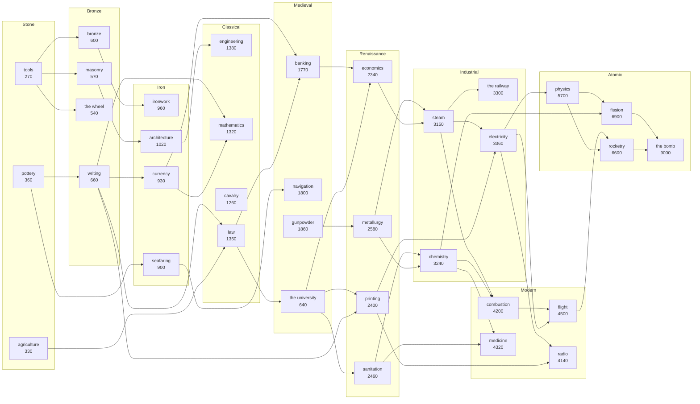

# Motebox — design

A **god simulator** for the Thumby Color: a living pixel world you nudge, bless and ruin,
built on the roguemote CC0 tile library. A demake of *WorldBox — God Simulator*, with the
two things WorldBox is actually loved for turned up and the 374-power buffet cut down:

1. **Civilisations that think.** Villagers with drives, lords who plan, kings who scheme,
   and a chronicle that names the people it kills.
2. **Disasters that are beautiful.** A cellular-automata `flux` field driving fire, lava,
   flood, acid, frost and ash, drawn through a recoloured FX sheet at 1 px/tile where a
   fire front actually *looks* like a fire front.

The organising constraint is inherited from roguemote and kept deliberately: **every sprite
in the library earns a place.** 1901 non-empty 8×8 tiles across 46 subsheets. Where a design
choice below looks odd, it is usually the honest way to give a sheet a job.

---

## 1. Hard constraints

Measured, not assumed.

| | |
|---|---|
| Screen | **128×128 px** — 16×16 tiles at 8 px |
| CPU | RP2350, dual Cortex-M33 **@ 280 MHz**, FPU; both cores rasterise |
| Input | 9 buttons: D-pad, **A**, **B**, **LB**, **RB**, **MENU** (MENU long-hold reserved by the OS) |
| ABI | v47 — runtime autotiles, `set_background_cb`, `kv_save`, `text_font`/`ui_font`, `blit_ex`, `link_*` |
| Static module RAM | **134 KB** (`.data` + `.bss`) |
| Load arena | **272 KB** (`MoteConfig` pools + `mote->alloc()`) |
| Tiles | 8×8, palette index 0 = transparent; baked sheets are `const` → **flash, not SRAM** |

Two ABI facts do most of the architectural work here:

- **`scene2d_set_autotiles(terrain, cols, rows, …)` autotiles a *runtime* byte map with no
  resolved tilemap buffer.** The only storage is the logical terrain array the sim already
  owns. A world where fire turns forest to ash every tick costs nothing extra to draw. This
  is why a god sim is even possible on this hardware.
- **`set_background_cb(fn)` is a per-band pass on both cores, settable at runtime.** That is
  the God's Eye view: a whole-world rasteriser that isn't the sprite pipeline, swapped in and
  out by pressing a button (`NULL` restores the scene, and Mortal View takes over).

---

## 2. What WorldBox is — and what a demake keeps

Research summary, with the design call on each system.

| WorldBox system | What it does | Motebox |
|---|---|---|
| **Village founding** | units of a race settle; campfire + banner; a city zone must be filled land, island ≥300 tiles | **Keep**, scaled: a 6×6 buildable zone, island ≥120 tiles |
| **Buildings** | town hall (3 tiers), houses (6 tiers), mine, windmill+farm, barracks, temple, library, docks, watchtower; caps of 1 mine / 1 windmill / 1 barracks per city | **Keep the set, keep the caps.** Tiers 1–3 for both hall and house |
| **Resource economy** | villager collects 10 stone + 5 wood → mine; hall tier 2 = 10 wood/10 stone, tier 3 = +10 iron; houses 4 wood → … → 10 each of wood/stone/iron/gold | **Keep the ladder almost verbatim** — it is well-tuned and it makes stockpiles legible |
| **Kings & lords** | king per kingdom, lord per village; Diplomacy / Stewardship / Warfare stats drive development | **Keep** — this is the cheapest way to make two villages feel different |
| **Loyalty & rebellion** | distance from capital, weak king, ambitious lord → village breaks away hostile | **Keep** — the best story generator in the game |
| **Diplomacy & war** | numeric peace/war/alliance likelihood, armies march, peace on exhaustion or conquest | **Keep**, with grudges read back out of the chronicle |
| **Culture / knowledge** | knowledge points unlock weapons, ships, architecture, rare metallurgy | **A real tree: 35 techs over 9 eras**, each visibly changing sprites, roads and weapons — see [The tech tree](#the-tech-tree). (This row said "compress to 5 tech tiers" for a long time after that stopped being true, which is why the diagram is generated and not typed.) |
| **Ages** | 10 ages ≥30 years each: Hope, Sun (heatwaves), Chaos (rage clouds), Ash (DoT, no armies), Despair (ice monsters)… | **Keep 8 ages** as global sim modifiers + a palette shift |
| **Traits** | 116 creature traits; ~29 non-random (Plague, Zombie, Blessed, Madness, Chosen One…) | **32 traits**, 8 of them god-granted only |
| **Happiness** | −100..+100 per unit, drives everything | **Keep** as a signed byte; it is the utility AI's main input |
| **Disasters** | toggleable Natural / Other; what can fire depends on population, city count and age | **Keep 22**, same gating philosophy, same World Laws toggles |
| **Powers** | ~374 across 8 tabs | **48 across 6 tabs.** Curation is the whole job |
| **374-power buffet, mod support, huge maps** | — | **Cut.** No d-pad UI survives 374 powers |

The community's own account of why they play — *"create civilisations and nuke them, then
repopulate"*, *"let it evolve naturally and watch diplomacy happen"*, *"roleplay and make
your own stories"* — is the design brief. Motebox optimises for **watch → poke → story**, in
that order, and adds one thing WorldBox lacks: a reason to nurture before you destroy (§11).

Sources: [Civilizations, Kingdoms and Villages](https://worldbox-sandbox-god-simulator.fandom.com/wiki/Civilizations,_Kingdoms,_and_Villages) ·
[How to grow civilizations](https://progameguides.com/worldbox-god-simulator/how-to-grow-civilizations-in-worldbox-god-simulator/) ·
[City Building](https://the-official-worldbox-wiki.fandom.com/wiki/City_Building) ·
[Nature and disaster powers](https://progameguides.com/worldbox-god-simulator/how-to-use-nature-and-disaster-powers-in-worldbox-god-simulator/) ·
[Disasters](https://the-official-worldbox-wiki.fandom.com/wiki/Disasters) ·
[Creature Traits](https://the-official-worldbox-wiki.fandom.com/wiki/Creature_Traits) ·
[Unit Stats](https://the-official-worldbox-wiki.fandom.com/wiki/Unit_Stats) ·
[Ages](https://gamerjournalist.com/how-the-new-ages-system-works-in-worldbox-god-simulator/) ·
[World Laws](https://the-official-worldbox-wiki.fandom.com/wiki/World_Laws) ·
[Races overview](https://en.namu.wiki/w/WorldBox%20-%20God%20Simulator)

---

## 3. The two views — the central UX invention

WorldBox is a pinch-zoom touch game. There is no pinch and no touch here, so the zoom is
**binary and exact**, and the world is sized so the zoomed-out view is pixel-perfect.

**World = 128 × 112 tiles.** In God's Eye, **1 tile = 1 pixel** and the entire world is on
screen with no scrolling, ever. The same 128×112 px region is the Mortal View camera area, so
the two views share a frame and the toggle reads as a true zoom rather than a jump.

```
GOD'S EYE  (set_background_cb, both cores)      MORTAL VIEW  (scene2d + autotiles)
┌────────────────────────────┐ 0                ┌────────────────────────────┐ 0
│░░░▒▒▓▓███▓▓▒▒░░░░░░░░░░░░░░│                  │  ▓▓ 16 × 14 tiles at 8 px  │
│░░▒▒▓▓█ the whole world  ░░░│  1 px per tile   │  trees, houses, banners,   │
│░▒▓▓██  political tint,  ░░░│  128 × 112       │  villagers with mood        │
│░░▒▓█   fire glow, unit  ░░░│                  │  emotes, blueprint ghosts   │
│░░░▒▒▓▓ pixels, cursor   ░░░│                  │  of what a lord plans       │
├────────────────────────────┤ 112              ├────────────────────────────┤ 112
│⌛×3 Y412 ☀Hope  ✋Meteor 340│  16 px HUD       │⌛×3 Y412 ☀Hope  ✋Meteor 340│  same HUD
└────────────────────────────┘ 128              └────────────────────────────┘ 128
```

**God's Eye is the default and the point.** It is where a god belongs: you see every war
front, every fire, every border at once. Political tint (§6) makes it read as a living map.
A 1 px unit is not a compromise — a crowd of 300 pixels streaming toward a border is more
legible than 300 sprites would ever be at this resolution.

**Mortal View is the reward.** Zoom in and the pixels become people with faces, mood emotes,
coloured houses per kingdom, and — the detail that sells the AI — **blueprint ghosts** of the
building a lord has decided to build but not yet paid for, drawn in the source sheet's
white floor-plan line art.

HUD (16 px, three fields left→right, always live): **⌛ speed · Y year · age glyph** ·
**selected power + Faith**. A fourth slot flashes chronicle toasts (§9).

---

## 4. Controls

Nine buttons, no chords, everything important one press away.

| | God's Eye | Mortal View | Menus / wheel |
|---|---|---|---|
| **D-pad** | move cursor (accelerating: 1 → 6 tiles/frame after 0.4 s) | move cursor, camera follows at the edges | navigate |
| **A** | cast selected power; **hold = brush** where the power allows | same | confirm |
| **B** | **inspect** → Soul Card of the unit/building/tile under the cursor | same | back |
| **LB tap** | cycle speed **PAUSE · ×1 · ×3 · ×8** | same | tab left |
| **LB hold** | **power wheel** — 8 slices, D-pad selects, release commits | same | — |
| **RB tap** | **zoom toggle** (cursor position preserved) | same | tab right |
| **RB hold** | **seek** — jump the cursor to the next point of interest (war, fire, new village, dying king), 3/s while held | same | — |
| **MENU** | **God Menu** — World Laws, Chronicle, Legends, Ages, Save, Options | same | close |

Two of these are the whole answer to "how do you play a touch game with a d-pad":

- **RB hold = seek.** Pixel-hunting a 1 px villager with a d-pad is misery. Seek walks a
  priority queue of interesting places the sim maintains for free (it already knows where the
  wars are). It also doubles as the "show me a story" button for passive play.
- **Tap/hold on one shoulder.** LB tap is the most-pressed verb in any sim (speed); LB hold is
  the most-varied (power choice). Same button, no chord, no modal state.

### The wheel: four arms, two stops each

**The Thumby Color's d-pad reports only the four cardinals** — pressing UP and RIGHT together
does not arrive as both — so an eight-slice radial selected by direction is unreachable on the
hardware, however well it reads on screen. (This section originally specified exactly that.)

So each of the four arms holds **two** powers, near and far:

```
                 [MOUNTAIN]        press UP    -> FIRE      (near, one press)
                     |             press UP    -> LIGHTNING (far, press again)
                  [RAISE]          press RIGHT -> METEOR    (jumps arms, near)
 [DESERT]-[ROAD]     +     [FOREST]-[GRASS]
                  [LOWER]
                     |
                  [WATER]
```

Pressing a direction selects that arm's **near** power; pressing the *same* direction again
steps out to the **far** one; pressing a different direction jumps to that arm's near slot.
Four powers are one press, four are two, and the spatial muscle memory survives. Selection is
edge-triggered, so a held direction cannot oscillate between the two stops.

Still 6 tabs × 8 = 48 powers, RB pages tabs while the wheel is up, last-used slot per tab is
remembered, and the wheel dims the world with scanlines rather than hiding it — you are
choosing *where* as much as *what*, and it is only up while LB is held.

---

## 5. Time, ages and determinism

| | |
|---|---|
| Sim tick | **1 week**, fixed. 52 ticks = 1 year |
| Nominal rate | 8 ticks/s at ×1 → **6.5 s per year** |
| Speeds | PAUSE · ×1 · ×3 · ×8 (**0.8 s/year** at ×8 — a 250-year epic in ~3½ minutes) |
| Render | 30 fps (`set_fps_limit(30)`), decoupled; ticks-per-frame budgeted with a `micros()` watchdog so a busy world drops sim rate, never frame rate |
| Ages | 8, each ≥30 years, chosen by a weighted roll off world state (population, war intensity, ruin count) exactly as WorldBox gates its disasters |

**The sim is integer-only and deterministic.** Fixed-point positions (1/16 tile), one
explicit PRNG stream per subsystem, no `float` anywhere in `mb_sim` / `mb_civ` / `mb_flux`.
Floats live only in FX and rendering. This is not purity for its own sake — it buys three
things the design depends on: a world is reproducible from `(seed, tick)` so the headless
audit in §17 means something; replays and the two-god link mode in §19 stay possible; and a
save can store the seed plus a diff instead of the whole world.

**The eight ages** (name · sim modifier · palette):

| Age | Modifier | Look |
|---|---|---|
| **Hope** | fertility +30%, war appetite −40% | default |
| **Sun** | dryness climbs; spontaneous fires; crops wilt | warm bias, hard shadows |
| **Moon** | night-long; predators bolder; faith income +50% | blue-shift, dim |
| **Iron** | tech +1 tier free; armies muster faster | neutral, cold metals |
| **Chaos** | rage clouds drift; madness trait spreads | high-contrast, jittering tint |
| **Ice** | frost flux at the poles; water freezes to ice | white-shift |
| **Ash** | every unit takes a small DoT; no new armies muster | grey desaturate + ashfall |
| **Despair** | Ice, plus dark, plus ice-monster spawns | near-monochrome |

Age transitions are chronicle events and get a full-screen title card. They are the sim's
seasons — the thing that stops a stable world from being a boring one.

---

## 6. The world

### Layers (all `mote->alloc`, 128×112 = 14 336 B each)

| Layer | Byte | Purpose |
|---|---|---|
| `biome[]` | terrain id 0–23 | drives the autotile pass directly — the engine reads *this array* |
| `elev[]` | 0–255 | lava and water flow downhill; mountains gate settlement; coastline |
| `obj[]` | object id | trees, rocks, ore, crops, buildings, ruins, graves, banners — one per cell |
| `flux[]` | kind:4 / intensity:4 | **the disaster channel** — fire, lava, water, acid, ash, frost, gas, void |
| `claim[]` | village id 0–63 + 2 bits development | political tint, territory, borders |

**70 KB total.** Everything else is small (§16).

### Biomes → tiles: what the CC0 sheet actually has

*(Rewritten after Phase 0 measured the sheet. The first draft of this section claimed the
colour-block region at source rows 20–23 was a flat-fill palette. It is not — every one of
those 64 cells carries 3–4 colours, because they are rounded UI panels with a navy border and
a white highlight. The real answer is better.)*

The master has **no water tile** — roguemote's `extract.py` says so outright and ships nothing
for it — and, measured across all 4096 cells, exactly **three pure single-colour cells**. So
there is no ready-made flat terrain art anywhere in it.

What it does have, in rows **35** and **47–49**, is about **forty hand-drawn monochrome
textures that tile seamlessly**: chevron wave bands, brick courses, pebble grids, diagonal
hatching, dashes, plough furrows, scale patterns. Each biome fill is therefore **one of those
textures composited over a flat of a source palette colour**, with the texture's ink recoloured
to a second palette colour. Base, ink and shape all come from the CC0 master; only the
combination is ours, and it lives in one declarative table (`BIOMES` in
`authoring/extract_box.py`) rather than being painted by hand.

Two things Phase 0 learned the hard way, both now enforced in the script:

- **Ink coverage must be 18–55% of the tile.** The master's wave band continues into *fully
  opaque* body cells (row 35 cols 50–55, row 34 cols 58–63) that look like more chevrons at
  thumbnail size and paint the ink over the entire tile. `flat()` refuses any cell outside the
  band, which caught two bad recipes rather than shipping blotches.
- **Flowing terrain gets `nvar=1`, still ground gets a plain variant plus two sparse ones.**
  Mixing a plain cell with a full-width chevron cell produced hard-edged 8 px blocks — a
  chevron has to meet another chevron to read as a surface. The wave cell is also a top-*edge*
  band, so it is horizontally periodic but not vertically: rolling it in y lifts the line off
  the seam. Ocean, sea, lava, acid and farmland are therefore one chevron line every 8 px,
  which is what classic pixel-art water looks like anyway.

Water is consequently real source art: the wave band over a flat of PICO-8 navy (ocean) or blue
(sea), with sandbank foam for the shoals. That closes roguemote's one asset gap.

Full biome table (24 ids, each an autotile ruleset or fill):

`ocean · sea · shallow · ice · beach · dune · desert · savanna · grass · meadow · forest ·
jungle · swamp · hill · mountain · peak · tundra · snow · ash · scorched · lava · acid ·
farmland · road`

Rulesets: **forest = `hedge` blob47** (the garden-maze set is a perfect canopy),
**grass = `floor_jungle` blob47** (grass with dirt sides and gold steps),
**road = `floor_road`/`floor_cobble`** (5 shades), **mountain = `boulders_mountains`** objects
over rock fill, the rest flat/dithered fills with 2–3 variants. Per-culture city walls come
free from roguemote's existing blob47 sets: `wall_brick` (human), `wall_marble` (elf),
`wall_stonebrick` (dwarf), `wall_aztec` (orc), `wall_bone` (undead).

### Political tint — why God's Eye reads as a map

Each of ≤12 kingdoms owns one of the sheet's 5 banner colours plus variants. In God's Eye a
claimed cell is drawn as `blend(biome_colour, kingdom_colour, 25%)` with a **2 px dither at
the border** so frontiers shimmer. Cost: one blend per pixel in the background band pass.
This single effect is what makes a 128×112 pixel grid look like a political map instead of
noise — and it makes a war visible from across the room.

### Worldgen

Value noise → `elev`; a second octave → moisture; a Whittaker-style table → `biome`. Rivers
descend the `elev` gradient to sea, carving `shallow`; basins fill as lakes. Ore/gold/gem
veins seed in `mountain`/`hill`. Forests weight by moisture. 3–6 islands so sea powers and
docks matter. Everything from a **32-bit seed shown on the world-select screen** — a world is
a number you can write down and re-roll.

---

## 7. The AI — three brains

This is the headline feature, so it gets the honest treatment: what each brain decides, what
it costs, and how it is measured.

### Tier 0 — movement: three tiers, no per-unit A*

Following `redmote`, which holds 140 units at 30 fps on a 96×96 map with 8 cached BFS flow
fields. A god sim needs more units and cheaper thinking, so movement splits by range:

1. **Local commute field** — each village owns a **32×32 `uint8` cost-to-hall field** (1 KB),
   rebuilt by BFS when its buildings change, one village per tick, amortised. 95% of all
   movement is a villager inside its own territory following a gradient: *O(1) per unit*.
2. **Region graph** — the world as **16×14 blocks** (224 nodes) with walkable/coastal flags.
   Settler parties, armies and traders A* over blocks (≤224 nodes, cached per journey), then
   steer locally. A cross-world march costs one small A* once, not per step.
3. **Steering** — 8-direction greedy descent + wall slide + separation jitter. Crowds part
   around obstacles instead of grinding.

### Tier 1 — the unit brain (utility)

Each unit carries seven **drives** as signed bytes: `hunger · fear · greed · duty · love ·
faith · wander`. Every tick, **1/8 of the population** re-scores ~10 candidate actions and
takes the argmax with hysteresis (the incumbent action gets a +12 bonus, so units don't
dither). Score shape, with everything integer:

```
score(act) = base[act]
           + drive[act.drive] * weight[act]        /* what I want */
           + trait_bonus[act]                      /* who I am */
           - distance_cost(field, act.target)      /* how far it is */
           + village_need[act.job] * lord_push     /* what my lord asked for */
           - danger(flux, threat_map, act.target)   /* what will kill me */
           + age_modifier[act]                     /* what age it is */
```

Actions: `eat · gather wood · gather stone · mine · farm · build · fight · flee · court ·
breed · worship · wander · flee-plague · bury`. Happiness (−100..+100, WorldBox's own range)
feeds `duty` and `love` and decays toward the village's condition, so a starving unhappy
village visibly stops working and starts leaving — emergent, not scripted.

**Traits: 32**, drawn from WorldBox's set and cut to those that visibly change behaviour:
`tough · fast · brave · coward · greedy · pious · fertile · barren · genius · stupid ·
cannibal · vengeful · loyal · ambitious · immortal · regenerating` + 8 god-granted only
(`blessed · cursed · chosen · marked · plague · madness · contagious · zombie`). Traits are
inherited with mutation, which is what makes bloodlines interesting.

**Ecology runs on the same brain**, cheaper: wildlife from `animals` (deer, boar, sheep,
chicken, rabbit as prey; wolf, bear, snake, spider as predators; fish; bees as the swarm
disaster; rats as the plague vector) with only `hunger · fear · breed`. Populations
genuinely oscillate, and overhunting a region visibly empties it.

### Tier 2 — the village brain (the lord)

Every 8 ticks, one village evaluates one decision from a needs vector, weighted by its lord's
`Stewardship / Diplomacy / Warfare`:

```
food_store < pop*2         -> farm / windmill      (cap 1 windmill)
wood  < 20                 -> woodcutter camp
stone < 20                 -> mine                 (cap 1 mine; costs 10 stone + 5 wood)
pop   > housing            -> house (tier 1) or house upgrade
threat_map[here] > 40      -> barracks (cap 1) / watchtower / wall segment
happiness < -20            -> temple / tavern
hall < 3 and stock allows  -> upgrade hall  (t2: 10w+10s · t3: 10w+10s+10i)
pop > 24 and land nearby   -> SETTLER PARTY -> found a new village
coastal and tech >= 2      -> docks (cap 5)
```

The chosen build appears immediately as a **blueprint ghost** in Mortal View and only becomes
real when the stockpile pays for it. Watching a lord plan is a feature, and the sheet's
floor-plan line art was waiting for a job.

### Tier 3 — the kingdom brain (the king)

Every 32 ticks per kingdom (≤12 kingdoms, so this is nothing):

```
for each known neighbour:
    friction  = shared_border_len + contested_claims*3
    strength  = my_army / (their_army + 1)
    culture   = |tech - their_tech| + race_distance
    grudge    = chronicle_grudge(them)        /* read straight out of §9 */
    war_score = friction + strength*20 + grudge*5 - their_diplomacy*4 + age_war_bias
    peace_score = exhaustion*3 + trade_value*2 + their_diplomacy*4
```

Highest score wins: **war** (pick a target village, muster an army at a rally point, march
via the region graph), **peace** (treaty; exhaustion decays), **alliance** (join each other's
wars), or **nothing**. Armies use soldier sprites whose weapon art steps with tech tier, so
you can *see* a kingdom's technology on the battlefield.

**Loyalty and rebellion**, straight from WorldBox because it is the best story engine in it:

```
loyalty = 60 - dist_to_capital/2 - lord_ambition*3 - war_exhaustion*2
        + king_diplomacy*2 + happiness/4
loyalty < 0 for 8 consecutive ticks -> the village secedes as a new hostile kingdom,
                                       taking its lord as king and its own banner colour
```

Big empires therefore fracture on their own, and civil wars happen without the player. That,
not the meteor button, is what makes a world worth watching.

### Cost budget (to be confirmed in Phase 1, but sized deliberately)

| Per tick at 8 Hz | Work | Est. cycles |
|---|---|---|
| Unit brains | 384/8 = 48 units × ~10 actions | ~120 k |
| Unit movement | 384 × gradient step | ~60 k |
| Flux CA | ≤2048 active cells | ~80 k |
| One village field rebuild | 32×32 BFS | ~40 k |
| Village brain | 1 village | ~5 k |
| Kingdom brain | amortised | ~2 k |
| **Total** | | **~310 k of 35 M cycles/tick** |

Roughly **1%** of one core at ×1, ~7% at ×8. Headroom is deliberate: the CA and crowd sizes
grow into it, and the frame budget belongs to rendering.

---

## 8. Population, families and legends

- **384 units max** (28 B each). WorldBox's medium maps run a few hundred; 384 across
  128×112 tiles is a comparable density and it is what the arena and the brain budget allow.
- **64 families.** Every unit has a surname, two parents and a birth year. Marriage crosses
  families; children inherit traits with mutation; a family with many kings becomes a
  **dynasty** and gets a crown sprite from `crowns_fx` on its heads.
- **Legends.** A unit that crosses a threshold (10 kills, king for 40 years, survives a
  meteor, founds 3 villages, cures a plague) earns a **nickname** — *Kaeda the Unburnt* — is
  written into the Legends screen, and stays there after death with its epitaph. This is the
  score. It is also what makes losing a village hurt.

---

## 9. The Chronicle — the story engine

The cheapest big win in the whole design, and the reason to keep playing.

- A **ring buffer of 96 events × 12 B**: `type · year · actor · place · magnitude`.
- Rendered to text at display time from ~60 templates plus a **syllable name generator**
  (a 2 KB table, hashed from unit id, so every name is stable and free):
  *"Y143 · Emberhold falls to the Green Horde."* ·
  *"Y144 · Kaeda the Unburnt crowned in Stonewatch."* ·
  *"Y151 · The Ashen Plague takes 40 souls."*
- **Grudges** are just a query over this buffer, which is why kings remember who sacked what.
- **Toasts**: a high-magnitude event slides a one-line banner into the HUD's fourth slot. With
  **Follow History** on (a World Law), the camera also jumps there. That is the passive mode —
  put it on ×8, watch it like a lava lamp, and it tells you stories.
- MENU → Chronicle is the full scrollable log; MENU → Legends is the hall of names.

Text: **`rogue8`** (roguemote's proportional CP437, 8 px) for dense chronicle/Soul Card
columns, where ~24 characters per line is the difference between a sentence and a fragment;
**`ui_font(MOTE_FONT_MED)`** for titles, toasts, menu chrome and the age cards.

---

## 10. Disasters — the flux field

One mechanism, 22 faces. `flux[]` holds `kind:4 / intensity:4` per cell, stepped by one rule
pass per tick, **double buffered** (read `flux[]`, write `next[]`, swap). The second buffer is
not optional: with one, a fire races across the map in a single tick in the scan direction and
crawls in the other, because a cell it just lit gets read again downstream.

Three things Phase 2 changed from this section's first draft, each after building it:

- **No active-cell ring.** The plan was a 4096-entry ring so a calm world cost nothing. The
  whole-grid scan is 14336 loads of a byte that is almost always zero, at 8–64 ticks/s — the
  ring would have bought a fraction of one percent of a core in exchange for a
  duplicate-suppression structure and its bugs.
- **Fire's intensity IS its remaining fuel**, set on arrival from the ground it lands on
  (`fuel >> 5`, clamped 2–15): a forest cell with a tree burns 14 ticks, bare grass 4. The
  first model gave every cell a flat 10 and decayed it, which made fire behave identically in
  a rainforest and on a lawn.
- **Spread chance depends on the neighbour's fuel and the wind, not on our intensity.** With
  the old rule a cast blob's edge cells were its weakest, so the *front* was the weakest part
  of the fire and it always guttered out after ten ticks. Now a front advancing into fresh
  fuel does not weaken, and fires reliably run — while rivers, desert and rock remain natural
  firebreaks, because fuel 0 cannot burn.

Per-kind behaviour is a case in the switch: spread (wind-biased), decay, whether it flows
downhill by `elev` (lava, flood), what `obj`/`biome` it consumes, what it leaves behind, and
its FX. Water beats fire in the merge rule, which is how rain and flood put a firestorm out.

**Disasters that walk** rather than spread — the tornado and the volcanic vent — are a
six-entry agent array (kind, position, heading, countdown) stepped before the field pass, so
they seed flux the pass then carries. The tsunami front and the kaiju reuse it.

| # | Disaster | Rule | Look |
|---|---|---|---|
| 1 | **Fire** | spreads by wind × dryness through trees/crops/houses → ash | orange flicker in God's Eye; fire-burst sprite + recoloured spark speckle |
| 2 | **Lightning storm** | wandering cloud, strikes ignite | bolt streak from `fx_mono`, 2-frame white flash, rumble |
| 3 | **Volcano** | a `peak` becomes a vent; lava flows downhill, cools to rock; ash cloud chills the region | red lava front, ash-fall particles, cone sprite from `crowns_fx` |
| 4 | **Meteor** | 8-frame incoming streak → crater, cleared radius, shockwave ring, firestorm | expanding rings (`fx_mono`), screen shake, rumble, camera flash |
| 5 | **Earthquake** | Bresenham fissure; buildings on the line collapse to ruins | decaying camera shake, dust puffs, cracked-ground tiles |
| 6 | **Tornado** | moving vortex; strips `obj`, scours biome, flings units (they orbit, then land hurt) | swirl sprite + 12 orbiting debris particles |
| 7 | **Tsunami** | water wall sweeps from a coast, floods low `elev` for N ticks, recedes leaving sand and corpses | foam band tiles, blue splash bursts |
| 8 | **Acid rain** | dissolves biome down a ladder: grass → dirt → rock → sea | green-recoloured drip particles, hissing sfx |
| 9 | **Blizzard** | frost flux; water → ice; crops die; units seek shelter | drifting snow particles with wind |
| 10 | **Heatwave** | global dryness climbs; grass → savanna → sand; spontaneous fire | heat shimmer via band offset, warm palette |
| 11 | **Drought** | rivers shrink, farms fail, famine drives migration | dried riverbeds, wilted crop sprites |
| 12 | **Plague** | unit-level SIR via proximity and trade routes; graves accumulate; **villages quarantine** — a real AI response | green spore emote over the sick, headstone objects |
| 13 | **Undead rising** | corpses and graves in a radius rise as skeletons; their kills join them | white wisp sprites from `monsters`, bone-wall city ruins |
| 14 | **Locust swarm** | 40-particle cloud eats farmland | bee sprites from `animals`, chittering sfx |
| 15 | **Madness** | rage flux; units attack whoever is nearest | red-shift tint, spiral emote |
| 16 | **Sinkhole** | growing void; swallows tiles and whatever stands on them | black fill, crumbling edge ring |
| 17 | **Flood** | rain raises rivers; extinguishes fire; grows grass after | rising shallow water, blue dither |
| 18 | **Kaiju** | summon one of the 17 `bosses` (2×2): it walks, wrecks buildings, eats units — **and kingdoms declare war on it** | 16×16 sprite, footstep shake, panic emotes |
| 19 | **Divine wrath** | a light pillar smites the faithless, heals the faithful | white column, holy-recoloured sparkles, angel sprite |
| 20 | **Fallout** | Iron-age unlock: flash, rings, everything in radius to ash, fallout flux mutates survivors | full white frame, triple ring, long rumble |
| 21 | **Ashfall** | Age of Ash: world-wide grey drift, small DoT everywhere | ash particles on every band, desaturated palette |
| 22 | **The Maw** | endgame: a slow void that consumes cells permanently and never stops | black growth with a shimmering rim |

Availability is **gated like WorldBox's** — population, city count and current age decide
what can fire naturally, and the World Laws let you switch Natural and Other disasters off
independently.

### The FX toolkit — and where "beautiful" comes from

Four cheap layers, composited:

1. **The flux field itself**, drawn in the biome pass. At 1 px/tile a spreading fire front is
   a *shape*, and shapes are what read on a 128 px screen.
2. **A 256-particle pool** (16 B each) sourced from `fx_mono` — 73 hand-drawn mono frames of
   bolts, slash arcs, expanding rings, sparkle bursts, speckle clouds and wind swooshes.
3. **`crowns_fx` impact sprites** — explosion, fire burst, water splash, smoke swirl.
4. **Screen-level**: camera shake (decaying), full-frame flash via the background pass, palette
   shift per age, and `rumble(intensity, ms)`.

**The multiplier:** `fx_mono` is white line art, and `blit` is colour-keyed with no tint — so
the extract step **palette-swaps the sheet into six elemental colours** (fire, frost, acid,
ash, holy, void), writing six editable PNGs. 73 frames × 6 = **438 FX frames** from one CC0
band, every one of them hand-drawn. That is where a 22-disaster range gets its variety without
inventing art.

---

## 11. Powers, and the one thing WorldBox is missing

**48 powers, 6 tabs of 8**, sized to the wheel:

| Tab | Powers |
|---|---|
| **Land** | raise · lower · grass · forest · sand · mountain · water · road |
| **Life** | human · elf · dwarf · orc · found village · animals · fish · plants |
| **Bless** | rain · fertility · heal · inspire (tech) · peace · gold vein · sanctuary · resurrect |
| **Curse** | plague · madness · curse · weaken · famine · barren · grudge · mark |
| **Wrath** | fire · lightning · tornado · earthquake · meteor · volcano · acid rain · tsunami |
| **Beasts** | skull titan · medusa · reaper · phoenix · golem · insect queen · the eye · angel |

Each power has an icon, a brush size, a cooldown, a Faith cost and a chronicle verb (so *your*
interventions are written into the history alongside everything else — you are a character in
the log, and that is the joke).

### Faith — the missing feedback loop

WorldBox's honest weakness is aimlessness: every power is free, so the optimal play is
meteor-spam and the civilisation is scenery. Motebox ships **two modes**:

- **Sandbox** — everything free and unlocked. WorldBox as it is.
- **Pantheon** (default) — powers cost **Faith**, and Faith is generated by *worshippers*:
  `Σ (happiness × faith_trait)` over living units, plus temples, plus festivals, minus heresy.

That one line changes the whole game. Rain costs 1. A meteor costs 120. A kaiju costs 500. To
afford spectacle you must first grow a civilisation that loves you — so nurturing and
destroying become a *trade-off* instead of two unrelated toys, and the growth sim you built
becomes the resource engine for the disaster sim. Wiping out your worshippers really does
bankrupt you.

**Trials** (8, optional, medals saved to `kv`) give a handheld session a shape without walling
off the sandbox: *Ashfall* — keep one kingdom alive 200 years through an Age of Ash · *Ark* —
all four races alive at Y300 on one island · *Kingslayer* — end with exactly one village
standing · *Shepherd* — reach 300 population with no disaster cast · *Pantheon* — bank 5000
Faith · each with a par year count.

---

## 12. World Laws

Cheap to build, disproportionately loved, and how a sandbox becomes personal. Toggles and
sliders in the God Menu: `natural disasters · other disasters · war · rebellion · plague ·
madness · ageing · breeding · monsters · tech progress · ages advance · follow history ·
unit nameplates · political tint · mood emotes · autosave`, plus sliders for
`breeding rate · aggression · disaster frequency · fertility`.

---

## 13. Sprite budget — every sheet earns a job

The contract, as in roguemote §4. Counts are non-empty cells measured from the baked sheets
(1901 total).

### Actors

| Sheet | n | Job |
|---|---|---|
| `characters` | 85 | 4 races × 5 roles (villager, farmer, miner, soldier, elder) + lords, kings, priests, prophets, rebels, bandits, children |
| `animals` | 83 | the ecology: prey, predators, fish, birds, bees (swarm), rats (plague vector), mushroom-folk as a 5th race |
| `monsters` | 72 | undead risings, goblin/orc raiders, demons (Age of Chaos), slimes/biomass, ice monsters (Age of Despair) |
| `bosses` | 68 | 17 kaiju at 2×2 — 8 summonable, 9 age-spawned horrors |
| `crowns_fx` | 23 | 5 dynasty crowns, volcano cones, explosion/fire/splash/smoke impacts |
| `helms_hoods` · `armour_set` | 58 | soldier tech tiers, drawn on the Soul Card and the army banner |

### World & buildings

| Sheet | n | Job |
|---|---|---|
| `doors_gems_banners` | 24 | **5 kingdom colours × house + banner** — the political layer you can see |
| `props_light` | 25 | campfire (the founding marker), torches, fences, bridges, docks, igloo (snow housing), log piles, late-age terminals |
| `trinkets` | 55 | the vegetation layer: trees, bushes, cactus, mushrooms, rocks, flowers, plus blood/acid splats and drifting clouds |
| `boulders_mountains` | 22 | mountain ranges, snow peaks, post-quake rubble |
| `terrain_edges` | 112 | coast foam, cloud shadow, snow drift, debris scatter |
| `grass_garden` | 128 | biome fringe, gold steps, snow ground (row 7) |
| `cobble_floors` | 20 | roads and plazas in 5 shades — one per culture |
| `wall_stonebrick` · `wall_temple` · `wall_purple` | 152 | per-culture architecture: arches, gates, windows, idols |
| `furniture_white` · `furniture_stone` · `loot_furniture` | 47 | top-down village interiors seen from above: market stalls, granary, well, forge |
| `treasure_ore` | 35 | ore/gold/gem deposits + **9 shields = kingdom heraldry in the HUD** |
| `food` | 36 | crops by biome, market goods, the food-stockpile icon |
| `chests` · `chest_wood` | 12 | village stockpiles, tribute, trade caravans |
| `blueprint` | 34 | **the blueprint ghosts** — what a lord has decided to build |
| `dungeon_mono` · `stairs` | 46 | temple and palace interiors, ziggurat wonders, the Pantheon screen |
| `levers` · `devices` · `runes` · `guns` | 69 | late-age wonders and their icons: hourglass = time, crystal ball = prophecy, harp/bell/drum = festivals, guns = Age of Iron |
| `weapons_potions` · `weapons_elemental` · `tools_wands` · `jewellery` · `ammo` | 115 | tech-tier iconography: the weapon a kingdom's soldiers carry, the tools its workers use |

### UI

| Sheet | n | Job |
|---|---|---|
| `fx_mono` | 73 ×6 = **438** | every disaster's particles, in six elemental recolours |
| `ui_status_emotes` | 83 | mood faces over units, per-element disaster icons, hearts, meter segments |
| `ui_icons_tiny` | 32 | HUD micro-icons, power-wheel glyphs |
| `ui_arrows_gauges` | 34 | the power-wheel ring, meters, the seek compass |
| `ui_buttons` | 35 | button prompts in the tutorial and the wheel |
| `panels_colour` | 64 | Soul Card, Chronicle, Legends and God Menu panels in 4 colours |
| `ui_symbols` | 4 | family/lineage marks on the Soul Card |
| `font_cp437` + `rogue8` | 253 | all text |

**Coverage discipline:** roguemote's `authoring/coverage.py` idea carries over — a script walks
the content tables and reports any sheet cell no table references. Target: **0 unused**.

---

## 14. Assets to author

The pipeline is roguemote's, extended. Everything stays an editable source file under
`assets/` or `tilesets/` and is turned into `src/*.h` by `mote bake` / Studio Save.

1. **`authoring/extract_box.py`** (new, alongside roguemote's `extract.py`):
   - the **colour-block region** (source rows 20–23) → 12 biome fill tilesets (water ×3,
     grass ×3, sand ×3, lava/scorched/acid ×3), each as `.tileset` + sheet;
   - the **wave/foam band** (rows 34–35) → a coast edge ruleset;
   - **six palette-swapped copies of `fx_mono`** → `fx_fire.png`, `fx_frost.png`,
     `fx_acid.png`, `fx_ash.png`, `fx_holy.png`, `fx_void.png`;
   - reuse roguemote's `hedge`, `floor_jungle`, `floor_road`, `floor_cobble` and the five
     `wall_*` blob47 sets **unchanged** — same source, same generator, no forking.
2. **`icon.png`** (60×60, game root): a globe of green/blue colour-block pixels with a fire
   front and a god-hand cursor over it. Baked to `src/icon.h` by `mote bake`.
3. **SFX** — authored in Studio's Audio tab as `.sfx` recipes (never hand-rolled in C):
   `fire · rumble · thunder · impact · splash · wind · crumble · plague · chant · fanfare ·
   birth · death · muster · build · toast`, plus per-age ambience.
4. **Fonts** — `rogue8` reused as-is from roguemote.

---

## 15. Rendering

| View | Path | Notes |
|---|---|---|
| **God's Eye** | `set_background_cb(world_band)` | dual-core per-band world rasteriser: biome colour → political tint blend → flux glow → `obj` dot → unit pixel → cursor. 14 336 px/frame, no sprite pool involved |
| **Mortal View** | `set_background_cb(NULL)` + `scene2d_begin` + `scene2d_set_autotiles(biome, 128, 112, rules, n)` + sprites | the engine autotiles the *live* biome array; objects, units, particles and blueprint ghosts are sprites |
| **HUD / cards / wheel** | `overlay(fb)` — `blit`, `draw_rect`, `draw_circle`, `text_font` | both views share it |

`max_sprites = 320`: ~120 objects + ~40 on-screen units + ~60 particles + emotes and wheel,
with headroom. Draw order is height order — shadows, units, buildings, canopies last — so
villagers pass *under* trees.

---

## 16. Memory budget

| Item | Bytes |
|---|---|
| 5 world layers @ 14 336 | 71 680 |
| 48 village commute fields @ 1 024 | 49 152 |
| Units 384 × 28 | 10 752 |
| Flux active ring 4096 × 2, double | 16 384 |
| Particles 256 × 16 | 4 096 |
| BFS queue 1 024 × 2 | 2 048 |
| Villages 48 × 64 · kingdoms 12 × 96 · families 64 × 12 | 5 100 |
| Chronicle 96 × 12 · legends 32 × 24 | 1 920 |
| Region graph 224 × 8 | 1 792 |
| Sprite pool (engine, 320) | ~5 000 |
| Save/RLE scratch | 8 192 |
| **Arena total** | **≈ 176 KB of 272 KB** |

Baked sheets and tables are `const` → flash. Static module RAM holds only small state, well
inside 134 KB. ~96 KB of arena slack is deliberate: it is where a bigger crowd, a third view
or a second world layer will go.

---

## 17. Testing — the Empire Audit

roguemote's content audit exercises code rather than reading it; the equivalent here is a
**headless soak** over the deterministic sim, because a god sim's bugs are statistical, not
structural. `authoring/audit_box.c` links the sim TUs against render stubs and runs worlds:

- **1000 years × 32 seeds**, asserting invariants:
  - population never hits 0 in a peaceful world, and never exceeds the cap;
  - kingdom count stays in 1..12 (rebellion doesn't explode or die out);
  - every fire eventually extinguishes; no flux cell is stuck non-zero forever;
  - no unit is stuck (position unchanged for 200 ticks while its goal is reachable);
  - claimed cells always belong to a living village; no orphan claims;
  - Faith income is non-negative in a world with happy worshippers;
  - the same `(seed, tick)` reproduces byte-identically — the determinism guarantee.
- **Balance curves** dumped as CSV: population, kingdom count, war ticks, average happiness,
  tech tier and Faith over 1000 years, so tuning a weight is measured, not eyeballed.
- **Disaster ledger**: fire every disaster 100× at random sites and assert each leaves the
  world in a legal state (no illegal biome, no negative stock, no lost units).

Env hooks for scripted runs, following the house convention:

```
MOTEBOX_SEED=1234            the world                              (built)
MOTEBOX_STAT=1               shape/climate/land%/biome histogram    (built)
MOTEBOX_CAST=fire@50,60      cast by NAME at a cell, on frame 12    (built)
MOTEBOX_TRACE=1              flux cell count every tick             (built)
MOTEBOX_PERF=1               fps, raster us, god_band us, flux, agents (built)
MOTEBOX_YEARS=500            fast-forward headless, dump metrics      (Phase 10)
MOTEBOX_LAWS=nowar,noplague  world laws from the command line        (Phase 8)
MOTEBOX_CHRON=1              chronicle to stderr                     (Phase 6)
MOTE_AUTORUN=1 MOTE_DT_MS=33 MOTE_KEYS="..." MOTE_SHOT=/tmp/x.ppm MOTE_SHOT_FRAME=N
```

`MOTEBOX_CAST` exists because the first fire test drove the wheel with scripted key presses
and landed the fire on bare mountain, where there is nothing to burn: that tested the wheel,
not the fire, and it could not aim. Casting by name at a named cell tests the disaster.

**Note on `MOTE_DT_MS`:** the host's fixed-timestep mode freezes `micros()` to a constant
within a frame, so every self-timing measurement reads 0. Capture runs want `MOTE_DT_MS`
(deterministic frames); timing runs must omit it.

---

## 18. Build order

Each phase ends with something runnable on the device.

| Phase | Deliverable |
|---|---|
| ~~**1. World + views**~~ | **DONE.** Worldgen (+ shape/climate rolls off the seed), 5 layers, God's Eye band renderer, Mortal View autotiles, zoom toggle, cursor, HUD. Measured on host, one core: God's Eye 20 us/frame, Mortal View 67-89 us. Device figures need hardware. |
| ~~**2. Flux**~~ | **DONE.** The CA (fire/lava/flood/acid/frost + wind), walking agents (tornado, vent), the 192-particle pool drawn two ways, screen flash + shake + rumble, 6 recoloured FX sheets, and 16 powers in two tabs (LAND, WRATH) on the four-arm wheel. |
| ~~**3. Life**~~ | **DONE.** One `Unit` for villagers, kings, deer and wolves; seven drives; the utility brain on a 1/8 stagger with hysteresis; a 16×14 bucket grid for proximity; ageing, births, inherited traits with mutation; twenty species; regrowth and burn recovery so a ruined world heals. |
| ~~**4. Villages**~~ | **DONE.** WorldBox's founding rule (filled zone + island ≥120 tiles), its build/resource ladder, the lord brain, blueprint ghosts, per-kingdom coloured houses, claim creep, settler parties, and the political tint. Five town morphologies laid out per settlement — grid, radial, ribbon, organic, green — leaning by race; and every change to the map is a WORK SITE somebody has to walk to, so nothing appears without a pair of hands. |
| ~~**5. Kingdoms**~~ | **DONE.** Kings, the diplomacy score, war and peace, mustering, loyalty and secession with the rebel taking its own banner. Measured: 1–6 kingdoms and 0–3 concurrent wars across a 600-year run, unprompted. |
| ~~**6. Chronicle**~~ | **DONE.** 96-event ring, three syllable name tables, ~11 templates, headline toasts, Follow History, the Chronicle screen, and grudges read back into the king brain. |
| ~~**7. Powers**~~ | **DONE.** All 48 in six tabs, Faith with a temple-scaled ceiling, Pantheon vs Sandbox. |
| ~~**8. Ages & laws**~~ | **DONE.** Eight ages with sim modifiers and a palette wash, 11 world laws in the God Menu. |
| ~~**9. Disasters**~~ | **DONE.** 21 of the 22: kaiju (7 summonable, killable by an army), the Maw, undead rising, plague with quarantine pressure, madness, tsunami, sinkhole, ashfall, heatwave, blizzard, swarm, famine. Fallout is the one not built — it needs the tech tier that unlocks it. |
| ~~**10. Audit & polish**~~ | **DONE.** `authoring/audit.sh` (10 worlds × 600 years, 8 invariants), 15 SFX recipes, save/load through `kv_*`, the tint LUT that took the God's Eye pass back from 83 µs to 45. |


Source layout: `game.c` (vtbl, modes, input) · `mb_world.c` (gen, layers, tiles) ·
`mb_sim.c` (units, drives, movement) · `mb_civ.c` (villages, kingdoms, war) ·
`mb_flux.c` (the CA) · `mb_fx.c` (particles, shake, flash) · `mb_draw.c` (both views) ·
`mb_ui.c` (wheel, Soul Card, menus) · `mb_chron.c` (names, events) · `mb_save.c`.

---

## 19. Stretch: two gods, one world

The infrastructure exists — `link_*` (v43), the LAN/lobby layer, and `moita`'s deterministic
lockstep as precedent. Because the sim is integer-only and seed-reproducible (§5), a second
god is nearly free: exchange **power casts only** (8 bytes: tick, tab, power, x, y, brush) and
both units step the identical world.

Two modes worth having: **Covenant** (co-op — shared world, shared Faith pool, a Trial to
beat together) and **Schism** (versus — each god's Faith comes only from *its own*
worshippers, so you fight a proxy war through civilisations that don't know you exist).
Deferred to after Phase 10, and it constrains nothing before then beyond the determinism rule
already stated.

---

## 20. What looking at it taught us

The curves in §21 found the simulation's faults. These were found by a person looking
at the screen and saying it was ugly, which no invariant would ever have caught — and
every one of them has the same shape as the sim bugs: a rule that is locally
defensible and globally wrong.

| What it looked like | The actual cause |
|---|---|
| "They are not blob47 — just rubbish squares" | Attempts one and two were *fills*: one tile repeated with no idea what was next to it, so every boundary was a hard pixel step. A fill cannot look like terrain at any polish level, because terrain is mostly EDGES. |
| "Giving it a single line border is not making a blob47 set" | Attempt three added a rim — but a rim around a square is still a square. |
| "blob47 works best if it really handles angles properly — these all still have sharp corners" | Attempts three and four both *reasoned* about what the geometry should be. Attempt five went and **dumped `hedge`'s pixels as a colour map**, which settles it in one glance: the interior is one flat colour, the rim is **2 px thick and brighter than the base**, convex corners round with a **single pixel**, and the rim thins to 1 px where opposite edges are both open. That last rule is the whole secret of round islands, shapely coasts and one-tile rivers. The three-pixel chamfer of attempt four was both heavier and less round than one pixel. |
| Six versions of "the interiors still look like wallpaper" | Because they were textured at all. **`hedge` and `floor_jungle` have completely flat body cells** — every gram of character is in the edge cells. Effort spent on interior pattern with a 1 px edge is exactly backwards, and any lattice tiled over a continent reads as wallpaper no matter how regular it is. |
| A map with visible mortar — a brick wall you could walk on | Four biomes used staggered `brickwork` on the argument that `wall_brick` is the most legible 8 px texture in the master. True, and beside the point: `wall_brick` is a **wall**. Ground has no joints. |
| "The grey triangles are not a sea texture" | The sea was the master's chevron band inked in SLATE — a mauve — over BLUE: pink zigzags on cyan. Water is two blues, or blue with white foam. |
| "Do you not see the difference vs the original tilesets" | Put side by side, `wall_brick` has a regular staggered interior and `hedge` is simply flat — and mine was random scatter, which reads as litter. The vocabulary is regular now, or plain. |
| Every patch read as an outlined ribbon — *twice* | Every biome rimmed all four sides, so each boundary carried **two** bright bands and a continent of grass, savanna and sand read as a jigsaw. Fixed once by removing soft ground's rim entirely, which also removed its corner rounding. Fixed properly by lighting only the **south and east** of soft ground: one light direction, so exactly one of any two neighbours draws a band on the edge they share, and every patch still has a lit side and a shaped corner. |
| Every river was a peach footpath | A one-tile-wide band is *entirely* rim, and shallow water's rim was sand-coloured. |
| No style at all, "as if you selected randomly" | Biome textures were chosen by INK COVERAGE from the master's decorative line art, so six biomes wore one diagonal motif in six colours, snow was scattered with hearts and tundra with plus signs. The interiors now come from a vocabulary that says what a material is (§ASSETS.md 2). |
| Every patch looked outlined, like a sticker | The first rim was *darker* than the field. A grass edge has to be a *lighter* green fringe; rock gets a light top and a dark underside, which is a cliff; lava gets a hot yellow edge. |
| Farmland read as chain-link fence | Furrows at period 3 with a crop dot every 3 rows is a lattice. A field is a few wide furrows with things growing between them. |
| Scorched ground was covered in little L glyphs | The crack generator turned on a coin flip every pixel. A crack keeps going and only occasionally kinks. |
| "Chickens and dogs running around?" / "make the races different humanoid races, NOT farmyard animals" | Sprite cells were guessed twice. The first pass drew sheep as the master's *chicken*, wolves as its *snake* and bears and boars both as the same *cow face*; the second drew all five civ races as **portrait busts** from rows 5–6 and the orc as *"witch/mage casting (purple)"*. **roguemote already labels 1306 cells** in `labels_{ai,human}.json` — the answer was in the repo the whole time. The races are now five full-body humanoid peoples (human, elf, dwarf, goblin-orc, troll), the wilderness is stocked with what is actually wild in the sheet, and sheep and hens are livestock that only spawn beside a village. |
| "Why are there no buildings in the civilizations?" | They were there — a census of one 16×14 window counted a castle, five houses, twelve cottages, three farms, a temple and a woodcutter — but they did not *read*: halls and houses used the same sprite, so the centre of a village looked like its outskirts. The hall is now the buildings sheet's solid walled block and houses are its pitched roof. Graves were worse: `MB_OBJ_SPR` had 15 entries after the object enum grew past 30, so thirty-four headstones in one screen drew nothing at all. Both arrays now have compile-time tripwires. |
| "Where are the civilizations?" | Most buildings pointed at `props` cells that are planks, benches and stone arches, so a village rendered as debris. They now draw from the buildings sheet, whose row IS the kingdom colour, and a capital wears one of the master's five crowns. |
| A village was invisible on the world map | At 1 px/tile a building drawn in its kingdom's colour was indistinguishable from a person standing on claimed ground. Buildings are white; only the hall carries the banner. |
| The map was strewn with confetti | Every tree, pebble and ore seam got a coloured pixel, so a settlement and an army had to compete with a thousand rocks. Only gold, gems and graves draw now. |
| Unexplained white sticks in villages | The blueprint ghost used a vertical bar from the line-art set. It is a hollow square now, which is what a plan looks like. |
| "Why are there no buildings in the civilizations?" — the second time, and this one was real | A census counted a castle, eight houses, eighteen cottages, four farms and a temple inside the drawn window, and the screen showed bare ground. `scene2d` holds **128 sprites and `scene2d_add` fails soft** past that; a 16×14 window is 224 tiles, and ground clutter went in **first**. It spent the whole budget on grass and headstones and the buildings and people were the sprites silently dropped. Draw order is now priority order — buildings, people, disasters, flux, then clutter — so the same cap costs a few tufts of grass instead of the town. |
| "Why is that town filled with ghosts?" | Two faults wearing one symptom. The grave sprite was `ui_status[11,3]`, which the label set calls *"ghost icon (grey, large)"* — so the dead literally drew as ghosts. And there were **59 graves in a 224-tile window**, a quarter of the ground: a corpse was buried wherever it fell with no spacing rule, and weathering was folded into the 48-cell regrowth sample, which revisits a cell every ~300 ticks and left headstones standing for 120 years. Graves now need two clear neighbours to be dug, and sweep on their own rotating cursor — a decade, not a century. 59 → 12. |
| "Your 5th race is a scorpion texture" | `monsters[2,1]` is labelled *"brown troll/ogre"* at LOW confidence, and low confidence meant wrong. There are four races now, every cell label-verified. |
| "The 4-direction interface looks ugly" | It was `draw_rect` boxes over a scanline dim of the whole screen, which left bright terrain between dark lines and read as CRT interference. It is now a **translucent cross** — the shape the control actually is — blended toward navy so the world stays legible under the arms, with the master's own ring hub, cardinal arrows, button discs under each icon and a gold ring on the pick. An opaque disc was tried in between: clean, but it blacked out a third of the map. |
| "The text overlaps so I cannot read it" | rogue8 is proportional and the HUD used hard-coded x positions, so at year 100 the year ran into the power name. Every field now declares a column and text is measured against the real glyph advances and truncated to fit it. Headlines were also written wider than the 21 characters a 128 px row holds. |

## 21. What the curves taught us

Every one of these was found by `MOTEBOX_YEARS` printing a yearly CSV, and not one
of them would have shown up in a screenshot. They are recorded because the *shape*
of the mistake repeats: in a simulation, a rule that is locally sensible can be
globally fatal, and only a long run says which.

| Symptom in the curve | The actual cause |
|---|---|
| 383 of 384 units were deer at tick 1 | The wildlife seeder ran to a try count, not to a population cap, so a dropped village got two settlers and every later birth silently failed. |
| Wildlife collapsed by year 30, every world | Spawn age was a flat 4–11 against a per-species lifespan, so half of every chicken (lifespan 6) was born already past dying age. |
| Civ population fell to zero in every run | Villagers must leave the claim to gather, and twenty wolves ate them faster than they bred. Beasts now avoid people unless starving, and never hunt on claimed ground. |
| Wounds were the second cause of civ death | "A cornered villager fights back" — but a bear does 35 a bite and a farmhand does 18. Farmhands flee; fighting is for soldiers, wars and titans. |
| Not one child born in 350 years | The work score beat the breed score in every village that wanted anything, and every village always wants something. Work is halved and capped; spare beds outbid it. |
| One village reached 230 people on 43 beds | Housing did not gate breeding, so the lord was stuck forever on "build another house" and no hall ever reached tier two. |
| Villages capped at 13 people and stopped | The food economy was circular: no food meant no farm, and no farm meant no food. Worked land now produces, and the granary actually feeds people — starvation went from 1973 deaths in 500 years to 2. |
| Every village stalled at six houses | The build ladder locked in the first want even when the village could not pay for it, so one unaffordable tier-three hall froze the whole world. The lord now takes the best thing it can afford. |
| Whole founding generation aged out doing civics | Houses ranked below the hall and the temple. Beds are existential; a fancy hall is an ambition. |
| A war ran unbroken for 240 years | Against a kingdom that had not existed for most of them: a dead kingdom's war bits were never cleared. |
| Plague deaths still climbing at 8/year after 300 years | Infection with no recovery is not an epidemic, it is a slow extinction. Illness now runs a course and ends — in death or in recovery. |
| Faith reached 39,000 | Uncapped income meant every power was free forever and the whole trade-off Pantheon mode exists for evaporated. The reserve has a ceiling that rises with the temples you inspired. |
| Wildlife hit zero and stayed there in 5 of 6 worlds | Extinction is absorbing. The map is a piece of a bigger world, so animals now migrate in — but only below a floor, so healthy predator-prey cycles still swing. |
| Every world was 70% deer or 58% people, never both | The two class caps summed to 104% of the array, so it filled and all births failed. |
| The whole continent read yellow | Political tint at 25% over 23 biome colours could not be told from farmland. The border now carries almost all the colour, and it is a lookup table rather than 43,008 blends a frame. |
| Half the audited worlds reported "ok" having never had a civilisation | The audit dropped founding parties at five **fixed coordinates**, and on an ocean-heavy world all five landed in the sea. Four of eight worlds ran 400 years empty and passed. `MOTEBOX_SEEDN` now has the game place parties on land, spread out — and the first run with it exposed a famine the empty worlds had been hiding. A test that passes because it tested nothing is worse than no test. |
| 2251 starvation deaths in a world sitting at the population ceiling | **152 homeless dwarves.** When a village dies its citizens are set adrift (`village = 0`) and nothing ever picked them up: no granary, because a villager eats from the village store, but no housing gate either, so they bred without limit and starved. A people that loses its town now walks to the nearest one within about twenty tiles and joins it, or stops and founds a new one. 2251 → 6. |
| A village of forty could never feed itself | The farm cap was a flat four, which feeds about a dozen. It scales with population now — and a lord will not roof an already-hungry village, because building beds you cannot feed is building the next famine. |
| Putting the cursor on a house crashed the game | `O_NAME` had 15 entries after the enum grew to 31, and C will not tell you. There is a compile-time tripwire on it now. |

## 22. Where it stands

Built, measured and committed. The device `.mote` cross-builds at 246 KB of flash;
`authoring/audit.sh` passes 8 worlds × 400 years against 8 invariants **and every one
of those worlds now grows a real civilisation**, which was not true when the audit
first went green. The God's Eye pass costs 45 µs and Mortal View 90 µs per frame on
the host, one core.

The visual work converged only once it stopped being reasoned about. Both remaining
classes of fault had the same cure: **read the source of truth instead of arguing from
first principles** — the artist's pixels for the tileset geometry, `labels_human.json`
for every sprite cell, and a census of the drawn window for "the buildings are
missing". Every round of "this still looks like rubbish" was a round where I had
inferred the answer rather than looked it up.

Not built, and honestly so:

- **Fallout** — 21 of the 22 disasters are in. Fallout needs the tech tier that
  unlocks it, and tech is a number on a kingdom that nothing yet spends.
- **Trials** — the eight scenarios with par year counts and medals (§11). The Faith
  economy and the audit's metrics are the machinery they need; nothing else is.
- **Legends screen** — legends are earned and written to the chronicle, but there is
  no hall of names to read them in.
- **Soul Card** — B inspects a tile and reports it in the HUD; the full card (family,
  traits, kills, faith) is not drawn.
- **Two gods, one world** (§19) — the determinism rule it needs has been kept
  throughout, so it remains available rather than foreclosed.
- **Device verification.** Everything above is host-measured. The tundra-reads-purple
  question, the political tint's legibility and the real frame cost all want the
  actual panel.

## 23. Open questions and risks

- **Unit cap is a guess pending Phase 1.** 384 is what the arena and the cycle budget allow on
  paper; `redmote`'s 140 units at 30 fps on a 96×96 map is the only measured precedent, and its
  units do more per tick than a villager. If 384 misses, the honest lever is the *think
  stagger* (1/8 → 1/16), not the crowd size, because crowd size is the look.
- **Sprite labels are 50/1494 human-verified in roguemote** (393 flagged low-confidence). The
  §13 assignments inherit that uncertainty. The correction pass matters most before Phase 4,
  when building and race identity start carrying meaning. Two known-wrong cuts are already
  documented and load-bearing here: `doors_gems_banners` is really **door/house/house-extend in
  5 colours** (which is exactly what the kingdom-colour buildings need), and `props_light`
  contains the **train track** rather than fencing.
- **No water in the source sheet.** Resolved by the colour-block region + wave band (§6), but
  the recolours must be reviewed on the device — flat fills that look fine at 6× zoom in a
  preview can read as mud on the LCD.
- **Political tint is doing a lot of work.** If a 25% blend over 24 biome colours turns out
  muddy on the real panel, the fallback is border-only tint plus a banner pixel per village —
  cheaper, less pretty, still legible. Decide with the device in hand, in Phase 4.
- **Faith may need a floor.** If a player nukes their own worshippers to zero they are locked
  out of every power. A small unconditional trickle (1/tick) keeps the world recoverable;
  whether that undermines the trade-off is a tuning question for Phase 7.
- **`ui_font` vs `rogue8`.** The engine's readable fonts are the house rule, but ~18 characters
  per line at MED is too few for chronicle prose. The split in §9 is a deliberate exception,
  and if the 8 px CP437 proves hard to read on the panel, the chronicle gets shorter templates
  rather than a smaller font.

## The tech tree

<!-- BEGIN GENERATED TECH TREE (authoring/techtree.py) -->



| era | techs (cost) |
|---|---|
| **Stone** | tools (270) · agriculture (330) · pottery (360) |
| **Bronze** | masonry (570) · bronze (600) · the wheel (540) · writing (660) |
| **Iron** | ironwork (960) · seafaring (900) · architecture (1020) · currency (930) |
| **Classical** | engineering (1380) · mathematics (1320) · cavalry (1260) · law (1350) |
| **Medieval** | gunpowder (1860) · navigation (1800) · banking (1770) · the university (640) |
| **Renaissance** | printing (2400) · metallurgy (2580) · sanitation (2460) · economics (2340) |
| **Industrial** | steam (3150) · the railway (3300) · chemistry (3240) · electricity (3360) |
| **Modern** | combustion (4200) · flight (4500) · radio (4140) · medicine (4320) |
| **Atomic** | physics (5700) · fission (6900) · rocketry (6600) · the bomb (9000) |

35 techs, 9 eras. Generated from `MB_TECH` in `src/mb_civ.c` by `authoring/techtree.py` — do not edit by hand.

<!-- END GENERATED TECH TREE -->
